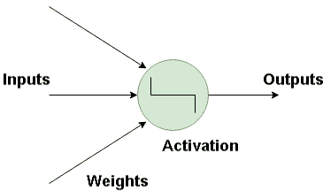
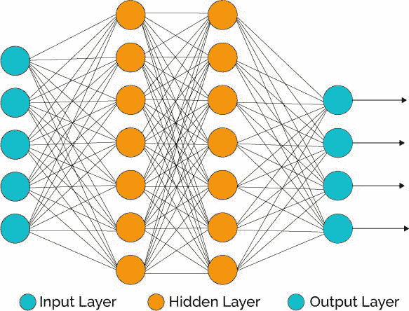
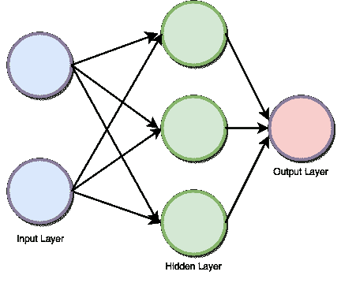
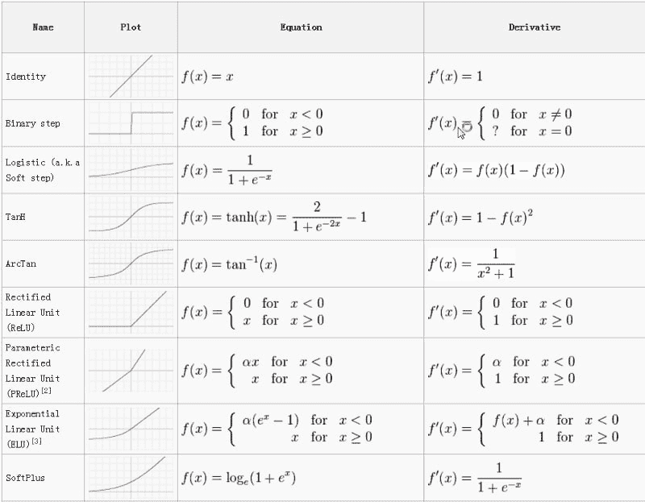
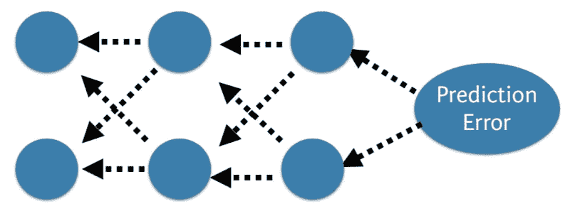

# 用 Python 进行深度学习:人脑模仿。

> 原文：<https://dev.to/adamcalica/deep-learning-with-python-the-human-brain-imitation-3n1b>

[深度学习](https://builtin.com/artificial-intelligence/deep-learning)背后的主要思想是，人工智能应该从大脑中汲取灵感。这种观点产生了“神经网络”这个术语。大脑包含数十亿个神经元，神经元之间有数万个连接。深度学习算法在许多情况下类似于大脑，因为大脑和深度学习模型都涉及大量的计算单元(神经元)，这些计算单元在孤立时并不是非常智能，但当它们相互交互时就会变得智能。

> 我认为人们需要理解深度学习正在幕后使许多事情变得更好。深度学习已经在谷歌搜索和图像搜索中发挥作用；它允许你搜索图片，比如“拥抱”——杰弗里·辛顿

## 神经元

神经网络的基本构件是模拟人脑神经元的人工神经元。这些是简单、强大的计算单元，它们对输入信号进行加权，并使用激活函数产生输出信号。这些神经元分布在神经网络的几个层中。

下图是一个神经元在神经网络中是如何被模仿的。神经元接受一个输入，并有一个特定的权重，通过这个权重它们与其他神经元相连。使用激活函数，非线性被去除并被放入估计输出的特定区域。

## 人工神经网络是如何工作的？

深度学习由人工神经网络组成，这些网络以人脑中存在的类似网络为模型。当数据通过这个人工网格时，每一层处理数据的一个方面，过滤离群值，发现熟悉的实体，并产生最终的输出。

输入层:这一层由神经元组成，这些神经元除了接收输入并将其传递给其他层之外什么也不做。输入图层中的图层数量应等于数据集中的属性或要素数量。

**输出层:**输出层是预测的特征，它基本上取决于您正在构建的模型的类型。

**隐藏层:**根据模型的类型，在输入层和输出层之间会有隐藏层。隐藏层包含大量的神经元。隐藏层中的神经元在传递输入之前对输入进行转换。随着网络被训练，权重得到更新，以更具预测性。

### **神经元权重**

权重指的是两个神经元之间连接的强度或幅度，如果你熟悉线性回归，你可以比较输入的权重，比如我们在回归方程中使用的系数。权重通常被初始化为小的随机值，例如 0 到 1 范围内的值。

### **前馈深度网络**

前馈监督神经网络是最早和最成功的学习算法之一。他们也被称为深度网络，多层感知器(MLP)，或简单的神经网络和一个单一的隐藏层的香草架构是说明。每个神经元与另一个具有一定权重的神经元相关联，

网络向上处理输入**，激活**神经元，最终产生输出值。这在网络上称为前向传递。

下图描述了数据如何通过一系列图层。

### **激活功能**

激活函数是总加权输入到神经元输出的映射。它被称为激活/传递函数，因为它决定了神经元被激活的起始时间和输出信号的强度。

数学上，

有几种激活功能用于不同的用例。最常用的激活函数是 relu、tanh、softmax。下面是激活函数的备忘单。

### **反向传播**

将网络的预测值与预期输出进行比较，并使用函数计算误差。然后，该误差在整个网络内传播回来，一次一层，并且根据它们对误差的贡献值来更新权重。这种巧妙的数学方法被称为**反向传播算法**。对训练数据中的所有示例重复该过程。为整个训练数据集更新网络的一轮被称为一个时期。网络可以被训练几十、几百或几千个时期。

### **成本函数和梯度下降**

成本函数是对给定训练输入和预期输出的神经网络“有多好”的度量。它还可能取决于权重和偏差等属性。

成本函数是单值的，而不是向量，因为它对神经网络作为一个整体的表现进行评级。使用梯度下降优化算法，权重在每个时期后递增地更新。

点击这里阅读其余的[深度学习 Python 示例和库。](https://builtin.com/data-science/deep-learning-python)