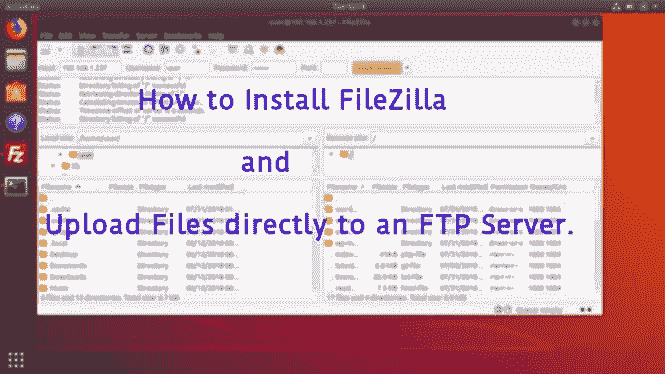
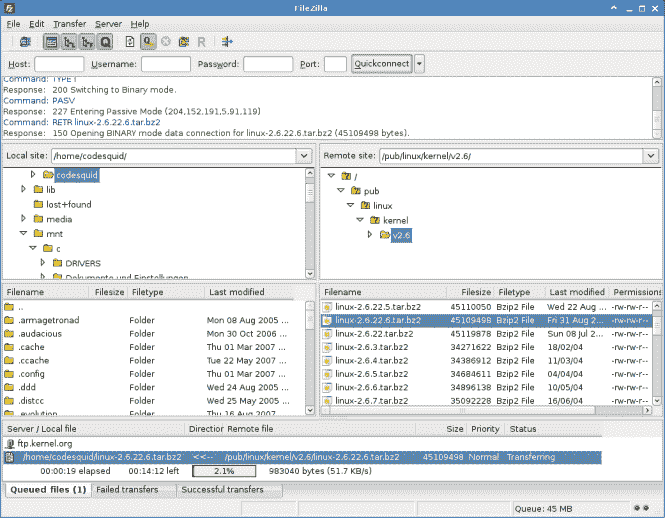
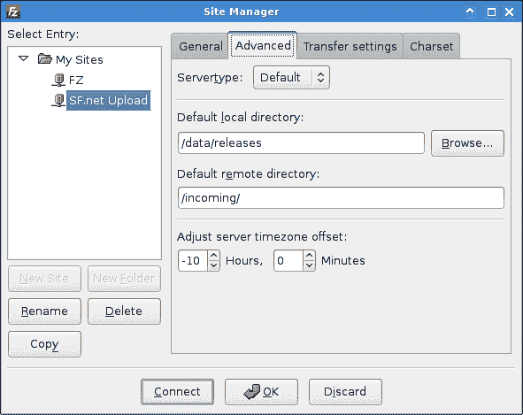
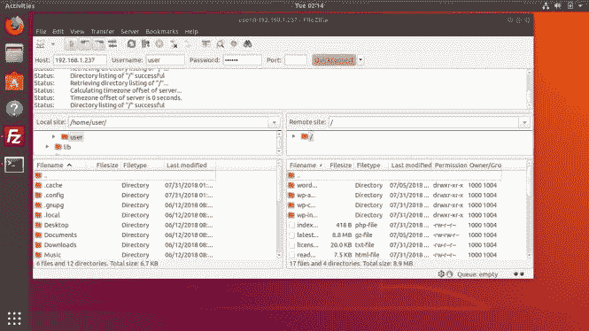
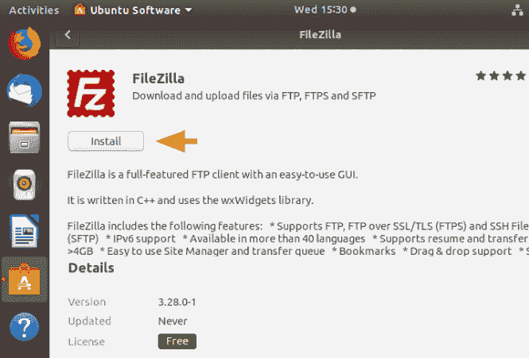

# 如何在 Linux 上安装 FileZilla FTP 客户端

> 原文：<https://dev.to/xeroxism/how-to-install-filezilla-ftp-client-on-linux-40fd>

#### *将文件直接上传到 FTP 服务器。*

[](https://res.cloudinary.com/practicaldev/image/fetch/s--dpcT6-mA--/c_limit%2Cf_auto%2Cfl_progressive%2Cq_auto%2Cw_880/https://i1.wp.com/fossnaija.com/wp-content/uploads/2019/06/filezilla-ubuntu-18-homepage.jpg%3Fresize%3D665%252C374%26ssl%3D1)

创建一个网站已经很难了，不要让上传(网站/应用的)文件到你的服务器变得更难——只要使用免费和开源的 FileZilla。

您可以使用[命令行界面(终端)](https://fossnaija.com/gui-vs-cli-the-more-you-look-less-you-see/)来提高速度，以及那些非常擅长键入命令的用户。但是这对新手来说是不可取的，因为任何事情都可能出错。所以最好使用一个[图形界面(GUI)](https://fossnaija.com/gui-vs-cli-the-more-you-look-less-you-see/) 应用程序来做这件事。有许多 FTP 软件(客户端)可以帮助你做到这一点。但是 FileZilla 是一个全功能的图形 FTP 客户端，也是你可以使用的最好的免费版本。

[](https://res.cloudinary.com/practicaldev/image/fetch/s--fCIpL-MM--/c_limit%2Cf_auto%2Cfl_progressive%2Cq_auto%2Cw_880/https://i2.wp.com/fossnaija.com/wp-content/uploads/2019/06/filezilla3_linux_main.png%3Fresize%3D665%252C518%26ssl%3D1)

在创建/开发一个网站，购买域名和托管(一个服务器空间来托管)后，下一步是找到一种方法将你的网站文件直接上传到服务器。这通常是使用文件传输协议(FTP)技术或任何它的变种，如 FTPS 和 SFTP。

它完成了文件上传客户端所需要的一切，无论如何，这仍然是相对简单的。在左侧窗格中，FileZilla 为您提供了一个文件夹选择视图，您可以在其中选择要上传的文件所在的文件夹。在右侧窗格中，显示了您在服务器上的位置。

[](https://res.cloudinary.com/practicaldev/image/fetch/s--K3HoZuzv--/c_limit%2Cf_auto%2Cfl_progressive%2Cq_auto%2Cw_880/https://i0.wp.com/fossnaija.com/wp-content/uploads/2019/06/filezilla_linux_site-manager.png%3Fw%3D665%26ssl%3D1)

你只需要确保你点击右窗格中的文件夹到你想要上传文件的地方。然后，只需使用拖放操作将您要上传的文件从左侧窗格移动到右侧窗格即可。一个非常简单，容易，而且通常非常无痛的过程。

[](https://res.cloudinary.com/practicaldev/image/fetch/s--M7KyNKJh--/c_limit%2Cf_auto%2Cfl_progressive%2Cq_auto%2Cw_880/https://i1.wp.com/fossnaija.com/wp-content/uploads/2019/06/filezilla-ubuntu-18-home.jpg%3Fresize%3D665%252C374%26ssl%3D1)

如果您需要[更改文件](https://fossnaija.com/assigning-and-removing-file-access-permissions/)的权限，只需右键单击您需要应用权限的任何文件或文件夹即可，仅此而已。

## **某些特征**

FileZillaalso 还包括以下功能:

*有 40 多种语言版本

*支持恢复和传输大于 4GB 的大文件

*速度限制

*文件名过滤器

*目录比较

*远程文件编辑

*记录到文件

*同步目录浏览

*远程文件搜索

*选项卡式界面可连接多台服务器

## **INSTALLFileZilla**

Filezilla 可以在大多数流行的 Linux 发行版的软件中心获得。只需在搜索栏中输入“ **filezilla** ”，然后点击 install 将其安装到您的系统中。

[](https://res.cloudinary.com/practicaldev/image/fetch/s--TFlKjdQZ--/c_limit%2Cf_auto%2Cfl_progressive%2Cq_auto%2Cw_880/https://i2.wp.com/fossnaija.com/wp-content/uploads/2019/06/filezilla_install-ubuntu.png%3Fw%3D665%26ssl%3D1)

那你就完了。

或者您可以在终端中执行以下命令:

```
**`sudo apt-get update`**  **sudo apt-get install filezilla** 
```

Enter fullscreen mode Exit fullscreen mode

要删除 FileZilla 客户端，请在终端中运行命令:

`sudo apt remove filezilla && sudo apt autoremove`

这就是了。你可以开始使用 FileZilla。

HappyLinux 'NG！

帖子[如何在 Linux 上安装 FileZilla FTP 客户端](https://fossnaija.com/how-to-install-filezilla-ftp-client-on-linux/)最早出现在 [Foss Naija](https://fossnaija.com) 上。