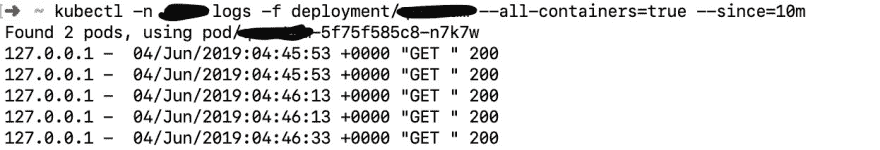
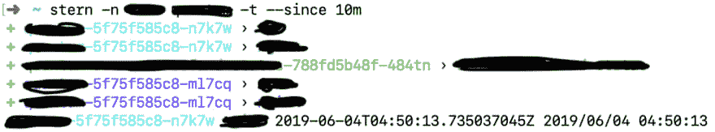

# 多个 Kubernetes 豆荚的尾部日志

> 原文：<https://dev.to/geshan/tail-logs-from-multiple-kubernetes-pods-the-easy-way-1pma>

Kubernetes(又名 K8s)是谷歌支持的容器编排软件事实上的标准，也是最活跃的 T2 开源项目之一。如果你正在使用 [Docker](https://www.docker.com/) ，很可能你正在使用 Kubernetes 或者至少听说过它。

> # When using Kubernetes and [Kubecl](https://kubernetes.io/docs/reference/kubectl/overview/) , do you want a way to track logs from multiple containers of the same deployment or service?

这篇文章将详细介绍如何实现更好的开发者(或者我应该说 DevOps/SRE)体验:

## 先决条件

假设您知道容器、Docker 之类的概念，并且习惯于 Kubernetes 和 kubectl。你不需要成为 Kubernetes 专家，但需要了解 Kubernetes 的基础知识。

## 使用 kubectl，您可以从多个 pods 容器中提取日志

您可以使用受欢迎的本地 Kubernetes 命令行工具 kubectl 跟踪多个 pods 中的日志。这样做很容易，如下所示:

```
kubectl -n <namespace> logs -f deployment/<app-name> --all-containers=true --since=10m 
```

<svg width="20px" height="20px" viewBox="0 0 24 24" class="highlight-action crayons-icon highlight-action--fullscreen-on"><title>Enter fullscreen mode</title></svg> <svg width="20px" height="20px" viewBox="0 0 24 24" class="highlight-action crayons-icon highlight-action--fullscreen-off"><title>Exit fullscreen mode</title></svg>

该命令是不言自明的，它说从过去 10 分钟以来的所有容器的给定名称空间跟踪该部署的日志。您还可以使用服务来代替部署。在这里，我使用了一个带有-n 参数的自定义名称空间:

[ ](https://res.cloudinary.com/practicaldev/image/fetch/s--Un7Kb25L--/c_limit%2Cf_auto%2Cfl_progressive%2Cq_auto%2Cw_880/https://cdn-images-1.medium.com/max/2492/1%2A1fs6pD9BAq7gHlc96s9N3Q.jpeg) * Kubectl 用所有容器进行部署的日志*

只要您只有一个部署或服务，这就很好，但是如果您的部署有一个 cron 作业，这就不够了。这就是下一个工具变得有用的地方:

## 遇见斯特恩，服用类固醇的库贝克

当您想要从多个 Kubernetes 对象中获取日志时，可以使用 [Stern](https://github.com/wercker/stern) ，例如[服务](https://kubernetes.io/docs/concepts/services-networking/service/)、[部署](https://kubernetes.io/docs/concepts/services-networking/service/)或[作业](https://kubernetes.io/docs/concepts/workloads/controllers/jobs-run-to-completion/) / [CronJob](https://kubernetes.io/docs/concepts/workloads/controllers/cron-jobs/) 。

> [T0】 Stern allows you to obtain color-coded logs from multiple containers in the pod of all related Kubernetes objects of the application/microservice.

通过下面这样一个简单的命令，您可以跟踪更多相关容器中的日志:

```
stern -n <namespace> <app-name> -t --since 10m 
```

<svg width="20px" height="20px" viewBox="0 0 24 24" class="highlight-action crayons-icon highlight-action--fullscreen-on"><title>Enter fullscreen mode</title></svg> <svg width="20px" height="20px" viewBox="0 0 24 24" class="highlight-action crayons-icon highlight-action--fullscreen-off"><title>Exit fullscreen mode</title></svg>

这里的命令也很简单。自过去 10 分钟以来，Stern tails 从该应用程序名称的给定命名空间中记录日志。在 Stern 的例子中，我们不仅可以看到一个 Kubernetes 对象(如部署或服务)的日志，还可以看到所有相关的日志，如下所示:

[ ](https://res.cloudinary.com/practicaldev/image/fetch/s--CyYCxR_0--/c_limit%2Cf_auto%2Cfl_progressive%2Cq_auto%2Cw_880/https://cdn-images-1.medium.com/max/2312/1%2Af9FFFu6wNuqXmPAIlt74Cw.png) *船尾原木与彩色集装箱*

请注意，这里的容器是用颜色编码的，这使得很容易区分日志。斯特恩在 2016 年出现在官方 Kubenetes [博客](https://kubernetes.io/blog/2016/10/tail-kubernetes-with-stern/)上。当您想要获得应用程序日志的整体视图时，Stern 非常有用。

如果你使用像 [Logentries](https://logentries.com/) 这样的日志发送器和日志查看器应用程序，那将是一种不同的体验。当你在调试或者想知道应用程序正在发生什么的时候，在命令行上获取实时日志是非常有用的。

## 其他选项用于从多个容器中跟踪日志

当然，还有其他选择来跟踪来自多个容器的日志。其中一些如下:

*   Kubetail —一个类似 Stern 的小型 bash 脚本。我没有使用它，因为我没有找到在每次运行时发送 kubeconfig 文件的简单方法。

*   凯尔(Kail)——似乎做着类似斯特恩和库贝泰尔的工作。没有用它来评论它。你可以试一下。

*   [k8 stail](https://github.com/dtan4/k8stail)——没用过但看起来缺少 Kubetail 和 Stern 的控制。如果你使用它，别忘了在下面评论它:)

## 结论

Kubernetes 是一款很棒的软件，但它确实增加了一层额外的复杂性。对于我们软件工程师来说，越快看到日志，我们就能越快解决问题。因此，如果您正在使用 Kubernetes 并有权查看您的 Kubernetes 集群上的日志，请使用一些别名设置您的 CLI，并从您的应用程序中实时查看日志。

* * *

首次发布于标志性的科技博客