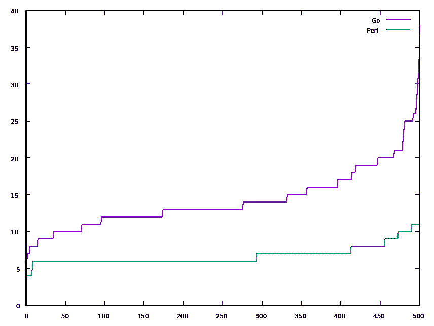
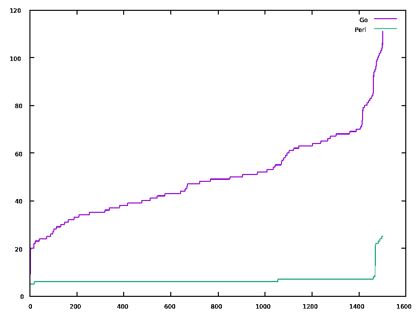

# 用 Perl 和 Go 实现的简单 web 服务器

> 原文：<https://dev.to/suntong/simple-web-server-implemented-in-perl-and-go-b43>

回想起来，我一直认为与 C/C++等编译语言相比，Perl 很慢。因此，我一直认为应该将我的简单 web 服务器从 Perl 重写为编译语言。最后我做到了，结果令我吃惊。

*   这是我用 Perl 编写的简单的 web 服务器
*   这是[我在 Go](https://github.com/suntong/dbab-go/blob/c082f2ddc515e652c76c5897ccce4ae431b864c5/dbab-svr/main.go) 中完成的重写

两者都很简单。

他们是如何相互竞争的？

我相信 Go 的实现应该比 Perl 代码快得多，因为它是一种编译语言，而且 Go http server 据说是一种产品级软件，为 Go web 应用程序奠定了坚实的基础。然而，我惊讶地发现，结果恰恰相反。

这里是一个轻负载的情况，有 100 个并发请求(一次执行多个请求的数量):

[](https://res.cloudinary.com/practicaldev/image/fetch/s--Wp41LXdD--/c_limit%2Cf_auto%2Cfl_progressive%2Cq_auto%2Cw_880/https://img.vim-cn.com/15/6463e0025d73a265070b76935b030887c58087.svg)

我们可以看到，这对 Perl 来说并不难，但是对 Go 来说，响应时间最终比初始值(几乎没有负载时)增加了 5 倍。

下面是一个最终提高了 Perl 响应时间的负载情况:

[](https://res.cloudinary.com/practicaldev/image/fetch/s--sDZ-VGZH--/c_limit%2Cf_auto%2Cfl_progressive%2Cq_auto%2Cw_880/https://img.vim-cn.com/c6/635682fa3a90f909fa2dd4c8ec6cfb57e13388.svg)

这一次，并发请求是 500。我们可以看到，对于 Perl 来说，情况在最后恶化了。然而，对于 Go 来说，当几乎没有负载时(从 5 毫秒到 20 毫秒)，它的启动速度是前一种情况的两倍或四倍，并且它不断恶化，直到接近 70 毫秒，然后迅速向上跳跃。

所以我今天学到的一课是，Perl 不仅是一种快速原型语言，当涉及到像这样的简单 web 服务器时，Perl 的表现也比 Go 好得多。

PS。

这两种载荷情况分别由
Apache Bench 使用`ab -n 500 -c 100`和`ab -n 1500 -c 500`生成。我已经在这里发布了原始的测试结果[，并且在文章的最后包含了统计摘要。](https://gist.github.com/suntong/b259a3730e40c017e6a1020339bd356c)

PPS。

无耻插件- [我用 Perl 编写的简单 web 服务器](https://github.com/suntong/dbab/blob/master/src/bin/dbab-svr)是我的 [dbab 包](https://github.com/suntong/dbab)的核心，基于 dnsmasq 的广告拦截，这是在 DNS 级别完成的广告拦截-所有对广告站点的请求都在 DNS 被拦截。不再有用户空间扩展模式匹配&更换的必要。无论是从封装大小还是 CPU 使用率来看，它都轻如鸿毛。它可以加快移动设备的浏览速度，而无需安装任何应用程序。我正在努力尽快发布一个新版本...

现在是原始测试结果。

Perl:

```
Concurrency Level:      500
Time taken for tests:   0.333 seconds
Complete requests:      1500
Failed requests:        0
Total transferred:      222000 bytes
HTML transferred:       64500 bytes
Requests per second:    4509.60 [#/sec] (mean)
Time per request:       110.875 [ms] (mean)
Time per request:       0.222 [ms] (mean, across all concurrent requests)
Transfer rate:          651.78 [Kbytes/sec] received

Connection Times (ms)
              min  mean[+/-sd] median   max
Connect:        0    0   2.9      0      21
Processing:     1    6   0.7      6       8
Waiting:        1    6   0.7      6       8
Total:          5    7   2.4      6      25

Percentage of the requests served within a certain time (ms)
  50%      6
  66%      6
  75%      7
  80%      7
  90%      7
  95%      7
  98%     22
  99%     23
 100%     25 (longest request) 
```

<svg width="20px" height="20px" viewBox="0 0 24 24" class="highlight-action crayons-icon highlight-action--fullscreen-on"><title>Enter fullscreen mode</title></svg> <svg width="20px" height="20px" viewBox="0 0 24 24" class="highlight-action crayons-icon highlight-action--fullscreen-off"><title>Exit fullscreen mode</title></svg>

去:

```
Concurrency Level:      500
Time taken for tests:   0.250 seconds
Complete requests:      1500
Failed requests:        0
Total transferred:      324000 bytes
HTML transferred:       64500 bytes
Requests per second:    6007.50 [#/sec] (mean)
Time per request:       83.229 [ms] (mean)
Time per request:       0.166 [ms] (mean, across all concurrent requests)
Transfer rate:          1267.21 [Kbytes/sec] received

Connection Times (ms)
              min  mean[+/-sd] median   max
Connect:        0   17   7.5     16      34
Processing:     6   33  16.1     31      90
Waiting:        5   28  14.9     27      87
Total:          7   49  16.3     48     111

Percentage of the requests served within a certain time (ms)
  50%     48
  66%     52
  75%     62
  80%     63
  90%     68
  95%     80
  98%     96
  99%    101
 100%    111 (longest request) 
```

<svg width="20px" height="20px" viewBox="0 0 24 24" class="highlight-action crayons-icon highlight-action--fullscreen-on"><title>Enter fullscreen mode</title></svg> <svg width="20px" height="20px" viewBox="0 0 24 24" class="highlight-action crayons-icon highlight-action--fullscreen-off"><title>Exit fullscreen mode</title></svg>