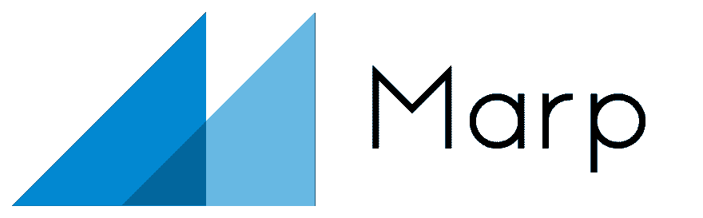
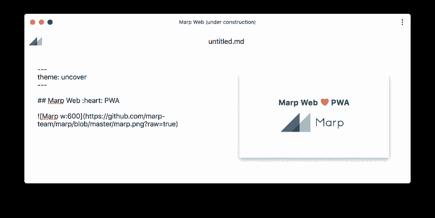
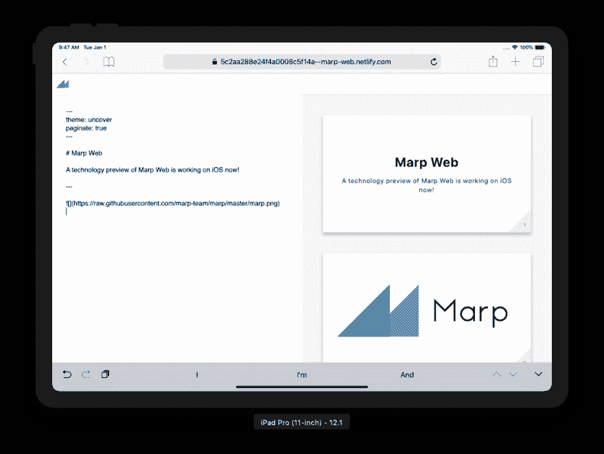
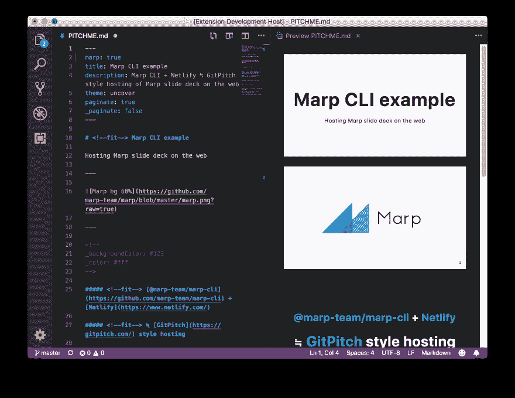

# Marp 的故事接下来

> 原文：<https://dev.to/yhatt/the-story-of-marp-next-1216>

*这篇文章是从 [Marp 博客](https://marp.app/blog/the-story-of-marp-next)交叉发布的文章。 [**Marp**](https://yhatt.github.io/marp/) 是一款开源的桌面应用，用于编写 Markdown 中的幻灯片。*

* * *

Marp 的第一个版本大约在 3 年前发布。起初，它是从一个名为“mdSlide”的简单个人使用工具开始的。现在，Marp 已经被许多认识到演示文稿作者真正价值的用户所使用。到目前为止，Marp 已经聚集了大约[8000 颗恒星](https://github.com/yhatt/marp/stargazers)。

然而，我们头痛的是开发缺乏可维护性。我们收到了很多对旧 Marp 应用程序的请求，它必须不断发展，以继续提供演示文稿的最佳写作环境。

今天，我非常兴奋地介绍 Marp 的故事！完全重写的 Marp 不仅仅是一个作家。为了能在各种情况下使用，我们建立了一个由多个模块组成的全新的 Marp 生态系统。它们是用 JavaScript 和 TypeScript 开发的，比以前的 Marp 更容易维护。

## /[marp](https://github.com/marp-team/marp)

### 降价展示生态系统的入口库

<article class="markdown-body entry-content container-lg" itemprop="text">

[](https://raw.githubusercontent.com/marp-team/marp/master/marp.png)

**Marp** :降价展示生态系统

Marp 是一个生态系统，用简单的降价来撰写你的演示文稿。

## Marp 家族

我们的项目分布在许多 repos 上，以便专注于每个存储库的有限范围。活动项目在下面的列表中强调显示。

这个回购( **[@marp-team/marp](https://github.com/marp-team/marp)** )是 marp 家族的一个入口，放置[我们的网站](https://marp.app/)。

### 框架/核心

| 名字 | 描述 | 释放；排放；发布 |
| --: | :-- | :-- |
|  | 从 Markdown 创建幻灯片的框架。( [marpit.marp.app](https://marpit.marp.app/) ) | [](https://www.npmjs.com/package/@marp-team/marpit) |
| **[Marp 核心](https://github.com/marp-team/marp-core)T3】** | 具有实用功能和[主题](https://github.com/marp-team/marp-core/tree/master/themes)的 Marp 转换器的核心。 | [](https://www.npmjs.com/package/@marp-team/marp-core) |

### 应用程序

| 名字 | 描述 | 释放；排放；发布 |
| --: | :-- | :-- |
| **[Marp CLI](https://github.com/marp-team/marp-cli)T3】** | [Marp Core](https://github.com/marp-team/marp-core) / [Marpit](https://github.com/marp-team/marpit) 的 CLI 界面转换成 HTML、PDF、PPTX 和图片。 | [](https://www.npmjs.com/package/@marp-team/marp-cli) |
| [Marp Web](https://github.com/marp-team/marp-web) | 基于 [PWA](https://en.wikipedia.org/wiki/Progressive_Web_Apps) 和 [Preact](https://preactjs.com/) 框架的 Marp 主界面。 | [](https://web.marp.app/) |
| Marp 桌面 | 用于替换 [yhatt/marp](https://github.com/yhatt/marp) 的 [Marp Web](https://web.marp.app/) 桌面客户端。 | [](https://camo.githubusercontent.com/00f627cbea749e6e6e5e3178b7cb6687de864923/68747470733a2f2f696d672e736869656c64732e696f2f62616467652f2d504c414e4e45442d6c69676874677265792e7376673f7374796c653d666c61742d737175617265) |

### 集成

| 名字 | 描述 | 释放；排放；发布 |
| --: | :-- | :-- |
| **[Marp VSCode](https://github.com/marp-team/marp-vscode)** | 一个 [VS 代码](https://code.visualstudio.com/)扩展到 |

…</article>

[View on GitHub](https://github.com/marp-team/marp)

# Marp 生态系统

Marp Next 有两个核心组件: **[Marpit](https://marpit.marp.app/)** 框架和 **[Marp 核心](https://github.com/marp-team/marp-core)** 。Marp 生态系统的工具通常基于这些。

## Marpit

## /[马皮特](https://github.com/marp-team/marpit)

### 从 Markdown 创建幻灯片的框架

<article class="markdown-body entry-content container-lg" itemprop="text">

[](https://marpit.marp.app)

**Marpit** : Markdown 滑梯平台框架

[](https://circleci.com/gh/marp-team/marpit/)[](https://codecov.io/gh/marp-team/marpit)[](https://www.npmjs.com/package/@marp-team/marpit)[T11】](https://raw.githubusercontent.com/marp-team/marpit/master/./LICENSE)

* * *

**Marpit** /mɑːrpɪt/是从 Markdown 创建幻灯片的瘦框架。它可以将 Markdown 和 CSS 主题转换为由静态 HTML 和 CSS 组成的幻灯片，并通过打印创建可转换为幻灯片 PDF 的网页。

Marpit 设计为*为滑梯平台*输出最小资产。你可以使用裸资产作为一个无逻辑的幻灯片，但主要是我们希望与其他工具和应用程序集成输出。

事实上，这个框架是为在下一版本 Marp 的[中使用](https://github.com/marp-team/marp/)[核心转换器](https://github.com/marp-team/marp-core/)而创建的。

## 特征

### [<g-emoji class="g-emoji" alias="memo" fallback-src="https://github.githubassets.cimg/icons/emoji/unicode/1f4dd.png">📝</g-emoji>T3【马皮特】降价 T5】](https://marpit.marp.app/markdown)

我们在 [markdown-it](https://github.com/markdown-it/markdown-it) 解析器中扩展了几个特性，以支持编写出色的幻灯片，例如 [*指令*](https://marpit.marp.app/directives) 和 [*幻灯片背景*](https://marpit.marp.app/image-syntax?id=slide-backgrounds) 。附加的语法强调与通用降价文档的兼容性。

### [<g-emoji class="g-emoji" alias="art" fallback-src="https://github.githubassets.cimg/icons/emoji/unicode/1f3a8.png">🎨</g-emoji> **主题 CSS 通过干净的标记**](https://marpit.marp.app/theme-css)

Marpit 有 CSS 主题化系统…

</article>

[View on GitHub](https://github.com/marp-team/marpit)

**[Marpit](https://marpit.marp.app/)** 是*用于从 Markdown 创建 HTML 幻灯片的瘦框架*。它旨在将 Markdown 转换为由静态 HTML 和 CSS 组成的最小资产，输出可以通过 Chrome / Chromium 打印转换为 PDF 幻灯片。

Marpit 是作为 Marp 生态系统的基础而创建的，但也是一个独立的框架。您可以将 Marpit 的 Markdown 转换与您的工具集成，即使它不是 Marp: [reveal.js](https://codesandbox.io/embed/nw80vrxvpp) 、 [WebSlides](https://codesandbox.io/embed/j3wo2091yw) 等等。

[https://codesandbox.io/embed/nw80vrxvpp?runonclick=1](https://codesandbox.io/embed/nw80vrxvpp?runonclick=1)
[https://codesandbox.io/embed/j3wo2091yw?runonclick=1](https://codesandbox.io/embed/j3wo2091yw?runonclick=1)T4】

真实世界的用例之一是 [MetaBake](https://www.metabake.org) 项目。它从我们的早期阶段提供了 Marpit 集成，易于建立具有演示风格的网页。([见例](https://github.com/metabake/mbake/tree/master/examples/slidesEx))

### [Marpit 降价](https://marpit.marp.app/markdown):与普通降价文件兼容

我们收到了许多对旧 Marp 的请求，关于帮助创建漂亮幻灯片的附加语法。另一方面，我们也收到了一个要求，即[必须严格遵守 Markdown 语法](https://github.com/yhatt/marp/issues/87)。我们必须处理这些矛盾的问题。

Marpit 提供的附加语法不应破坏 [CommonMark](https://commonmark.org/) 文档。因此，即使您在通用 Markdown 编辑器中打开 Marpit Markdown，渲染的结果看起来仍然很好。如果需要，你甚至可以通过 [markdown-it 插件](https://marpit.marp.app/usage?id=extend-marpit-by-plugins)来扩展附加语法。

### [主题 CSS](https://marpit.marp.app/theme-css) :用干净的标记设计你的卡片

Marpit 拥有主题化系统，允许通过 CSS 设计幻灯片的所有内容。

旧 Marp 的主题系统*有限*，需要深入内部进行定制:构建系统、 [Sass](https://sass-lang.com/) ，Marp 应用的逻辑，等等。因此，我们必须创建一个全新的主题化系统，只需要一般的 CSS 知识就可以轻松定制主题。

Marpit 的 it 只需要一个纯 CSS，不需要额外的知识！您只需要关注 HTML 语义元素的样式。这意味着你可以从现在开始创建主题 CSS 了！

此外，Marpit 还拥有像 PowerPoint 和 Keynote 这样的像素级完美幻灯片系统。主题创建者从来不需要担心响应性布局，可以毫不费力地提供作者想要的设计。

### [内嵌 SVG 幻灯片](https://marpit.marp.app/inline-svg)(实验)

我们的独特想法是通过内嵌 SVG 包装每张幻灯片。这可能感觉有点奇怪，但有很多好处。

*   通过样式定义支持像素级完美缩放，**实现零 JS 幻灯片**。
*   隔离 Markdown 内容，并防止 Marpit 的高级功能注入的 DOM 破坏主题 CSS 中定义的设计。

由于 SVG 的强大功能，我们可以保持框架的简单和可维护性。 [Marp 核心](https://github.com/marp-team/marp-core)默认基于内嵌 SVG 幻灯片。

## Marp 核心

**[Marp Core](https://github.com/marp-team/marp-core)** 是我们从 Marpit 延伸出来的项目的基础转换器。简而言之，它是一个包含电池的 Marpit。

Marpit 只有基本的功能，所以它可能不足以开始编写你的卡片组。Marp Core 提供了实用的语法、附加特性和内置主题。

许多功能都是基于旧的桌面应用程序，并经过改进以适合 Marpit。当然，我们增加了新的功能来创造更美丽的甲板。

*   内置主题(默认、盖亚和*新*揭开主题)
*   包含表情符号支持😁
*   [KaTeX](https://katex.org/) 数学排版
*   自动缩放功能(*新增*)
    *   通过`<!-- fit -->`注释装配标题
    *   缩小溢出围栏、代码和数学块

# 申请

## Marp CLI

**[Marp CLI](https://github.com/marp-team/marp-cli)** 是 Marpit 和 Marp Core converter 的 CLI 接口。这是一把瑞士军刀！

[](https://github.com/marp-team/marp-cli)

如果安装了 [Node.js](https://nodejs.org/) ，现在就可以通过运行`npx @marp-team/marp-cli`来使用它。

*   导出为 HTML、PDF 和图像
*   观察你的减价和主题(`--watch`)的变化
*   打开预览窗口进行演示(`--preview`)
*   基于 Marpit 框架的全定制引擎

Marp 最初有一个文本编辑器，但是您可能认为应该用您最喜欢的编辑器来编写幻灯片。如果您使用 Vim，您可能会对不能使用 Vim 风格的键绑定感到不舒服。从现在开始，使用 Marp CLI 的手表模式连同原来的 Vim！

Marp CLI 可以创建真正实用的静态 HTML，就像演示模式一样！它由与 [Bespoke.js](https://github.com/bespokejs/bespoke) 的深度集成提供支持。

得益于 [Netlify](https://www.netlify.com/) 、 [Now](https://zeit.co/now/) 和更多的托管服务，Marp CLI 还带来了高效的 Git 管理，用于创建幻灯片，就像 [GitPitch](https://gitpitch.com/) 一样。我已经创建了一个通过 [GitHub 库](https://github.com/yhatt/marp-cli-example)管理的示例幻灯片，作为帮助编写幻灯片的良好开端。尝试通过[自述文件](https://github.com/yhatt/marp-cli-example/blob/master/README.md#usage)上的“部署到网络”按钮使用它！

## Marp Web ( *技术演示*

**[Marp Web](https://web.marp.app/)** 是 Marp 演示文稿编写器的一个 Web 界面。它允许像编写传统桌面应用程序一样编写幻灯片。

> 当前的 Marp 网络只是一个技术演示。我们正计划重新实施基于众所周知的框架(如 React)的 Marp Web，用于构建 SPA。

### 渐进式网络应用

当为了保持 Marp 的可维护性而提出迁移到基于 web 的应用程序的想法时，这引起了离线使用 Marp 的用户的强烈反对。这是因为当时对 PWA 的认识并不全面。

两年后，使用 PWA 的时候到了！在第一次访问**[【https://web.marp.app/】](https://web.marp.app/)**之后，Marp Web 就可以在线和离线使用了。使用 web 界面的在线资源将被缓存在您的浏览器中，并在网络离线时使用它们。

[](https://web.marp.app/)

### 通过任何设备使用

通过迁移到基于网络的应用程序，Marp 将能够在移动设备上使用:Android 和 iOS。这肯定非常适合 iPad 这样的平板设备。

[](https://res.cloudinary.com/practicaldev/image/fetch/s--bJkBb2XW--/c_limit%2Cf_auto%2Cfl_progressive%2Cq_auto%2Cw_880/https://user-images.githubusercontent.com/3993388/50569518-5305c800-0daa-11e9-8fa4-08053c9b51cd.png)

Marp Web 也可以在 Chrome 操作系统中很好地工作。Marp 尤其在教育领域拥有众多用户，支持在其领域占有较大份额的 Chrome OS 是有意义的。

### ⚡️闪电般的现场预告

我们认为 Marp 的重要特征是极快的现场预览。在基于网络的应用程序中，实现相同的功能有许多困难。

在目前发布的技术演示中，你可以尝试 Marp 的真正快速的网络预览。预览会在您输入后立即应用，即使您有超过 100 页的大减价幻灯片，它也不会阻止您的输入。

# 集成

模块化的 Marp 核心为一些工具带来了 Marp 集成。

## [Marp for VS 代码](https://marketplace.visualstudio.com/items?itemName=marp-team.marp-vscode)

老实说，我不认为我想做一个新的编辑，因为世界上有许多伟大的降价编辑。我一直在想，如果 Marp 可以与其他强大的 Markdown 编辑器集成，那将是一件非常棒的事情。而现在，Marp 可以在 [Visual Studio 中使用代码](https://code.visualstudio.com/)！

[](https://marketplace.visualstudio.com/items?itemName=marp-team.marp-vscode)

它的实现是因为 VS 代码使用了与 Marpit 框架相同的 Markdown 引擎(markdown-it)。当然，你可以很容易地将幻灯片导出为 PDF 和 HTML 格式，由 Marp CLI 提供支持。

## [Marp React](https://github.com/marp-team/marp-react)&[Marp Vue](https://github.com/marp-team/marp-vue)(开发中)

Marp 的超快的实时预览不仅仅是我们的！我们将 Marp 渲染器组件提供给 [React](https://github.com/marp-team/marp-react) 和 [Vue](https://github.com/marp-team/marp-vue) 。Marp React 和 Marp Vue 都支持使用框架的虚拟 DOM 进行增量更新，并且它们很容易构建您的应用程序。

特别是，Marp React 将成为 Marp Web 未来的基础。

# 迁移计划

## 桌面应用程序( [yhatt/marp](https://github.com/yhatt/marp)

如果您使用的是旧的 Marp 应用程序，您应该迁移到使用 Marp Next 工具。我不建议继续使用旧的 Marp，因为*它的维护已经在 2 年前停止了，并且存在安全问题。*

将来，主界面将成为 Marp Web。我们最好使用有很多优点的 PWA 技术。桌面应用程序被计划为“Marp 桌面”,但它可能会成为 Web 界面的包装。

如果 Marp Web 已经发展到可以替换旧的 Marp，我会停止发布旧的 Marp 并将其存储库存档。

## 你的幻灯片

用旧的 Marp 语法编写的降价幻灯片应该重写，以适应全新的 Marp 生态系统。

在新的 Marp 中，我们根据对旧 Marp 应用的反馈重新考虑了 Markdown 语法。因此，一些语法正在失去兼容性。

### 语法

*   在 Marp Core 中，出于安全原因，默认情况下禁用非白名单 HTML 元素。目前我们的白名单只包括`<br>`元素。一些 Marp Next 工具提供了启用 HTML 的首选项，但是您应该注意在不可信的降价中启用 HTML。

### 指令

*   指令将由为 Marp 调优的 YAML 解析器(Marpit)解析。因此，为了保持 YAML 语法，点指令前缀`*`被改为`_`。
*   幻灯片大小不再可以通过降价来改变。因此`size`指令也被删除。请改用主题 CSS。
*   `page_number`指令更名为`paginate`。
*   `template`指令更新为使用`class`指令。它可以为每张幻灯片定义 HTML 类。
*   `prerender`指令被删除。它使用户对导出的 PDF 质量感到困惑。

### 图像

*   默认情况下，背景图像``没有应用滤镜。如果你愿意，试着使用``。
*   内嵌图像不再按百分比``缩放。(Firefox 不支持)你可以使用`width` ( `w`)和`height` ( `w`)关键字来调整图片大小。
*   ``行不通。它需要将图像改变为块元素，给主题作者带来困惑。如果你愿意，你可以调整样式。

```
<style>
  img[alt~='center'] {
    display: block;
    margin-left: auto;
    margin-right: auto;
  }
</style> 
```

# 接下来试试 Marp！

Marp 下一步只是专注于用纯开源构建 Markdown 幻灯片的生态系统。我们希望与开源社区一起提高 Marp 的生产力。

我们仍然站在全新生态系统的起点。您对 Marp 团队和我们的生态系统感兴趣吗？我们欢迎您开始投稿！参见[我们的投稿指南](https://github.com/marp-team/marp/blob/master/.github/CONTRIBUTING.md)并开始吧！

> PS。我已经开始 [Patreon](https://www.patreon.com/yhatt) 并且站在 [GitHub 赞助商](https://github.com/sponsors)的队伍中。如果你想帮助我为开源工作，这些也是很好的贡献。