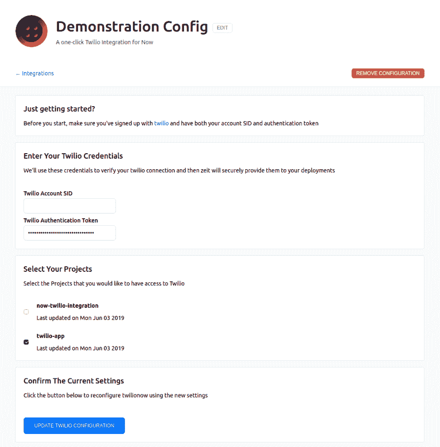

# ZEIT Hackathon 2019:我的第一次无服务器 Hackathon

> 原文：<https://dev.to/mykalcodes/zeit-hackathon-2019-a-retrospective-3goe>

过去的这个周末，我参加了 ZEIT 的首次黑客马拉松。这是一个 48 小时的活动，围绕着为 ZEIT 的“now”无服务器托管平台构建一个集成。我以前从未使用过 Now，但我喜欢 ZEIT 的许多其他软件([next . js](https://nextjs.org/)&[hyper . js](https://hyper.is/))，我认为这将是一个通过用它构建一个小项目来了解 Now 的好机会。

这篇文章将回顾我构建的东西，我学到的东西，以及我下一次黑客马拉松的一些收获。

## 我造了什么

我最初很难想出一个关于黑客马拉松的想法。我在活动间隙花了一些时间考虑一些想法，但我真的没想到什么。因此，在活动组织者的推荐下，我决定与他们的赞助商之一建立一个整合: [Twilio](https://www.twilio.com/) ！

我最终完成了一个简单的令牌管理器集成，允许用户跨不同部署管理多个 Twilio 身份验证令牌和帐户！在浏览文档时，我注意到现在允许您通过 API 将环境变量传递到项目中。我用这个特性作为起点，48 小时后(其中只有大约 16 小时我实际上是在编码)，我有了我的集成！

最后，我的集成真正允许您做的是传递一些 Twilio 凭证作为环境变量，并管理哪些项目可以访问哪些凭证。如果你使用 Now，你可以点击 Now Marketplace 链接[这里](https://zeit.co/integrations/twilio-now)或者点击 [twilionow.tech](https://twilionow.tech) 查看文档

## 我学到了什么

### 无服务器很牛逼(大多数时候)

现在是一个无服务器托管平台。在黑客马拉松开始时，我知道 Now 是一个无服务器部署，但我不明白这在实践中意味着什么。本质上，你所有的 Now 项目都被分解成一堆基于云的函数，称为“AWS Lambda”函数。这有几个主要好处:

*   **节省成本:**应用程序仅在使用时使用计算能力，这首先极大地降低了应用程序的成本* **疯狂快速的部署:**应用程序从本地运行到现在只需 10-15 秒，节省了时间，总体感觉非常棒。

*   **无需工作的 CDN**:现在你可以通过几行配置在遍布世界各地的服务器上复制你的应用程序(说真的，这非常简单，看这里的

虽然所有这些东西都非常酷，但我确实遇到了一些 Now 和无服务器的问题:

*   **事情不像预期的那样运行:**当我试图构建一个示例 Node.js/Express 应用程序来演示我的集成时，我很快意识到我不能构建任何旧的 express 应用程序。我需要有一个基于[λ的设置](https://github.com/zeit/now-examples/tree/master/express)，其中每个端点都在一个单独的。js 文件等等。构建我的示例应用程序花费的时间比预期的要长，因为这个设置与我习惯的有太多不同。

### 我需要干净的代码

尽管这个活动的名字叫黑客马拉松，但我觉得我在整合中越是黑客，效率就越低。

在编程的第一天之后，我的大部分代码仍然在一个文件中，感觉工作起来绝对是一团糟。每次我不得不做出改变时，都要花一分钟的时间来真正理解我的代码在做什么。当我最终想通的时候，我经常会忘记我最初想做什么，让我再次回到起点。

在第二天的开始，我做了一些核心代码清理。我将我所有的模板文字(我用来构建集成的 UI)移动到它们自己的基于组件的文件中，然后导入到 pages 中，并将我的应用程序逻辑分成几个单独的文件。

这不仅在第二天为我节省了大概 1-2 个小时的编程时间，而且让我在写代码的时候感觉更好，这让我可以更长时间地投入到代码中。

这可能不适用于任何人，但我个人希望我开始的时候更有条理一点，并且从一开始就知道我需要一个(相对)干净的代码库来提高效率。

## 下一次黑客马拉松的要点

### 预先阅读文档

ZEIT 集成平台有**牛逼** [文档](https://zeit.co/docs)。它非常深入，组织良好，并有指南和开源代码作为示例。也就是说，在活动之前，我并没有在文件**上花太多时间。我经常发现自己破坏了我的集成，编写了一个补丁，并对它进行了测试，只是为了查阅文档并找到一个很棒的、解释得很好的例子来说明我正在尝试构建的东西。**

这一切都可以通过在活动前一周对文件进行仔细检查来解决。浏览文档可能要花一个小时的时间，而且可能会节省我至少两到三个小时重写代码的时间。

### 尽量减少杂念

不可否认，我在这次黑客马拉松上花的时间并没有我想要的那么多。尽管这是一场 48 小时的黑客马拉松，但我可能只花了不到一天的时间在我的集成上，最终产品也反映了这一点。我没有为这个事件做好充分的准备，也没有让我周围的人知道我将要擅离职守，这经常让我远离 VS 代码，长时间地进入现实世界。例如:

*   周六下午，我有一个朋友过来闲逛。
*   星期六晚上，我出去看了一场我答应去看的电影。
*   周日晚上，我匆匆忙忙地完成了整合工作，这样我就可以去参加一个之前计划好的约会了。

如果我能重来一次，我要么全力以赴参加黑客马拉松，要么只过正常的周末。试图将这两者混为一谈，占用了我的时间和精力，结果在与朋友和家人出去玩的时候，要么迟到，要么压力过大。

## 结论

总的来说，这是一个伟大的周末！我了解了无服务器，在 Hacakthon 的 slack 中结交了一些朋友，并获得了另一个作为开发人员成长的机会！

此外，我想给整个 ZEIT 团队一个巨大的感谢，感谢他们举办了这次活动。他们非常令人鼓舞，回答了我的一大堆问题，让在线参与变得非常有趣！