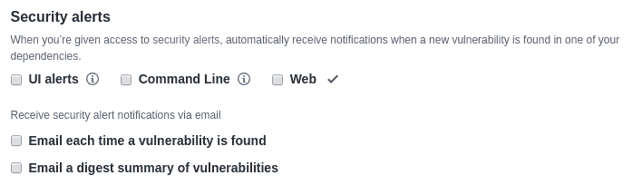
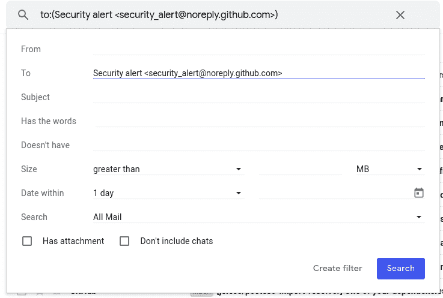
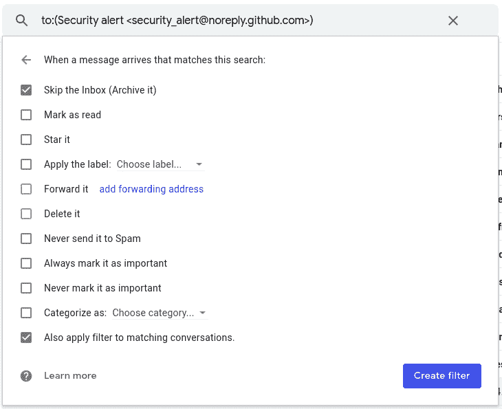
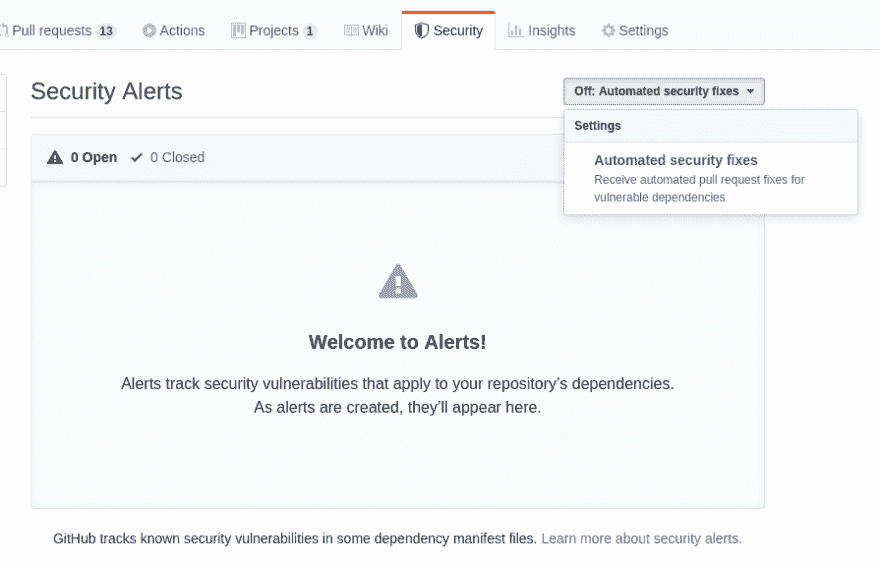

# Why I dislike GitHub security alerts? (and how to disable them)

> 原文：[https://dev.to/pi0/why-i-dislike-github-security-alerts-and-how-to-disable-them-1cg2](https://dev.to/pi0/why-i-dislike-github-security-alerts-and-how-to-disable-them-1cg2)

You may have heard about [Github Security Alerts](https://help.github.com/en/articles/about-security-alerts-for-vulnerable-dependencies) and received some for your projects (if you are an open source maintainer, probably a LOT of them!)

Well, that sounds so promising, doesn't it? But the truth is that most the cases are false-positive, non-effective or a security alert doesn't provide any solution! In this article, I will try to explain about reasonings why GitHub security is not good protection and a workaround to avoid spams in your email.

## For [npm](https://npmjs.com) package maintainers

Package dependencies are usually specified with a caret (`^`) or tile (`~`) range (learn more about [semver](https://docs.npmjs.com/misc/semver#ranges)). This means even if you don't explicitly upgrade to a patch or minor version of a dependency, fresh installs of your package receive the patch of the dependencies so you shouldn't worry.

[dependabot](https://dependabot.com) (which is acquired by Microsoft/GitHub and now enabled by default on all repositories) tries to just update lock-file in the repository. This doesn't fix anything for your package users as lock file is **not** published with your package and will not be used by package managers when someone installs your package. So what's the benefit? Probably nothing! unless dependency is harmless itself by execution (for example running malicious code or leaking tokens) which in this cases npm security team will take fast action and remove tarball from the registry, before any disclosure. Also, many security alerts are usually related to `devDependencies` which are totally irrelevant as these dependencies are probably used for your local environment and not affecting end-users if there is a bug into them. (at least is not a *security* problem!)

## For end-projects

If you have a GitHub project that powers a public website or an API, it really matters that you receive security patches ASAP and deploy them. But personally, still don't feel good about having GitHub eyes on **all of my projects** by default:

1.  Many of my personal GitHub repositories are temporary projects or examples and are not going to be updated. A regex DDOS is irrelevant for them and it is just annoying about GitHub that frequently requests me to update their dependencies.
2.  Many of security alerts are false-positive or related to `devDependencies`. Like a potential bug in a jest dependency. Certainly, an attacker does not write a test that runs in CI to break it and it is not really a security alert.

I wish it could be enabled on only projects that I need, not everything! and also there were some options specifying behavior. I don't want to advertise but I had a much better experience and customizability by using [Renovate Bot](https://renovatebot.com). Another option is [snyk](https://snyk.io) which regularly checks your project against known security alerts and more importantly, it provides automated patches for high-impact vulnerabilities (not just alerting)

## Disabling GitHub Notifications

Go to the [notifications](https://github.com/settings/notifications) section of your GitHub profile and change preferences according to your needs:

## Skipping email alerts from inbox (Gmail)

Even by disabling notifications you will still receive LOTS of emails from GitHub security. You can label them to skip the inbox and go to a specific category or archive by default.

First, open [Gmail](https://mail.google.com) and search for **`to:(Security alert <security_alert@noreply.github.com>)`**. Using the dropdown button right to the search box, open more options:

Then click on `Create filter` to create a filter and configure it according to your preferences:

## Disable automated pull-requests

Unfortunately, automated pull-requests are enabled by default for all of your repositories but the good news is that you can still disable them one by one by going to "Security" tab of each repository and selecting "Off: Automated security fixes" from the dropdown:

## Conclusion

Never ignore security for your project. If you are the author of a popular npm package or critical website. In this article, I tried to explain why (current) GitHub security is not probably the best tool and provide a way to give back **freedom** choosing tooling for security checks.

GitHub platform is powering thousands of opensource projects and for sure there is a good intention about new integrated security checks. But it could be better, allowing more customization and considering the facts about semver versioning and also the freedom to opt-in for security alerts. **Having lots of irrelevant security alerts makes it harder to observe real security bugs.**