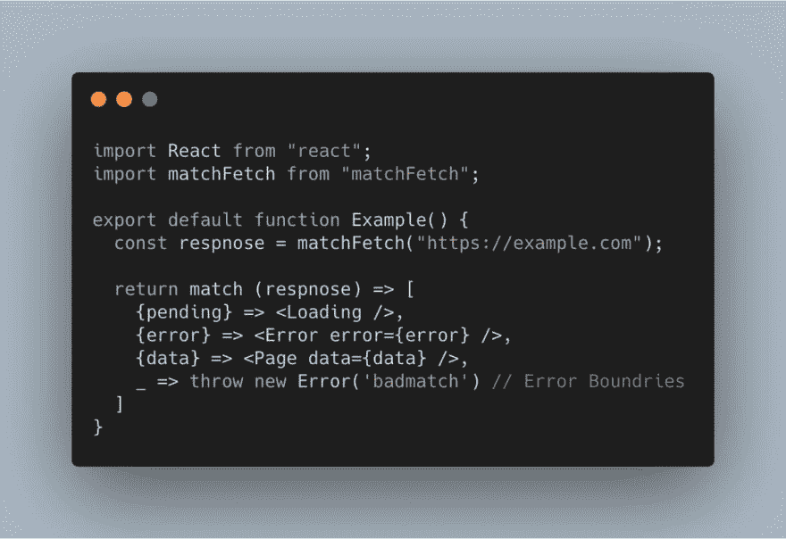

# 反应:“我真希望这就是我编写组件的方式。”

> 原文：<https://dev.to/joelnet/react-i-really-wish-this-is-how-i-could-write-components-1k4j>

> Mike Piccolo@ mfpiccolo我真希望我能这样写组件。04:08AM-05 Jun 2019[](https://twitter.com/intent/tweet?in_reply_to=1136122559362084864)[](https://twitter.com/intent/retweet?tweet_id=1136122559362084864)11[](https://twitter.com/intent/like?tweet_id=1136122559362084864)105

## 挑战接受！

下面的代码为`useMatchFetch`。

```
import React from "react";
import { useMatchFetch } from "./effects/useMatchFetch";

export const Example = () => {
  const render = useMatchFetch("https://swapi.co/api/people/1/?format=json");

  return render({
    pending: () => <div>Loading</div>,
    error: err => <div>{err.toString()}</div>,
    data: data => <pre>{JSON.stringify(data, null, 2)}</pre>
  });
}; 
```

## 观看我的直播

想看看我是如何创造这个的吗？在 Twitch 上看我！

[](https://www.twitch.tv/videos/435160322)

## `useMatchFetch`

我真的很喜欢这个。我想我可能会在一些地方使用它。

```
import { useState, useEffect } from "react";

const render = data => match =>
  data.pending ? match.pending()
  : data.error ? match.error(data.error)
  : data.data  ? match.data(data.data)
  : null // prettier-ignore

export const useMatchFetch = url => {
  const [data, setData] = useState({ pending: true });

  useEffect(() => {
    fetch(url)
      .then(response => response.json())
      .then(data => setData({ data, pending: false }))
      .catch(error => setData({ error, pending: false }));
  }, [url]);

  return render(data);
}; 
```

## 结束

在推特上关注我

[](https://res.cloudinary.com/practicaldev/image/fetch/s--PqqJmrxK--/c_limit%2Cf_auto%2Cfl_progressive%2Cq_auto%2Cw_880/https://thepracticaldev.s3.amazonaws.com/i/6jsy3a866frzp3u5oda0.jpg)