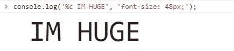
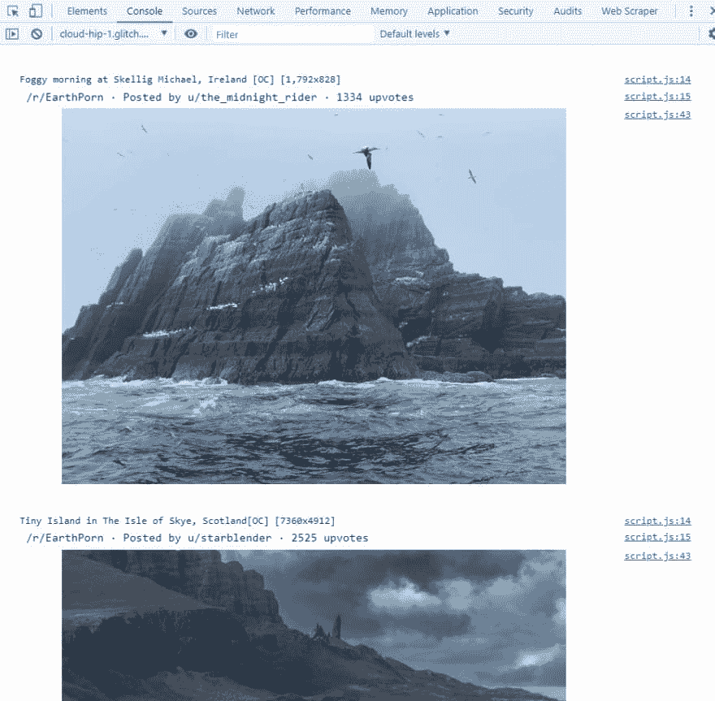
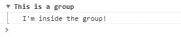
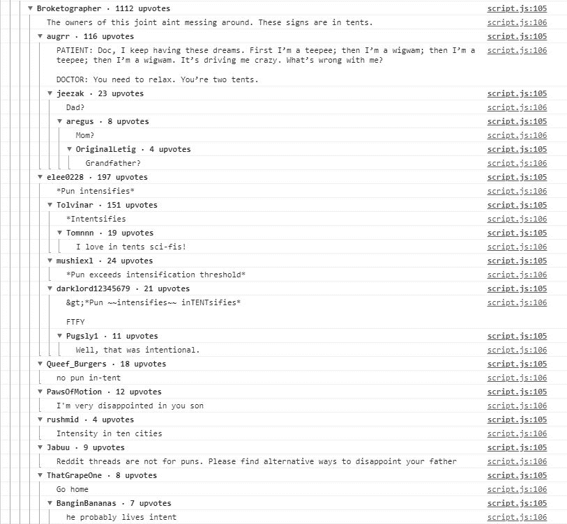
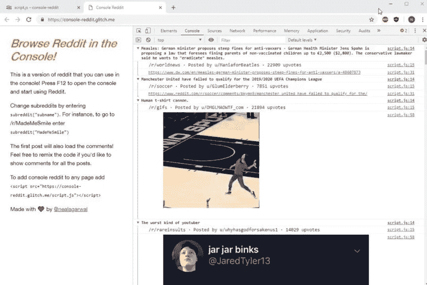

# 我如何在控制台中创建 Reddit

> 原文：<https://dev.to/neal/how-i-made-reddit-in-the-console-5d4i>

有时候，采用技术并以它们显然不应该被使用的方式使用它们是很有趣的。除了有趣之外，它还能帮助你了解你正在使用的技术的古怪之处。

对我来说，这个项目的目标是通过重新制作 Reddit 来了解更多关于控制台和一些鲜为人知的功能。尽管我一生都在使用 console.logging，但在这个过程中，我发现了几个我从来不知道的控制台特性！

## 获取数据

我选择实现 Reddit，而不是另一个社交媒体网站，因为从 Reddit 获取数据非常容易。

想要获取/r/all 的 json 数据吗？简单追加。json 到网址:
[https://www.reddit.com/r/all.json](https://www.reddit.com/r/all.json)

很漂亮，谢谢 Reddit。

现在我们有了一个 API 端点，我们可以获取数据:

```
function getPosts(currentSub){
  let url = "https://www.reddit.com/r/" + currentSub + ".json";
  fetch(url)
    .then(function(response) {
      return response.json();
  })
  .then(function(json) {
    parsePosts(json["data"]);
  });
} 
```

我们的 getPosts 函数将接受一个子编辑名，这样我们就可以从控制台中的任何子编辑中获取帖子了！

## 打印图像

Reddit 主要是图像，所以我们的控制台版本的 Reddit 也应该支持图像！

进入这个项目时，我知道可以将图像打印到控制台上，但我不知道怎么做。

经过一些研究，我发现:这是黑魔法。

事实证明，如果您将“%c”放在 console.log 消息中，那么您可以传递第二个参数，该参数带有将被添加到消息中的样式。

例如:
console.log('%c IM HUGE '，' font-size:48px；');

会显示为:
[](https://res.cloudinary.com/practicaldev/image/fetch/s--CE_iQ_OU--/c_limit%2Cf_auto%2Cfl_progressive%2Cq_auto%2Cw_880/https://thepracticaldev.s3.amazonaws.com/i/e7gw0k6i93fyybwmv993.JPG)

那么我们如何利用这个特性来打印图像呢？答案是背景图像属性！但是图像在控制台中的行为不像预期的那样。例如下面的

```
console.log('%c', 'background-url=url(./walrus.jpg) no-repeat;'); 
```

将显示为:

[](https://res.cloudinary.com/practicaldev/image/fetch/s--gXau-3kH--/c_limit%2Cf_auto%2Cfl_progressive%2Cq_auto%2Cw_880/https://thepracticaldev.s3.amazonaws.com/i/w6pysa2lsrgi6zi8ghb3.JPG)

为了让图像正确显示，我们必须在样式中添加填充。

```
console.log('%c ', 'padding: 125px; background:url(./walrus.jpg) no-repeat;'); 
```

现在它将正确显示:

[](https://res.cloudinary.com/practicaldev/image/fetch/s--8ZI1k1Le--/c_limit%2Cf_auto%2Cfl_progressive%2Cq_auto%2Cw_880/https://thepracticaldev.s3.amazonaws.com/i/0zrysrpmakbi1bxdqltj.JPG)

这很好，但是我们不能硬编码样式上的填充，因为来自 Reddit 的图像会有不同的尺寸。为了解决这个问题，我们需要根据图片的大小在每张图片上添加不同的填充。

我们可以用一些 Javascript:

```
function logImage(url) {
    var img = new Image();

    img.onload = function() {
        let width = this.width;
        let height = this.height;

        //Resize if needed
        if (this.width > 600) {
            width = 600;
            height = 600 * (this.height / this.width);
        }

        var style = getStyle(width, height);
        console.log("%c", style + "background: url(" + url + ");");
    };

    img.src = url;
}

function getStyle(width, height) {
    return "padding: " +
               Math.floor(height/3) + "px " +
               Math.floor(width/2) + "px; line-height: " +
               height/3 + "px;"
} 
```

我们还缩放图像，使图像的最大宽度为 600 像素，从而提供更好的观看体验。此外，还增加了行高，以确保图像保持居中。

接下来，让我们打印来自 Reddit 的实际图像。

我们的 Reddit JSON 数据包含每篇文章的 URL。利用这一点，我们可以通过检查 URL 是否包含图像扩展名来检查它是否是图像。png，。jpg 等)。如果是这样，那么我们控制台. log 图像。

它甚至适用于 gif！

[](https://res.cloudinary.com/practicaldev/image/fetch/s--9txJbUsy--/c_limit%2Cf_auto%2Cfl_progressive%2Cq_66%2Cw_880/https://thepracticaldev.s3.amazonaws.com/i/c9h3qwiowfk9zqhyvcyp.gif)

要添加更多的上下文，让我们添加更多的信息，如作者和 upvote 计数。

```
console.log('%c ' + "/r/" + postData["subreddit"] + 
                    " · Posted by u/" + postData["author"] +
                    " · "  + postData["score"] + " upvotes", 
                    "font-size: 14px;"); 
```

现在看起来是这样的:

[](https://res.cloudinary.com/practicaldev/image/fetch/s--Ka9JgbQ7--/c_limit%2Cf_auto%2Cfl_progressive%2Cq_auto%2Cw_880/https://thepracticaldev.s3.amazonaws.com/i/xhprayxzoq8dj1pp7swt.JPG)

漂亮！也许这就是 Reddit 的本意。

剩下的就是添加评论了。

## 添加评论

遗憾的是，我们调用的原始 API 端点不包含注释。因此，我们必须为每个帖子包含另一个 API 调用来获取评论。不过谢天谢地，Reddit 也让这个过程变得简单了。我们只需使用第一个 API 调用中给出的 permalink 来调用另一个端点:

```
function getComments(permalink, done){
  let url = "https://www.reddit.com" + permalink + ".json";

  fetch(url)
    .then(function(response) {
      return response.json();
  })
  .then(function(json) {
     parseComments(json);
     done();
  });
} 
```

就这样，我们能够获得所有帖子的评论！

现在我们只需要想办法展示它们。我们可以简单地 console.log 所有的评论，但是考虑到一个 Reddit 帖子可以获得数百条评论，简单地打印所有的评论将是一个糟糕的用户体验。

幸运的是，这款游戏机还有一个鲜为人知的功能。使用 console.group()和 console.groupEnd()，我们可以在控制台中创建可折叠的组。

例如:

```
console.group("This is a group");
console.log("I'm inside the group!")
console.groupEnd(); 
```

在控制台中会是这样的:

[](https://res.cloudinary.com/practicaldev/image/fetch/s---Te7UPhL--/c_limit%2Cf_auto%2Cfl_progressive%2Cq_auto%2Cw_880/https://thepracticaldev.s3.amazonaws.com/i/cdv5npbs2ebdp7biuh42.JPG)

利用这一点，我们现在可以使我们的注释默认折叠:

[](https://res.cloudinary.com/practicaldev/image/fetch/s--os87ezI8--/c_limit%2Cf_auto%2Cfl_progressive%2Cq_auto%2Cw_880/https://thepracticaldev.s3.amazonaws.com/i/urgnprk2rulfkttrx1lc.JPG)

但是等等，这还不是全部！控制台允许您将组嵌套在彼此内部。所以我们实际上可以像真正的 Reddit 一样以线程方式显示 Reddit 评论！

它是这样工作的:

```
function addComment(comment){
  if(!comment["body"]){
    return; 
  }
  console.group(comment["author"] + " · " + comment["score"] + " upvotes");
  console.log(comment["body"]);
  if(comment["replies"]){
    parseReplies(comment["replies"]["data"]["children"]);
  }
  console.groupEnd();
}

function parseReplies(replies){
   for(let x = 0; x < replies.length; x++){
     addComment(replies[x]["data"]);
   }
} 
```

对于每个评论，我们创建另一个控制台组，其中包含作者姓名和该评论的投票数。然后，我们递归地对该注释的所有回复做同样的事情，并且只在添加完所有回复后调用 console.groupEnd()。

结果看起来就像普通的 Reddit 评论，评论线程甚至是可折叠的！

[](https://res.cloudinary.com/practicaldev/image/fetch/s--P1zEKaHW--/c_limit%2Cf_auto%2Cfl_progressive%2Cq_auto%2Cw_880/https://thepracticaldev.s3.amazonaws.com/i/kovrlfozieo84p28tsb5.JPG)

将所有这些放在一起，这就是最终产品:

> <video loop="" controls=""><source src="https://video.twimg.com/ext_tw_video/1125091464210415616/pu/vid/1076x720/ZqS5JFZHxj6IUgdd.mp4?tag=9" type="video/mp4"></video>Neal Agarwal@ nealagarwal想在工作中浏览 Reddit？没问题，我做了一个 Reddit 版本，你可以在浏览器的控制台上使用！[@ glitch](https://twitter.com/glitch)
> 
> [console-Reddit . glitch . me](https://t.co/a7zHy2kySi)2019 年 5 月 05 日下午 17:57[](https://twitter.com/intent/tweet?in_reply_to=1125097314505375744)[](https://twitter.com/intent/retweet?tweet_id=1125097314505375744)6[](https://twitter.com/intent/like?tweet_id=1125097314505375744)59

点击此处查看完整代码
[点击此处查看运行中的代码！](https://console-reddit.glitch.me/)

这个项目是一个爆炸，我学到了更多关于控制台的东西，比我想象的要多。请随意重新混合，并添加更多的功能。

另外，如果你喜欢愚蠢而有趣的项目，我的推特上有更多！