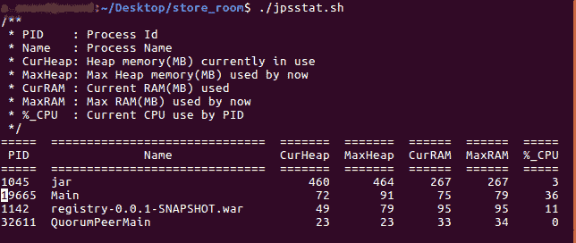

# JVM 内存使用监控工具

> 原文：<https://dev.to/cosimo/jvm-memory-usage-monitoring-tools-2mmf>

在过去的几天里，我研究了 JVM 内存监控工具。

这是我绝对不熟悉的一个专业领域。到目前为止，在我的职业生涯中，对于长时间运行的进程，一般的方法是避免使用 Java:-)我从过去的 Java 经验中记得的唯一的另一个(经验)智慧结晶是最大堆内存应该小于或等于最大系统内存除以 2 ( `maxHeap <= totalMem / 2`)。这些年来，我看到这种关系在一个相当繁忙的 Solr 搜索集群中工作得很好，该集群有 24 到 96Gb 的内存服务器，但 maxHeap 从来没有超过 8Gb，因为这些服务器同时运行许多其他进程。显然，如果系统上有其他进程并发运行，最大堆大小应该相应减少。

在观察服务器时，通常会监视“可用”内存(在 Datadog 中，应该是`system.mem.usable`),它是系统当前空闲内存和缓存或缓冲内存的总和。即系统在需要时可以随时抓取和使用的总内存。

这种方法不一定能告诉我们哪些进程在使用内存，为什么。我们还观察到，当像 filebeat 这样的日志聚合工具读取、解析日志并将其发送到日志服务器时，内存使用会出现峰值。开始跟踪特定的 merlin java 进程使用了多少内存，而不是查看一个总的内存指标，这将非常有用。

四处搜索，我找到了一些有用的文章(其中有[https://www . push technology . com/support/kb/understanding-the-Java-virtual-machine-heap-for-high-performance-applications/](https://www.pushtechnology.com/support/kb/understanding-the-java-virtual-machine-heap-for-high-performance-applications/))和几个工具，它们有助于更深入地挖掘和提取更多关于游戏服务器上发生的内存使用情况的信息。我想在这里提到它们，以供将来参考，并收集其他人的最终反馈。

## jvmtop

网址:[github.com/patric-r/jvmtop](https://github.com/patric-r/jvmtop)

简单的控制台应用程序，提供关于堆使用和垃圾收集 CPU 使用的高级统计信息。这里有一个来自文档页面的例子:

```
JvmTop 0.8.0 alpha amd64 8 cpus, Linux 2.6.32-27, load avg 0.12
 https://github.com/patric-r/jvmtop

  PID MAIN-CLASS HPCUR HPMAX NHCUR NHMAX CPU GC VM USERNAME #T DL
 3370 rapperSimpleApp 165m 455m 109m 176m 0.12% 0.00% S6U37 web 21
11272 ver.resin.Resin [ERROR: Could not attach to VM]
27338 WatchdogManager 11m 28m 23m 130m 0.00% 0.00% S6U37 web 31
19187 m.jvmtop.JvmTop 20m 3544m 13m 130m 0.93% 0.47% S6U37 web 20
16733 artup.Bootstrap 159m 455m 166m 304m 0.12% 0.00% S6U37 web 46 
```

其中各列是:

```
PID = process id
MAIN-CLASS = the "jvm name" but often the entry point class (with used main() method)
HPCUR = currently used heap memory
HPMAX = maximum heap memory the jvm can allocate
NHCUR = currently used non-heap memory (e.g. PermGen)
NHMAX = maximum non-heap memory the jvm can allocate
CPU = CPU utilization
GC = percentage of time spent in garbage collection (~100% means that the process does garbage collection only)
VM = Shows JVM vendor, java version and release number (S6U37 = Sun JVM 6, Update 37)
USERNAME = Username which owns this jvm process
#T = Number of jvm threads
DL = If !D is shown if the jvm detected a thread deadlock 
```

有助于快速浏览一些关键参数。我已经测试了最新的版本(0.9.0 ),从源代码编译起来又快又容易。

## jvm-mon

网址:[github.com/ajermakovics/jvm-mon](https://github.com/ajermakovics/jvm-mon)

另一个控制台应用程序，但是比 jvmtop 更复杂一些。它还显示趋势，因为它意味着要运行更长的一段时间。我觉得这是我喜欢的合适的花式层次:-)

[](http://www.streppone.it/cosimo/blog/wp-content/uploads/2019/06/jvm-mon.png) 我挺喜欢 jvm-mon 的，它很清晰，数据也容易理解。图表会根据运行时间的长短动态调整大小。

## jps_stat

网址:[github.com/amarjeetanandsingh/jps_stat](https://github.com/amarjeetanandsingh/jps_stat)

一个更简单的 shell 脚本，显示或多或少与 jvmtop 相同的信息，并保持运行和更新统计信息。阿发克，不可能一蹴而就。这将有助于构建我们自己的指标监控。

这是 jps_stat 执行时的样子: [](http://www.streppone.it/cosimo/blog/wp-content/uploads/2019/06/jps_stat.gif)

## 的指针

[https://docs . Oracle . com/javase/7/docs/technotes/tools/share/jstat . html](https://docs.oracle.com/javase/7/docs/technotes/tools/share/jstat.html)

最后一个是`jstat`，它是 JVM 发行版的一部分。用法非常简单，可以很容易地嵌入到一行程序或 shell 脚本中，如:

```
watch -d -n1 jstat -gc $(pidof java) 
```

`jstat -gc`输出垃圾收集统计数据，其中一些我还没弄明白用途。示例输出如下:

```
Every 1.0s: jstat -gc 12743 Thu Jun 6 09:33:23 2019

 S0C S1C S0U S1U EC EU OC OU MC MU CCSC CCSU YGC YGCT FGC FGCT GCT
34048.0 34048.0 10229.3 0.0 272640.0 37062.4 2731264.0 1519963.6 32192.0 30728.8 3804.0 3510.3 34926 873.839 26 2.781 876.620 
```

这些指标比仅仅从整体上看堆的使用情况更加详细。我真的不确定我是否需要具体研究所有这些。

## 结论

没什么可说的，但是现在获得更多关于服务器如何运行、消耗了多少堆内存、使用了多少非堆内存以及 java 进程本身使用的总内存与服务器上使用的总内存相比如何的细节是很有用的。

另外，写下这些东西很方便，这样我可以在需要的时候参考它们:-)