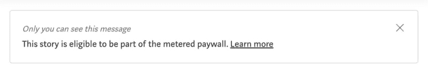
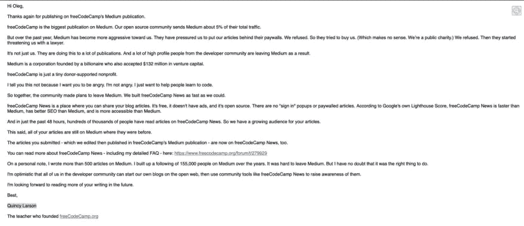
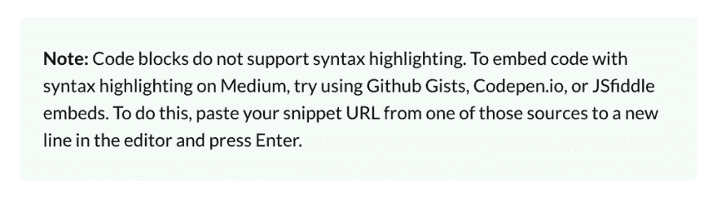
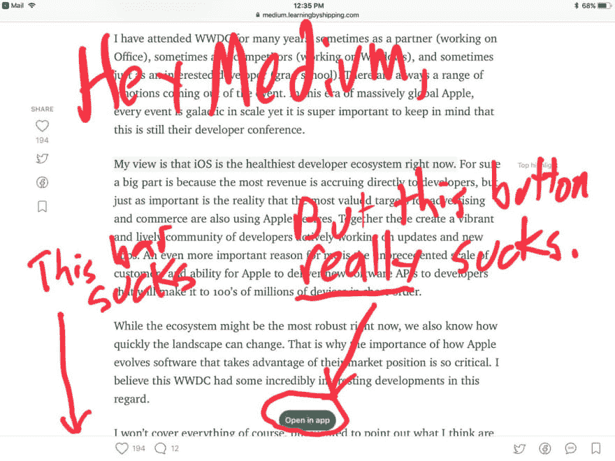
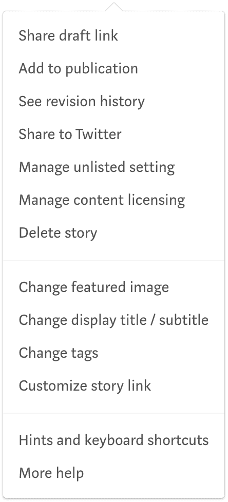
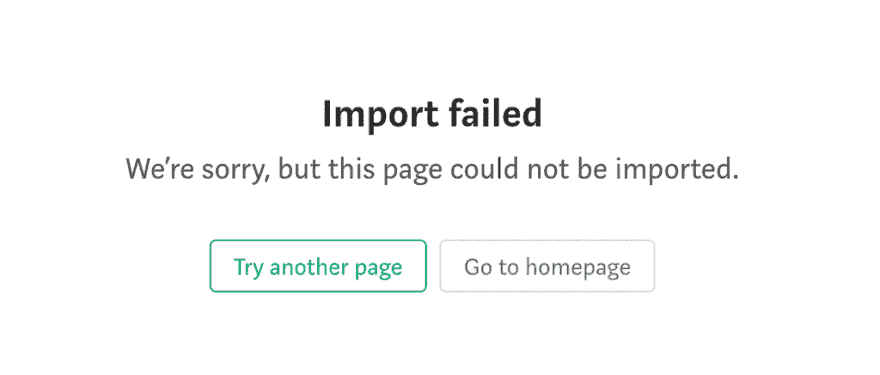
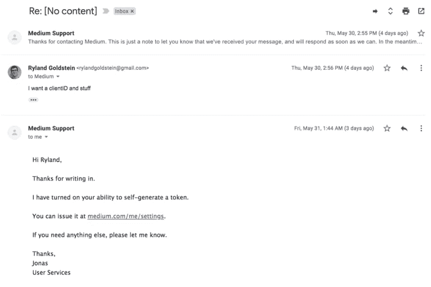
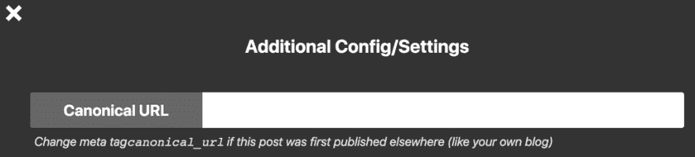

# 为什么媒体真的很烂

> 原文：<https://dev.to/taillogs/why-medium-actually-sucks-203>

在过去的几周里，针对臭名昭著的[“付费墙”](https://help.medium.com/hc/en-us/articles/360018834314-Stories-that-are-part-of-the-metered-paywall)，有很多针对媒体的反弹。我开始看到很多类似这条的推文:

> Bharath Ramsundar@ rbhar 90我确定这篇博文很优秀，但是 [@Medium](https://twitter.com/Medium) 的付费墙阻止我阅读。博客文章付费墙的激增是一个不愉快的未来。这感觉就像邀请学术付费墙重返科技世界。让我们开始避免像[@ Medium](https://twitter.com/Medium)[twitter.com/quocleix/statu…](https://t.co/rVW4YSrFZp)2019 年 5 月 18 日下午 21:46Quoc Le@ Quoc leixVincent Vanhoucke 题为“安静的半监督革命”的漂亮博客文章。它讨论了谷歌大脑团队的两项相关工作:无监督数据增强和 MixMatch。https://t.co/7nEFUgX8a1 https://t.co/bbDxaF6vep

我对这种态度有两个主要问题。

### 理由 1: **作者竖起了付费墙，不是媒介**

如果你遇到了付费内容，这意味着特定内容的作者选择了付费内容。默认情况下，付费墙是禁用的。一旦你写了一篇文章，你会看到下面的对话。

即使作者决定加入付费墙，他们仍然可以根据自己的判断获得一个无付费墙的链接进行分发。

### 理由二:有更好的理由不喜欢中号

#### 卑鄙的商业伎俩

[FreeCodeCamp](https://www.freecodecamp.org/) 是一个为开发者提供免费资源的慈善机构。他们的使命宣言说得最好，

> 我们的使命:帮助人们免费学习编码。我们通过创建数以千计的视频、文章和交互式编码课程来实现这一目标——所有这些都免费提供给公众。我们在世界各地也有数千个 freeCodeCamp 学习小组。

最近，一封由 FreeCodeCamp 创始人写的邮件在 twitter 上被泄露。这封邮件解释了 Medium 是如何对非营利组织施加压力，最终导致他们离开这个平台的。他特别指出，

> freeCodeCamp 是最大的媒体出版物。我们的开源社区向媒体发送了大约 5%的总流量。但是在过去的一年里，Medium 对我们变得更加咄咄逼人。他们迫使我们把我们的文章放在他们的付费墙后面。我们拒绝了。所以他们试图收购我们(这毫无意义。我们是公共慈善机构。).我们拒绝了。然后他们开始用律师威胁我们。

假设他们说的是真的，媒体真的敲诈了一个慈善机构。

> 不仅仅是我们。他们正在对许多出版物这样做。结果，许多来自开发者社区的知名人士离开了 Medium。

我很乐意听到其他人像 FreeCodeCamp 无意中那样说出来。这是完整的电子邮件，还有很多好东西。

#### 可怕的用户体验

让我们从简单的开始，比如语法高亮。

真快。

这是[官方媒体文件](https://help.medium.com/hc/en-us/articles/215194537-Format-text)！我不明白他们怎么会认真地建议找第三方来做一些简单的事情，比如语法高亮显示。

这是另一个很好的例子。Medium 有一款产品可以让发送简讯变得更容易。但是正如维科·比斯康蒂在他的文章中所说

> 我本来可以添加一张图片或更好的标志，但是，老实说，当我看到我最多只能添加一张全幅图片时，我就忘记了我的意愿。没别的了。除了页脚中的默认分隔符之外，您甚至不能添加分隔符，也不能在文章中嵌入图片、副标题和作者。没什么。
> 
> 虚无制造通讯。
> 
> 显然，Medium 已经多年没有人开发过这个工具了。

编辑体验的其他关键问题包括:

*   图像没有替代文本，这是不可接受的，因为它妨碍了视觉障碍者的可访问性

*   不直接支持视频，相反，你需要依靠一个外部服务来托管视频，即使是很短的视频。

*   没有本机表或网格。这在技术领域之外也是一个有用的特性，这真的让我对 Medium 的决策感到挠头。

*   没有可视化或数据绘图。这一缺失的特征本质上使得数据科学和媒体相互排斥。

媒体并没有把坏 UX 限制在编辑之内。在过去的一两年里，越来越多的垃圾也溜进了阅读体验。

> 约翰·格鲁伯@格鲁伯嘿@中:2017 年 6 月 12 日下午 16:37

用户体验是如此糟糕，以至于有人不得不制作浏览器插件[“让媒体再次可读”](https://chrome.google.com/webstore/detail/make-medium-readable-agai/kljjfejkagofbgklifblndjelgabcmig?hl=en)只是为了让体验再次变得可以忍受。

#### 有限控制你的内容

媒体并没有提供让你控制内容的机制。以设置规范的 URL 为例。似乎 Medium 并没有提供一种通过你文章上的菜单来设置规范 URL 的方法(如下图)。

我以为我错过了什么。快速的谷歌搜索结果是一个有前途的页面。

> Medium 的官方交叉发布工具(包括迁移工具、导入工具和 Wordpress 插件)会自动将导入来源添加为规范链接。

建议的第一个选项，即[“迁移工具”](https://help.medium.com/hc/en-us/articles/218445047-Import-Wordpress-archive)，已被否决。第二个选项，[【导入工具】](https://help.medium.com/hc/en-us/articles/214550207-Import-post)对我的博客不起作用。对于那些想知道为什么导入工具对我的博客不起作用的人，这里是 Medium 要说的。

如你所见，非常有洞察力。最后一个建议，显然不是一个选项，因为我的博客根本不使用 Wordpress 或 CMS。

大多数人会在这一点上放弃，但我有点受虐狂。在更多的搜索之后，我了解到 Medium 有一个[发布 API](https://help.medium.com/hc/en-us/articles/213480768-Publishing-API) 。

> Medium 向开发人员免费提供了一个只写 API，使您的应用程序的用户能够参与 Medium 网络。
> 
> Medium 使用 OAuth2 进行身份验证，通过它您可以无缝地发布到您的用户的 Medium 配置文件。该 API 支持 Markdown 和 HTML 内容格式、用于交叉发布的规范 URL 以及介质上可用的全部许可。

听起来很棒，对吧？当我开始阅读一些关于 publishing API 的文章时，他们总是提到一个“clientID ”,据称它在我的 Medium profile 中。事实并非如此。在经历了一些严重的挫折后，我崩溃了，去了 Github 上的 Medium API。短暂滚动后，我找到了基于浏览器的认证部分

> 首先，你必须通过给[yourfriends@medium.com](mailto:yourfriends@medium.com)发电子邮件请求访问。然后，我们将授予您在您的设置页面上访问 clientId 和 clientSecret 的权限，您可以使用这些权限访问 Medium 的 API。每个集成都应该有自己的 clientId 和 clientSecret。clientSecret 应该像密码一样被安全地存储。

好消息[Medium API 现在对所有人开放](https://blog.medium.com/the-medium-api-is-now-open-to-everyone-3f4642e5c850)

不知何故，他们所有的其他资源和文档都没有提到这个令人难以置信的手动步骤。但我仍然没有被打败，我认为这封邮件是由一个机器人控制的，它在介质上验证你的身份并自动回复。

一天后，我证实了那很可能只是一个叫乔纳斯的人。

我不是唯一一个对媒体这方面有问题的人。我强烈推荐[这篇关于离开媒体](https://baremetrics.com/blog/medium-back-to-blog)的伟大文章。

对于那些想知道这样做是否正确的人来说，下面是使用 [dev.to](https://dev.to/) 时整个过程的样子。

### 我们能做什么？

创建自己的博客比以往任何时候都容易。如果你已经有一段时间没有写博客了，我强烈推荐看看静态站点生成器，比如[盖茨比](https://github.com/gatsbyjs/gatsby)、[雨果](https://github.com/gohugoio/hugo)和 [Gridsome](https://github.com/gridsome/gridsome) 。结合类似 [Netlify](https://www.netlify.com/) 的东西，维护一个博客可能是轻而易举的事。Wordpress、Wix、Squarespace 和 Drupal 等博客 CMS 平台提供了一个丰富的生态系统，即使对于那些技术水平不足以运营自己博客的人来说也是如此。

不幸的是，这只能解决替换媒体的内容部分，而不能解决分发问题。没有简单的解决办法，你最好的办法是在尽可能多的渠道(Twitter，Reddit，HN 等)上发布...)尽你所能。

也有一些媒体的替代品。我个人将我的博客发布到 [Dev.to(你可能正在上面阅读这篇文章)](https://dev.to/)上，因为它们支持我控制自己的内容所需的功能。作为一个产品人员，我肯定会做一些 UI 更改，但总体体验要比中等好得多。