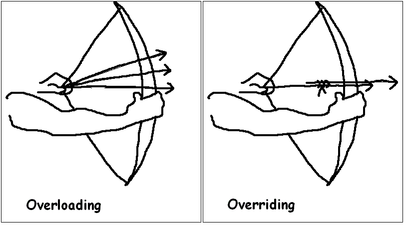
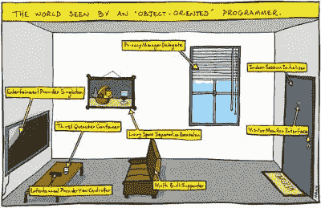
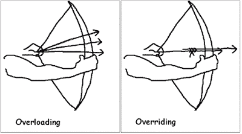
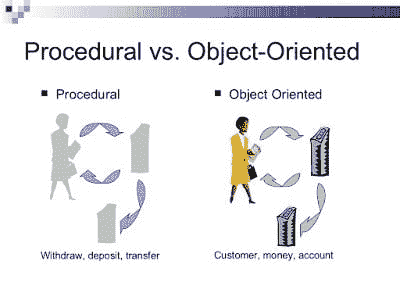
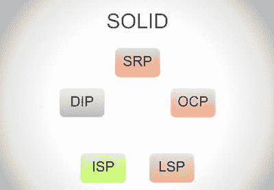
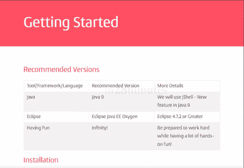

# 面向初学者和有经验的程序员的 5 个最佳面向对象编程课程和教程

> 原文：<https://dev.to/javinpaul/5-courses-to-learn-object-oriented-programming-in-2019-l0o>

*披露:这篇文章包括附属链接；如果您从本文提供的不同链接购买产品或服务，我可能会收到报酬。*

毫无疑问，[面向对象编程](http://www.java67.com/2018/02/5-free-object-oriented-programming-online-courses.html)是软件开发的支柱，也是 Java 取得巨大成功的原因之一。扎实的面向对象编程知识有助于您创建更好的软件。

这也有助于你更好地向你的团队和同事交流你的想法。尽管这是一项如此重要的技术，但是很难找到很好理解 OOP 的优秀程序员。

很多程序员只是认为 OOP 无非是[抽象](http://www.java67.com/2015/05/difference-between-abstraction-and.html)、[继承](http://www.java67.com/2012/08/what-is-inheritance-in-java-oops-programming-example.html)、[封装](https://javarevisited.blogspot.com/2012/03/what-is-encapsulation-in-java-and-oops.html)、[多态](http://www.java67.com/2015/05/difference-between-abstraction-and.html)，而没有真正理解和掌握这些概念。

毫无疑问，它们是面向对象编程的四大支柱，但 OOP 远不止于此。OOP 是关于类和对象方面的思考，通过遵循最佳实践来组织你的代码，比如使用[可靠设计原则](https://javarevisited.blogspot.com/2018/07/10-object-oriented-design-principles.html)和[设计模式](https://javarevisited.blogspot.com/2018/02/top-5-java-design-pattern-courses-for-developers.html)。

它最终帮助你写出更好的软件，更容易修改和支持。这就是程序员和软件开发人员理解 OOP 非常重要的原因。

以前我分享过几本[书](https://javarevisited.blogspot.com/2017/04/top-5-books-to-learn-object-oriented-programming.html)和[免费课程学习面向对象编程](http://www.java67.com/2018/02/5-free-object-oriented-programming-online-courses.html)。然而，关于一般的反馈，我收到了一些建议，关于分享更彻底和完整的课程来学习基本和高级的 [OOP 概念](http://www.java67.com/2015/12/top-30-oops-concept-interview-questions-answers-java.html)。

在这篇文章中，我将尝试回应这些反馈，并提供一个更广泛、更全面的初级和高级课程列表。

在这篇文章中，我将分享一些最好的课程，可以帮助你从头开始学习更多关于[面向对象编程和设计](https://medium.com/javarevisited/my-favorite-courses-to-learn-object-oriented-programming-and-design-in-2019-197bab351733)的知识。我还包括了初级和高级课程，以迎合不同经验水平的 Java 程序员。

## 面向 Java 开发人员的 5 门最佳面向对象编程课程

事不宜迟，下面是我为 Java 程序员列出的一些最好的面向对象和设计课程。这个列表包括初学者和有几年经验的 Java 程序员的课程。

不管你是否知道 [Java](https://javarevisited.blogspot.com/2018/08/top-5-free-java-8-and-9-courses-for-programmers.html) 和 [OOP](http://www.java67.com/2015/12/top-30-oops-concept-interview-questions-answers-java.html) ，加入这些课程你都会学到一点东西。

### [1。掌握 Java 面向对象设计](https://click.linksynergy.com/fs-bin/click?id=JVFxdTr9V80&subid=0&offerid=323058.1&type=10&tmpid=14538&RD_PARM1=https%3A%2F%2Fwww.udemy.com%2Fmastering-object-oriented-design-in-java%2F)

学习 Java 很容易，但编写生产质量的面向对象代码同样很难——这正是本课程将帮助你的地方。

你在网上找到的大多数面向对象课程只会解释 OOP 的基础，我指的是四大支柱- [抽象](http://javarevisited.blogspot.sg/2010/10/abstraction-in-java.html#axzz59Lhz7uVu)、[封装](https://javarevisited.blogspot.com/2017/04/difference-between-abstraction-and-encapsulation-in-java-oop.html)等等。但是，他们中很少有人详细讲述如何将它们应用到现实世界中。

抽象解决什么问题？为什么重要？如果你没有使用正确的抽象层次会发生什么？或者，你如何发展在不同抽象层次上看待事物的技能，等等？

这门[课程](https://click.linksynergy.com/fs-bin/click?id=JVFxdTr9V80&subid=0&offerid=323058.1&type=10&tmpid=14538&RD_PARM1=https%3A%2F%2Fwww.udemy.com%2Fmastering-object-oriented-design-in-java%2F)试图通过解释专业 Java 开发人员应该知道的所有重要工具和面向对象编程概念来弥合这一鸿沟。

你将像任何其他 Java 课程一样从 OOP 基础开始，但是慢慢地，你将学会使用面向对象编程中的最佳实践来设计和开发软件。

您将了解坚实的原则，并看到使用它们来编写更好的代码的例子。您还将学习几种面向对象的设计模式，如模板、[工厂](http://javarevisited.blogspot.sg/2011/12/factory-design-pattern-java-example.html#axzz51cvxH5kW)、[策略](http://javarevisited.blogspot.sg/2015/07/strategy-design-pattern-and-open-closed-principle-java-example.html)、[观察者](http://javarevisited.blogspot.sg/2011/12/observer-design-pattern-java-example.html)、[构建器](http://javarevisited.blogspot.sg/2012/06/builder-design-pattern-in-java-example.html)等。

该课程还涵盖了高级概念，如[依赖注入](https://javarevisited.blogspot.sg/2015/06/difference-between-dependency-injection.html)和 [UML](https://javarevisited.blogspot.com/2017/07/top-5-books-to-learn-uml-unified-modelling-language-java.html) ，并向您展示如何在实际项目中使用它们。

总的来说，这是一门学习更多面向对象编程和设计的好课程，我强烈推荐给有几年经验的初级和中级 Java 开发人员。

* * *

### [2。Java 面向对象编程绝对入门](https://click.linksynergy.com/fs-bin/click?id=JVFxdTr9V80&subid=0&offerid=323058.1&type=10&tmpid=14538&RD_PARM1=https%3A%2F%2Fwww.udemy.com%2Fabsolute-introduction-to-object-oriented-programming-in-java%2F)

这是上一课作者的另一门[课](https://click.linksynergy.com/fs-bin/click?id=JVFxdTr9V80&subid=0&offerid=323058.1&type=10&tmpid=14538&RD_PARM1=https%3A%2F%2Fwww.udemy.com%2Fabsolute-introduction-to-object-oriented-programming-in-java%2F)。这个课程实际上更多的是初级水平，如果你在加入之前的课程之前参加这个课程会更好——如果你之前没有任何关于 [OOP](http://www.java67.com/2016/09/oops-concept-tutorial-in-java-object-oriented-programming.html) 的背景。

本课程节奏缓慢、简单，非常适合希望理解类和对象以及它们如何帮助您编写更有组织的代码的初学者。

您将了解对象是何时创建的，以及当您运行 Java 程序时，它如何使用属性和方法。

本课程结束时，你将理解类和对象的区别以及重要的面向对象技术，如[继承](http://www.java67.com/2017/08/default-methods-in-interface-multiple.html)和[多态](http://javarevisited.blogspot.sg/2011/08/what-is-polymorphism-in-java-example.html)。

总的来说，对于想要理解面向对象编程的初学者来说，这是一门很棒的课程。

* * *

### [3。Java -面向对象编程【绝对初学者】](https://click.linksynergy.com/fs-bin/click?id=JVFxdTr9V80&subid=0&offerid=323058.1&type=10&tmpid=14538&RD_PARM1=https%3A%2F%2Fwww.udemy.com%2Fjava-object-oriented-programming-for-absolute-beginners%2F)

这是另一门更侧重于 Java 的[课程](https://click.linksynergy.com/fs-bin/click?id=JVFxdTr9V80&subid=0&offerid=323058.1&type=10&tmpid=14538&RD_PARM1=https%3A%2F%2Fwww.udemy.com%2Fjava-object-oriented-programming-for-absolute-beginners%2F)，但是它很好地涵盖了面向对象编程。你可以把课程分成两部分——第一部分是第 1 章，它只关注 OOP，第二部分关注不同的 Java 特性，比如线程、IO、流、Java 垃圾收集和异常处理。

在第一部分中，你将学习 OOP 基础知识，比如类和对象、构造函数、[重载](http://www.java67.com/2015/08/top-10-method-overloading-overriding-interview-questions-answers-java.html)和[覆盖](http://javarevisited.blogspot.sg/2011/12/method-overloading-vs-method-overriding.html#axzz5BcfNzgOe)方法，比如[数据抽象](http://javarevisited.blogspot.sg/2010/10/abstraction-in-java.html)、[封装](http://javarevisited.blogspot.sg/2012/03/what-is-encapsulation-in-java-and-oops.html#axzz4vlf582rN)和[继承](http://www.java67.com/2012/08/what-is-inheritance-in-java-oops-programming-example.html)。

好的一面是，它用一个演示来解释每个概念，使其易于理解和记忆。本课程还关注静态变量，这是 OOP 不推荐的，并使用抽象类和接口。

* * *

### [4。Java 面向对象编程:从头开始](https://click.linksynergy.com/fs-bin/click?id=JVFxdTr9V80&subid=0&offerid=323058.1&type=10&tmpid=14538&RD_PARM1=https%3A%2F%2Fwww.udemy.com%2Fobject-oriented-programming-in-java-from-the-beginning%2F)

你会发现大多数关于 Java 面向对象编程的课程更多地关注 Java，而较少关注 OOP，但是这个课程是不同的。

诚然，面向对象编程课程往往侧重于 OOP，并使用 Java 作为例子。

在这门[课程](https://click.linksynergy.com/fs-bin/click?id=JVFxdTr9V80&subid=0&offerid=323058.1&type=10&tmpid=14538&RD_PARM1=https%3A%2F%2Fwww.udemy.com%2Fobject-oriented-programming-in-java-from-the-beginning%2F)中，你将学习面向对象编程的基础知识，比如 OOP 和过程化语言的区别，比如 Java 和 C，以及抽象、封装、[继承](http://www.java67.com/2016/03/top-21-java-inheritance-interview-Questions-Answer-Programming.html)、[多态](http://www.java67.com/2012/10/difference-between-polymorphism-overloading-overriding-java.html)、[组合](http://javarevisited.blogspot.sg/2013/06/why-favor-composition-over-inheritance-java-oops-design.html#axzz57Kv4wGXe)和[聚合](http://javarevisited.blogspot.sg/2014/02/ifference-between-association-vs-composition-vs-aggregation.html)等。

您还将了解抽象类接口以及如何使用 OOP 创建对象。

本课程现在关注 Java 如何支持 OOP，例如 getters 和 setters、访问修饰符、接口的使用、组合、[重载](http://www.java67.com/2012/09/difference-between-overloading-vs-overriding-in-java.html)、[静态成员](http://www.java67.com/2016/05/difference-between-static-and-nonstatic-member-variable-in-java.html)等。

最后，本课程还介绍了 Java 中的一些设计模式，并解释了它们如何帮助你用 Java 编写更好的 OOP 代码。

简而言之，这是一个很好的学习 Java 面向对象编程和设计的短期课程。也就是说，对于软件工程师和工作中的 Java 专业人员来说，这都是一个不错的选择。

* * *

### [5。用 250 个步骤学习面向对象的 Java 编程](https://click.linksynergy.com/fs-bin/click?id=JVFxdTr9V80&subid=0&offerid=323058.1&type=10&tmpid=14538&RD_PARM1=https%3A%2F%2Fwww.udemy.com%2Fjava-programming-tutorial-for-beginners%2F)

这是学习 Java 面向对象编程的一门优秀且最新的[课程](https://click.linksynergy.com/fs-bin/click?id=JVFxdTr9V80&subid=0&offerid=323058.1&type=10&tmpid=14538&RD_PARM1=https%3A%2F%2Fwww.udemy.com%2Fjava-programming-tutorial-for-beginners%2F)。

这门课教你使用 Java 9 进行面向对象编程——它使用最新最好的工具，例如 JShell、 [Eclipse IDE](http://www.java67.com/2018/02/5-free-eclipse-and-junit-online-courses-java-developers.html) 等等。你将学习编程的基础知识，如循环、条件、函数等。

该课程还解释了面向对象编程的基础知识，包括抽象类、接口、构造函数、覆盖、重载以及 OOP 的四大支柱。

这门课程最大的好处是它非常实用，你可以通过实践来学习，这是学习新技术的最好方式。

这门课程的另一个好处是它是免费的，但我不确定它会免费多久。

* * *

### 6。[学习 Java 面向对象编程](https://www.educative.io/courses/learn-object-oriented-programming-in-java?affiliate_id=5073518643380224)

面向对象编程是一种基本的编程风格，你绝对应该拥有它。这将挑战你以不同的方式思考问题，最终帮助你作为一名开发人员取得进步，并在你的职业生涯中成长。

熟悉面向对象的原则会让你的生活变得更容易，原因如下:

当您使用对象和类时，调试代码更容易。你可以使用像[多态](https://www.java67.com/2012/10/difference-between-polymorphism-overloading-overriding-java.html)、[封装](https://javarevisited.blogspot.com/2017/04/difference-between-abstraction-and-encapsulation-in-java-oop.html)和[继承](https://javarevisited.blogspot.com/2012/10/what-is-inheritance-in-java-and-oops-programming.html)这样的技术。

您将能够对更容易编写和理解的复杂现实世界问题进行建模。

还有什么比仍然广泛使用的原始面向对象语言 Java 更好的起点呢？Java 还有很多生命，对于语言不断进步的 Java 开发人员来说，这是一个非常激动人心的时刻。

这就是为什么我非常兴奋地与你们分享这门课程，学习 Java 面向对象编程。本课程采用基于项目的方法来帮助你加深对 OOP 概念的理解。

在课程快结束时，你将开始设计一个基于控制台的自动售货机应用程序，这样你就有机会将 OOP 原理应用到现实场景中。

开始使用 Java 中的 [OOP，开发解决问题的新方法，并开始使用您在职业生涯中所学的知识。](https://javarevisited.blogspot.com/2020/05/object-oriented-programming-questions-answers.html)

以下是加入本课程的链接- [学习 Java 面向对象编程](https://www.educative.io/courses/learn-object-oriented-programming-in-java?affiliate_id=5073518643380224)

对于不懂 Java 的人来说，这门课程也有 [JavaScript](https://www.java67.com/2020/10/best-javascript-courses-for.html) 、 [Python](https://javarevisited.blogspot.com/2021/05/python-interview-questions-answers-for-beginners.html) 、 [C++](https://javarevisited.blogspot.com/2020/07/top-10-courses-to-learn-c-in-depth-best.html) 、 [C#](https://medium.com/javarevisited/9-free-c-c-sharp-courses-and-tutorials-for-beginners-and-intermediate-programmers-best-of-lot-dc8c793aab31) 三种版本，可以随着自己编程语言的选择来选择课程，学习面向对象编程。

以上是学习面向对象编程和 Java 设计的一些最好的课程。这些课程对于第一次接触 Java 和面向对象编程的人来说非常有用。

它不仅会教你 OOP 基础，还会向你展示如何使用 OOP 和基本的面向对象设计原则来设计程序，比如接口编码和创建更好的 Java 应用程序的坚实原则。

### 您可能想探索的其他编程资源

[初学者学习 Docker 的 10 门免费课程](https://hackernoon.com/10-free-courses-to-learn-docker-for-programmers-and-devops-engineers-7ff2781fd6e0)
[每个程序员都应该学习的 10 个 OOP 设计原则](https://hackernoon.com/10-oop-design-principles-every-programmer-should-know-f187436caf65)
[Java 开发人员学习的 5 门免费 Spring 框架课程](http://www.java67.com/2017/11/top-5-free-core-spring-mvc-courses-learn-online.html)
[有经验者学习 Spring Boot 的 5 门课程](https://hackernoon.com/top-5-online-courses-to-learn-spring-boot-in-2019-c2fd7a0282c2)
[学习大数据和 Apache Spark 的 5 门课程](http://javarevisited.blogspot.com/2017/12/top-5-courses-to-learn-big-data-and.html)
[学习 Java 设计模式的 5 门课程](https://javarevisited.blogspot.com/2018/02/top-5-java-design-pattern-courses-for-developers.html)
[5 门免费数据结构和算法课程](https://javarevisited.blogspot.com/2018/01/top-5-free-data-structure-and-algorithm-courses-java--c-programmers.html)
[面向程序员和开发人员的免费 Linux 课程](http://www.java67.com/2018/02/5-free-linux-unix-courses-for-programmers-learn-online.html)
[5 门免费课程学习 React JS 框架](http://www.java67.com/2018/02/5-free-react-courses-for-web-developers.html)
[学习 TensorFlow 和机器学习的前 5 门课程](https://javarevisited.blogspot.com/2018/08/top-5-tensorflow-and-machine-learning-courses-online-programmers.html)
[初学者学习 Web 开发的前 5 门课程](https://javarevisited.blogspot.com/2018/02/top-5-online-courses-to-learn-web-development.html)

感谢阅读这篇文章。如果你觉得这些 OOP 课程有用，那么请分享给你的朋友和同事。如果您有任何问题或反馈，请在下面留言！

> P.S. -如果你正在寻找一些免费的面向对象编程课程，你也可以看看我的[免费面向对象编程课程列表](http://www.java67.com/2018/02/5-free-object-oriented-programming-online-courses.html)。