# Jenkins:通过 Github 和 Allure 中的 Pull 请求从 Codeception 运行 PHPUnit-reports

> 原文：<https://dev.to/setevoy/jenkins-running-phpunit-from-codeception-by-a-pull-request-in-github-and-allure-reports-3inl>

[](https://res.cloudinary.com/practicaldev/image/fetch/s--ZNr-ArAg--/c_limit%2Cf_auto%2Cfl_progressive%2Cq_auto%2Cw_880/https://rtfm.co.ua/wp-content/uploads/2016/01/Jenkins.sh-600x600-e1453134979914.png) 任务是创建一个 Jenkins 脚本化的管道作业，用我们基于 PHP 的后端单元测试运行 [PHPUnit](https://phpunit.de/) 。

要运行 PHPUnit [将使用 Codeception](https://codeception.com/) 。

这个 Jenkins 作业必须在创建拉请求后从 Github 库触发，所以这里将使用 [Github 拉请求生成器](https://rtfm.co.ua/jenkins-github-pull-request-builder-plagin/)插件。

要查看生成的报告，将使用 [Allure](https://rtfm.co.ua/jenkins-allure-reports-plugin-v-scripted-pipeline/) Jenkins 插件。

我们的 Jenkins 运行在 Docker 容器中，它的所有任务也将使用 [Docker 插件](https://plugins.jenkins.io/docker-plugin)作为 Docker 容器运行。

### 测试测试

为了了解测试将如何在 Jenkins 中运行——首先，让我们在本地运行它们。

PHP:

```
$ docker run -ti php:7.2 php --version
PHP 7.2.19 (cli) (built: Jun  1 2019 00:50:51) ( NTS )
Copyright (c) 1997-2018 The PHP Group
Zend Engine v3.2.0, Copyright (c) 1998-2018 Zend Technologies 
```

制作`init` :

```
$ docker run -ti -v $(pwd):/data/ php:7.2 /data/init --env=Development
Yii Application Initialization Tool v1.0
...
initialization completed. 
```

现在–Composer 安装依赖项:

```
$ docker run -ti -v $(pwd):/data/ --workdir /data composer install --optimize-autoloader --ignore-platform-reqs
Loading composer repositories with package information
Installing dependencies (including require-dev) from lock file
Package operations: 118 installs, 0 updates, 0 removals
...
Generating optimized autoload files 
```

最后——单元测试本身，首先从我们的*后端*目录开始:

```
$ docker docker run -ti -v $(pwd):/data/ codeception/codeception run -c /data/backend/ unit
Codeception PHP Testing Framework v3.0.1
Powered by PHPUnit 7.5.9 by Sebastian Bergmann and contributors.
Running with seed:
Backend\tests.unit Tests (0) ----
Time: 99 ms, Memory: 16.00 MB
No tests executed! 
```

好的——现在还没有测试，开发者稍后会添加测试，我们现在的任务就是让它工作。我们去詹金斯。

### 詹金斯

创建一个管道作业，配置 *GitHub 项目*:

[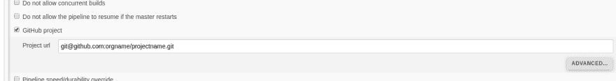](https://rtfm.co.ua/wp-content/uploads/2019/06/Screenshot_20190605_125109.png)

写一个管道脚本:

```
node {

    stage('Clone repo') {
        git branch: "master", url: "git@github.com:orgname/reponame.git", credentialsId: "jenkins-github"
    }

    stage('Build app') {
        docker.image('php:7.2').inside('-v /var/run/docker.sock:/var/run/docker.sock') {
            sh "php init --env=Development"
        }
    }
} 
```

[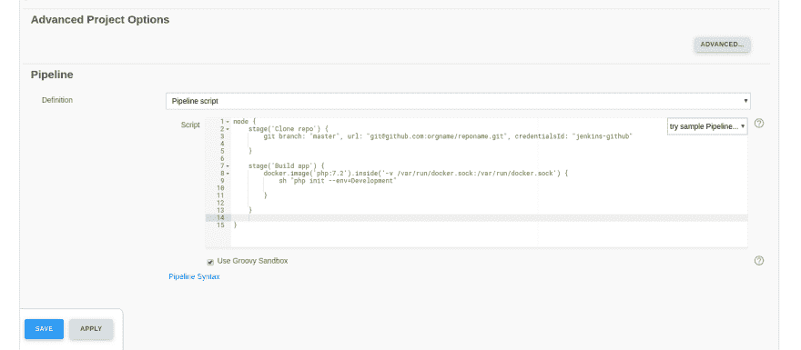](https://rtfm.co.ua/wp-content/uploads/2019/06/Screenshot_20190606_142617.png)

运行:

[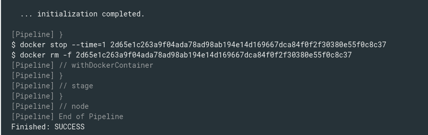](https://rtfm.co.ua/wp-content/uploads/2019/06/Screenshot_20190605_131748.png)

好了，所有作品都在这里，现在添加作曲:

```
node {

    stage('Clone repo') {
        git branch: "master", url: "git@github.com:orgname/reponame.git", credentialsId: "jenkins-github"
    }

    stage('Build app') {
        docker.image('php:7.2').inside('-v /var/run/docker.sock:/var/run/docker.sock') {
            sh "php init --env=Development"
        }
        docker.image('composer').inside('-v /var/run/docker.sock:/var/run/docker.sock') {
            sh "composer install --optimize-autoloader --ignore-platform-reqs"
        }
    }
} 
```

运行作业并:

[](https://rtfm.co.ua/wp-content/uploads/2019/06/Screenshot_20190605_132504.png)

> …
> 
> –安装 orgname/itunes-receipt-validator(dev-master c 8 c 11 ba):克隆 c8c11ba7ba
> 
> 未能从源代码下载 orgname/itunes-receipt-validator:未能执行 git 克隆–不结账':orgname/itunes-receipt-validator . git ' '/var/lib/Jenkins/workspace/BackendUnitTests/project name/vendor/orgname/itunes-receipt-validator '&&CD '/var/Jenkins
> 
> 现在尝试从 dist
> 
> 下载–安装 orgname/itunes-receipt-validator(dev-master c 8 c 11 ba):下载(连接中…)…下载(失败)
> 
> 【Composer \ Downloader \ transport exception】
> 
> [文件无法下载(HTTP/1.1 404 未找到)
> 
> …](https://api.github.com/repos/orgname/itunes-receipt-validator/zipball/c8c11ba7ba1741c7dec248e6f9c0787cb146730a%E2%80%9D)

通过调用`composer config` :
来添加 Github Auth 令牌

```
...
        docker.image('composer').inside('-v /var/run/docker.sock:/var/run/docker.sock') {
            sh "composer config -g github-oauth.github.com 64b***554"
            sh "composer install --optimize-autoloader --ignore-platform-reqs"
        }
... 
```

重新启动作业:

[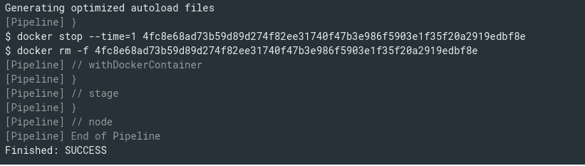](https://rtfm.co.ua/wp-content/uploads/2019/06/Screenshot_20190605_132956.png)

很好。

添加测试执行:

```
node {

    stage('Clone repo') {
        git branch: "master", url: "git@github.com:orgname/reponame.git", credentialsId: "jenkins-github"
    }

    stage('Build app') {
        docker.image('php:7.2').inside('-v /var/run/docker.sock:/var/run/docker.sock') {
            sh "php init --env=Development"
        }
        docker.image('composer').inside('-v /var/run/docker.sock:/var/run/docker.sock') {
            sh "composer config -g github-oauth.github.com 64b***554"
            sh "composer install --optimize-autoloader --ignore-platform-reqs"
        }
    }

    stage('Backend tests') {
        docker.image('codeception/codeception').inside('-v /var/run/docker.sock:/var/run/docker.sock') {
            sh "codeception run -c backend/ unit"
        }        
    }
} 
```

#### Jenkins Docker 插件——容器启动但没有运行预期的命令。请仔细检查您的入口点。

下一个错误发生在添加`codeception` Docker 容器时:

> …
> 
> 【管道】with docker container
> 
> Jenkins 好像在容器 81 f 6a 8 cbdb 28 a 86 b5 e 156 a 929 ef 06 C2 a 68 DD 5 c 716910 f 0 ab 66073656 c32c 6472
> 
> $ docker run-t-d-u 0:0-v/var/run/docker . sock://var/run/docker . sock-w/var/lib/Jenkins/workspace/内运行 code exception/code exception cat
> 
> $ docker top 7e 909 BF 25 e 232 c 951658478 C1 a82 a 93504061 a4 de 4d 90 b 2134680 B3 ca 5 f 59 f 36-EO PID，comm
> 
> 错误:容器启动但没有运行预期的命令。 请仔细检查您的入口点是否按照官方 docker 映像的要求，执行了作为 docker run 参数传递的命令(请参见[https://github . com/docker-library/official-images # consistency](https://github.com/docker-library/official-images#consistency)了解入口点一致性要求)。
> 
> 或者，您可以通过添加选项`–entrypoint=”`强制禁用图像入口点。
> 
> ……
> 
> 进程显然从未在/var/lib/Jenkins/workspace/BackendUnitTests/project name @ tmp/durable-49 ccb7e 5
> 
> ……
> 
> 【管道】管道末端
> 
> 错误:脚本返回退出代码-2
> 
> 完成:失败

这不是我第一次看到这个错误，通常，我只是通过用所有必要的工具建立自己的 Docker 映像来解决它。

但这次我有点懒得写 Dockerfile 并构建了，所以找了另一个“解决方案”。

在 2016 年开始的这一期[詹金斯](https://issues.jenkins-ci.org/browse/JENKINS-39748?focusedCommentId=285351&page=com.atlassian.jira.plugin.system.issuetabpanels%3Acomment-tabpanel#comment-285351)中，仍然有新的评论，人们说`--entrypoint=""`可能会有所帮助。

但是在这种情况下,`sh "codeception run [...]"`调用将不起作用。

因此，需要在 Codeception Docker 映像中找到一个可执行的 Codeception。

这可以通过用指定的`entrypoint`搜索它的`Dockerfile`，或者通过运行一个容器并用`docker inspect`检查它来实现，但是我用了另一种方法。

用重新定义的`entrypoint`到`bash` :
在本地运行一个容器

```
$ docker run -ti --entrypoint bash codeception/codeception
root@596960d14192:/project# 
```

然后我试图找到`codeception`可执行文件:

```
root@596960d14192:/project# find / -name codeception
/root/.composer/cache/files/codeception
/repo/vendor/codeception 
```

[/simterm]

但是这些都是目录…

那它是怎么开始的呢？

于是我开始输入*代码*，并点击 TAB 键，它给我设置了可执行文件的名称—`codecept`而不是`codeception`。

然后调用返回我的`/repo/codecept`的`which codecept`。

现在更新管道脚本–添加`--entrypoint=""`并更改`sh`调用:

```
...
    stage('Backend tests') {
        docker.image('codeception/codeception').inside('-v /var/run/docker.sock:/var/run/docker.sock --entrypoint=""') {
            sh "/repo/codecept run -c backend/ unit"
        }        
    }
... 
```

运行它:

[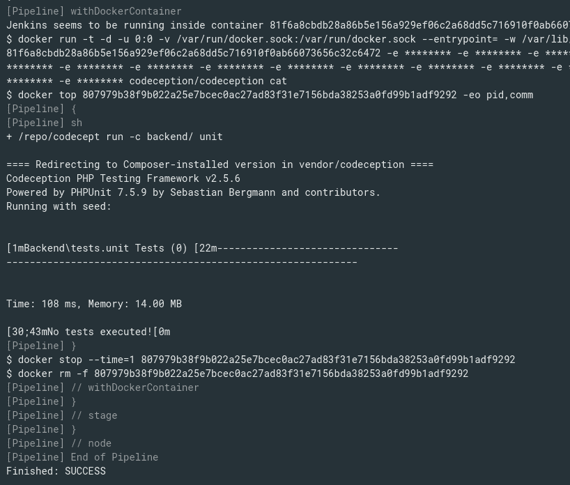](https://rtfm.co.ua/wp-content/uploads/2019/06/Screenshot_20190605_141215.png)

很好。

在写这篇文章的时候，开发人员添加了一个“测试”,所以让我们用报告生成来运行它，见这里的文档[>>>](https://codeception.com/docs/11-Codecoverage)。

```
...
    stage('Backend tests') {
        docker.image('codeception/codeception').inside('-v /var/run/docker.sock:/var/run/docker.sock --entrypoint=""') {
            sh "/repo/codecept run -c backend/ unit --coverage-xml --coverage-html"
        }        
    }
... 
```

运行:

[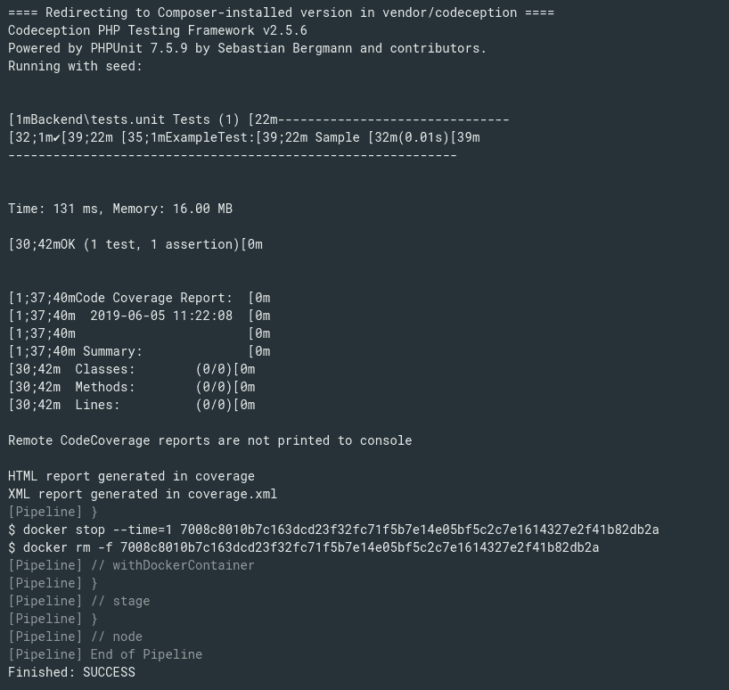](https://rtfm.co.ua/wp-content/uploads/2019/06/Screenshot_20190605_142511.png)

### 倾城报道

工作结束后，我想做的下一件事是一份诱惑报告。

我们已经有了另一个版本的 [Allure Reports 插件](https://rtfm.co.ua/jenkins-allure-reports-plugin-v-scripted-pipeline/),所以让我们试着将它与 Codeception/PHPUnit 一起使用。

另一个解决方案可能是使用 [Clover PHP 插件](https://wiki.jenkins.io/display/JENKINS/Clover+PHP+Plugin)。

这里有[>>>](https://github.com/allure-framework/allure-codeception)的 Allure docs for Codeception。

编辑项目的`composer.json`，添加诱惑依赖:

```
...
{
    "require": {
            ...
      "allure-framework/allure-codeception": ">=1.1.0"
    }
}
... 
```

更新`backend/codeception.yml`配置并添加`extensions` :

```
namespace: backend\tests
actor: Tester
paths:
    tests: tests
    log: tests/_output
    data: tests/_data
    helpers: tests/_support
settings:
    bootstrap: _bootstrap.php
    colors: true
    memory_limit: 1024M
modules:
    config:
        Yii2:
            configFile: 'config/test-local.php'
extensions: 
    enabled:
        - Yandex\Allure\Codeception\AllureCodeception
    config:
        Yandex\Allure\Codeception\AllureCodeception:
            deletePreviousResults: false
            outputDirectory: allure-results 
            ignoredAnnotations:
                - env        
                - dataprovider 
```

在作业中添加`composer.lock` update(以后最好在项目的存储库中更新它，以避免每次在作业中调用`update`):

```
...
    stage('Build app') {
            ...
            sh "composer update --lock --ignore-platform-reqs"
            sh "composer install --optimize-autoloader --ignore-platform-reqs"
        }
    }
... 
```

将 Allure 插件设置添加到构建脚本:

```
...
    stage('Backend tests') {
        docker.image('codeception/codeception').inside('-v /var/run/docker.sock:/var/run/docker.sock --entrypoint=""') {
            sh "/repo/codecept run -c backend/ unit"
        }        
    }

    stage('Reports') {
        allure([
            includeProperties: false,
            jdk: '',
            properties: [],
            reportBuildPolicy: 'ALWAYS',
            results: [[path: 'backend/tests/_output/allure-results']]
        ])
    }
... 
```

运行构建:

[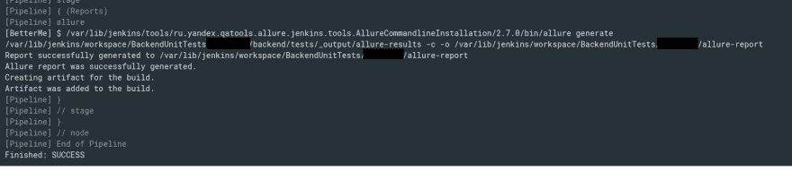](https://rtfm.co.ua/wp-content/uploads/2019/06/Screenshot_20190605_171735.png)

报告已经准备好了:

[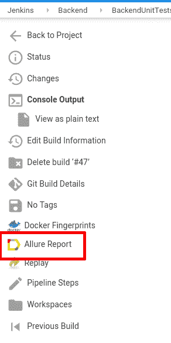](https://rtfm.co.ua/wp-content/uploads/2019/06/Screenshot_20190605_171801-1.png)

[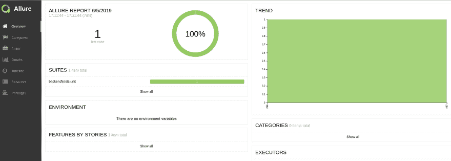](https://rtfm.co.ua/wp-content/uploads/2019/06/Screenshot_20190605_171820.png)

### [T1】Github web hook](#github-webhook)

最后要做的事情是配置一个 Github 存储库，以便在创建一个 Pull 请求来触发 Jenkins 上的单元测试作业之后执行一个 webhook。

参见 [Jenkins: Github 拉请求生成器плагин](https://rtfm.co.ua/jenkins-github-pull-request-builder-plagin/) ( *Rus* )。

在作业的设置中添加 *GitHub 项目*:

[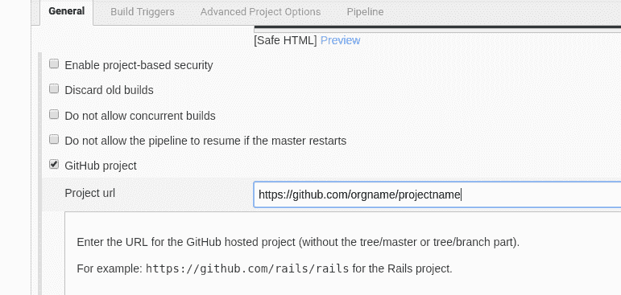](https://rtfm.co.ua/wp-content/uploads/2019/06/Screenshot_20190606_105353.png)

创建一个 Github 令牌并配置插件。

在作业的设置中，在其*构建触发器*中启用 *GitHub 拉请求构建器*，设置*使用 GitHub 钩子进行构建触发。*

在*组织列表中。他们的成员将被列入白名单*添加一个 Github 的组织(或者在*管理员列表*中的一个专用用户，如果你的 Github 中没有组织)，并设置*允许白名单组织的成员作为管理员*:

[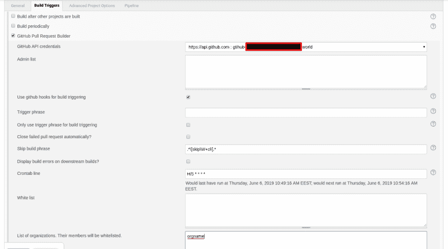](https://rtfm.co.ua/wp-content/uploads/2019/06/Screenshot_20190606_105807.png)

[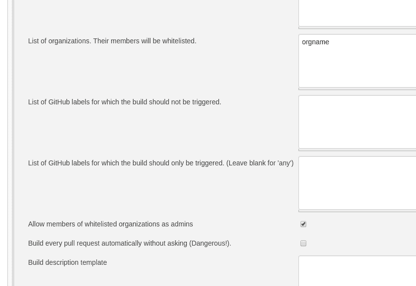](https://rtfm.co.ua/wp-content/uploads/2019/06/Screenshot_20190606_112239.png)

如果网页挂钩不是由插件创建的——自己添加:

[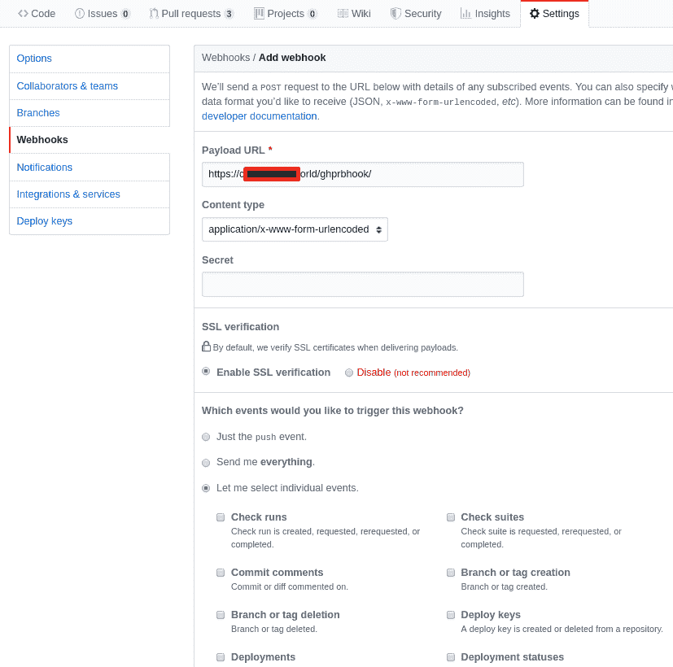](https://rtfm.co.ua/wp-content/uploads/2019/06/Screenshot_20190606_111850-1.png)

在*Payload URL*set*https:///ghprbhook/*中，选择*让我选择单个事件*，选择将触发此 webhook 的事件——*发布评论*和*拉请求*:

[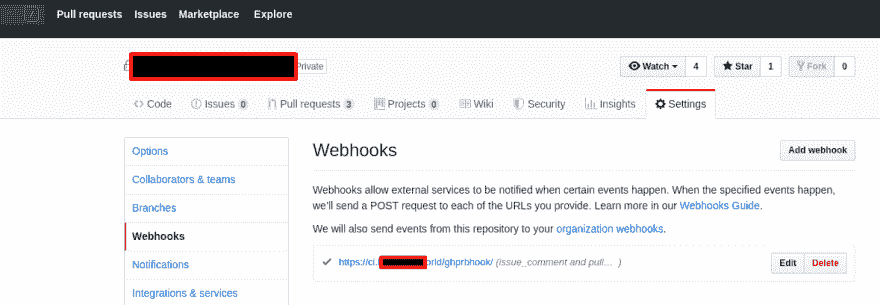](https://rtfm.co.ua/wp-content/uploads/2019/06/Screenshot_20190606_134502-1.png)

[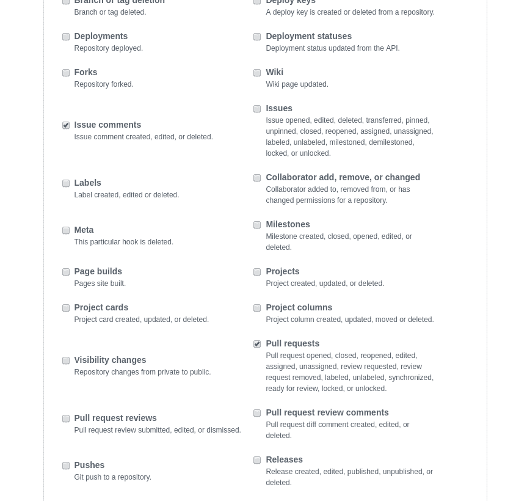](https://rtfm.co.ua/wp-content/uploads/2019/06/Screenshot_20190606_112035.png)

创建公关:

[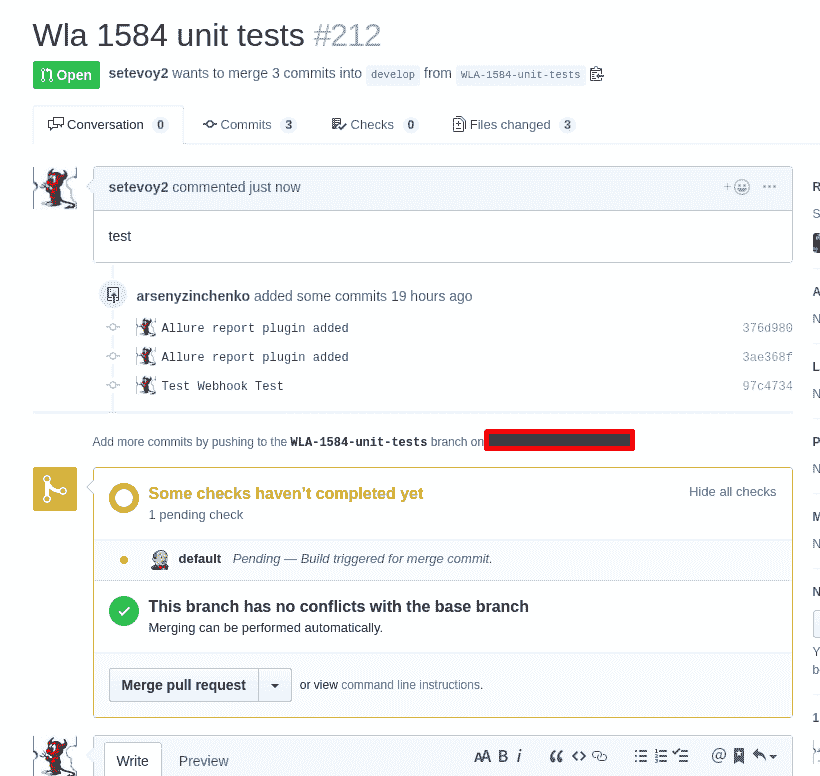](https://rtfm.co.ua/wp-content/uploads/2019/06/Screenshot_20190606_112426.png)

检查 webhook 状态–必须是对 Jenkins 的新呼叫:

[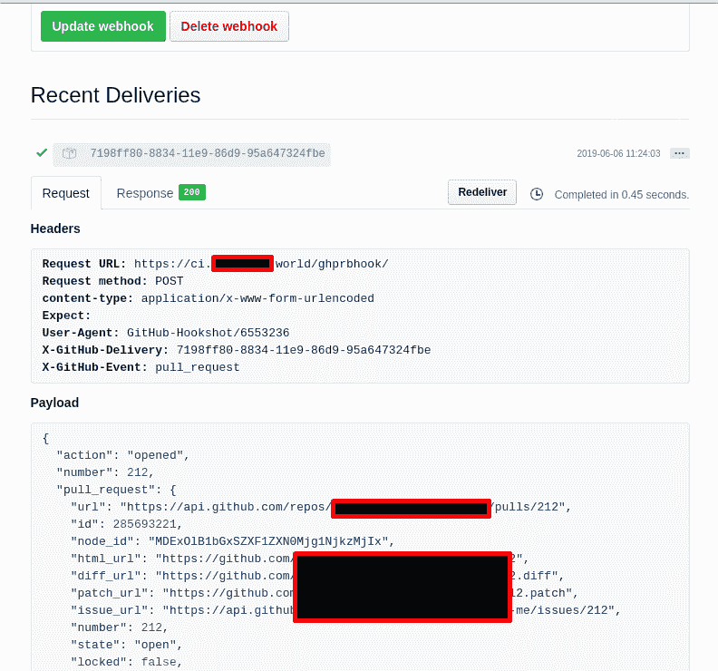](https://rtfm.co.ua/wp-content/uploads/2019/06/Screenshot_20190606_112500.png)

詹金的新工作是:

[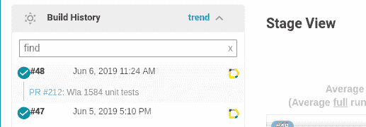](https://rtfm.co.ua/wp-content/uploads/2019/06/Screenshot_20190606_112539.png)

公关状态:

[](https://rtfm.co.ua/wp-content/uploads/2019/06/Screenshot_20190606_112607.png)

总的来说，就是这样。

为了完成我们上面所做的一切——将管道脚本移动到一个存储库，并硬编码 Github 存储库/分支——作为作业的参数。

所以构建脚本现在看起来像这样:

```
node {
    stage('Clone repo') {
        git branch: "${APPLICATION_BRANCH}", url: "${APPLICATION_URL}", credentialsId: "jenkins-github"
    }
    stage('Build app') {
        docker.image('php:7.2').inside('-v /var/run/docker.sock:/var/run/docker.sock') {
            sh "php init --env=Development"
        }
        docker.image('composer').inside('-v /var/run/docker.sock:/var/run/docker.sock') {
            sh "composer config -g github-oauth.github.com ${GITHUB_TOKEN}"
            sh "composer update --lock --ignore-platform-reqs"
            sh "composer install --optimize-autoloader --ignore-platform-reqs"
        }
    }
    try {
        stage('Backend tests') {
            docker.image('codeception/codeception').inside('-v /var/run/docker.sock:/var/run/docker.sock --entrypoint=""') {
                sh "/repo/codecept run -c backend/ unit"
            }
        }
        stage('Frontend tests') {
            docker.image('codeception/codeception').inside('-v /var/run/docker.sock:/var/run/docker.sock --entrypoint=""') {
                sh "/repo/codecept run -c frontend/ unit"
            }
        }
    } finally {
        stage('Reports') {
            allure([
                includeProperties: false,
                jdk: '',
                properties: [],
                reportBuildPolicy: 'ALWAYS',
                results: [[path: 'backend/tests/_output/allure-results'],[path: 'frontend/tests/_output/allure-results']]
            ])
        }
    }
} 
```

添加了一个*前端*测试阶段，并在`try/catch`中设置了测试执行，以便总是通过 Allure(在`finally`中)收集报告，否则，如果任何测试失败，构建将停止而不执行`stage('Reports')`。

现在作业中的脚本执行:

[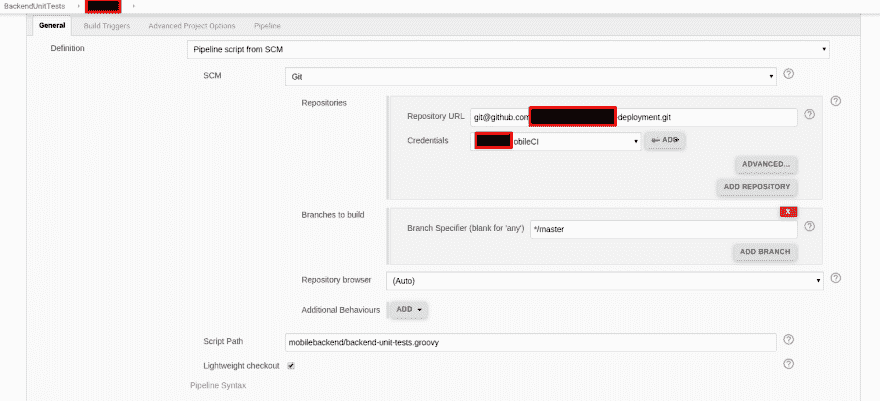](https://rtfm.co.ua/wp-content/uploads/2019/06/Screenshot_20190606_130009.png)

和报告—*后端*一个通过，*前端*一个失败:

[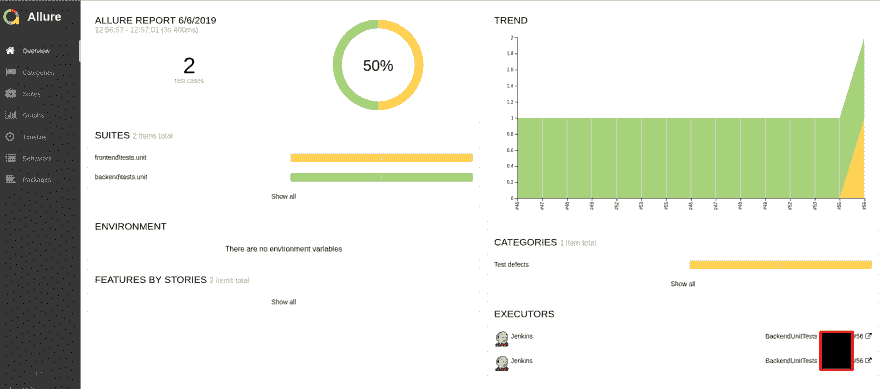](https://rtfm.co.ua/wp-content/uploads/2019/06/Screenshot_20190606_130210.png)

完成了。

*   [](http://www.facebook.com/sharer.php?u=https://rtfm.co.ua/en/jenkins-running-phpunit-from-codeception-by-a-pull-reguest-in-github-and-allure-reports/&t=Jenkins%3A+running+PHPUnit+from+Codeception+by+a+Pull+Request+in+Github+and+Allure-reports)
*   [](http://twitter.com/share?text=Jenkins%3A+running+PHPUnit+from+Codeception+by+a+Pull+Request+in+Github+and+Allure-reports-&url=https://rtfm.co.ua/en/jenkins-running-phpunit-from-codeception-by-a-pull-reguest-in-github-and-allure-reports/&via=RTFM:%20Linux,%20DevOps%20and%20system%20administration)
*   [](https://plusone.google.com/_/+1/confirm?hl=fr-FR&url=https://rtfm.co.ua/en/jenkins-running-phpunit-from-codeception-by-a-pull-reguest-in-github-and-allure-reports/)
*   [](http://www.tumblr.com/share/photo?source=https%3A%2F%2Frtfm.co.ua%2Fwp-content%2Fuploads%2F2016%2F01%2FJenkins.sh-600x600-e1453134979914-1.png&caption=Jenkins%3A+running+PHPUnit+from+Codeception+by+a+Pull+Request+in+Github+and+Allure-reports&clickthru=https%3A%2F%2Frtfm.co.ua%2Fen%2Fjenkins-running-phpunit-from-codeception-by-a-pull-reguest-in-github-and-allure-reports%2F)
*   [](http://www.linkedin.com/shareArticle?mini=true&url=https://rtfm.co.ua/en/jenkins-running-phpunit-from-codeception-by-a-pull-reguest-in-github-and-allure-reports/&title=Jenkins%3A+running+PHPUnit+from+Codeception+by+a+Pull+Request+in+Github+and+Allure-reports&source=RTFM:%20Linux,%20DevOps%20and%20system%20administration)

### 类似的帖子

*   <small>06/18/2019</small>[sonar cube:对来自 T4](https://rtfm.co.ua/en/sonarqube-running-tests-from-jenkins-pipeline-from-docker/)【0】码头的 Jenkins 管道进行测试
*   <small>2019 年 6 月 18 日</small> [声呐曲:儿基会码头□□□□□□□□□□□□□□□□□□□□□□□□□□□□□□□□□□□□□□□□□□□□□□□□□□□□□□□□□□□□](https://rtfm.co.ua/sonarqube-zapusk-v-docker-i-vyzov-iz-jenkins-pipeline/)
*   <small>2/24/2017</small>[【Jenkins:输油管道″″″″″″″″″″″″″″″″″″″″″″″″″″″″″″″″″″″″″″″″″″″″″″″″″″″″″″″″″″″″″″″](https://rtfm.co.ua/jenkins-pipeline-plagin-i-trigger-bilda-cherez-github-webhook/)
*   <small>04/16/2019</small> [Jenkins:一份检查 Github 组织公共存储库列表的工作](https://dev.to/setevoy/jenkins-a-job-to-check-a-github-organization-s-public-repositories-list-129p) <small>(0)</small>