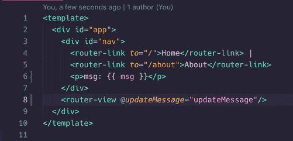

# 从 Vue 路由器视图触发事件

> 原文：<https://dev.to/therealdanvega/triggering-events-from-vue-router-views-5f48>

上周，我在整理我们关于 Vue 路由器的文档时，遇到了一个有趣的挑战。在很短的时间内，我们的学生能够使用 Vue 构建一些非常酷的应用程序。我们教他们组件如何相互通信，并向他们介绍 Vue 路由器。

当您想要从您的视图甚至这些视图中的组件开始触发事件时，问题就出现了。在现实世界中，你会开始认为这是一个明显的痛苦，并看看别人用什么来解决这个问题。

当这个问题出现时，你可能会使用 Vuex 之类的东西。在我们的情况下，我们只是没有时间将它包含在我们的课程中，所以当他们构建最终顶点项目时，他们需要一种方法来触发他们视图中的事件。

我做了一个快速的演示，有一个哈哈的时刻。当我们想要在任何组件中触发一个事件时，我们只需发出一个并在父组件上监听它。在这种情况下，视图只是一个组件，父组件是`<router-view>`。很容易忘记，但`<router-view>`只是一个组件。

我对此非常兴奋，所以我在推特上发布了这个:

> 丹维加[@ therealdanvega](https://dev.to/therealdanvega)当你开始构建真实世界 [#vuejs](https://twitter.com/hashtag/vuejs) 应用时，你最终会迁移到类似 vuex 的东西，但你知道吗，当使用 vue-router 时，你可以在视图中冒泡出子组件的事件，并在路由器视图组件上监听该事件？它只是一个组件🤷‍♂️20:01pm-2019 年 5 月 31 日[](https://twitter.com/intent/tweet?in_reply_to=1134550365049937920)[](https://twitter.com/intent/retweet?tweet_id=1134550365049937920)18[](https://twitter.com/intent/like?tweet_id=1134550365049937920)50

Damian Dulisz 很快回复并提醒我，因为它是一个组件，所以它也可以接受道具。这正是我们在工作中进行的讨论，我很高兴听到我们不是唯一有这种想法的人。

## 触发来自 Vue 路由器演示的事件

我不能使用触发这篇文章的确切项目，但是我能够放在一起一个简单的例子，应该有助于解释解决方案。如果你想跳过前面，你可以跳到 [CodeSandbox](https://codesandbox.io/s/trigger-event-views-p9oyt?fontsize=14) 上的最终解决方案。

### 试玩游戏介绍

在我们的示例应用程序中，我们有一个在整个应用程序中保持不变的页脚组件，它包含一条状态消息。

[](https://res.cloudinary.com/practicaldev/image/fetch/s--QyOA9xMO--/c_limit%2Cf_auto%2Cfl_progressive%2Cq_auto%2Cw_880/2019-06-05_12-13-15-1bacd64d-69d7-48c7-a7ac-b90cc67baea5.png)

在`App.vue`中有一个`<router-view>`组件将显示我们的每一个视图，在它下面你将包含一个组件`TheFooter.vue`。

```
<template>
  <div id="app">
    <ul class="nav">
      <router-link to="/">Home</router-link>|
      <router-link to="/admin">Admin</router-link>
    </ul>
    <router-view @updateStatus="updateStatus" class="content"/>
    <the-footer :status="status"/>
  </div>
</template> 
```

页脚组件的代码非常少。

```
<template>
  <div class="footer">
    <p>{{ status }}</p>
  </div>
</template>

<script>
export default {
  name: "the-footer",
  props: {
    status: String
  }
};
</script> 
```

我们需要的是从组件中改变状态消息的能力。这里的问题是组件(`StatusUpdate.vue`)正在另一个名为 admin 的视图中使用。

[](https://res.cloudinary.com/practicaldev/image/fetch/s--xN6iVH-g--/c_limit%2Cf_auto%2Cfl_progressive%2Cq_auto%2Cw_880/2019-06-05_12-15-38-7d19d6b2-654c-4187-8d61-fa1a6b4f88aa.png)

因此，要实现这一点，你需要从管理页面到主应用程序组件触发事件，然后将其作为道具传递到页脚。

### 触发路由器视图中的事件

如果您在知道可以发出一个事件以便任何父组件能够监听它之前已经处理过事件。要更新状态，您将在输入字段中键入新的状态，然后单击按钮。当按钮在我们的`StatusUpdate.vue`组件中被点击时，它将发出一个名为`updateStatus()`
的事件

```
<template>
  <div class="update-status">
    <p>Please enter a message below to update the status message.</p>
    <input type="text" v-model="status">
    <button @click="$emit('updateStatus',status)">Update Status</button>
  </div>
</template>

<script>
export default {
  name: "status-message",
  data() {
    return {
      status: ""
    };
  }
};
</script> 
```

父组件是`src/views/`中一个名为`Admin.vue`的视图。在管理页面上，您将导入状态消息组件并将其显示在屏幕上。当你发出一个事件时，它只在父组件中可用，所以要在`App.vue`中监听它，你需要从管理员到应用程序进行冒泡。

为了完成这项工作，添加一个事件监听器来监听将从`UpdateStatus.vue`组件发出的`updateStatus`事件。这将返回并向 Admin 的父组件(即我们的`<router-view>`)发出`updateStatus`事件。

```
<template>
  <div class="admin">
    <h1>Admin Page</h1>
    <p>Siphon white macchiato arabica frappuccino breve as, affogato that acerbic dark sweet. Qui brewed single shot white bar plunger pot single shot cinnamon. Lungo brewed turkish white aged skinny french press. Aged french press white medium, brewed and ut seasonal single origin. Single origin, aroma, robusta trifecta cup frappuccino cup skinny.</p>
    <p>Arabica and percolator blue mountain to go mug frappuccino white medium brewed single shot. Skinny redeye aromatic, java flavour mazagran blue mountain robusta milk. Trifecta single shot strong single origin caffeine cream cinnamon cream extra. Turkish, caramelization so, cultivar brewed, cream mocha plunger pot white robusta saucer. Caffeine dark, brewed carajillo pumpkin spice mocha caffeine.</p>

    <status-message @updateStatus="updateStatus"/>
  </div>
</template>

<script>
import StatusMessage from "@/components/StatusMessage.vue";

export default {
  name: "admin",
  components: {
    StatusMessage
  },
  data() {
    return {};
  },
  methods: {
    updateStatus(status) {
      this.$emit("updateStatus", status);
    }
  }
};
</script> 
```

现在在`App.vue`中，您可以监听`<router-view>`组件上的`updateStatus`事件。正如我之前提到的，这只是一个组件，所以这将工作。您现在可以更新状态，它将使用 props 传递到您的页脚中。

```
<template>
  <div id="app">
    <ul class="nav">
      <router-link to="/">Home</router-link>|
      <router-link to="/admin">Admin</router-link>
    </ul>
    <router-view @updateStatus="updateStatus" class="content"/>
    <the-footer :status="status"/>
  </div>
</template>

<script>
import TheFooter from "./components/TheFooter";

export default {
  name: "App",
  components: {
    TheFooter
  },
  data() {
    return {
      status: "This is the default status message"
    };
  },
  methods: {
    updateStatus(status) {
      this.status = status;
    }
  }
};
</script> 
```

## CodeSandbox

如果你对这个项目的最终代码感兴趣，你可以[点击这里](https://codesandbox.io/s/trigger-event-views-p9oyt?fontsize=14)或者使用下面的 CodeSandbox embed。

[https://codesandbox.io/embed/trigger-event-views-p9oyt?fontsize=14 & view=editor](https://codesandbox.io/embed/trigger-event-views-p9oyt?fontsize=14&view=editor)

## 结论

我认为这里要记住的重要事情是，你在`/views`文件夹中的组件以及`<router-link>`和`<router-view>`最终都只是单个文件组件。正因为如此，它们可以触发和监听事件，或者像其他组件一样工作。我希望这个小提示能让你的一天变得更轻松，一如既往....

快乐编码

丹

*这篇文章最初是在 https://www.danvega.dev/blog 的[发表在我的博客上的。如果你觉得这篇文章有趣，请考虑](https://www.danvega.dev/blog)[订阅我的时事通讯](https://www.danvega.dev/signup/)或者在 [Twitter](http://twitter.com/therealdanvega) 上关注我。*