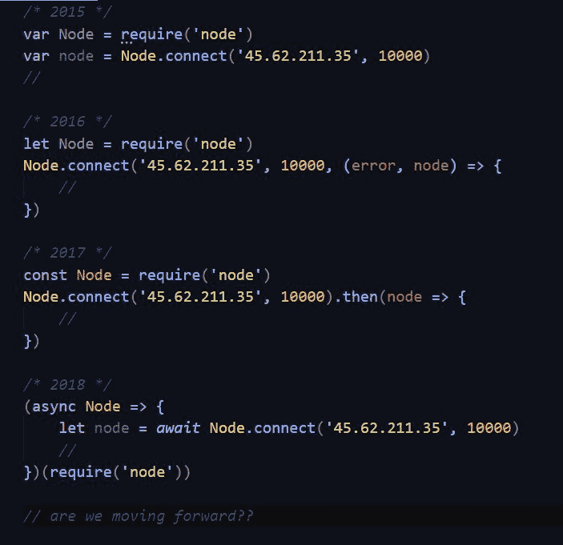

# 你想象 JavaScript 在 5 年或 10 年后会是什么样子？

> 原文：<https://dev.to/jochemstoel/what-do-you-imagine-javascript-looks-like-in-5-or-10-years-4mla>

自从引入 ES6、Node 和各种新的标准 API 以来，我们已经走过了漫长的道路。你想象(或希望)JavaScript 十年后会是什么样子？:)