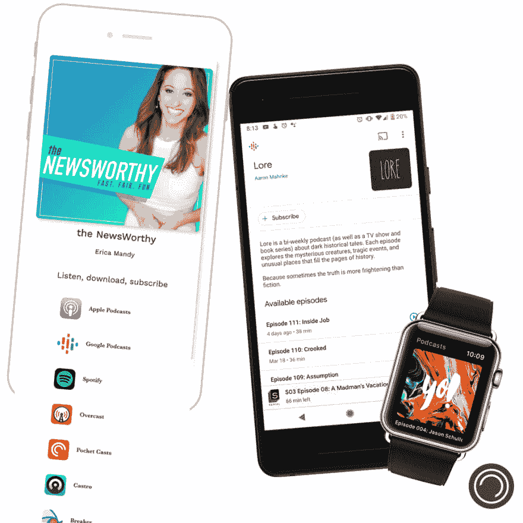

# 超越 SaaS MVP 进入自动化和优化——创始人之旅

> 原文：<https://dev.to/scottmathson/bootstrapping-beyond-saas-mvp-into-automation-optimization-founder-s-journey-5461>

几年前，我确信自己会成为一名著名的音乐家和录音室老板。

在那之前，一个职业滑板运动员。

我的道路和我如何到达我现在的位置的轨迹有点曲折。

但在我更深入地投入到市场营销、网络开发和一整套创业角色之前，我已经埋头于音频制作和音乐。最初学习打鼓，然后逐渐转向学习吉他、贝斯、作曲、班卓琴等等。

2000 年中期，我经营着一家面向当地音乐家的录音室，提供音频制作服务。在此期间，我学到了更多关于播客制作的知识，并最终开始主持一个节目(自存档以来)。音频是我最初的创业经历之一，音乐对我来说一直很重要。

植根于艺术和创造力，我选择的旅行路线已经深入到事物更具技术性的一面。网站设计和开发导致自由职业和代理所有权，内容到日常工作和副业，营销和产品到全职工作，工程，设计，创业，等等。

我总是在创造，总是在制造东西。

同样，我最近推出了 podcast 智能链接服务。坚持我的[时事通讯的承诺](https://scottmathson.com/newsletter/)公开记录我的网络角落和分享项目，我将分享更多关于 Plink 和我的创业之旅。

因此，让我们深入了解 Plink 实际上是什么，我为什么要创建它，以及它所解决的问题。以及分享我正在做的决定，我正在克服的困难，以及对业务和产品优化的见解。

**目录**:

*   这个播客智能链接产品是什么？为什么要创造它？
*   超越 MVP
    *   制作 v1。并通过第三方解决方案使其符合预算
    *   运送不带用户帐户、电子邮件和其他功能的 MVP

# 这个播客智能链接产品是什么？为什么要创造它？

Plink 是一款智能链接即服务、软件即服务(SaaS)、播客营销产品。我创建这个是为了解决播客创作者和消费者的痛点。很明显双方都经历了脱节。

作为一名播客(Makerviews)和许多播客的粉丝，我亲身经历了在推广节目和剧集时为收听平台收集链接这一耗时的手工任务。在消费者方面，iOS 苹果播客的过度优先化使得这种媒体似乎无法被 Android 和其他消费者获得，尤其是第一次听的人。

Plink 制作智能链接，任何人、任何设备都可以打开并播放。为创作者提供播客营销解决方案，增强消费者的用户体验，无论设备、操作系统或地理位置如何。

使用 Plink 和 smart linking，每个人，尤其是第一次使用播客的听众，如果他们还没有应用程序偏好(或者还不知道有一个应用程序偏好)，会自动将他们引导到各种设备中预装的原生应用程序。我开发了更多的功能，如显示页面播客应用程序链接登录页面等。更多的内容正在不断地被划分优先级并添加到路线图中。

创作者如何链接到各种平台的节目直接影响消费者的体验和整个生态系统的可访问性。我对此充满热情，并在 Plink 博客上写了更多关于[播客发现和可访问性的文章。](https://plinkhq.com/blog/2019/05/03/how-podcasts-are-discovered-social-smart-link-sharing/)

在我的日常工作和家庭生活之外，在过去几个月的大部分时间里，我一直专注于开发这项服务和解决方案。从市场调查，客户访谈，产品规划和开发，私人测试，等等。我在 2019 年 Q2 奥运会开始时公开发布了 Plink 的一个*成熟的最小可行产品(MVP)* ，在建立 MVP 时考虑了 [Eric Ries 的精益创业方法](https://amzn.to/2WsEudd)。

然而，它仍然是一个 MVP，为了扩大规模，是时候超越已被证明可行的 MVP 了。

# 超越 MVP

我已经进入了下一个阶段，并逐步改进和消除一些小错误。目前，我对产品的现状非常有信心和满意。它证明了最初的假设，解决了问题，节省了创作者的时间，并改善了消费者的聆听体验。

见鬼，我甚至添加了一些功能，比如帮助播客赚取更多的被动收入，将他们的 iTunes 会员 id 添加到付费的自定义链接中。这让我非常兴奋，因为 Plink 将继续通过进一步的采用、积极的反馈和评论以及该产品的免费和付费用户群的不断增长而得到验证。

但是我已经认识到，实际上是时候将我的大部分注意力从核心产品上转移开了。远离构思、开发、发布和营销新功能(以及优化现有功能)。

是时候将我的重点转移到*优化业务*上了。为了进行扩展，我需要自动化手动任务、重新工作、扩展自助支持、文档和其他核心业务优化。

* * *

最近我在听 SaaS 的播客，由前微软员工、西雅图 SaaS 教练兼企业家奥马尔·汗主持。第 207 集的嘉宾泰勒·特林加斯真的引起了我的共鸣。我发现自己重新听了这一集，点头附和，并看到了他的创始人和我自己的旅程之间的许多相似之处。

这一集讲述了泰勒所谓的“微型 SaaS”(非常有针对性的利基，小团队，专注的产品)业务的旅程，他之前创建并出售了该业务。他的 MVP 也就是后来的 [Storemapper](https://www.storemapper.co/) 的发布时间比大多数人都要快。经过从旧金山到布宜诺斯艾利斯 30 个小时的国际航班，他的利基商店定位应用程序被运出。不到 24 小时，他就有了付费顾客。

这整个故事从想法到收购是相当惊人的。我会引用更多泰勒的作品。

* * *

## 制作 v1。并通过第三方解决方案使其符合预算

带着产品的想法和要解决的问题，我跑了一段时间的客户和市场调查，客户访谈，产品规划，然后进入初步的产品设计和开发。从那时起，我和少数人一起打开了一扇致力于私人测试的时间之窗。在此期间获得的反馈是如此宝贵——大声喊出来，感谢 [UNCO 播客](https://plnk.to/uncofm)主持人蒂莫西·巴克，[哟！播客](https://plnk.to/yo)主持人罗布·霍普，我的弟弟马克，还有许多其他人。

* * *

毫无疑问，无代码运动正在发生。像 Makerpad 的 Ben Tossell 这样的人们正在让如此多的制造商建立 MVP，开始创业，并快速交付。像 Zapier，Carrd，Airtable 这样的工具，以及如此多的第三方解决方案，使得任何进入的技术壁垒比以往任何时候都低。

我走的是无代码/低代码路线吗？号码

但值得注意的是，Plink 的 MVP 确实包含了第三方解决方案，从而大大缩短了上市时间。在我多年的制作过程中，像 Zapier 和 Gumroad 这样的工具让我能够在早期更快地迭代。

* * *

无需深入研究 Plink 最成熟的部分，代码和脚本——链接路由功能、静态页面解决方案等等，就知道 Cloudflare 工作人员帮助推出了 MVP。借助 Workers，您可以在类似 WebAssembly/service worker 的环境中“从边缘”编写、部署和运行服务器端 JavaScript，为从数据中心到最终用户的一切服务。一般来说，工作人员和无服务器环境非常高效、高性能和快速。

除了 Workers 中“来自边缘”的 HTML/CSS/JS、Node.js 和 Webpack 代码库，利用其他 Cloudflare 解决方案(如 Workers 键值(KV)存储、CDN 和 DNS 管理)才有意义。我还利用了其他第三方解决方案，比如 DigitalOcean、GitHub 等等。

启动任何东西都会让你不断地意识到什么是真正需要的付费订阅。我将开销控制在最低限度，经常选择制造东西而不是购买。不过，有了 MVP，在早期使用和购买预制的解决方案确实有助于更快地启动项目。

在我结束私人测试期后，我收到了一些来自广受好评的 podcasting 行业通讯和节目 Podnews 的新闻，以及其他行业出版物——也包括国际新闻:[波兰 podcast Radiogram](https://radiogram.pl/rodecaster-pro-recenzja/) 和[西班牙网站 Vía Podcast](https://viapodcast.fm/microfono-o-grabadora-para-hacer-podcasts/) 。

随着 MVP 现在成为众所周知的事情，我开始了一些有机的营销推广——我们开始吧！

Plink v1 很快被证明是创作者想要的服务，他们马上开始使用。

哦，是的，Plink 是免费的。

我选择建立并推出一个免费增值服务，并为定制的短链接提供付费升级选项，这对我很有利。毫无疑问，免费的 plinkhq.com 域名链接(相对于定制的 plnk.to 域名链接)进一步增加了产品的采用。

事实上，我有从未谋面的客户，我的网络之外的人，以及真正的服务冠军，甚至是分支机构，这是令人兴奋的。我已经与创作者、消费者和其他播客行业公司建立了令人惊叹的新关系和合作伙伴关系。

在 MVP 上花费更多时间是否可行？是的(而且相当快)！同样，所有这些真的让我兴奋。

创业总是包括展望未来，总是保持领先几步。

与 Tyler 的 Storemapper 故事类似，我已经意识到我在一些事情上花费了太多的时间。

所以，是时候打磨东西，真正超越 MVP 了。

## 运送不带用户账户、电子邮件和其他功能的 MVP

就像 Tyler 分享的关于 Storemapper 的初始 MVP 一样，Plink 的 MVP 缺乏一些标准的 SaaS 功能。

其核心是，我确保 Plink 在营销网站上做它所说的事情。

它解决了创作者的问题和痛点吗？是的。对于消费者来说？是的。是[稳定](https://status.plinkhq.com/)吗？是的。

我已经(相当聪明地)设法把事情结合在一起。然而，现在是时候为扩展进行优化了——比如事务性电子邮件、订阅管理、面向客户的 web 应用程序，包括注册、登录、身份验证、帐户和链接管理/定制、更强大的内部 API，等等。

尽管我只想专注于产品功能和新功能的设计、开发和发布，但我感觉有些 MVP 技术债务正在逼近。债务总是要偿还的。

SaaS 订阅管理和用户注册最初随 Gumroad 定期订阅插件解决方案一起提供。不过，是时候超越这些了。Gumroad 非常适合信息产品/优质内容，总体来说也是一款很棒的产品，但 Plink 需要一款更强大的内部(可能带有 Stripe)订阅管理解决方案，将控制权交给我，并更好地集成/内置到产品中。开发这将减少每订单的交易费用，启动。

这种碎片化很大程度上可以归因于我的 MacGyvered，第三方解决方案设置。有些事情应该花更少的时间来完成和/或应该完全自动化。因此，在超越 MVP 阶段的过程中，我将专注于开发解决方案。构建解决方案，确保未来一切更易于管理和扩展。

[阅读这篇关于 scottmathson.com 的文章的其余部分](https://scottmathson.com/blog/2019/06/06/moving-beyond-mvp-saas-automation-onboarding-support-solo-founder/?ref=devto#need-for-automation---onboarding-support-and-emails)