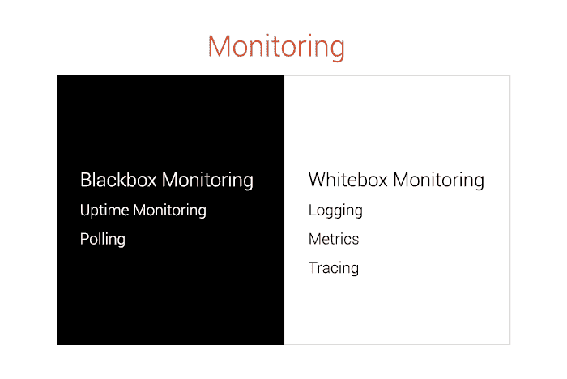
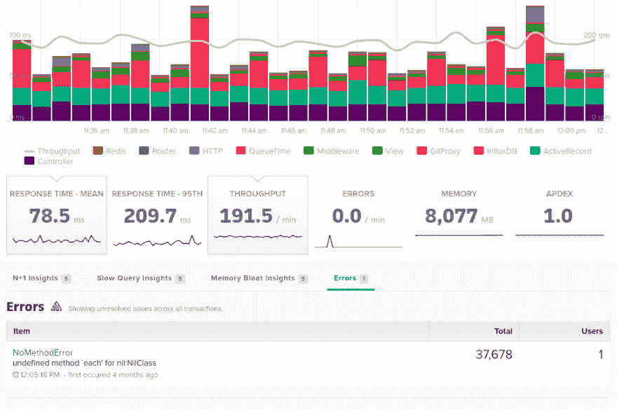
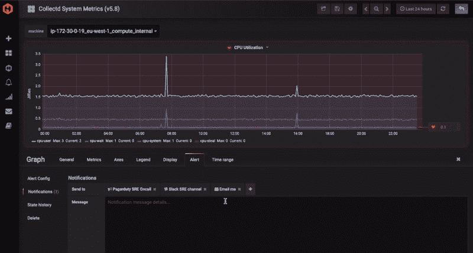
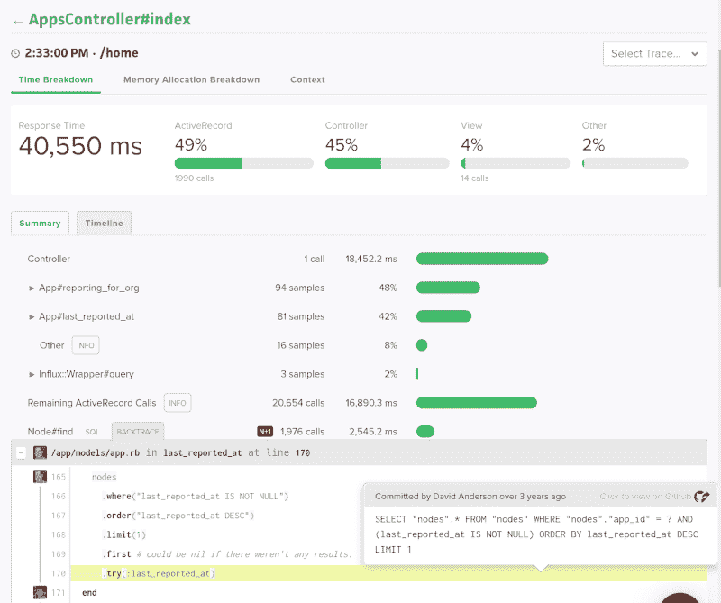

# 2019 PHP 监控选项

> 原文：<https://dev.to/scoutapm/2019-php-monitoring-options-2c76>

*这篇文章最初出现在[童子军博客](https://scoutapm.com/blog/2019-php-monitoring-options)上。*

不可否认 PHP 的流行。自 1995 年发布以来，它一直是 web 开发领域的一支不变的力量。而现在 2019 年，多亏了 Laravel，它依然一如既往的强劲！在 Scout，最近我们一直在努力提供一个 **PHP 性能监控代理**，与我们现有的 [ruby](https://docs.scoutapm.com/#ruby-agent) 、 [python](https://docs.scoutapm.com/#python-agent) 和[elixin](https://docs.scoutapm.com/#elixir-agent)代理并肩而立。在我们发布这个 PHP 代理之前，让我们来看看 PHP 生态系统，看看 Scout 如何补充现有的监控环境。

## 对监控工具进行分类

有许多不同的方法来解决如何成功监控 PHP 应用程序的挑战。你可以从多个不同的角度来完成这项任务，这取决于你想看到什么。但是我们可以将这些方法大致分为两大类:*黑盒监控*和*白盒监控*。

**黑盒监控**涉及从外部监控系统；从面向用户的角度来看。之所以称之为黑盒，是因为这种类型的监控没有关于底层系统的信息，只有暴露给外部用户的信息。黑盒监控的例子包括正常运行时间监控或轮询。

与这种方法不同的是，**白盒监控**描述的方法旨在利用特权信息从内部监控系统。这可以通过日志记录、度量和跟踪等来实现。通常这些方法都有开销，但是它们让我们可以看到系统内部，看到问题的核心。

让我们仔细看看 PHP 生态系统中最流行的四种监控技术:正常运行时间监控、日志记录、指标和跟踪。

## 1。正常运行时间监控

也许我们能做的最简单的监控是**正常运行时间监控**。这种黑盒方法允许我们监控网站的正常运行时间，并在中断发生时收到警报。2019 年最受欢迎的正常运行时间监控服务包括 [Pingdom](https://www.pingdom.com/product/uptime-monitoring) 、 [UptimeRobot](https://uptimerobot.com/) 和 [Site24x7](https://www.site24x7.com/) 。

正常运行时间监控服务非常有用，可以说，你可以把它们看作是在第一线。从这个意义上说，它们会提醒您出现了问题，但是为了诊断该问题，您可能需要一种不同类型的监控解决方案来提供更具体的信息。

## 2。记录

要了解更多信息，正常运行时间监控的下一个逻辑步骤是**日志记录**。作为开发人员，我们不断地在应用程序中记录信息，直接或间接地通过我们使用的框架。这些日志报告从日常状态信息到异常和错误报告的所有内容。这意味着当出现问题时，我们可以利用大量的特权信息进行调查。正如我们前面提到的，这被称为白盒监控。

记录到文件最初工作得很好，但是随着应用程序的增长，对日志监控服务的需求变得明显。例如，当您的实际系统中出现错误时，您希望得到通知，然后能够立即看到堆栈跟踪，以便调试过程可以立即开始。

在 PHP 领域有很多很棒的服务可以完成这项任务，下面是我们最喜欢的一些:

[Rollbar](https://rollbar.com/) (集成侦察兵)
[哨兵](https://sentry.io/)(集成侦察兵)
[Bugsnag](https://www.bugsnag.com/) (集成侦察兵)
[蜜獾](https://www.honeybadger.io/)(集成侦察兵)

错误记录系统还有一个很大的优势，那就是它们也可以很容易地集成到 Scout 这样的 APMs 中，以实现更智能、更高效的监控。在下图中，你可以看到哨兵记录的错误是如何出现在 Scout 主页的一个方便列表中的。

## 3。韵律学

日志对于报告详细信息非常有用，这些信息可以很容易地过滤并用于诊断问题。但是如果您需要更高层次的信息呢？换句话说，如果您需要缩小视图来查看系统性能的全貌，该怎么办？这就是**指标**发挥作用的地方。

指标是对某个变量在一段时间内(称为时间序列)的度量，而不是像日志一样对某个事件的单一快照。度量补充了日志，当一起使用时，它们提供了一个强大的监控解决方案。我们经常听到的三种最受欢迎的服务是:

*   [普罗米修斯](https://prometheus.io/)
*   [石墨](https://graphiteapp.org/)
*   [InfluxDB](https://www.influxdata.com/)

[托管石墨](https://www.hostedgraphite.com/)是“标准石墨”的替代品(如下所示)，这是一项我们最近听说过的很棒的服务，因为它似乎越来越受欢迎。

这些解决方案经常被组合在一起，并在像 [Grafana](https://grafana.com/) 这样的工具中可视化。如果你有兴趣了解更多关于 Prometheus 和 Grafana 的信息，那么看看 Erik 关于[如何在 Docker 容器](https://scoutapm.com/blog/prometheus-and-docker-monitoring-your-environment)中设置 Prometheus 和 Grafana 的精彩博文。

## 4。描摹

到目前为止，我们已经讨论了各种类型的监控解决方案，这些解决方案允许您在服务关闭时得到通知，为诊断问题提供错误日志，并向您显示有关系统性能的有用图表。但是，如果您的系统中没有错误，服务都已启动并运行，但是您发现应用程序在某些方面的性能不如您所希望的，这种情况会怎么样呢？这就是监控难题的最后一部分，**跟踪**。

跟踪允许您从头到尾看到单个 PHP Laravel 请求的生命周期的完整画面。使您能够看到在请求的每一层使用了多少内存，以及时间被用在了什么地方。然后，可以将这些跟踪汇总在一起，形成一个高级指标的一部分，让您可以查看系统中单个端点的性能和运行状况。这种应用程序性能随时间变化的强大快照是一个**应用程序性能监控**工具(APM)的工作，比如 Scout。

## 接下来是什么？

PHP 开发者欢欣鼓舞！不再仅仅是 Ruby、Python 和 Elixir 开发人员可以享受所有的乐趣，您很快也可以使用您最喜欢的应用程序性能监控(APM)工具 Scout 来监控您的 PHP 和 Laravel 应用程序！

如果您有兴趣使用 Scout 来监控您的 PHP 应用程序，那么请今天就联系[注册您的兴趣](//mailto:support@scoutapm.com)。我们希望听到您的要求，并帮助您开始。如果你目前还不是 Scout 的客户，那么请确保你已经准备好通过[注册今天的免费试用](https://scoutapm.com/users/sign_up)。