# 27 个以上免费仪表板模板

> 原文：<https://dev.to/creativetim_official/27-free-dashboard-templates-13b7>

###### 本帖包含附属链接；如果您从本文提供的不同链接购买产品或服务，我可能会收到报酬。

* * *

这篇文章将关注为什么你需要一个仪表板，以及如何设置它最适合你。为了使您的工作更容易，我们还创建了一个免费资源列表，可以加快您的开发过程。所以让我们一步一步来。

什么是仪表板？

仪表板是一组易于阅读的页面，它向用户实时提供有关其业务的信息。仪表板通常由组织内当前状态和趋势的图形表示组成。拥有一个设计良好的仪表板将使您能够根据业务提供的数据采取行动并做出明智的决策。

更准确地说，仪表板是报告的图形化实时表示。人们总是以一种有意义的方式展示他们的数据，只是它一直在纸上。在网上做生意需要你在仪表板上看到后台流程。

驾驶汽车需要你看到一个控制面板，这样你就可以知道你的速度，里程，还有多少油。你可以考虑以同样的方式经营一家软件公司:你需要知道每个部分是如何运作的，以及何时需要采取行动。

你需要人力资源、运营管理、招聘销售、信息技术、项目管理、客户关系管理等方面的仪表盘，这样的例子不胜枚举。如果您发现自己处于这些领域中的任何一个，您可能已经感觉到有必要将您的管理功能放在一个友好的界面中。

你如何着手做这件事？首先，不要多此一举。因为每个人都需要一个仪表板，仪表板已经被制作出来并在网上可用。你只需要定制它。另一个建议是，你最好保持简单。只保留你需要的功能。

**我们自己的例子**

我们需要为我们的个人管理员和用户创建一个仪表板。所以我们想到了最好的解决方案。我们不想再造轮子，但我们也不想让它变得臃肿，功能繁多。因此，我们使用预定义的小部件，并以一种有意义的方式将它们放在一起。我们发现这是对我们来说最好的方法，但最重要的是你要找到对你的企业来说最好的方法。

为了让您的过程更加舒适，我们整理了一份有用的免费资源列表供您选择。如果你知道其他对你有帮助的工具，请在下面的评论中留下它们。

## **[冲击设计系统](https://www.creative-tim.com/product/impact-design-system?ref=devto)**

**[Impact](https://www.creative-tim.com/product/impact-design-system?ref=devto)** 是一个为你的网上商务展示精心设计的令人敬畏的设计系统。Impact Design System 是与 [Themesberg](https://themesberg.com/) 合作开发的，它是一个完整的解决方案**，包含首页和仪表板页面**。

[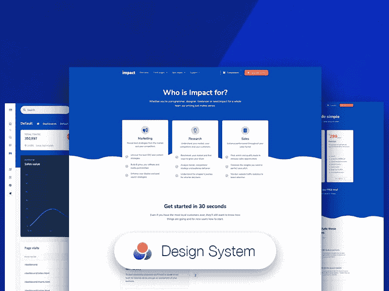](https://www.creative-tim.com/product/impact-design-system?ref=devto)

[下载|](https://www.creative-tim.com/product/impact-design-system?ref=devto) [直播预告|](https://demos.creative-tim.com/impact-design-system/?ref=devto) [获取主持](http://www.bluehost.com/track/creativetim)

### **[现在 UI 仪表盘](https://www.creative-tim.com/product/now-ui-dashboard?ref=devto)**

[Now UI Dashboard](https://demos.creative-tim.com/now-ui-dashboard/examples/dashboard.html?ref=devto) 是一个漂亮的 Bootstrap 4 admin dashboard，有大量的组件，设计得很漂亮，很有条理。
T3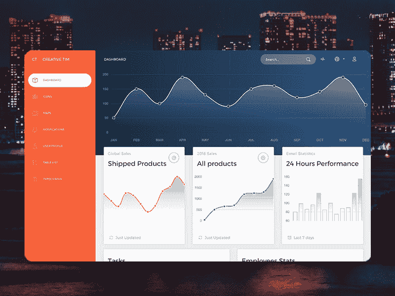T5】

[下载](https://www.creative-tim.com/product/now-ui-dashboard) | [直播预告](https://demos.creative-tim.com/now-ui-dashboard/examples/dashboard.html) | [Github 项目](https://github.com/creativetimofficial/now-ui-dashboard) | [获取托管](https://m.do.co/c/276af09d9975)

### **[灯光自举仪表盘](https://www.creative-tim.com/product/light-bootstrap-dashboard?ref=devto)**

[Light Bootstrap Dashboard](https://demos.creative-tim.com/light-bootstrap-dashboard/examples/dashboard.html?ref=devto) 是一个 Bootstrap 4 管理仪表板模板，设计美观简单。它提供了大量的元素，为您提供多种可能性来创建最符合您需求的应用程序。
T3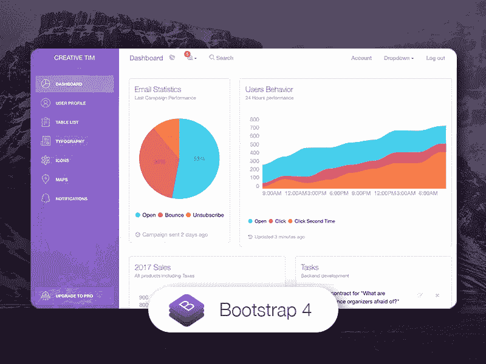T5】

[下载](https://www.creative-tim.com/product/light-bootstrap-dashboard) | [直播预告](https://demos.creative-tim.com/light-bootstrap-dashboard/examples/dashboard.html) | [Github 项目](https://github.com/creativetimofficial/light-bootstrap-dashboard) | [获取托管](https://m.do.co/c/276af09d9975)

### [T2](#volt)[是 T4](https://a.paddle.com/v2/click/113942/122967?link=3009)

Volt 是一个免费开源的 Bootstrap 5 管理仪表板，拥有 100 多个组件、11 个示例页面和 3 个带有 Vanilla JS 的插件。它是使用最新版本的 Bootstrap 5 构建的，因为不再需要 jQuery 作为依赖项，所以 Volt 只使用普通的 JS 构建。
T3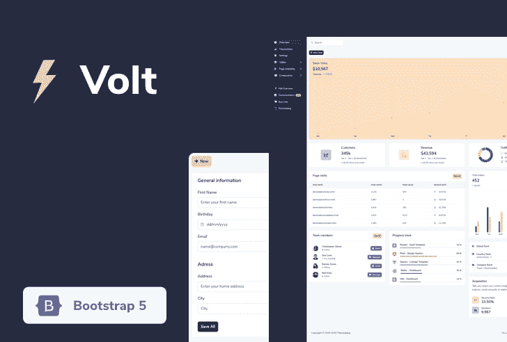T5】

[下载](https://a.paddle.com/v2/click/113942/122967?link=3009) | [直播预告](https://a.paddle.com/v2/click/113942/122967?link=3099) | [Github 项目](https://github.com/themesberg/volt-bootstrap-5-dashboard) | [获取托管](https://m.do.co/c/276af09d9975)

### **[材质仪表盘](https://www.creative-tim.com/product/material-dashboard?ref=devto)**

[Material Dashboard](https://demos.creative-tim.com/material-dashboard/examples/dashboard.html?ref=devto) 是一个免费的材料引导管理器，其设计灵感来自谷歌的材料设计。Material Dashboard 是在流行的 Bootstrap 框架上构建的，它附带了几个重新设计的第三方插件，以适应其余的元素。
T3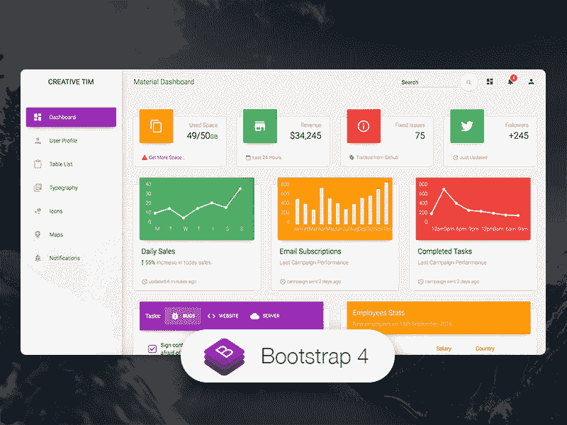T5】

[下载](https://www.creative-tim.com/product/material-dashboard) | [直播预告](https://demos.creative-tim.com/material-dashboard/examples/dashboard.html) | [Github 项目](https://github.com/creativetimofficial/material-dashboard) | [获取托管](https://m.do.co/c/276af09d9975)

### **[纸质仪表盘](https://www.creative-tim.com/product/paper-dashboard?ref=devto)**

[纸质仪表板](https://demos.creative-tim.com/bs3/paper-dashboard/dashboard.html?ref=devto)是一个自举管理面板，结合了柔和的颜色、漂亮的字体、宽敞的卡片和图形。这是一个强大的工具，但它很轻，易于使用。
T3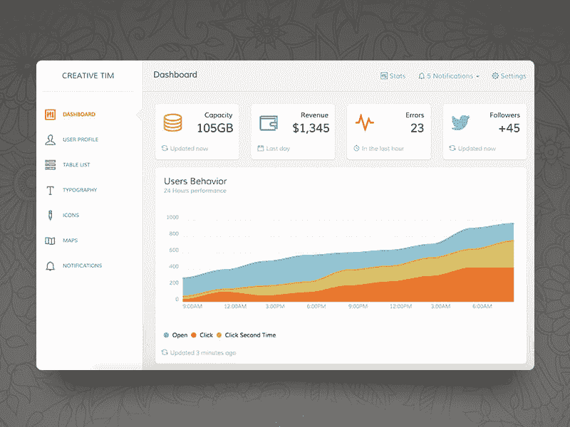T5】

[下载](https://www.creative-tim.com/product/paper-dashboard) | [直播预告](https://demos.creative-tim.com/bs3/paper-dashboard/dashboard.html) | [Github 项目](https://github.com/creativetimofficial/paper-dashboard) | [获取托管](https://m.do.co/c/276af09d9975)

### **无仪表板**

DashGum 是一个简单而优雅的管理面板。有了 DashGum，你就有了图表、表格、大量面板、日历、通知、待办事项列表等等。抓住我们的免费主题，享受它。
[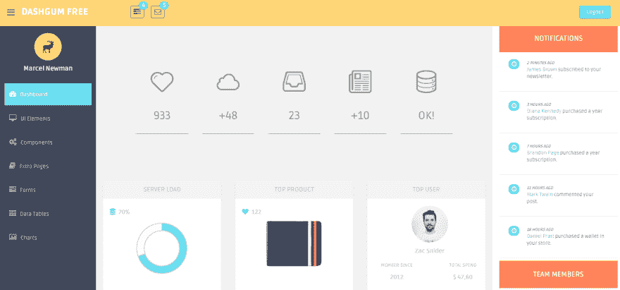T3】](https://res.cloudinary.com/practicaldev/image/fetch/s--yn7ZrBgm--/c_limit%2Cf_auto%2Cfl_progressive%2Cq_auto%2Cw_880/https://blog.creative-tim.com/wp-content/uploads/2015/10/2blog.png)

[下载](https://templatemag.com/dashio-bootstrap-admin-template/) | [直播预告](https://templatemag.com/demo/Dashio/) | [获取主持](https://m.do.co/c/276af09d9975)

### **SB 管理员**

SB 管理员可以免费下载引导管理模板。该模板使用默认的 Bootstrap 3 样式和各种强大的 jQuery 插件来创建一个强大的框架，用于创建管理面板、web 应用程序或后端仪表板。
[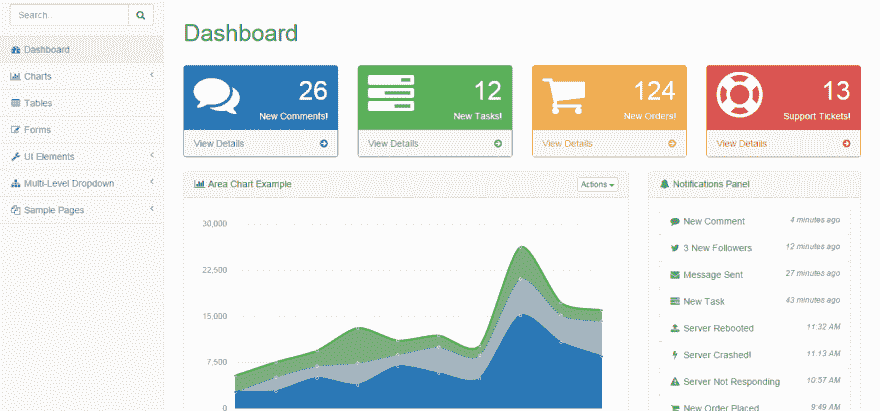T3】](https://res.cloudinary.com/practicaldev/image/fetch/s--WYRNWPWU--/c_limit%2Cf_auto%2Cfl_progressive%2Cq_auto%2Cw_880/https://blog.creative-tim.com/wp-content/uploads/2015/10/4blog.png)

[下载](https://startbootstrap.com/templates/sb-admin/) | [直播预告](https://blackrockdigital.github.io/startbootstrap-sb-admin/) | [Github 项目](https://github.com/BlackrockDigital/startbootstrap-sb-admin) | [获取托管](https://m.do.co/c/276af09d9975)

### **管理控制面板模板**

最佳开源管理仪表板和控制面板主题。AdminLTE 构建在 Bootstrap 3 之上，提供了一系列响应迅速、可重用和常用的组件。
[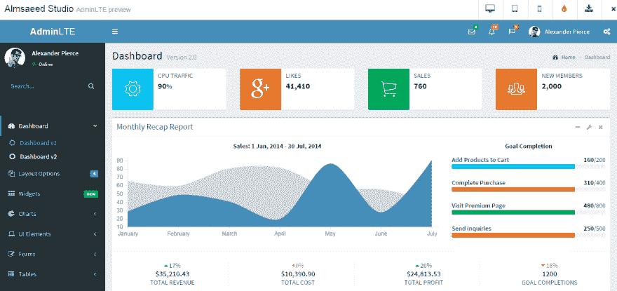T3】](https://res.cloudinary.com/practicaldev/image/fetch/s--S9Lx_T-r--/c_limit%2Cf_auto%2Cfl_progressive%2Cq_auto%2Cw_880/https://blog.creative-tim.com/wp-content/uploads/2015/10/5blog.png)

[下载](https://www.almsaeedstudio.com) | [直播预告](https://adminlte.io/themes/AdminLTE/index2.html) | [获取主持](https://m.do.co/c/276af09d9975)

### **响应引导管理模板–Edmin**

Edmin 是一个带有 jQuery 插件的引导管理模板，非常适合您的项目。它提供了一个易于使用的现代平面用户界面设计和一个完全响应的布局，与手机和平板电脑等手持设备兼容。
[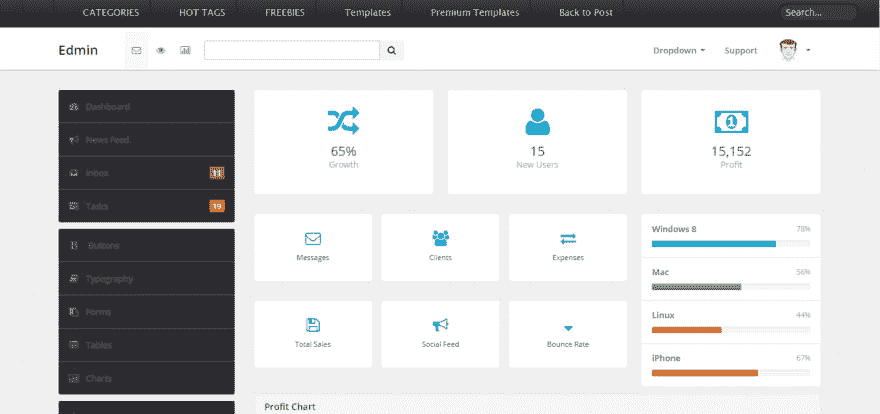T3】](https://res.cloudinary.com/practicaldev/image/fetch/s--tazFT457--/c_limit%2Cf_auto%2Cfl_progressive%2Cq_auto%2Cw_880/https://blog.creative-tim.com/wp-content/uploads/2015/10/6blog.png)

[下载](https://www.egrappler.com/responsive-bootstrap-admin-template-edmin/) | [直播预告](https://www.egrappler.com/edmin/index.html) | [获取主持](https://m.do.co/c/276af09d9975)

### **矩阵引导管理模板**

矩阵管理是一个现代的，干净的，功能强大的准备使用的响应管理模板与惊人的图表和图形。
[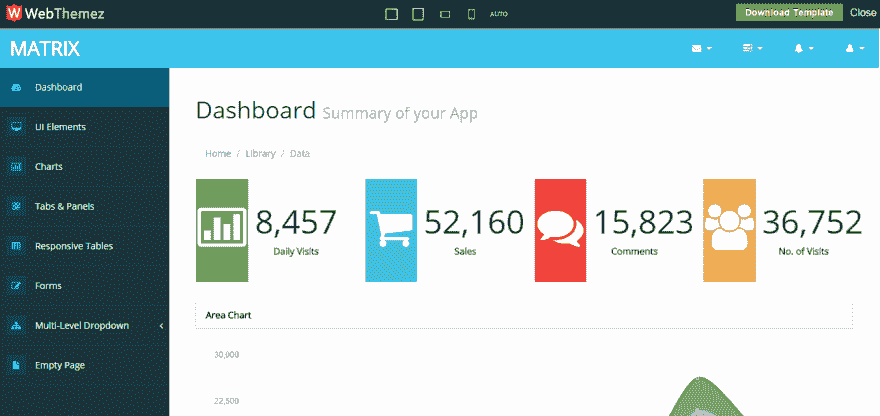T3】](https://res.cloudinary.com/practicaldev/image/fetch/s--yFMbn55q--/c_limit%2Cf_auto%2Cfl_progressive%2Cq_auto%2Cw_880/https://blog.creative-tim.com/wp-content/uploads/2015/10/7blog.png)

[下载](https://webthemez.com/matrix-free-bootstrap-admin-template/) | [直播预告](https://webthemez.com/demo/matrix-free-bootstrap-admin-template/) | [获取主持](https://m.do.co/c/276af09d9975)

### **免费管理模板 PSD**

管理模板为您提供了一个仪表板，您可以使用它来管理和运行您的 web 应用程序。管理模板越容易使用，它为用户提供的体验就越好。
[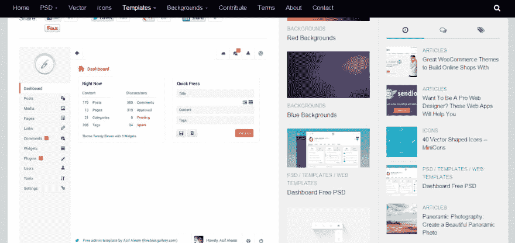T3】](https://res.cloudinary.com/practicaldev/image/fetch/s--QeSF7m1y--/c_limit%2Cf_auto%2Cfl_progressive%2Cq_auto%2Cw_880/https://blog.creative-tim.com/wp-content/uploads/2015/10/11blog.png)

[下载](http://www.freebiesgallery.com/free-admin-template-psd/) | [直播预告](http://www.freebiesgallery.com/free-admin-template-psd/) | [获取主持](https://m.do.co/c/276af09d9975)

### **无限管理员——免费 PSD 网络管理员**

他们给出了两个版本(常规和超薄仪表板)免费 PSD 网络管理，称为无限管理。所有的层都被很好地组织成组。尽情享受吧，因为它是免费的！
[T3】](https://res.cloudinary.com/practicaldev/image/fetch/s--smwTBBtk--/c_limit%2Cf_auto%2Cfl_progressive%2Cq_auto%2Cw_880/https://blog.creative-tim.com/wp-content/uploads/2015/10/12bllog.jpg)

[下载](http://victorsosea.com/blog/infinite-admin-free-psd-web-admin/) | [直播预告](http://victorsosea.com/blog/infinite-admin-free-psd-web-admin/) | [获取主持](https://m.do.co/c/276af09d9975)

### **[Vue 光自举仪表盘](https://www.creative-tim.com/product/vue-light-bootstrap-dashboard?ref=devto)**

[Vue Light Bootstrap Dashboard](https://demos.creative-tim.com/vue-light-bootstrap-dashboard/#/admin/overview?ref=devto)是基于 Bootstrap 4 和 Vuejs 构建的优秀资源。它将帮助您立即开始开发仪表板。
T3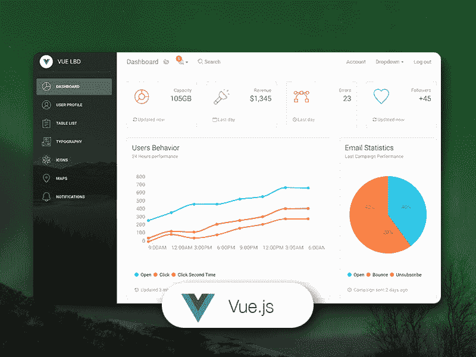T5】

[下载](https://www.creative-tim.com/product/vue-light-bootstrap-dashboard?ref=devto) | [直播预告](https://demos.creative-tim.com/vue-light-bootstrap-dashboard/#/admin/overview?ref=devto) | [Github 项目](https://github.com/creativetimofficial/vue-light-bootstrap-dashboard) | [获取托管](https://m.do.co/c/276af09d9975)

### **[灯光自举仪表盘反应过来](https://www.creative-tim.com/product/light-bootstrap-dashboard-react?ref=devto)**

[Light Bootstrap Dashboard React](https://demos.creative-tim.com/light-bootstrap-dashboard-react/#/admin/dashboard?ref=devto)是一个设计美观简单的管理仪表板模板。它是建立在 Light Bootstrap Dashboard 和 React JS 之上的，并且是完全响应的。
T3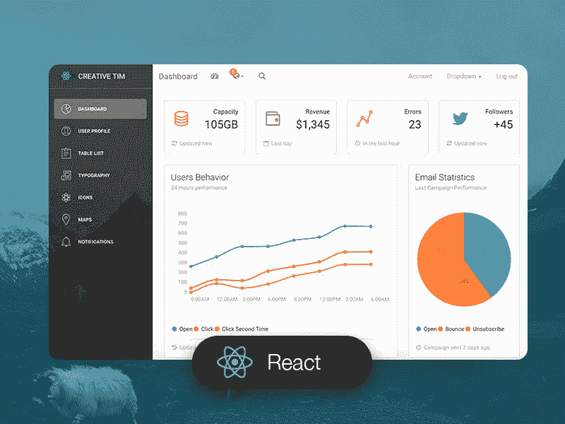T5】

[下载](https://www.creative-tim.com/product/light-bootstrap-dashboard-react?ref=devto) | [直播预告](https://demos.creative-tim.com/light-bootstrap-dashboard-react/#/admin/dashboard?ref=devto) | [Github 项目](https://github.com/creativetimofficial/light-bootstrap-dashboard-react/) | [获取托管](https://m.do.co/c/276af09d9975)

**管理仪表板免费 UI**
管理仪表板。像老板一样管理您的个人专用仪表板。
[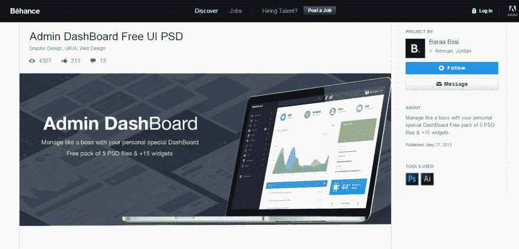T6】](https://res.cloudinary.com/practicaldev/image/fetch/s--55a4d7JY--/c_limit%2Cf_auto%2Cfl_progressive%2Cq_auto%2Cw_880/https://blog.creative-tim.com/wp-content/uploads/2015/10/19bblog.png)

[下载](https://www.behance.net/gallery/26597915/Admin-DashBoard-Free-UI-PSD) | [直播预告](https://www.behance.net/gallery/26597915/Admin-DashBoard-Free-UI-PSD) | [获取主持](https://m.do.co/c/276af09d9975)

**[Material Dashboard React](https://www.creative-tim.com/product/material-dashboard-react?ref=devto)**
[Material Dashboard React](https://demos.creative-tim.com/material-dashboard-react/#/admin/dashboard?ref=devto)是一款免费的 Material-UI Admin，其清新的新设计灵感来自谷歌的材质设计。它建立在流行的 Material-UI 框架之上。
[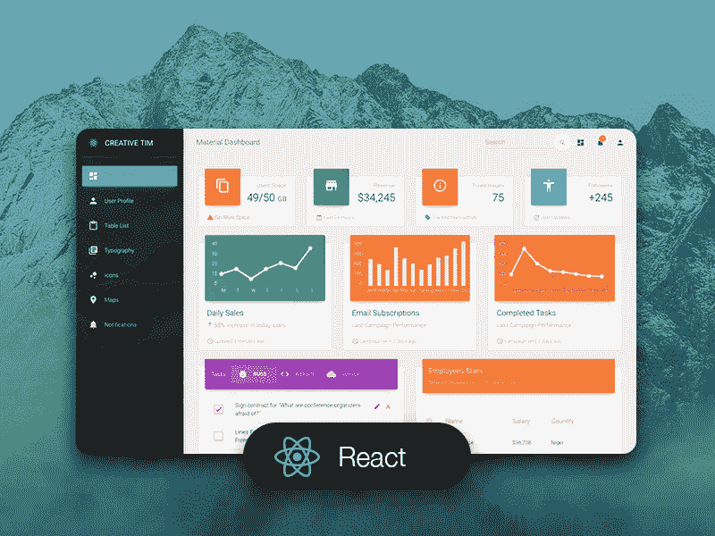](https://res.cloudinary.com/practicaldev/image/fetch/s--8Q2_VN2u--/c_limit%2Cf_auto%2Cfl_progressive%2Cq_auto%2Cw_880/https://s3.amazonaws.com/creativetim_bucket/products/71/original/opt_mdr_thumbnail.jpg%3F1517307720)

[下载](https://www.creative-tim.com/product/material-dashboard-react?ref=devto) | [直播预告](https://demos.creative-tim.com/material-dashboard-react/#/admin/dashboard?ref=devto) | [Github 项目](https://github.com/creativetimofficial/material-dashboard-react/) | [获取托管](https://m.do.co/c/276af09d9975)

### **Evernote 仪表盘**

使用 Evernote 只是在 reskin 的脑海中留下了一个想法，让它更生动，只是用一些更具标志性的底座，为用户改变一些 UX 视图，希望你会喜欢它。
[T3】](https://res.cloudinary.com/practicaldev/image/fetch/s--su2zfn2F--/c_limit%2Cf_auto%2Cfl_progressive%2Cq_auto%2Cw_880/https://blog.creative-tim.com/wp-content/uploads/2015/10/21blog.png)

[下载](https://dribbble.com/shots/1803500-Evernote-Dashboard) | [直播预告](https://dribbble.com/shots/1803500-Evernote-Dashboard) | [获取主持](https://m.do.co/c/276af09d9975)

### **仪表盘 UI 元素**

很高兴与你分享伟大的 UI 套件的第一部分。这是由 16 个元素组成的仪表板。使用的字体是蒙特塞拉特自由
[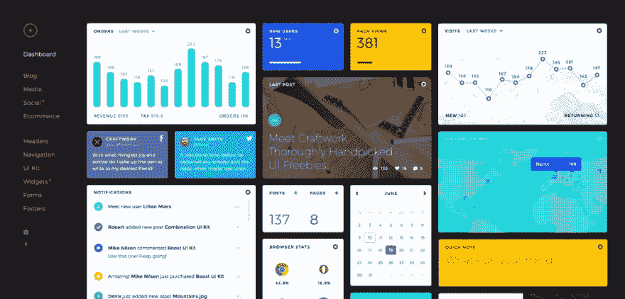](https://res.cloudinary.com/practicaldev/image/fetch/s--M9sfYhcC--/c_limit%2Cf_auto%2Cfl_progressive%2Cq_auto%2Cw_880/https://blog.creative-tim.com/wp-content/uploads/2015/10/22blog-1024x491.jpg)

[下载](https://craftwork.design/dashboard-ui-elements/) | [直播预告](https://craftwork.design/dashboard-ui-elements/) | [获取主持](https://m.do.co/c/276af09d9975)

### **[纸仪表板棱角分明](https://www.creative-tim.com/product/paper-dashboard-angular?ref=devto)**

[Paper Dashboard Angular](https://demos.creative-tim.com/paper-dashboard-angular/#/dashboard?ref=devto) 是一个引导管理模板，它结合了柔和的颜色、漂亮的排版、宽敞的卡片和图形。
T3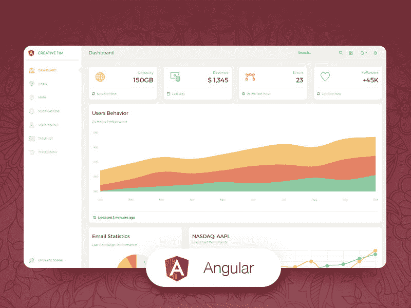T5】

[下载](https://www.creative-tim.com/product/paper-dashboard-angular?ref=devto) | [直播预告](https://demos.creative-tim.com/paper-dashboard-angular/dashboard?ref=devto) | [Github 项目](https://github.com/creativetimofficial/paper-dashboard-angular) | [获取托管](https://m.do.co/c/276af09d9975)

**[Vue 纸质仪表盘](https://www.creative-tim.com/product/vue-paper-dashboard?ref=devto)**
[Vue 纸质仪表盘](https://demos.creative-tim.com/vue-paper-dashboard/#/dashboard?ref=devto)是构建在 Bootstrap 和 Vue 之上的漂亮资源。它将帮助您立即开始开发仪表板。Vue 纸质仪表板是[原始纸质仪表板](https://www.creative-tim.com/product/paper-dashboard?ref=devto)的 Vue 移植版本。
[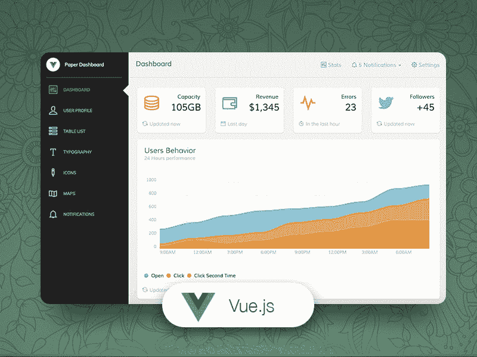](https://res.cloudinary.com/practicaldev/image/fetch/s--cwpAT7FL--/c_limit%2Cf_auto%2Cfl_progressive%2Cq_auto%2Cw_880/https://s3.amazonaws.com/creativetim_bucket/products/57/original/opt_pd_vue_thumbnail.jpg%3F1534959668)

[下载](https://www.creative-tim.com/product/vue-paper-dashboard?ref=devto) | [直播预告](https://demos.creative-tim.com/vue-paper-dashboard/#/dashboard?ref=devto) [Github 项目](https://github.com/creativetimofficial/vue-paper-dashboard) | [获取托管](https://m.do.co/c/276af09d9975)

### **[灯光自举仪表盘棱角分明 2](https://www.creative-tim.com/product/light-bootstrap-dashboard-angular2?ref=devto)**

Light Bootstrap Dashboard Angular 2 是一个管理仪表板模板，设计美观简单。它建立在[光引导仪表板](http://www.creative-tim.com/product/light-bootstrap-dashboard?ref=devto)和引导 3 的顶部，并且它完全响应。
[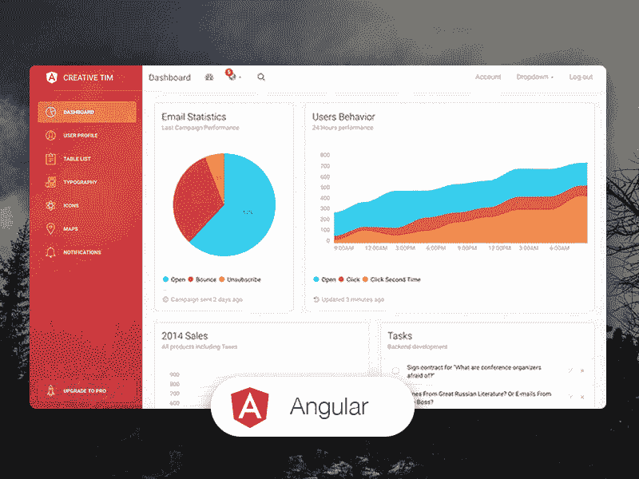](https://res.cloudinary.com/practicaldev/image/fetch/s--b0xzRFcO--/c_limit%2Cf_auto%2Cfl_progressive%2Cq_auto%2Cw_880/https://s3.amazonaws.com/creativetim_bucket/products/52/original/opt_lbd_angular_thumbnail.jpg%3F1551357855)

[下载](https://www.creative-tim.com/product/light-bootstrap-dashboard-angular2?ref=devto) | [直播预告](https://demos.creative-tim.com/light-bootstrap-dashboard-angular2/#/dashboard?ref=devto) | [Github 项目](https://github.com/creativetimofficial/light-bootstrap-dashboard-angular2) | [获取托管](https://m.do.co/c/276af09d9975)

### **[材质仪表盘棱角分明 2](https://www.creative-tim.com/product/material-dashboard-angular2?ref=devto)**

[Material Dashboard Angular 2](https://demos.creative-tim.com/material-dashboard-angular2/#/dashboard?ref=devto)是一个免费的材料引导管理程序，其设计灵感来自谷歌的材料设计。
T3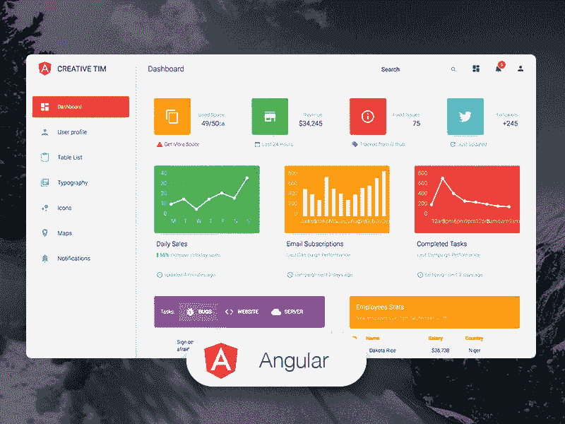T5】

[下载](https://www.creative-tim.com/product/material-dashboard-angular2?ref=devto) | [直播预告](https://demos.creative-tim.com/material-dashboard-angular2/dashboard?ref=devto) | [Github 项目](https://github.com/creativetimofficial/material-dashboard-angular2) | [获取托管](https://m.do.co/c/276af09d9975)

### **[Vue 材质仪表盘](https://www.creative-tim.com/product/vue-material-dashboard?ref=devto)**

[Vue Material Dashboard](https://demos.creative-tim.com/vue-material-dashboard/#/dashboard?ref=devto) 是建立在 [Vue Material](https://vuematerial.io/) 和 [Vuejs](https://vuejs.org/v2/guide/) 之上的漂亮资源。它将帮助您立即开始开发仪表板。
[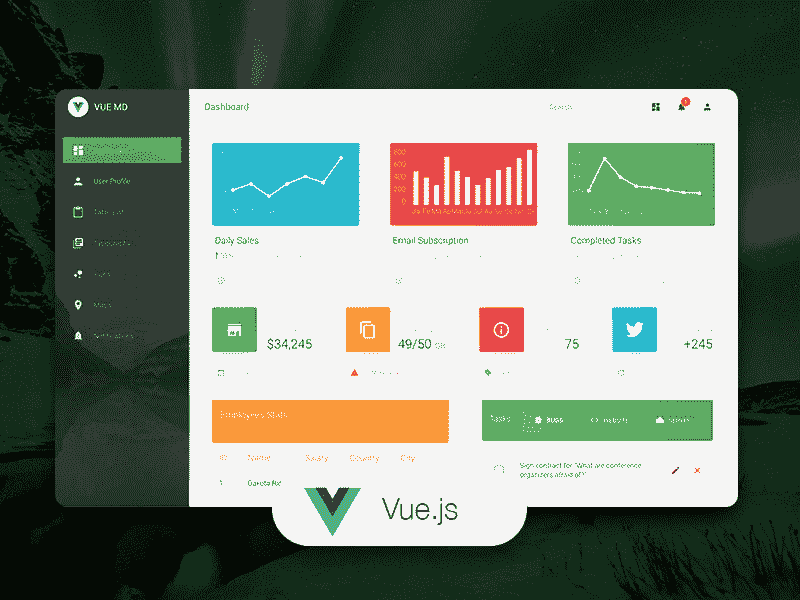](https://res.cloudinary.com/practicaldev/image/fetch/s--LmTt5-VZ--/c_limit%2Cf_auto%2Cfl_progressive%2Cq_auto%2Cw_880/https://s3.amazonaws.com/creativetim_bucket/products/81/original/opt_md_vue_thumbnail.jpg%3F1534938464)

[下载](https://www.creative-tim.com/product/vue-material-dashboard?ref=devto) | [直播预告](https://demos.creative-tim.com/vue-material-dashboard/#/dashboard?ref=devto) | [Github 项目](https://github.com/creativetimofficial/vue-material-dashboard) | [获取托管](https://m.do.co/c/276af09d9975)

### **[氩气仪表盘](https://www.creative-tim.com/product/argon-dashboard-pro-laravel?ref=devto)**

从为 **Laravel Framework 5.5 及更高版本**构建的 **Bootstrap 4 管理仪表板**开始您的开发。[创意 Tim](https://creative-tim.com/?ref=devto) 与 [Updivision](https://updivision.com/) 合作，为你提供完全编码的“前端+后端”解决方案。

[下载](https://www.creative-tim.com/product/argon-dashboard-pro-laravel?ref=devto) | [直播预告](http://argon-dashboard-pro-laravel.creative-tim.com/login?ref=devto) | [Github 项目](https://github.com/creativetimofficial/ct-argon-dashboard-pro-laravel) | [获取托管](https://m.do.co/c/276af09d9975)

### **[氩气控制板视图](https://www.creative-tim.com/product/vue-argon-dashboard?ref=devto)**

[Vue Argon Dashboard](https://demos.creative-tim.com/vue-argon-dashboard/#/dashboard?ref=devto) 由 100 多个独立组件组成，让您自由选择和组合。所有组件的颜色都可能不同，您可以使用 SASS 文件轻松修改。
T3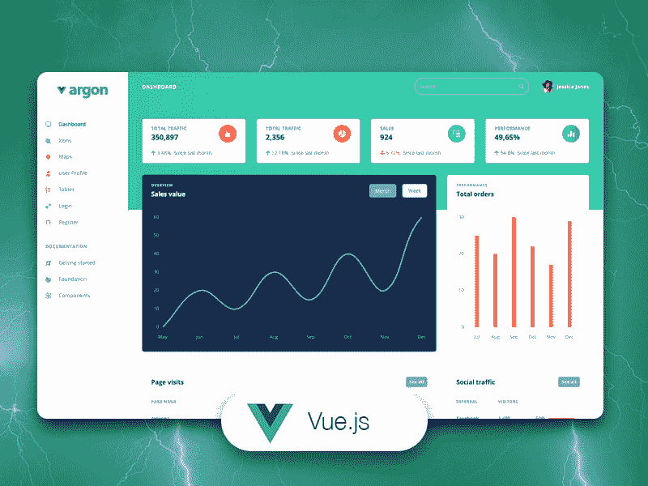T5】

[下载](https://www.creative-tim.com/product/vue-argon-dashboard?ref=devto) | [直播预告](https://demos.creative-tim.com/vue-argon-dashboard/?ref=devto) | [Github 项目](https://github.com/creativetimofficial/vue-argon-dashboard) | [获取托管](https://m.do.co/c/276af09d9975)

### **[氩气仪表盘 PRO React](https://www.creative-tim.com/product/argon-dashboard-pro-react?ref=devto)**

 是一款全新的产品，基于我们最新的从头开始重新构建的框架结构，旨在使我们的产品更加直观、适应性更强，更易于定制。让 Argon 用它酷的特性和构建工具让你惊讶，让你的项目达到一个全新的水平。
T3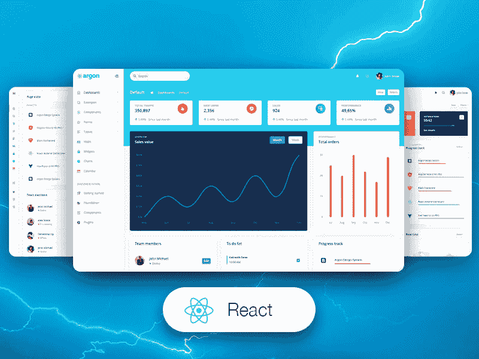T5】

[下载](https://www.creative-tim.com/product/argon-dashboard-pro-react?ref=devto) | [直播预告](https://demos.creative-tim.com/argon-dashboard-pro-react/#/admin/dashboard?ref=devto) | [Github 项目](https://github.com/creativetimofficial/ct-argon-dashboard-pro-react) | [获取托管](https://m.do.co/c/276af09d9975)

### **氩仪表盘 Pro Nodejs**

从为 Node.js framework 构建的 Bootstrap 4 管理仪表板开始开发，node . js framework 是顶级公司的最新技术。创意 Tim 与 Udevoffice 合作，为你提供完全编码的“前端+后端”解决方案。
[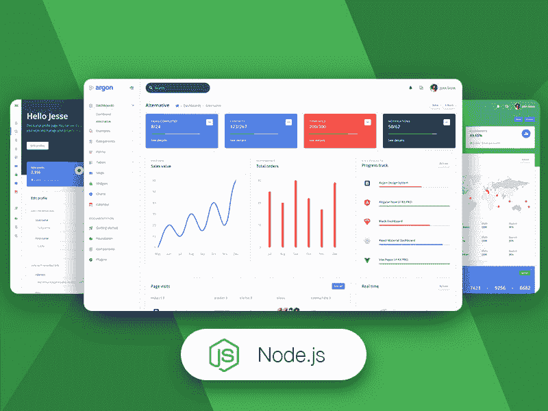T3】](https://res.cloudinary.com/practicaldev/image/fetch/s--Sba6C3I4--/c_limit%2Cf_auto%2Cfl_progressive%2Cq_auto%2Cw_880/https://s3.amazonaws.com/creativetim_bucket/products/153/original/opt_adp_node_thumbnail.jpg%3F1554283037)

[下载](https://www.creative-tim.com/product/argon-dashboard-pro-nodejs?ref=devto) | [直播预告](https://argon-dashboard-pro-nodejs.creative-tim.com?ref=devto) | [Github 项目](https://github.com/creativetimofficial/ct-argon-dashboard-pro-nodejs) | [获取托管](https://m.do.co/c/276af09d9975)

### **黑色仪表盘拉腊维尔**

Black Dashboard Laravel 包括 16 个完全实现的组件和 3 个定制插件，旨在加速您的开发。在这个过程中让一切看起来都很棒。
[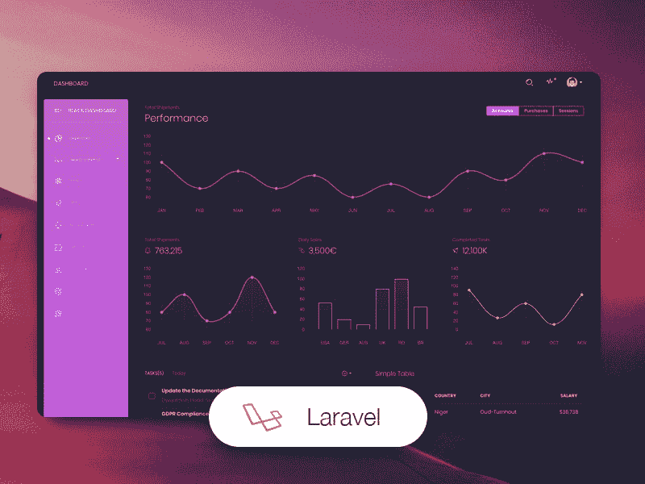T3】](https://res.cloudinary.com/practicaldev/image/fetch/s--9aKHABzr--/c_limit%2Cf_auto%2Cfl_progressive%2Cq_auto%2Cw_880/https://s3.amazonaws.com/creativetim_bucket/products/164/original/opt_blk_laravel_thumbnail.jpg%3F1561102244)

[下载](https://www.creative-tim.com/product/black-dashboard-laravel?ref=devto) | [直播预告](https://www.creative-tim.com/live/black-dashboard-laravel?ref=devto) | [Github 项目](https://github.com/laravel-frontend-presets/black-dashboard) | [获取托管](https://m.do.co/c/276af09d9975)

### **黑色仪表盘棱角分明**

黑色仪表板 Angular 是一个漂亮的 Bootstrap 4 管理仪表板，它使用 Angular 和大量的组件构建在一起，看起来很棒。如果您正在寻找一种工具来管理和可视化关于您的业务的数据，这个仪表板是你的事情。它结合了悦目的颜色、宽敞的卡片、漂亮的排版和图形。
[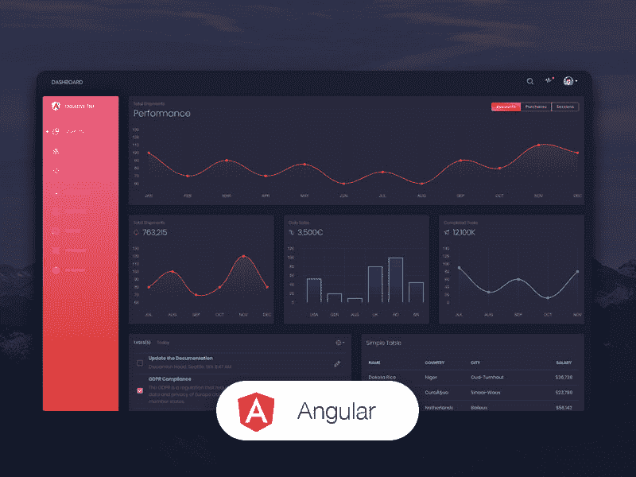T3】](https://res.cloudinary.com/practicaldev/image/fetch/s--YiuRvFed--/c_limit%2Cf_auto%2Cfl_progressive%2Cq_auto%2Cw_880/https://s3.amazonaws.com/creativetim_bucket/products/169/original/opt_bd_angular_thumbnail.jpg%3F1563529558)

[下载](https://www.creative-tim.com/product/black-dashboard-angular?ref=devto) | [直播预告](https://demos.creative-tim.com/black-dashboard-angular/#/dashboard?ref=devto) | [Github 项目](https://github.com/creativetimofficial/black-dashboard-angular) | [获取托管](https://m.do.co/c/276af09d9975)

## **[光自举仪表板](https://www.creative-tim.com/product/light-bootstrap-dashboard-laravel?ref=devto)**

[Light Bootstrap Dashboard Laravel](https://www.creative-tim.com/live/light-bootstrap-dashboard-laravel?ref=devto)是 Laravel 的免费前端预置。从零开始非常耗时，因此我们与 [UPDIVISION](https://updivision.com/) 合作，为您提供一种免费而简单的方式来启动您的下一个项目:前端和后端。

[Light Bootstrap 仪表盘 Laravel](https://www.creative-tim.com/live/light-bootstrap-dashboard-laravel?ref=devto) 设计简洁明了。我们只在管理仪表板中包含了您实际需要的组件，而没有牺牲灵活性。

[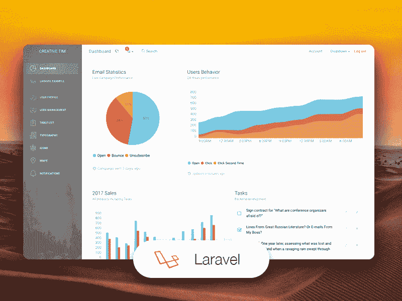](https://www.creative-tim.com/product/light-bootstrap-dashboard-laravel?ref=devto)

[下载|](https://www.creative-tim.com/product/light-bootstrap-dashboard-laravel?ref=devto) [直播预告|](https://www.creative-tim.com/live/light-bootstrap-dashboard-laravel?ref=devto) [获取主持](https://m.do.co/c/276af09d9975)

## **[白色仪表板](https://www.creative-tim.com/product/white-dashboard-laravel?ref=devto)**

[白色仪表盘 Laravel](https://www.creative-tim.com/live/white-dashboard-laravel?ref=devto) 是 Laravel 的免费前端预置。

使用为 Laravel 5.5 及更高版本构建的 Bootstrap 4 管理仪表板启动您的下一个项目。白色仪表板 Laravel 结合了悦目的颜色、宽敞的卡片和漂亮的排版，使其成为管理和可视化数据的绝佳工具。

[下载|](https://www.creative-tim.com/product/white-dashboard-laravel?ref=devto) [直播预告|](https://www.creative-tim.com/live/white-dashboard-laravel?ref=devto) [获取主持](https://m.do.co/c/276af09d9975)

## **[现 UI 仪表盘](https://www.creative-tim.com/product/now-ui-dashboard-laravel?ref=devto)**

现在 UI Dashboard Laravel 是 Laravel 的免费前端预置。

使用 NOW UI Dashboard Laravel 构建身临其境的体验，这是一个反应灵敏的 Bootstrap 4 管理仪表板，集成了由 [UPDIVISION](https://updivision.com/) 提供的 Laravel 后端。仪表板的外观&的灵感来自 [NOW UI 套件](https://www.creative-tim.com/product/now-ui-kit?ref=devto)，这是我们与 [Invision](https://www.invisionapp.com/) 共同开发的漂亮的跨平台 UI 套件，该设计平台为全球最佳用户体验提供动力。

[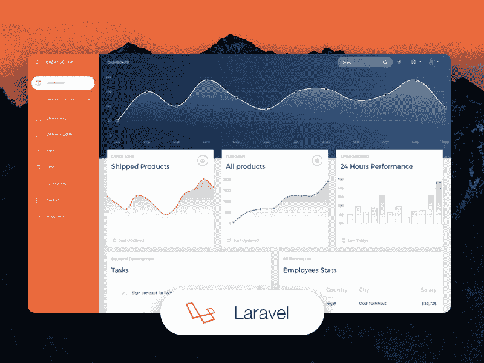](https://www.creative-tim.com/product/now-ui-dashboard-laravel?ref=devto)

[下载|](https://www.creative-tim.com/product/now-ui-dashboard-laravel?ref=devto) [直播预告|](https://www.creative-tim.com/live/now-ui-dashboard-laravel?ref=devto) [获取主持](https://m.do.co/c/276af09d9975)

## **[纸质仪表盘](https://www.creative-tim.com/product/paper-dashboard-laravel?ref=devto)**

[纸质仪表盘 Laravel](https://www.creative-tim.com/live/paper-dashboard-laravel?ref=devto) 是 Laravel 的免费前端预置。

简单的设计比你想象的要复杂得多。尤其是在表面之下有很多事情发生的时候。这就是为什么我们与 [UPDIVISION](https://updivision.com/) 合作，为您提供两全其美的产品:基于 Bootstrap 4 构建的简洁、优雅的设计，带有 Laravel 后端。

[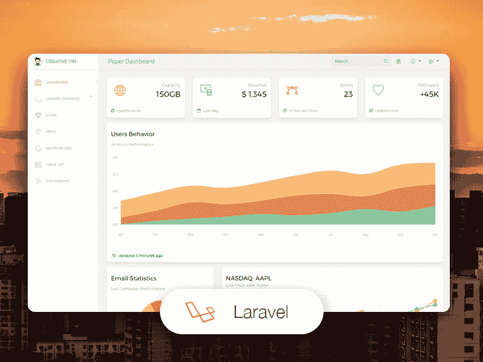](https://www.creative-tim.com/live/paper-dashboard-laravel?rev=devto)

[下载|](https://www.creative-tim.com/product/paper-dashboard-laravel?ref=devto) [直播预告|](https://www.creative-tim.com/live/paper-dashboard-laravel?ref=devto) [获取主持](https://m.do.co/c/276af09d9975)