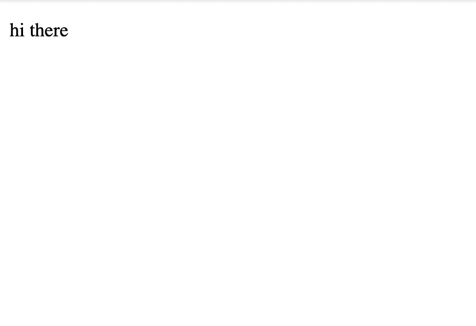
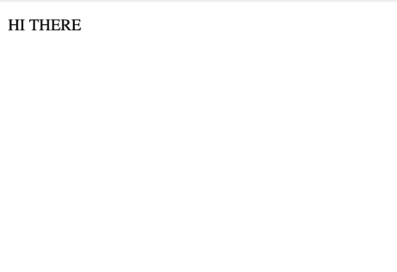

# 使用输入装饰器的 3 种不同方式

> 原文：<https://dev.to/deerawan/3-different-ways-to-use-input-decorator-4b3c>

Input ( `@Input()`)是 Angular apps 中使用最多的装饰器之一。它用于将数据从父组件或宿主组件传递到子组件。这个装饰器与使用子组件的模板中的 DOM 属性有关系。

有三种不同的方式来使用这个装饰器。

# ①平原

这是使用 Input decorator 的基本方法。

`child-one.component.ts`

```
@Input() message: string; 
```

`child-one.component.html`

```
<p>{{ message }}</p> 
```

`parent.component.html`

```
<child-one message="hi there"></child-one> 
```

输出:
[](https://res.cloudinary.com/practicaldev/image/fetch/s--ha5leZK_--/c_limit%2Cf_auto%2Cfl_progressive%2Cq_auto%2Cw_880/https://thepracticaldev.s3.amazonaws.com/i/2gc718u6kmo0a0wsw1y1.png)

我们有一个名为`message`的变量，我们给这个变量一个`@Input()`装饰器。模板`parent-component.html`中的 DOM 属性将使用与变量名相同的名称。

# 2)别名

通过使用别名，模板中的 DOM 属性可以使用不同的名称。为了给出别名，我们可以在 Input decorator 中给出一个参数，比如`@Input('my-alias-naming')`。下面是一个例子:

`child-two.component.ts`

```
@Input('msg') message: string; 
```

`child-two.component.html`

```
<p>{{ message }}</p> <!-- still uses `message` --> 
```

`parent.component.html`

```
<child-two msg="hi there"></child-two> <!-- use alias 'msg' --> 
```

输出:
[](https://res.cloudinary.com/practicaldev/image/fetch/s--ha5leZK_--/c_limit%2Cf_auto%2Cfl_progressive%2Cq_auto%2Cw_880/https://thepracticaldev.s3.amazonaws.com/i/2gc718u6kmo0a0wsw1y1.png)

这里，我们在输入装饰器中给变量`message`一个别名`msg`。在子组件模板(`child-component.html`)中，我们仍然称之为`message`。

**但是，在父组件模板(`parent-component.html`)中的**，我们使用它的别名`msg`来引用它。

# 3) Setter Getter

使用前面相同的例子，考虑我们想要以大写形式显示`message`。

这大概是常见的方式

`child.component.ts`

```
@Input() message: string;

ngOnInit() {
  this.message = this.message && this.message.toUpperCase();
} 
```

或者，另一种方法是使用`uppercase`管道

`child.component.ts`

```
@Input() message: string; 
```

`child.component.html`

```
<p>{{ message | uppercase }}</p> <!-- using uppercase pipe --> 
```

嗯，还有一种方法是使用 Typescript 类中的`set`和`get`。它们被称为**自动属性**，用于访问类变量，我们可以在那里执行一些逻辑。

`child-three.component.ts`

```
private _message: string;

@Input() // specify Input decorator here
set message(inputMessage: string) {
  this._message = inputMessage && inputMessage.toUpperCase(); // uppercase message here
}

get message(): string {
  return this._message;
} 
```

`child-three.component.html`

```
<p>{{ message }}</p> 
```

`parent.component.html`

```
<child-three message="hi there"></child-three> 
```

输出

[](https://res.cloudinary.com/practicaldev/image/fetch/s--XFF5v_dt--/c_limit%2Cf_auto%2Cfl_progressive%2Cq_auto%2Cw_880/https://thepracticaldev.s3.amazonaws.com/i/4n84ywxr58s04xphbfnq.png)

如代码所示，我们在`set`方法中定义了大写消息的逻辑。

我们还能通过这种方式给出别名吗？是的，我们也可以指定别名，例如

`child-three.component.ts`

```
@Input('msg') // give alias
set message(inputMessage: string) {
  this._message = inputMessage && inputMessage.toUpperCase(); // uppercase message here
} 
```

`parent.component.html`

```
<child-three msg="hi there"></child-three> <!-- use alias 'msg' --> 
```

# 演示

[stack blitz 上的演示](https://stackblitz.com/edit/2019-09-07-input-decorator)

# 总结

使用输入装饰器的三种不同方式。它们分别是平原法、`set`别名和`get`法。普通方式是最基本的方式，DOM 属性将与变量名同名。别名方式为我们提供了拥有不同 DOM 属性名的灵活性。最后，`set`和`get`允许我们执行一些逻辑。