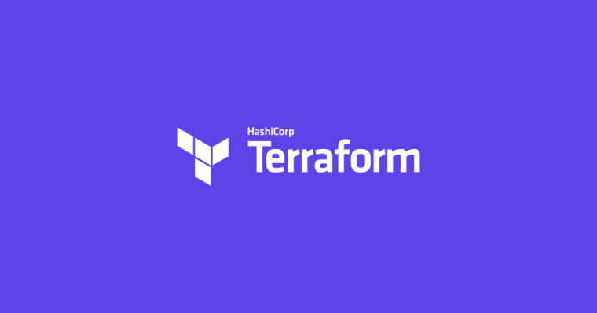
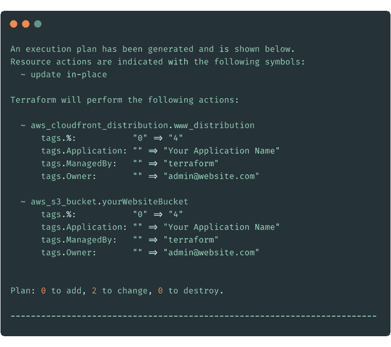
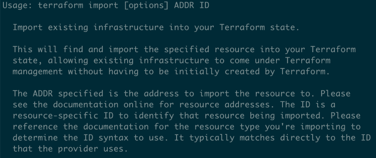
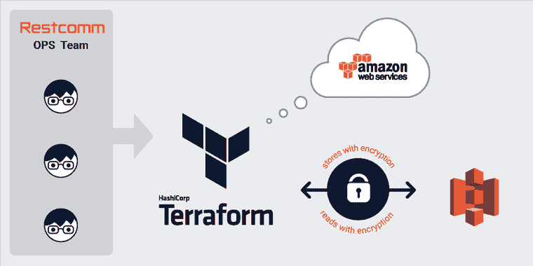
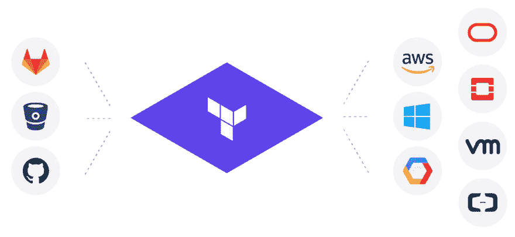

# 3 个 Terraform 特性帮助您轻松重构基础设施

> 原文：<https://dev.to/loujaybee/3-terraform-features-to-help-you-refactor-your-infrastructure-effortlessly-c53>

有没有创建过应用程序，比如网站？你创建应用程序，让一切工作。但是当你想要改变时，这个想法会让你害怕得要死。

这听起来像你吗？我也经历过同样的情况。编写灵活多变的代码并不容易。当谈到编写灵活的基础设施时，Terraform 这样的工具可以帮助我们。

如果你还不熟悉 Terraform，不要担心，你会很安全的！Terraform 是一个[基础设施代码](https://dev.to/loujaybee/infrastructure-as-code-a-quick-and-simple-explanation-56ln)工具，它有一些很棒的特性，允许我们编写灵活变化的基础设施代码。

到本文结束时，您将理解什么是 Terraform，为什么它是第一个值得学习的基础设施即代码工具，以及它的主要特性如何帮助您编写易于重构的基础设施。

## 为什么可重构基础设施有用？

正如我们的代码一样，对基础设施的需求会随着时间的推移而变化。例如，我们可能会部署一定数量的服务器，能够处理大量的请求。但是，随着应用程序需求的增加，我们的基础架构可能也需要扩展。

无论我们的基础设施发生变化的原因是什么，我们创建的软件必须能够灵活地适应新需求带来的变化。我们确保代码始终处于可塑状态的几种方法是使用某些技术。我们可以利用抽象来松散地耦合我们的服务。我们可以确保彻底测试我们的应用程序。我们对测试越有信心，我们就能越积极地做出改变。

但是——我们如何将灵活、敏捷的软件应用到基础设施和代码中呢？嗯，我最近花了相当多的时间使用和编写 Terraform，并且非常喜欢它的一些特性，这些特性允许我们将灵活的基础设施编写为代码，今天我想与您分享这些特性！

## 地形简介

在我们开始了解 Terraform 的一些特性之前，您需要了解一些 Terraform 理论，所以让我们来谈谈 Terraform 是什么，它是如何工作的，以及为什么您应该关注它！

让我们从一个定义开始:

Terraform 是一个独立的命令行、基础设施即代码工具。

哇——满嘴都是，让我来给你解释一下…

**注意:**如果您对基础设施不太了解，请查看之前的文章，了解对[基础设施和基础设施即代码的介绍。](https://dev.to/loujaybee/infrastructure-as-code-a-quick-and-simple-explanation-56ln)

Terraform 是一个命令行工具。使用 Terraform，您可以编写基础设施代码，然后执行命令来运行它。该命令直接在您的计算机上运行，或者在生成服务器上运行。Terraform 通常不在云上运行。我强调这一点，terraform 不是在云上运行的，因为它解释了 Terraform 的许多细微差别(稍后会详细介绍)。

Terraform 也是独立的，因为(与许多竞争对手不同)它与特定的云提供商或服务没有联系。Terraform 可用于在 [GCP](https://cloud.google.com/) 、 [AWS](https://aws.amazon.com/) 和许多其他服务上提供基础设施。不像其他一些基础设施即代码工具，如 [CloudFormation](https://aws.amazon.com/cloudformation/) 与 AWS 服务绑定在一起(我们还会回到这一点！)

使用 Terraform，您可以将基础设施的期望状态声明为代码，然后 Terraform 会执行许多神奇的操作，将您现有的基础设施迁移到新的描述状态。

好的——这看起来有点复杂……但是为了让一切变得生动，我们将更详细地讨论 Terraform 是如何工作的。所以坚持下去，我保证最终会物有所值！

## terra form 是如何工作的？

为了更详细地了解 Terraform 的工作原理，我们需要了解两个关键概念:

1.  地形状态
2.  地形规划与地形应用

让我们现在就做吧！

### 地形状态

关于地形，最重要的概念是状态的概念。

为了理解地形状态，我们需要考虑三个方面:

*   Terraform 代码——我们希望我们的基础设施是什么样子。
*   地形状态—我们基础设施的最后已知状态。
*   基础架构状态—我们基础架构的实际状态(实时)。

Terraform 保存状态(在状态文件中),以便了解基础设施的当前状态。当您请求对基础设施进行更改时，Terraform 会将您想要的(您的代码)与您当前拥有的(您的状态)进行比较。

关于状态，需要记住的重要一点是，它并不反映基础设施的实际状态。Terraform 通过在后台调用不同的 API 来计算出基础设施的当前状态。这很重要，值得重复。_Terraform 状态并不直接反映基础设施的实际状态。_

到现在为止，你可能想知道…但是所有这些和重构基础设施有什么关系呢？别担心，我们很快就会谈到 Terraform 的不同特性，以及它们是如何促进重构的！但是我们需要明白，重构 Terraform 意味着在这三个方面进行仔细的平衡:我们的代码、terraform 状态和基础设施状态。

但是在我们讨论 Terraform 的主要特性来帮助我们重构之前，让我们先了解一下 Terraform 的两个重要概念:规划和应用。

### 地形图

当你开始修改你的地形代码时，你可能会用到两个重要的命令:[地形计划](https://www.terraform.io/docs/commands/plan.html)和[地形应用](https://www.terraform.io/docs/commands/apply.html)。

计划是你要求 Terraform 将当前状态与请求状态进行比较。Terraform 会回复一些细节。Terraform 会告诉你是否有任何改变，改变了什么，以及推出这些改变会产生什么影响。例如，一些更改将要求整个基础架构被破坏和重建。

*地形规划命令的例子*

### 地形应用

我们使用 Terraform plan 来确保我们的代码会产生我们想要的变化。当我们对我们的更改感到满意时，我们使用 Terraform apply 进行更改。

这就是我们对 Terraform 的介绍，我们现在可以进入真正有趣的部分，即了解 Terraform 功能如何使我们能够轻松地重构我们的基础设施！

让我们来看一个例子，看看这两个 Terraform 命令是如何工作的。

## 3 个平台特性有助于重构基础设施

好了，希望现在你应该很好地掌握了 Terraform 的工作原理。现在，让我们进入正题，看看一些更高级的特性，以及它们如何使我们能够编写灵活且易于管理的基础架构代码，以便我们可以毫不费力地进行更改！

听起来不错吧？我们开始吧！

### 把基础设施变成代码:用 Terraform 导入。

正如我们之前所说，状态是 Terraform 了解我们正在管理的基础架构的方式。但有时，不管出于什么原因，我们有不是用 Terraform 编写的基础设施，我们希望它是，这样我们就可以利用基础设施即代码的所有好处进行更改。

Terraform 为我们提供了一个工具，让我们能够控制现有的基础设施。通过导入命令。使用 Terraform import，您只需向 Terraform 提供云资源的唯一标识符(前提是 Terraform 支持它[！)Terraform 可以抓取那个状态，给你拉下来。不幸的是，虽然 Terraform 还不支持代码的导入，只支持状态的导入。](https://www.terraform.io/docs/providers/)

既然您已经降低了您的状态，您就有了一个类似于 TDD 的过程，您可以编写您的基础设施代码来匹配您的状态。您可以通过编写一些代码并运行 Terraform plan 命令来检查 Terraform 是否仍然告诉您您的代码和您的状态不一致。只需稍加改动，您就可以将手动创建的基础设施编写成代码，而且非常容易！

但是，这和重构有什么关系呢？当你可以在 Terraform 下导入一个资源时，你可以使用 Terraform 进行未来的修改。当您的基础设施用代码管理时，创建用于测试的副本环境变得很容易，并且如果我们犯了错误，我们可以很容易地向前或向后滚动。

*terra form 导入命令的描述。*

### 整体到可管理的基础设施代码:远程状态

我们之前讨论过状态的概念，这是 Terraform 了解当前存在哪些基础设施需要管理的方式。到目前为止，我没有分享任何关于如何存储状态的细节。

存储状态最简单的方法是本地存储。我什么意思？嗯，当 Terraform 运行并更改其状态时，它会存储在一个基本的 Terraform 状态文件中，并可以通过您的代码提交。但是……这导致了许多复杂情况。如果很多人都在同一个州工作会怎么样？如果国家包含敏感信息呢？

这就是一个简洁的地形特征的来源:远程状态。我们可以在 Terraform 中使用一些简单的配置，让 Terraform 知道我们想要远程存储状态。例如，在 AWS 中工作时，这意味着它会将您的 JSON 文件推送到 AWS，并在那里存储您的状态。

但是，为什么远程状态对重构有用呢？远程状态的一大优势是我们可以在状态文件之间共享状态。使用 Terraform 中的数据导入器，我们可以拉入由不同 Terraform 代码创建的远程状态。

但是——那又怎样？

通过能够拉入其他 Terraform 的远程状态，我们可以引用不同基础设施文件中构建的基础设施。这使得将我们的基础设施分解成小块变得容易，保持简单的文档记录和良好的描述。就像我们可能想要分解一个大的应用程序代码库一样，我们可以通过使用远程状态来很好地维护 Terraform。

*来源:[restcomm](https://www.restcomm.com/multi-account-aws-terraform-setup-encrypted-remote-state-s3-backend/)T3】*

### 管理万物云:使用 Terraform HCL

现在越来越常见的是，当创建应用程序时，软件工程师将许多不同的云服务拼凑在一起，如 [Auth0](https://auth0.com) 或 [Stripe](http://stripe.com) 。如果你感兴趣的话，[的 Ryan Hoover](https://twitter.com/rrhoover),[Product Hunt](https://www.producthunt.com/)的创始人写了一篇关于“无代码”应用(我创建的一款产品——split oo——也属于“无代码”类别)的文章。

但是，这与基础设施即代码和地形有什么关系呢？

因为有了 Terraform，你实际上可以为所有这些类型的云应用编写基础设施代码，而不仅仅是像 AWS、GCP 等常规云提供商。

这就是我们谈论独立平台的原因。因为 Terraform 不依赖于云平台，这意味着无论你将什么类型的基础设施转换成代码，你的 Terraform 知识都可以转移，不仅仅是服务器和数据库等。实际上，将这些更适合的资源写成基础设施即代码是可能的。

拥有一个独立于这些提供者的工具意味着在它们之间转移更容易。当您的其余基础架构都在 AWS 中时，您想集成 GCP 服务吗？现在你已经熟悉了 Terraform 这个工具，在不同的地方创建新的资源变得非常容易。

*平台提供商示例*

## 轮到你了——地球化一切！

希望我已经激起了你对 Terraform 和一些关键优势的兴趣。在过去的几周里，我真的很喜欢和 Terraform 一起工作。我发现(因为我们正在谈论的特性)Terraform 是一个非常好的工具。

如果您接触任何基础设施，我强烈建议您首先花时间学习如何将它作为代码放入基础设施。如果您打算学习任何工具来管理您的基础架构即代码的供应，我强烈推荐 Terraform。

这就是今天的全部内容，Terraform 为我们提供了三个特性，使我们能够灵活、轻松地重构我们的基础设施。一如既往，最好的学习方法是试一试。如果你正在考虑用 AWS 之类的东西创建云资源，记得正确设置你的 AWS 账户，这样你就不会被黑了！

* * *

post [3 Terraform 特性帮助你毫不费力地重构你的基础设施](https://www.thedevcoach.co.uk/refactoring-infrastructure-terraform/)首先出现在[的 Dev 蔻驰](https://www.thedevcoach.co.uk)上。

像您一样加入云原生软件工程师社区。了解最新的云技术，学习核心云工程主题的基本技能，如:Docker。无服务器和 Linux，等等。

[加入我们](https://thedevcoach.co.uk/newsletter)并取得成功！