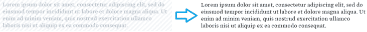
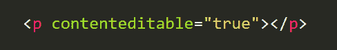

# 我(几乎)每天都会用到的 3 个有用的书签

> 原文：<https://dev.to/lpellis/3-useful-bookmarklets-i-use-almost-daily-3lm1>

> <small>**注意:** Dev.to 不允许在链接中使用 javascript，所以要安装这些书签请前往[https://loft ie . com/post/3-used-bookmarklets-I-use-almost-daily](https://loftie.com/post/3-useful-bookmarklets-i-use-almost-daily)</small>

Bookmarklets 是小的 javascript 脚本，可以用来执行简单的任务。下面是我在浏览或做网站开发时经常使用的 3 个简单的书签。

### 1: SaneColor

> 将字体和背景更改为可读的颜色

<figure> 

<figcaption></figcaption>

</figure>

在浏览或阅读文章的过程中，我经常会看到一些页面，由于对比度不好或颜色不好，我觉得很难阅读。这个 bookmarklet 将背景和字体的颜色更改为可读的颜色，并且不需要重新加载页面就可以工作。

### 2:jquery ify

> 注入 jQuery 以便在任何站点的控制台中使用

<figure> 

<figcaption></figcaption>

</figure>

现在我不经常使用 jQuery 了，但是我仍然发现自己想要使用它的语法在页面上快速查看一些东西。这个 bookmarklet 使 jQuery 在任何页面上都可用，只需点击一个按钮。

基于这篇古老帖子的修改版(适用于任何网站):[https://www . learning jquery . com/2009/04/better-strong-safer-jquery ify-bookmarklet](https://www.learningjquery.com/2009/04/better-stronger-safer-jquerify-bookmarklet)

### 3:使可编辑

> 使任何页面可从浏览器编辑

<figure> 

<figcaption></figcaption>

</figure>

通常在设计过程中，直接简单地编辑内容来看看它看起来会是什么样子会很好。这个 bookmarklet 只是为整个页面设置了`contenteditable`。

这甚至可以在页面上删除会话中恼人的闪烁/分散注意力的元素。

* * *

你还有其他有用的书签吗？请在评论中告诉我:)