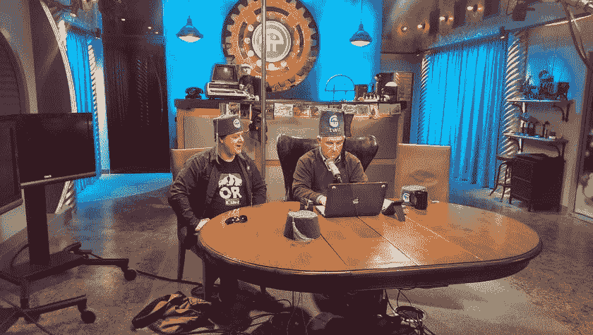

# 30 个最佳开发和技术播客

> 原文：<https://dev.to/rosnovsky/30-best-dev-and-tech-podcasts-35dh>

很难相信，我已经听了将近 15 年的播客，并且从 2006 年 4 月开始我自己也在做播客。想想看:那时 Youtube 刚刚从约会网站转型为 Twitter，Twitter 拥有 150 名活跃用户，优步在未来 3 年左右不会存在，世界上最具创新性的手机公司是诺基亚和黑莓。大片是巨大的，迷失是有史以来最大的电视节目，仍然在第三季:)

播客从未像视频流那样起飞，但我不认为这是一个问题。历史上，口语在受欢迎程度上输给了电影，但更多时候是在内容和深度上输给了电影。不仅如此，播客不需要像 Youtube 那样的专注度。你不能真的开车看 [Kurzgesagt](https://www.youtube.com/user/Kurzgesagt) ，但你可以开车听[科学 Vs](https://gimletmedia.com/shows/science-vs) 。

以下是我最喜欢的播客列表。其中一些已经运行了二十年，一些还是相当新的，但是它们都是知识、新闻和人类经验的巨大来源，因为它们通常与高科技产业相关，特别是软件开发。如果你认为我错过了一场精彩的演出，请随时提出[拉请求](https://github.com/rosnovsky/rosnovskyus/blob/master/src/content/blog/tech-podcasts-in-2019.md)！

> **TL；你可以[下载下面提到的全部 30 个节目的完整 OPML 列表。只要把它放到你最喜欢的播客应用程序中(我建议](https://github.com/rosnovsky/rosnovskyus/blob/master/src/content/blog/30-top-tech-podcasts-in-2019/overcast.opml)[播](https://overcast.fm/))，所有这些节目马上就会出现在你的订阅中！**

## 开发

开发播客提供了大量的信息和惊人的学习体验。他们也给人一种更大的团体感和归属感。以下是直接涉及软件和 web 开发的播客列表。

### 1。[语法](https://syntax.fm/)

相对较新的和真正的打击。两位主持人 Wes“Barracuda”Bos 和 Scott“El Toro Loco”tolin ski 通常会制作 JavaScript 课程并在会议上发言，但他们偶尔(更像是一周几次)会聚在一起谈论工作。从如何成为自由职业者或获得第一份开发工作到最新的 CSS 技巧和最新的内部化特性。《家常便饭》Q & A 集和 on-point“美味佳肴”。

<small>语法 [iTunes](https://itunes.apple.com/ca/podcast/syntax-tasty-web-development-treats/id1253186678?mt=2) |语法[RSS](http://feed.syntax.fm/rss)T5】</small>

* * *

### 2。 [React 播客](https://reactpodcast.simplecast.fm/)

都在名字里。从与 React 核心团队成员的访谈到我们都喜欢的框架的远景和深入细节(并且[我们确实喜欢它](https://2018.stateofjs.com/front-end-frameworks/overview/)！)到职业讨论。

<small>React 播客 [iTunes](https://podcasts.apple.com/us/podcast/the-react-podcast/id1341969432) | React 播客 [RSS](https://rss.simplecast.com/podcasts/6265/rss)</small>

* * *

### 3。[软件工程日报](https://softwareengineeringdaily.com/)

对基本上所有软件开发的广泛看法。不过，这并不是专门针对 web 开发的。老实说，我没有那么多时间，而且我确实有很多其他好的播客可以听，所以就我个人而言，我会浏览新剧集的展示笔记，听那些看起来有希望的。有趣的话题经常出现，但不幸的是，时间是有限的资源。

<small>软件工程日报 [iTunes](https://podcasts.apple.com/us/podcast/software-engineering-daily/id1019576853?ls=1&mt=2) |软件工程日报[RSS](https://softwareengineeringdaily.com/category/podcast/feed)T5】</small>

* * *

### 4。[变更日志](https://changelog.com/podcast)

变更日志已经存在很长时间了。剧集以杰出的工程师、开发人员和其他专家为主角，通常有一个特定的主题。

<small>变更日志 [iTunes](https://itunes.apple.com/us/podcast/the-changelog/id341623264) |变更日志[RSS](https://changelog.com/podcast/feed)T5】</small>

* * *

### 5。 [JS 党](https://changelog.com/jsparty)

🎉🎉🎉有趣而随意，是你想参与的那种聊天。像有些话题那么严肃(倦怠，有人吗？)，剧集大多都是励志和赋能的一面。

<small>JS 党 [iTunes](https://itunes.apple.com/us/podcast/js-party/id1209616598) | JS 党[RSS](https://changelog.com/jsparty/feed)T5】</small>

* * *

### 6。[开发商茶](https://spec.fm/podcasts/developer-tea)

开发者茶是播客中较短的一部分。对新手和经验丰富的开发人员都有启发和帮助，对任何通勤时间超过 20 分钟的人都适用。我甚至训练我的 Alexa 在早上给我喝新开发人员的茶，大多数时候它们的情节很好地融入了我的早餐日程。

<small>开发者茶 [iTunes](https://geo.itunes.apple.com/ca/podcast/feed/id955596067) |开发者茶[RSS](http://feeds.feedburner.com/developertea)T5】</small>

* * *

### 7。[全栈电台](http://www.fullstackradio.com/)

亚当·瓦森每周深度访谈节目。有时候，我听着客人的话，会想我是否曾经像他们一样对技术有如此巨大而完整的理解。

<small>全栈电台 [iTunes](https://geo.itunes.apple.com/ca/podcast/feed/id955596067) |全栈电台[RSS](https://rss.simplecast.com/podcasts/279/rss)T5】</small>

* * *

### 8。[店谈](https://shoptalkshow.com/)

另一个关于前端开发，网页设计和 UX 所有事情的伟大表演。有趣的是，有时你会在这个列表的不同播客上听到相同的嘉宾，但每个主持人和每个节目都有不同的角度，提供不同的对话。激动人心的嘉宾，精彩的深度讲座。

<small>店谈 [iTunes](http://itunes.apple.com/podcast/id493890455) |店谈[RSS](https://shoptalkshow.com/feed/podcast)T5】</small>

* * *

### 9。[自由代码营](https://freecodecamp.libsyn.com/)

[FreeCodeCamp](https://freecodecamp.org) 是学习软件开发的绝对最好且完全免费的开源资源之一。它像疯了一样成长，有一个令人难以置信的充满热情的人的社区，他们乐于分享他们的知识并帮助新手。他们的播客也不例外:令人敬畏的嘉宾、刺激的话题、成功的故事等等。强烈推荐！

<small>FreeCodeCamp[iTunes](https://itunes.apple.com/us/podcast/the-freecodecamp-podcast/id1313660749?mt=2&ls=1)| FreeCodeCamp[RSS](http://podcast.freecodecamp.org/rss)T5】</small>

* * *

### 10。[第二职业发展](https://secondcareerdevs.com/)

凯尔与那些在其他领域有过工作经历后成为软件工程师的人进行了交谈。这一点对我来说尤为重要，因为我的前世是记者和电台主持人，我自己也是第二职业发展者。

<small>第二职业开发者 [iTunes](https://podcasts.apple.com/us/podcast/second-career-devs/id1317467797) |第二职业开发者[RSS](http://feeds.soundcloud.com/users/soundcloud:users:332558027/sounds.rss)T5】</small>

* * *

### 11。[可维护的](https://maintainable.fm/)

遗留代码、技术债务，以及如何维护和推进较老的项目(个人或工作)。这是为经验丰富的开发人员量身定制的，但是任何人都可以从中受益，不管当前的经验水平如何。

<small>可维护 [iTunes](https://podcasts.apple.com/us/podcast/maintainable/id1459893010) |可维护[RSS](https://feeds.simplecast.com/7y1CbAbN)T5】</small>

* * *

### 12。[电码笔电台](https://blog.codepen.io/radio/)

CodePen 是一个非常棒的工具，可以快速原型化一个功能，展示一些代码，做一个练习或者在一个项目上合作。他们发布了一个很有见地的播客，是关于经营网络软件业务的。

<small>CodePen Radio[iTunes](https://itunes.apple.com/us/podcast/codepen-radio/id824437159)| CodePen Radio[RSS](https://blog.codepen.io/feed/podcast/)T5】</small>

* * *

### 13。[编码块](https://www.codingblocks.net/)

> 关于计算机编程和软件开发的播客，让您可以随时随地学习。

确实如此。主题千差万别，但是您会发现自己每个月都在深入钻研不同的编程概念并学习大量新东西。

<small>编码块 [iTunes](https://podcasts.apple.com/podcast/coding-blocks-software-web/id769189585) |编码块[RSS](https://www.codingblocks.net/podcast-feed.xml)T5】</small>

* * *

## 通用技术对话

更一般的是，这些播客涵盖了科技新闻。其中一些深入科技故事的哲学含义，一些涉及在科技领域工作的细节。

### 14。[本周科技](https://www.twit.tv/shows/this-week-in-tech)

利奥·拉波特是一个真正的传奇人物，也是播客的先驱之一。他的 TWiT 网络运营着一大堆节目，从网络安全到 iOS 再到每日科技新闻。我认为《本周科技》是每周科技新闻播客。

<small>本周科技 [iTunes](https://podcasts.apple.com/us/podcast/this-week-in-tech-mp3/id73329404?uo=10) |本周科技[RSS](http://feeds.twit.tv/twit.xml)T5】</small>

### 15。[意外科技播客](https://atp.fm/)

Marco Arment、Casey Liss 和 John Siracusa 这三位知名软件开发人员、作家和制作人主持了这个非常特别的节目。这既讽刺，又乐观，有时甚至是悲观的，但这完全是另外一回事。从最好的意义上来说，它无处不在。这是相当严重的苹果倾向，因为主持人一直在报道苹果或与苹果堆栈工作了几十年。例如，Marco Arment 是负责[覆盖](https://overcast.fm/)的人，毫无疑问是最好的播客应用。

<small>偶然 [iTunes](https://itunes.apple.com/us/podcast/accidental-tech-podcast/id617416468) |偶然[RSS](http://atp.fm/episodes?format=rss)T5】</small>

### 16。[独立黑客](https://www.indiehackers.com/podcast)

我不能跳过独立黑客，尽管这可能是我不完全确定我喜欢的播客之一:)有时这是一种大肆宣传，客人们是这种自制的万事通，但他们随后与某人进行了有意义的，鼓舞人心的，总体上很好的交谈，因为他们真正了解他们的东西。总之，时好时坏，但仍值得一试。

<small>独立黑客 [iTunes](//itms://itunes.apple.com/us/podcast/indie-hackers-podcast-how/id1206165808) |独立黑客[RSS](https://feeds.backtracks.fm/indiehackers/indie-hackers-podcast/feed.xml)T5】</small>

* * *

## 苹果& Mac

众所周知，苹果*发明了*播客。毫不奇怪，苹果被几十个不同的节目所覆盖。这家公司受到一些人的喜爱，也受到一些人的鄙视，但我真的不知道有哪个人对苹果完全漠不关心。

### 17。[麦克布雷克周刊](https://www.twit.tv/shows/macbreak-weekly)

这是现存最古老的 Mac 和苹果秀；我记得我看过的第一个高清视频之一，大概是在 50 年前，这第一个视频是《MBW》的指导集之一(我仍然记得视频的开头配乐，下载它花了多长时间，它在我的旧电脑上非常抖动)。我的最爱之一。

<small>MacBreak 周刊 [iTunes](https://podcasts.apple.com/us/podcast/macbreak-weekly-mp3/id179237749?uo=10) | MacBreak 周刊[RSS](http://feeds.twit.tv/mbw.xml)T5】</small>

### 18。[升级](https://www.relay.fm/upgrade)

Relay.fm 网络的联合创始人 Myke Hurley 和他的传奇联合主持人 Jason Snell，在一个关于技术的严重苹果倾向的节目中。他们倾向于通过*苹果眼镜*来看待所有的技术场景，他们在旋转苹果产品方面做得很好。

<small>升级 [iTunes](https://itunes.apple.com/us/podcast/upgrade/id918152703) |升级[RSS](https://overcast.fm/itunes918152703/upgrade)T5】</small>

### 19。[矢](https://www.imore.com/vector)

iMore 的 Rene Ritchie 几乎每天(有时一天两次)主持这个关于个人技术，特别是苹果技术的节目。雷内很擅长解释事情，通常他会在真正谈论之前弄清他在谈论什么。

<small>向量 [iTunes](http://applepodcasts.com/vector) |向量[RSS](http://vector.libsyn.com/rss)T5】</small>

### 20。[接通](https://www.relay.fm/connected)

视角和口音的独特组合。这个节目以苹果为中心，提供了大量你可能不同意的评论和观点。随便说说:)

<small>已连接 [iTunes](https://itunes.apple.com/us/podcast/id909109652) |已连接[RSS](https://overcast.fm/itunes909109652/connected)T5】</small>

## 谷歌&安卓

Googleverse 当然是一个东西，在任何给定的时刻，这个宇宙中都会发生相当多令人兴奋的事情。

### 21。[本周在谷歌](https://www.twit.tv/shows/this-week-in-google)

这真是一场精彩的演出。谷歌称之为“本周”,但是伙计们，他们真的坚持这个主题吗？我的意思是称赞，真的:这个节目比谷歌新闻更广泛，涵盖了所有与谷歌有关的事情，或谷歌的技术，或谷歌的潜在技术，或技术的未来，或任何今天令人兴奋的事情:)

<small>本周在谷歌 [iTunes](https://podcasts.apple.com/us/podcast/this-week-in-google-mp3/id326120877?uo=10) |本周在谷歌[RSS](http://feeds.twit.tv/twig.xml)T5】</small>

### 22。[素材播客](https://www.relay.fm/material)

因其他节目而闻名的两个人，MacBreak Weekly 的 Andy Ihnatko 和 All About Android 的 Florence Ion，联手创建了 Material Podcast。所有的东西都是安卓的，有相当多的随和的壁炉边聊天和有趣的观点。

<small>素材播客 [iTunes](https://itunes.apple.com/us/podcast/material/id1015422651) |素材播客 [RSS](https://www.relay.fm/material/feed)</small>

### 23。[关于安卓的一切](https://www.twit.tv/shows/all-about-android)

与 Android Central 的播客一起，这可能是 Android 忠实用户的 Android 秀。当一群对 Android 充满热情的人聚在一起，分享他们的挫折、兴奋、希望和经历时，不管你对 Android 有什么看法，你都会看到一场精彩的表演。

<small>关于安卓的一切 [iTunes](https://podcasts.apple.com/us/podcast/all-about-android-mp3/id429307630?uo=10) |关于安卓的一切[RSS](http://feeds.twit.tv/aaa.xml)T5】</small>

## 微软& Windows

近年来，微软从一个以消费者为中心的操作系统和办公软件巨头转变为一个消费者和企业云和服务公司(我必须补充一点，它拥有惊人的消费者设备部门！)在我个人看来，这种不可思议的转变没有得到足够的爱和关注，但话说回来，数据湖和 Azure Active Directory 的受众可能相当狭窄。然而，一些节目很好地报道了微软的所有事情。

### 24。[视窗周刊](https://www.twit.tv/shows/windows-weekly)

如果你想从专业报道微软的人那里寻找一些友好的恶意，不用再找了。有时候我想知道为什么所有的讽刺，但随后主持人会深入解释发生了什么，为什么，从什么时候开始，以及接下来会发生什么。

<small>Windows 周刊 [iTunes](https://podcasts.apple.com/us/podcast/windows-weekly-mp3/id197875368?uo=10) | Windows 周刊[RSS](http://feeds.twit.tv/ww.xml)T5】</small>

### 25。[本周第九频道](https://channel9.msdn.com/shows/This+Week+On+Channel+9/)

这个有点 *meta* 。我的同事克里斯蒂娜·沃伦(Christina Warren)基本上总结了第 9 频道的所有内容，包括微软发布的新闻、功能更新谈话、技术讨论、博客帖子等等。我也推荐[第 9 频道](https://channel9.msdn.com/)的全部内容，但是要做好准备，它有很多很棒的内容。

<small>twic 9[iTunes](https://itunes.apple.com/gb/podcast/this-week-on-channel-9-mp4-channel-9/id360667463)| twic 9[RSS](https://channel9.msdn.com/Shows/This+Week+On+Channel+9/feed/mp3)T5】</small>

### 26。 [Windows Central 播客](http://windowscentral.libsyn.com/)

另一个关于 Windows 和微软的质量展示。我会说，更多的是在消费者方面，但这并不意味着你不能全面、深入地了解微软宇宙中正在发生的事情。

<small>Windows Central[iTunes](https://itunes.apple.com/us/podcast/windows-central-podcast/id1120948170?at=10l3Vy&ct=UUwpUdUnU40700YYwYwo5uw4zdpo5zwgzloorzgc3bomnxw2)| Windows Central[RSS](http://windowscentral.libsyn.com/rss)T5】</small>

## 通用

最后一类节目更多的是关于事物的一般方面，不一定与技术或软件开发直接相关。不过，这些都是优秀的大众兴趣节目。

### 27。[科学 Vs](https://gimletmedia.com/shows/science-vs)

最好的科普播客之一。我真的希望它能更有规律，我当然希望能更经常地看到更多的剧集。但老实说，我不确定在不牺牲研究深度和所有在你开始录音之前就出现的东西的情况下，还能有更多这种质量的内容。

<small>科学 Vs [iTunes](https://itunes.apple.com/us/podcast/science-vs/id1051557000?mt=2&at=1000lSb9&ct=gimweb) |科学 Vs [RSS](https://feeds.megaphone.fm/sciencevs)</small>

### 28。[升空](https://www.relay.fm/liftoff)

对于我们所有的太空迷和爱好者来说，这是太空展。最新的新闻，技术进步，计划和太空时代的现实，所有我们喜欢和享受的东西，都被对太空充满热情的人们很好地包装和解开。

<small>升空 [iTunes](https://itunes.apple.com/us/podcast/liftoff/id1031275911) |升空[RSS](https://www.relay.fm/liftoff/feed)T5】</small>

### 29。[内部对讲机](https://www.intercom.com/blog/podcasts/)

这是一些关于公司方面的事情，但对于那些关注 SaaS 和科技行业的人来说，总体来说是有益的。许多真正的大人物在 Intercom 的虚拟工作室停下来分享他们的成功之旅。

<small>内线通话 [iTunes](https://itunes.apple.com/us/podcast/inside-intercom-podcast/id996103731?mt=2) |内线通话[RSS](https://rss.art19.com/inside-intercom)T5】</small>

### 30。 [99%隐形](https://99percentinvisible.org/)

这又是一个更普遍的兴趣方面的事情。尽管如此，在 30-60 分钟内，它仍然充满了乐趣和灵感，以及发人深省的对话。

<small>99%不可见 [iTunes](https://itunes.apple.com/us/podcast/99-invisible/id394775318?at=10l9zE) | 99%不可见[RSS](http://feeds.99percentinvisible.org/99percentinvisible)T5】</small>