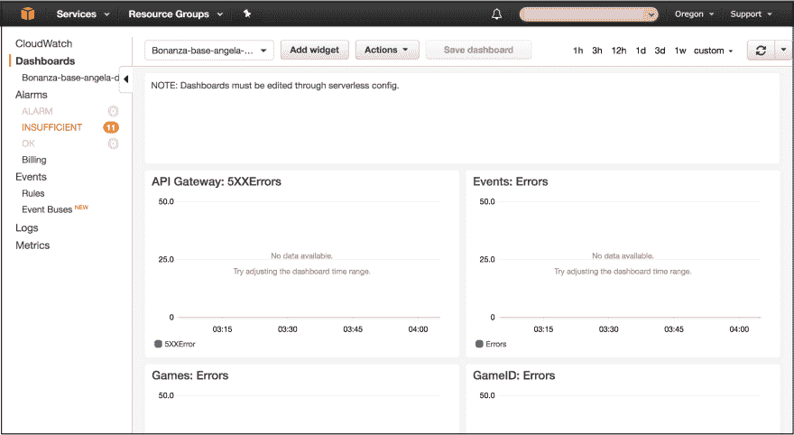
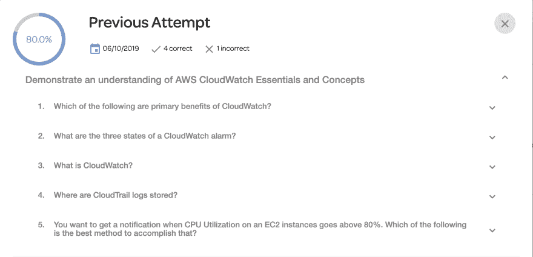

# 30 天 AWS(第 10 天)

> 原文：<https://dev.to/gameoverwill/30-days-of-aws-day-10-4c48>

欢迎回来，伙计们，这一周有点疯狂，有很多工作，但我也学习了很多，让我们谈谈。

第十天，我学习了管理工具 CloudWatch 和 CloudTrail，这是一门关于本质的课程，这个主题没有深入讨论。

## 云观察

这是一项允许您监控 AWS 帐户中的服务的服务。

来自官方文档“Amazon CloudWatch 是一款为开发者、系统操作员、站点可靠性工程师(SRE)和 IT 经理打造的监控和管理服务。CloudWatch 为您提供数据和可操作的见解，以监控您的应用、了解和响应系统范围的性能变化、优化资源利用率，并获得运营状况的统一视图”

基本上，它是一个控制面板，您可以在其中监控服务，如下图所示:

您可以使用它来设置关于以下内容的警报:

1.  CPU 利用率。
2.  服务状态。
3.  磁盘读写。
4.  我们的 S3 桶中的对象数量。
5.  您在 AWS 帐户中的成本。

### 好处

在工作中，我们使用 CloudWatch，我们有成千上万的好处，例如:

1.  基础设施监控和故障排除:我们已经创建了图形，让我们可视化的应用和基础设施。因此，我们比较指标和日志，以获得不同问题的根本原因。

    由于这一点，我们已经能够识别不容易看到的问题。

2.  资源优化:当您需要确定一个进程是否伸缩性不好时，这很有帮助，因此我们修正了可伸缩性规则。

3.  应用程序监控:这是工作中最常用的方法之一，我们已经创建了几个警报来监控我们的 lambdas(无服务器应用程序)并改进我们的流程。

除了完成这一天，我还练习创建警报来识别问题。很难向你展示与此相关的东西。

今天考试的结果。

今天到此为止。

感谢阅读。