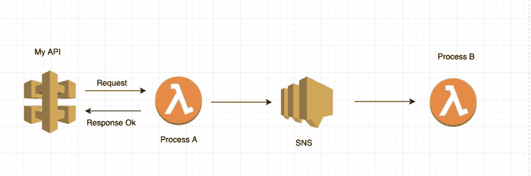

# 30 天 AWS(第 12 天)

> 原文：<https://dev.to/gameoverwill/30-days-of-aws-day-12-7d4>

欢迎回来伙计们，这疯狂挑战的另一个更新。我有个好消息，我完成了这门课程，:D

所以，最后一个话题是兰姆达斯。我知道这项服务，因为在工作中我们经常使用它，但每次你都可以学到新东西。

## Lambdas

来自官方文档“AWS Lambda 是一种无服务器计算服务，它运行您的代码来响应事件，并自动为您管理底层计算资源。您可以使用 AWS Lambda 通过自定义逻辑扩展其他 AWS 服务，或者创建自己的后端服务，在 AWS 规模、性能和安全性方面进行操作。AWS Lambda 可以自动运行代码来响应多个事件，例如通过亚马逊 API 网关的 HTTP 请求、亚马逊 S3 桶中对象的修改、亚马逊 DynamoDB 中的表更新以及 AWS Step 函数中的状态转换”。

使用 lambdas 的一些好处:

1.  您可以构建自己的后端代码，您是所有者，您可以使用自己想要的语言进行部署。

2.  你可以把 lambdas 和另一个像 SQS，SNS 什么的联系起来。

3.  自动缩放，AWS Lambda 仅在需要时调用您的代码，并自动缩放以支持传入请求的速率，而无需您进行任何配置。

4.  通过使用 AWS Step 函数构建工作流，您可以为复杂或长期运行的任务协调多个 AWS Lambda 函数。

5.  AWS Lambda 通过其内置的 AWS SDK 以及与 AWS 身份和访问管理(IAM)的集成，允许您的代码安全地访问其他 AWS 服务。默认情况下，AWS Lambda 在 VPC 中运行您的代码。

6.  使用 AWS Lambda，您只需为服务的请求和运行代码所需的计算时间付费。

## 现实世界中的 AWS Lambdas

你可以用成千上万种不同的方式使用 lambdas，但让我告诉你我如何在工作中使用它，这是最基本的一种。

因此，当用户请求我们的端点 API GW 调用 lambda 时，但是这个过程是如何异步的，用户得到一个响应。与此同时，lambda 正在处理用户发送的信息，当它完成时，它向 SNS 和另一个 lambda 发送一条消息，以便用另一个业务逻辑进行处理。

如你所见，业务逻辑分布在 lambdas 中，因为我们有条件和其他东西，可以根据条件唤醒 lambda。

这就是本课程提供的与 lambdas 相关的所有内容，我知道(多亏了我的“每天”),我可以使用 lambdas 做很多事情，当你使用 CloudWatch 来监控服务的健康状况时，这也是一个很好的想法。

下一篇文章将会是一个类似于检查点的东西，因为这个挑战除了澄清一些与认证相关的事情之外，还有一些变化。

这就是今天的全部内容，感谢您的阅读，非常感谢。

如有任何疑问或建议，请留言。

谢谢你。