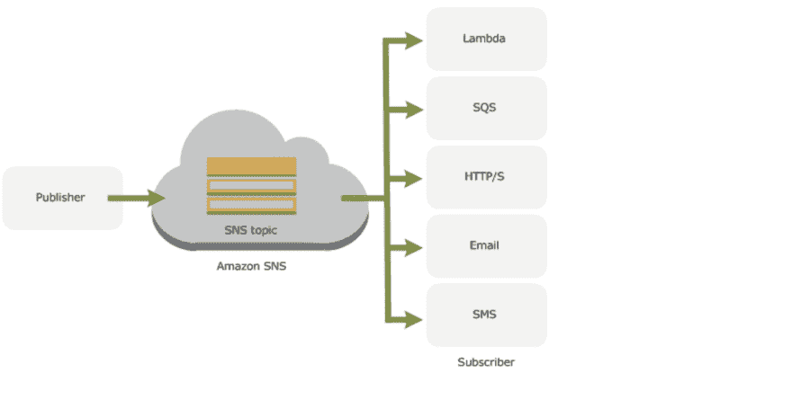
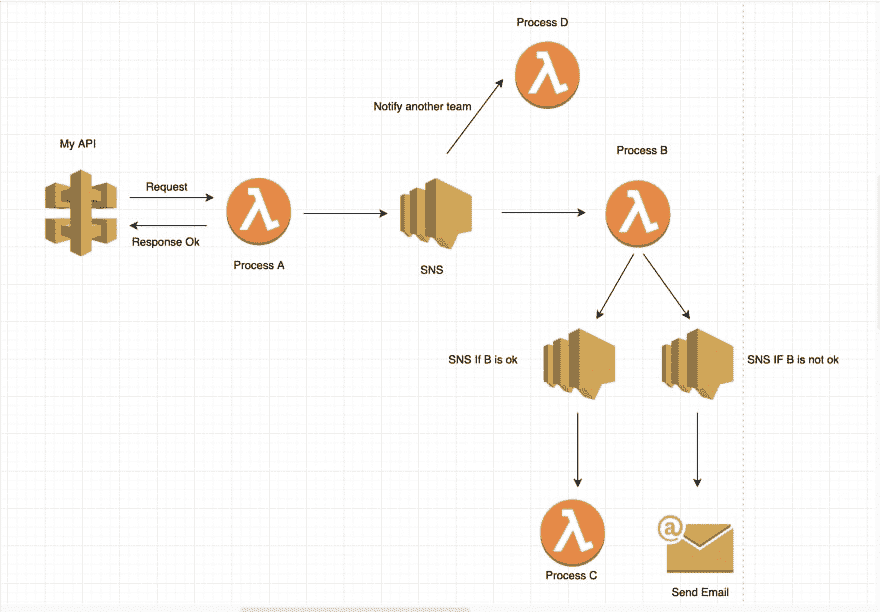
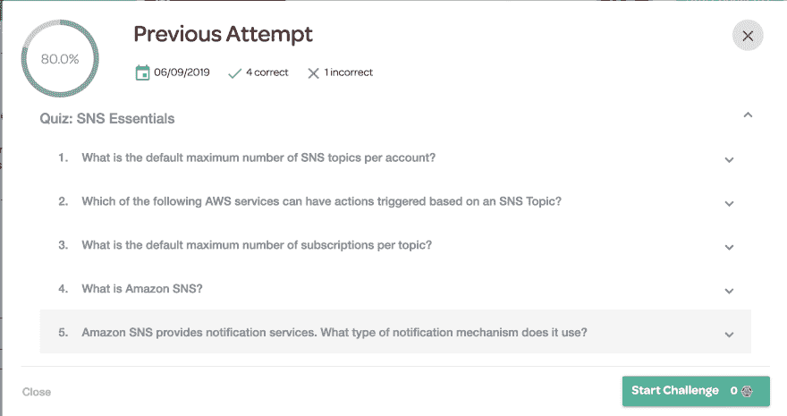

# 30 天 AWS(第 8 天和第 9 天)

> 原文：<https://dev.to/gameoverwill/30-days-of-aws-day-8-and-9-2p83>

大家好。我回来了。我很抱歉在过去的三天里，我生病了，但现在我觉得准备好分享我这些天所学到的东西。

## 第八天——简历。

我在控制台上用不同的服务练习了很多，VCP，S3，EC2 和 RDS。另外我在 AWS 的报纸上读到过。值得一提的是，这个挑战是我准备 AWS 解决方案架构师认证的一部分，我知道当你学习完成这样的事情时，你应该查看比基础课程更多的信息。

一旦我完成了第一门课程，我将参加另一门专门针对该认证的课程。感谢安德鲁·布朗，他一直在给我建议我应该学习的其他内容，并和我分享了他的平台的早期使用情况。此外，[沃尔特·塞恩](https://dev.to/walterseun)与我分享了一页来练习测试。谢谢大家。

## 第 9 天- SNS。

今天我学习了 SNS，尽管这是我每天都在使用的一项服务。因为我们有很多通知，关于，帐单，健康检查和 lambdas 之间(我稍后会解释)。

## SNS。

“Amazon 简单通知服务(Amazon SNS)是一种 web 服务，它协调和管理向订阅端点或客户端发送消息。在亚马逊社交网络中，有两种类型的客户端——发布者和订阅者——也称为生产者和消费者。发布者通过向主题生成和发送消息来与订阅者进行异步通信，主题是逻辑访问点和通信通道。订阅者(即网络服务器、电子邮件地址、亚马逊 SQS 队列、AWS Lambda 功能)在订阅主题时，通过支持的协议之一(即亚马逊 SQS、HTTP/S、电子邮件、SMS、Lambda)消费或接收消息或通知。”

默认情况下，每个帐户的最大 SNS 主题数为 100，000，每个主题的最大订阅数为 12，500，000。

## 真实世界的例子。

下图是我们如何使用社交网站的示意图，这可能不是最好的例子，但你可以知道如何使用它。

好的，我们拥有的第一个服务是 API 网关，当用户发出请求时，我们立即发送一个响应，通知请求已被处理。我们正在做的一件事是使用 lambdas 函数作为微服务，因为我们的工作流有几个不同输出的可能选项。

一旦 lambda 函数调用 *Process A* 处理消息，我们就通知 SNS。这将向两个不同的服务发送一条消息，流程 B 和 d。在这里，您可以考虑为什么需要向两个不同的 lambdas 发送消息？因为我们需要相同的信息来提出不同的建议，每个 lambda 都应该有其功能。

在 lambda *进程 B* 处理完消息后，它有两种不同的方式，如果通过，它将发送一条消息给其他 lambda，如果不通过，它将发送一封电子邮件。因此，基本上我们正在做的是使用社交网络来通知其他服务，这取决于我们有不同的输出。

此外，我参加了一个关于 SNS 和以上结果的小考试。

好了，伙计们，今天就到这里。

感谢阅读。