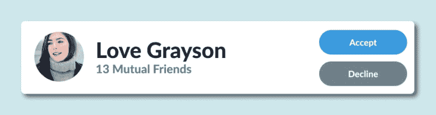
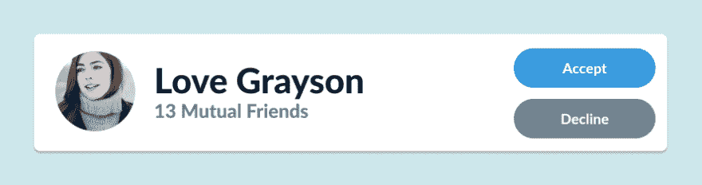
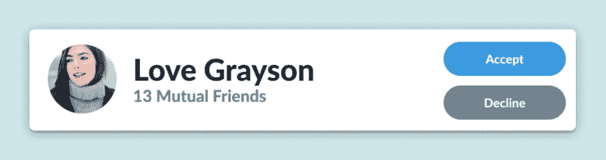
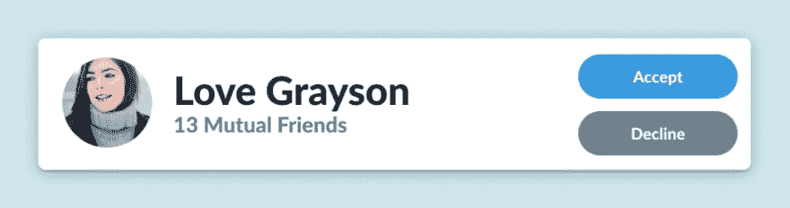
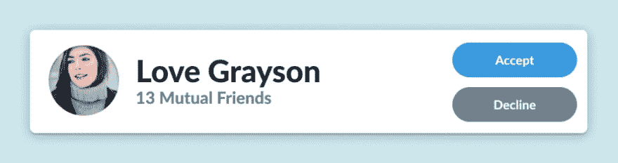

# 4 个可行的技巧，立即改善你的用户界面阴影设计(包括设计文件和代码)

> 原文：<https://dev.to/skill_pathway/4-actionable-tips-to-immediately-improve-your-ui-shadow-design-design-file-code-included-l4m>

**如果您想浏览/复制设计或查看代码笔，请查看帖子底部**

我们最近的 Instagram 民意调查& DM 关于开发者对设计的感受向我们强调了一些事情；大多数开发人员对设计感到很不舒服。

有 93%的人同意，我们认为这将是一个很好的时机来帮助大家一些初学者的设计技巧，从一些坚实的原则开始，以更好的阴影。

## 阴影在 UI 设计中的用途

阴影的存在是为了改善事物的整体感觉，并为用户的视觉体验增加深度和真实感。

因此，阴影应该

*   模拟真实世界的灯光动态，如直射光和环境光
*   不要太突出，以免分散注意力。他们应该有效地融入。

下面的设计绝对违背了那两条原则:

在这一点上，这里有 4 个可操作的提示，供你在项目中的任何 UI 阴影设计中实施，我们将向你展示它们是如何累加每一步的

## 1)用硬(不模糊)阴影模拟直射光

直射光是从一个光源直接照射到物体上的光。

例如:当太阳出来时，每个物体的另一面都会有一个清晰的阴影。这是我们正在谈论的投射硬阴影的直射光

如果我们把直射光加到我们的卡片上，它看起来会是这样的:

## 2)用柔和(模糊)的阴影模拟环境光

环境光是从我们周围的所有表面反射回来的光。

例如:当太阳隐藏在云层后面时，你不会看到任何直射的光影，但如果你在树下看，你可能会看到树下非常柔和的阴影区域。这是因为该区域有环境光，这导致了柔和的阴影。

如果我们给我们的卡片添加环境光，它看起来会像这样:

## 3)使用与下面组件相似的颜色模拟表面阴影

这是目前的一种趋势，它也给你的设计带来了另一个层次的真实感——在现实世界中，当阴影投射到物体上时，物体不仅仅会变得“更黑”,它们会变成比本来颜色更暗的阴影。

因此，在这种情况下，我们选择背景颜色，并使其颜色更深、更饱和。下面是它的样子:

这本身是一个非常微妙的变化，但这与所有其他技巧叠加在一起，形成了一个伟大的 UI 阴影。

## 4)在用户生成的图像上使用中等柔和的内部阴影

用户生成的图像，如个人资料图片或任何其他形式的上传图像，有时会有与其背景相似的颜色。

这里有一个有和没有内部阴影的个人资料图片的对比:

## 最终产品

这个看起来比我们一开始用的好多了:

## 我们对此进行了编码

如果你感兴趣的话，这是 CodePen——你可以随意窃取它，并以任何你想要的方式使用它**(如果你按下“用 code pen 编辑”看起来会好得多，因为它没有响应)** :
[https://codepen.io/skillpathway/embed/YmayaO?height=600&default-tab=result&embed-version=2](https://codepen.io/skillpathway/embed/YmayaO?height=600&default-tab=result&embed-version=2)

## 获取设计文件

您可以[点击此处直接进入 Figma -请随意复制并制作您自己的。](https://www.figma.com/file/7vK41UR44JYAWOkuDsrMQo/Immediately-Improve-Your-Shadow-Design-Post-Video?node-id=0%3A1)您不需要责怪我们，反正我们也请不起律师！

## 好奇前端开发？我们刚刚发布了一个免费速成课程(不，它真的是免费的——没有升级，没有隐藏成本)

我们花了几个月的时间制作了一个*专业设计*和 *4 小时 20 分钟*的视频内容，为您带来我们的免费速成课程，向您展示如何编写这个投资组合网站(我们不断鼓励您根据自己的风格进行定制)

如果你对此感兴趣，并且想了解更多关于 HTML、CSS、SCSS、Bootstrap 4、Git、GitHub 页面以及一些 JavaScript 和 jQuery 的知识，你可以今天就通过这里的链接免费注册。