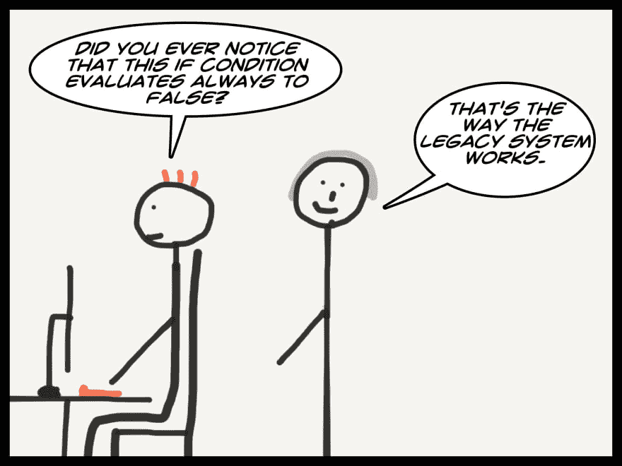

# 重构哪怕是最糟糕的遗留代码的 5 个简单胜利

> 原文：<https://dev.to/mlevkov/5-easy-wins-to-refactor-even-the-worst-legacy-code-2bp5>

你刚刚加入了一家新公司，你很兴奋地学习最新的技术，并致力于一些超级酷的新项目，然后砰，你必须首先学习和导航遗留系统。

当您浏览一个又一个助手文件时，兴奋感突然从您的身体中消失，无法理解代码库。

在这篇文章中，我将讲述 5 种非常常见的代码气味以及如何解决它们。如果你认为缺少了什么，请查看我以前的帖子， [5 个重构最丑代码的简单方法](https://dev.to/mlevkov/5-easy-wins-to-refactor-even-the-ugliest-code-14lb)。

## 1)条件句应该各占一行

一般来说，如果每条语句都有自己的一行，你的代码会更容易阅读。该规则的例外是将 else(或 else/if)与前一个 if 的结尾结合起来。然而，如果你正在写一个新的 if 语句，把它放在新的一行是很重要的。这将防止将来出现任何错误，因为两个 if 语句没有逻辑联系可能并不明显。