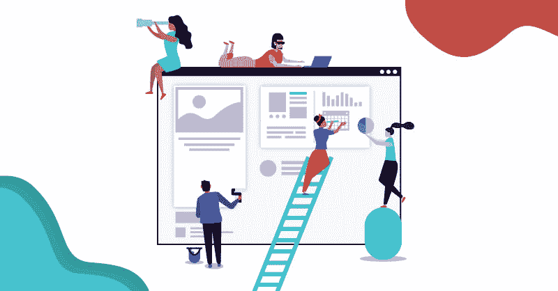

# 开发者体验设计的 5 个要点

> 原文：<https://dev.to/praxentsoftware/5-experience-design-takeaways-for-developers-1l55>

体验设计将用户和业务驱动因素置于产品策略和开发的掌舵位置。有了体验设计，真正的创新是可能的。然而，如果没有跨设计和开发的协作，不一致会严重损害最善意的体验设计过程。

作为一名开发人员，为了创新，你愿意合作到什么程度？积极主动的开发人员可以通过参与体验设计过程并从中学习来帮助推动真正的创新。

这里有 5 种方法可以让你与设计和商业利益相关者合作，生产出真正创新的数字产品。

## 1.让产品愿景来定义你的工作。

最优秀的开发人员会把他们正在开发的应用或其他数字产品的个人愿景放在一边。相反，他们与业务利益相关者和设计师合作，理解并采用产品愿景，以推动以用户和业务为中心的成果。

当愿景由技术优先级驱动时，您可以创建让其他开发人员兴奋的技术华而不实的产品——但您将无法创建改变人们生活和工作方式的创新产品。

采用大视野的开发人员可以引导他们的团队远离兔子路，并帮助他们做出导致商业成功的决策。

## 2.了解业务和用户目标。

成功的数字产品通过改善正确的用户体验来产生财务回报。与设计师和商业利益相关者合作，理解商业目标和用户目标的交集——这就是产品的目的。

要求对你正在开发的应用程序的产品市场适合性做一个简单的解释。请求访问旅程地图、用户角色和心智模型图，以了解谁将使用该产品以及为什么使用。

然后，利用您的技术专长，以最低的成本交付最高功能的代码。你会赚钱，你的客户会赚钱，你的产品会改变世界的运作方式。

## 3.就用户故事进行协作。

好的用户故事围绕产品愿景创建一致性，并使从设计到开发的过渡平稳。它们以一种对开发人员有帮助且清晰的方式准确地表示了业务和用户目标。

当孤立地写时，用户故事会导致混乱和空白。确保设计师、开发人员和商业利益相关者都提供投入。在某些情况下，你需要提供指导，告诉他们如何以一种有效的方式编写用户故事，来传达开发人员需要知道的东西。

***[> >学习如何用小黄瓜语法编写用户故事。访问免费模板和分步指南。](https://info.praxent.com/write-your-own-user-stories-with-gherkin-syntax-ebook)***

## 4.使决策参数与产品愿景保持一致。

一旦你理解了产品愿景以及你的工作将如何服务于进一步的用户和商业目标，你将需要一种方法来保持开发与项目优先级一致。

在这一阶段，创建决策参数列表会有所帮助。这些参数作为标准或规则，开发人员在决定如何继续开发一个特性时可以参考。

你应该优先考虑可读性还是速度？还是可达性高于审美？创建一个清晰的项目优先级列表将有助于确保开发决策符合产品愿景。

## 5.加入关于产品概念的讨论。

向设计师和商业利益相关者学习，并允许他们通过参加产品概念讨论向你学习。

通过参与早期的远景谈话，你不仅能了解产品的目的和背景，还能提供重要的技术投入，从而塑造产品方向。关心产品愿景的设计师和商业利益相关者将欢迎你对技术机会和限制的建议。

这一级别的协作将减少项目后期的混乱，并为更快、更有针对性的开发铺平道路。

***> >查看关于开发者、设计师和企业如何合作的[信息图](https://praxent.com/blog/human-centered-design-infographic-how-designers-developers-businesses-work-together)和[文章系列](https://praxent.com/blog/how-designers-developers-businesses-work-together-part-1)。***