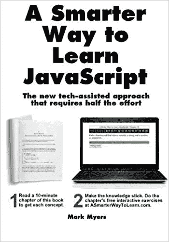
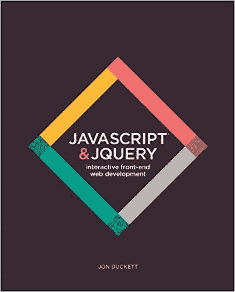
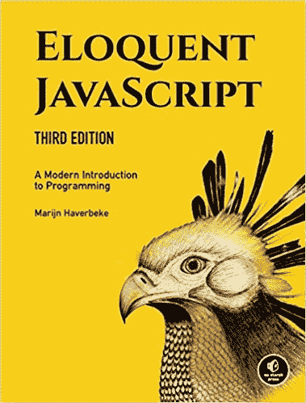
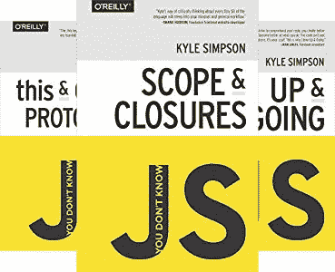
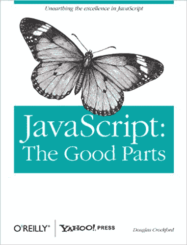
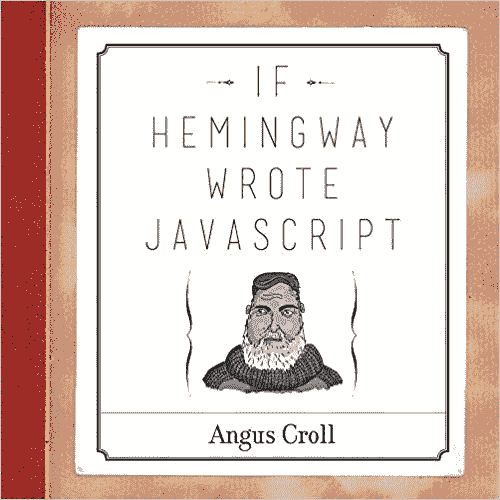

# 作为代码新手，我后悔没有读 5 本 JavaScript 书

> 原文：<https://dev.to/realtoughcandy/5-javascript-books-i-regret-not-reading-as-a-code-newbie-n7b>

## 作为一个积极上进的代码新手，我发现了一本非常棒的书，叫做《学习 JavaScript 的更聪明的方法》。

在所有 1000 本 JavaScript 书中，[更聪明的方法](https://amzn.to/2YFqYEv)完全改变了游戏规则。它不仅帮助我学习了基础知识，还教会了我如何开始自己编码和解决 JavaScript 问题。

我会把这本书和 Udemy 的课程结合起来，让这些概念真正被记住。结果是🔥。

### 虽然这本书对于任何初学 web 开发的人来说都是一本冰冷的经典，但我后来发现也有一些书非常出色。

每当我发现另一本很棒的 JavaScript 书时，总会有一种挥之不去的想法:“哇，我希望我在刚开始的时候就发现了这一点。”

这会节省我大量宝贵的时间和精力，而不是从一个资源跳到无穷无尽的资源。

### 下面是我作为代码新手后悔没有的 5 本 JavaScript 书。

5. **JavaScript 和 jQuery:交互式前端 Web 开发**

这是一本由 Jon Duckett 撰写的巨著，包含数百幅插图和代码样本。这部作品比我见过的大多数其他编程书籍都要好得多。在我开始学习 web 开发大约一年后，我发现了 [JavaScript 和 jQuery:交互式前端 Web 开发](https://amzn.to/2H2FWcD)。

面向新手，Duckett 的风格无与伦比。

他让事情变得简单而有趣，jQuery 是一个很好的附加特性。有些人可能会说 jQuery 已经死了，但是仍然有很多理由使用它！他从不过度解释事情，这是 JavaScript 很难做到的。

4.**雄辩的 JavaScript，第三版:编程的现代介绍**

这是最近购买的，从介绍的第一页我就被吸引住了。这是 Marijn Haverbeke 的第三版也是最新版的雄辩 JavaScript。它包括现代 JavaScript 体验所需的所有 ES6 好东西。

这本书最好的部分之一是每一节都有练习，甚至有项目要完成。谁说书不能互动！

Marijn 深入探讨了 JavaScript 的血淋淋的细节，从像函数和控制结构这样的基础开始。然后，他继续讨论诸如错误处理、调试之类的事情，甚至稍微深入一下 Node。还有一个在线互动沙盒，你可以在那里玩代码样本。

3.**你不知道 JS(系列)。**

你不知道 JavaScript(通常缩写为 YDKJS)是一个六本书的系列，每本书涉及不同的 JavaScript 主题。

作者 Kyle Simpson 是一位真正的 JavaScript 大师。他留着标志性的红胡子，你可能已经在 YouTube 或其他平台上看到过他在教大众这个我们称之为 JavaScript 的奇怪东西。

书籍包括:

*   你不知道 JS: Up and Going(基本上涵盖了包括 ES6 在内的核心 JavaScript 概念)
*   你不知道 JS: Scope & Closures
*   你不知道 JS:异步&性能
*   你不知道 JS: ES6 & Beyond
*   你不知道 JS: this &对象原型
*   你不知道 JS:类型和语法

关于[你不知道的 JavaScript](https://amzn.to/2GZvLFV) 系列，我喜欢的是 Kyle 对 JavaScript 如何工作的热情和细节。即使是第一本书(《飞黄腾达》)也有很多好的信息，尽管更多的是对这门语言的介绍&。

《行动起来》是我购买的系列中的第一部，它让我进入了 YDKJS 兔子洞。

许多作者和教师都小心翼翼，因此他们的写作风格让人昏昏欲睡。凯尔·辛普森和 YDKJS 系列就不是这样了。

2.JavaScript:好的部分。

作家道格拉斯·克洛克福特因其对 JavaScript 的早期贡献而闻名，他为一个严肃的话题带来了一个有趣的标题。事实上，JavaScript 是仓促编写的，作为一种编程语言，它包含了许多不良的品质。

幸运的是，正如克罗克福德指出的，有好的部分！他去掉了不好的特性，展示了比整个 JavaScript 更可靠、更可读、更易维护的 JS 子集。

他谈到了这样的事情:

*   目标
*   功能
*   遗产
*   数组
*   正则表达式

…以及更多。

JavaScript:精彩部分是一本更老的书(2008 年)，但是信息仍然有效。

我喜欢 JavaScript 的地方在于:它是由一位 JavaScript 教父编写的，他不害怕承认这种语言有一些严重的缺陷，但提出了克服这些缺陷的实用方法。

因此，你可以专注于好的部分，并最大限度地发挥它们，成为更好的程序员。

1.**如果海明威写了 JavaScript**

这可能是我见过的关于 JavaScript 的最古怪的书。如果海明威写了 JavaScript，那么作者 Angus Croll 会想象著名作者写的简短的 JavaScript 程序。其结果是一个有趣的和教育结合的诗歌，散文和编程。

例如，如果让简·奥斯汀用 JavaScript 写一个阶乘程序，或者让莎士比亚生成斐波那契数列，那会怎么样？他们的程序甚至可以在 GitHub 上找到。

如果你曾梦想看到刘易斯·卡罗尔的涉及质数的理论程序，如果海明威写的 Javascript 适合你。我喜欢这本书的地方在于它独特而有趣。插图也很酷，我忘了我实际上是在读一本科技书籍。

## 无论你是代码新手还是经验丰富的 web 开发人员，这些书都值得任何技术图书馆参考。

在这五本书中，我建议从 Jon Duckett 的书(JavaScript 和 jQuery:交互式前端 Web 开发)开始，因为整本书都是面向新手的。

但是，作为一个新手，你可以很快轻松地阅读这些书的其余部分，它们将继续提供价值。

还有哪些 JavaScript 书籍值得一查？请在评论中告诉我！

附言[在 YouTube](https://www.youtube.com/realtoughcandy) 上看看我，在那里我谈论所有关于 web 开发的事情！【T2

*本帖包含附属链接；如果您从本文提供的不同链接购买产品或服务，我可能会收到报酬。*