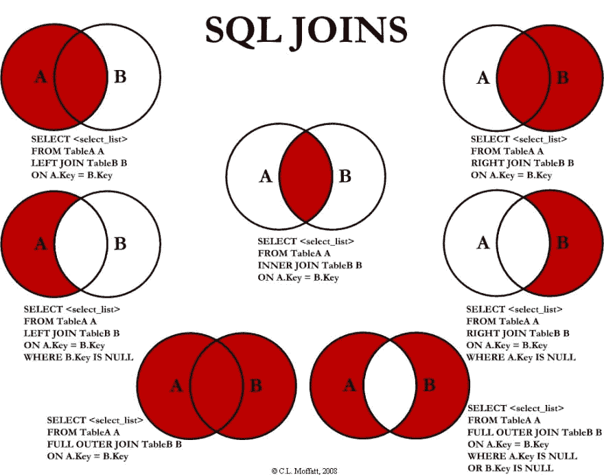
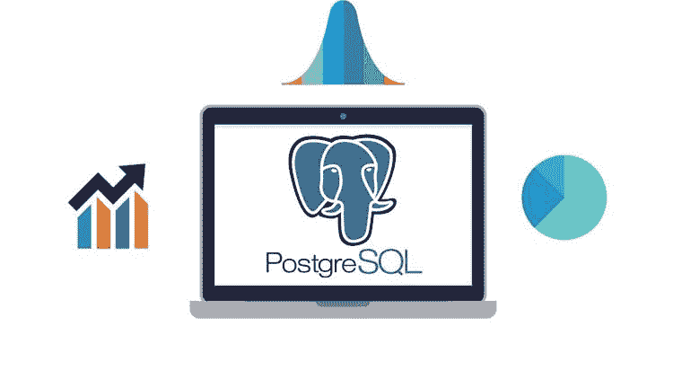
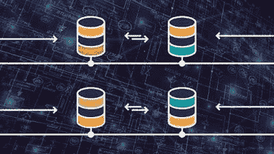
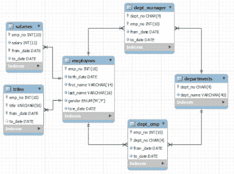

# 为初学者学习 SQL 和数据库的 5 大在线课程-最好的

> 原文：<https://dev.to/javinpaul/5-online-courses-to-learn-sql-and-database-for-beginners-best-of-lot-5533>

*披露:这篇文章包括附属链接；如果您从本文提供的不同链接购买产品或服务，我可能会收到报酬。*

 
大家好，如果你是计算机科学毕业生或编程新手，并且对学习数据库和 SQL 感兴趣，并且正在寻找一些很棒的资源，如书籍、课程和教程，那么你来对地方了。

过去，我已经分享了一些最好的 SQL 书籍和教程，今天，我将分享一些最好的 SQL 和数据库课程，这样你就可以掌握这项有用的技术。

如果你不知道什么是 SQL，也不知道为什么要学习 SQL，那么为了大家的利益，我来给大家简单的概述一下 SQL。SQL 是一种处理数据库的编程语言。

您可以使用 SQL 创建数据库对象，如表、存储过程等，还可以从数据库中存储和检索数据。

SQL 对于任何程序员来说都是最重要的技能之一，与技术、框架和领域无关。它甚至比像 [Java](http://www.java67.com/2014/09/top-10-java-8-tutorials-best-of-lot.html) 和 [Python](https://javarevisited.blogspot.sg/2018/05/10-reasons-to-learn-python-programming.html) 这样的主流编程语言更受欢迎，它绝对会给你的简历增加很多价值。

SQL 允许您处理数据，这是当今世界最重要的资产。通过学习 SQL，你可以得到你的问题的答案。举个例子，如果你是一个热门在线课程平台 [Udemy](http://javarevisited.blogspot.sg/2018/01/top-10-udemy-courses-for-java-and-web-developers.html) 的课程创建者，想知道哪个课程最畅销，哪个课程根本卖不出去，你可以使用 SQL。

它有助于故障排除和报告。此外， [SQL](http://www.java67.com/2016/09/sql-5-best-books-to-learn-and-master.html) 是一项非常稳定的技术，已经存在多年，将来也会需要它。这意味着你在学习 SQL 上的任何投资也将在你的职业生涯中为你服务很长时间。

### 初学者学习 SQL 和数据库的 5 个最佳在线培训课程

过去，我也分享过一些我的读者喜欢的免费 SQL 课程，但反馈是他们想要更全面和深入的材料，这就是为什么我为初学者和有经验的程序员提供了这个 T2 最佳 SQL 和数据库课程的列表。

在这个列表中，我收录了一些最好的 SQL 和数据库课程，它们来自于在线课程的两个领先的地方:Udemy 和 T2。

这些课程将从头开始教你 SQL。他们中的大多数甚至不需要先决条件，只要你知道如何操作电脑和从互联网上下载东西，这是你知道的，这就是为什么你正在阅读这篇文章。

[**1。完整的 SQL 训练营**](https://click.linksynergy.com/fs-bin/click?id=JVFxdTr9V80&subid=0&offerid=323058.1&type=10&tmpid=14538&RD_PARM1=https%3A%2F%2Fwww.udemy.com%2Fthe-complete-sql-bootcamp%2F)
这是一门优秀的 SQL 初学者课程。该课程从零开始，不需要任何编程技能或经验。

顾名思义，该课程受训练营的启发，侧重于强化学习。这也是一门综合课程，通过使用幻灯片和现场编码来解释每一个概念。

作者使用 PostgreSQL 进行演示，它是免费和开源的。它还带有一个名为 **PgAdmin** 的 GUI 工具，这使得使用 [PostgreSQL 数据库](https://medium.com/javarevisited/7-best-free-postgresql-courses-for-beginners-to-learn-in-2021-3bf369d73794)变得很容易。

尽管作者使用 PostgreSQL，但你在本书中学到的所有概念都适用于其他主要数据库，如 [Oracle](http://www.java67.com/2018/02/5-free-oracle-and-microsoft-sql-server-online-courses.html) 、[微软 SQL Server](http://www.java67.com/2018/01/top-4-free-microsoft-sql-server-books.html) 和 [MySQL](https://javarevisited.blogspot.sg/2018/05/top-5-mysql-courses-to-learn-online.html) 。

这门课程的另一个好处是有一位非常热情、教学方法详细的讲师。总的来说，这是一个从头开始学习 SQL 的很好的课程，尤其是对初学者来说。您还将获得一份结业证书，可以在您的 LinkedIn 个人资料中展示。

[**2。新手 SQL:初学者数据分析**](https://click.linksynergy.com/fs-bin/click?id=JVFxdTr9V80&subid=0&offerid=323058.1&type=10&tmpid=14538&RD_PARM1=https%3A%2F%2Fwww.udemy.com%2Fsql-for-newbs%2F)
这是又一个让初学者学习 SQL 的牛逼又好玩的课程。我真的很喜欢看这门课，不仅仅是因为内容，还因为来自两位导师大卫和皮特的正能量。

看他们讨论和解释 SQL 概念真的很有趣。我知道 SQL 很有趣，但是他们让它更有趣。这就像过去的大学时光，一些朋友总是跳来跳去，做一些事情，这让你发笑，但至少它有助于消除课堂上的无聊。

至于内容，顾名思义，这是一个初学者课程，但你将学习所有的基本概念，如创建数据库、表、存储过程、使用 [SELECT](http://javarevisited.blogspot.sg/2011/10/selct-command-sql-query-example.html) 、INSERT、UPDATE 和 [DELETE](http://javarevisited.blogspot.sg/2016/03/how-to-delete-from-table-using-join-in-SQL-Server.html) 语句。

他们在这门课中使用 MySQL 数据库，这是最流行的开源数据库，你可以免费下载。他们还有一个下载和安装 MySQL 数据库的部分。

在学习了基础知识之后，您将学习一些重要的信息，如通过操作符和聚合函数对[分组、连接表、连接多个条件，以及处理其他 SQL 操作符和函数。](http://javarevisited.blogspot.sg/2013/08/difference-between-where-vs-having-clause-SQL-databse-group-by-comparision.html)

当然，最好的部分是它有测试你的 SQL 知识的脑力劳动，这是构建数据的关键，因为你需要使用关系数据库和 SQL。

[**3。SQL &数据库设计 A-Z:学习 MS SQL Server+PostgreSQL**](https://click.linksynergy.com/fs-bin/click?id=JVFxdTr9V80&subid=0&offerid=323058.1&type=10&tmpid=14538&RD_PARM1=https%3A%2F%2Fwww.udemy.com%2Fsqldatabases%2F)\
这是深入学习 SQL 的又一大课程。它几乎涵盖了应用程序开发人员应该了解的关于 SQL 的所有主题。

在本课程中，您将学习创建基本的 SQL 查询和不同类型的连接，如[左右连接](http://javarevisited.blogspot.sg/2013/05/difference-between-left-and-right-outer-join-sql-mysql.html)，内部连接、外部连接、交叉连接、[自连接](http://www.java67.com/2013/01/difference-between-self-and-equi-join-sql-example-inner-mysql.html)等。

本课程还解释了一些高级概念，如[索引](http://www.java67.com/2017/12/difference-between-table-scan-index.html)，使用[多个表编写 SQL 查询，以及将](https://javarevisited.blogspot.sg/2012/11/how-to-join-three-tables-in-sql-query-mysql-sqlserver.html)个表连接在一起生成有意义的报告。

您还将探索数据库设计概念，如规范化。这门课有一整节解释了规格化和各种范式——比如 **1NF，2NF，3NF，BCNF** 等等。

该课程同时使用了[微软 SQL Server](https://medium.com/javarevisited/5-best-courses-to-learn-microsoft-sql-server-in-depth-e9f11b73c14a) 和 [PostgreSQL](https://javarevisited.blogspot.com/2020/02/top-5-courses-to-learn-postgresql-in.html) ，并且该课程最好的部分是它的重点是通过真实世界的数据科学练习来增强您的数据分析技能。

如果你对[数据科学](http://javarevisited.blogspot.sg/2018/03/top-5-data-science-and-machine-learning-online-courses-to-learn-online.html)感兴趣，并想成为一名数据科学家，那么良好的 SQL 知识将大有帮助，本课程是一个很好的起点。

[**4。Oracle SQL:从零开始成为认证 SQL 开发人员！**](https://click.linksynergy.com/fs-bin/click?id=JVFxdTr9V80&subid=0&offerid=323058.1&type=10&tmpid=14538&RD_PARM1=https%3A%2F%2Fwww.udemy.com%2Foracle-sql-12c-become-an-sql-developer-with-subtitle%2F)
毫无疑问，Oracle 是最受欢迎的关系型数据库，对具有良好 Oracle 数据库技能和经验的人有着巨大的需求——像了解 Oracle [PL/SQL](http://javarevisited.blogspot.sg/2017/09/top-4-books-to-learn-oracle-plsql-best-must-read.html) 的应用开发人员，以及了解 Oracle 数据库来龙去脉的数据库管理员。

无论您是想从应用程序开发的角度还是从数据库管理员的角度学习 Oracle。从这个角度来看，这门课是一个很好的起点。

在本课程中，您不仅将学习创建数据库、表和存储过程，还将学习如何编写 SQL 查询。

您将学习 Oracle 数据库中的基本 SQL 概念，如 [SELECT](http://www.java67.com/2018/02/why-you-should-not-use-select-in-sql.html) 、INSERT、UPDATE、 [DELETE](https://javarevisited.blogspot.sg/2016/03/how-to-delete-from-table-using-join-in-SQL-Server.html) 和 [ALTER](http://www.java67.com/2013/01/how-to-use-alter-command-in-sql-examples.html) 语句 joins a group by、where 子句和其他函数。

这是一门包含 100 多堂课的综合课程，分为 16 个部分，将教授您使用 Oracle 数据库的所有重要 SQL 概念。

老师很好，并且使用免费工具，比如 Oracle SQL Developer，你可以从网上下载。总的来说，如果你想了解 Oracle 数据库，这是一门很好的 SQL 课程。

[**5。200+ SQL 面试题**](https://click.linksynergy.com/fs-bin/click?id=JVFxdTr9V80&subid=0&offerid=323058.1&type=10&tmpid=14538&RD_PARM1=https%3A%2F%2Fwww.udemy.com%2Fsql-interview-questions%2F)
这是一门从面试角度学习 SQL 的绝佳课程。如果你正在为你的第一次工作面试或下一份工作做准备，你会在面试中遇到很多 SQL 问题。

这是一项重要的技能，这也是为什么许多面试都关注 SQL 和数据结构和算法的原因。

通过学习这门课程，你不仅可以为下一次面试做好准备，还可以学到很多重要的 SQL 概念。例如，如果您只是观看了一章的预览，该章讨论了如何调优 SQL 查询或者如何查找和解释执行计划，那么您会学到很多东西。

我特别喜欢从[面试问题](http://www.java67.com/2013/04/10-frequently-asked-sql-query-interview-questions-answers-database.html)中学习，因为它们鼓励我，激发我的好奇心。如果你和我一样，你会发现这个课程非常有帮助。我去年花了 10.99 美元在**买了这个课程，直到今天我还在享受它。**

它也是乔·盖柯的 SQL 谜题书《T1》的完美伴侣，这本书很值得一读。这是一本有趣的 SQL 查询和解谜书，如果你还没有读过的话，这是一本必读的书。

这些是学习 SQL 和数据库基础知识的最佳在线课程。对于初学者和不懂 SQL 的有经验程序员来说，这些都是优秀的 SQL 课程。

由于 SQL 技能总是很受欢迎，事实上，与其他编程技能一样，SQL 技能也是强制性的，所以掌握 SQL 知识不仅有助于你找到一份更好的工作，也有助于你当前的日常工作。

其他**有用的编程资源**你可能喜欢探索的有:
[2021 年学习 Python 的前 5 门课程](https://dev.to/javinpaul/7-python-online-courses-for-beginners-and-intermediate-programmers-1h4k)
[2021 年学习微服务开发的 5 门课程](https://javarevisited.blogspot.sg/2018/02/top-5-spring-microservices-courses-with-spring-boot-and-spring-cloud.html)
[2021 年学习 Java 9 的 5 门课程](http://www.java67.com/2018/02/5-online-courses-to-learn-java-9-better.html)
[2021 年学习区块链的前 5 门免费课程](http://www.java67.com/2018/02/5-free-blockchain-technology-courses.html)
[面向 Web 开发人员的前 5 门免费 React 和 ReactJS 课程](http://www.java67.com/2018/02/5-free-react-courses-for-web-developers.html)
  [2021 年学习机器学习和数据科学的 10 门课程](https://dev.to/javinpaul/10-data-science-and-machine-learning-courses-for-programmers-looking-to-switch-career-57kd)
[学习大数据、Hadoop 和 Spark 的 5 门免费课程](http://www.java67.com/2018/05/top-5-free-big-data-courses-to-learn-Hadoop-Apache-Spark.html)

感谢您阅读本文。如果你喜欢这些 SQL 课程，那么请分享给你的朋友和同事。如果您有任何问题或反馈，请留言。

### P.S -如果你正在寻找一些免费课程开始学习数据库和 SQL 基础知识，那么你也可以看看我的[免费数据库和 SQL 课程列表](http://www.java67.com/2018/02/5-free-database-and-sql-query-courses-programmers.html)。