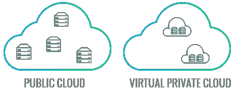

# 创业公司需要做的 5 个简单的安全措施

> 原文：<https://dev.to/veebuv/5-simple-security-practices-for-startups-you-need-to-do-5bn4>

我知道你在经营一家公司，并以每小时 500 英里的速度前进，相信我，我靠快速建造东西为生，所以我明白。然而，你不需要达到第 n 级安全级别，但至少在构建你的产品时做一些基本的事情，这样你就不会因为错误的原因出现在新闻中。

这里有一篇超级短的文章，讲述了你可以做的一些基本事情，以确保你的产品在某种程度上是“安全的”。当然，你真的可以用荒谬的安全实践、笔测试、基于 ML 的异常检测软件、内部 LAN 网络和防火墙以及双因素认证来放大这一点——这样的例子不胜枚举。

本文将使用 node 和 AWS 作为例子——我很有信心同样的原则也适用于您的堆栈。

## 1。哈希密码

是的，我知道，这在训练营和大学一年级的时候就已经教过了，但是很遗憾我不得不提起它。使用 bcrypt 和 salt 轮散列您的密码。Salting 是一个随机生成的字符串，代表成本因素，salting 的目标是防止您的系统受到彩虹表的攻击，以暴力破解密码。

一些 bcrypt 最佳实践:

1.  进行 UX 研究，找出用户注册和认证的可接受等待时间。
2.  如果接受的等待时间是 1 秒，那么调整 bcrypt 的开销，使它在您的硬件上运行 1 秒钟。
3.  与您的安全团队一起分析计算时间是否足以减轻和减缓攻击。

## 2。通过管道加载所有 ENV 变量

使用 AWS 参数存储、Elasticbeanstalk 设置和您的管道系统，在您的管道中使用变量标识符，如`DB_URL=$DB_URL`将敏感值注入到您的后端环境中。

确保变量对于您的生产和暂存环境是不同的。

确保这些变量由受限的 IAM 帐户访问。

## 3。VPC 网络公司

它的设置非常简单，但最简单的虚拟私有云可以被认为是一所房子，房子里的所有人都可以自由地相互通信，只有经过认证的人才可以开门。这所房子位于一个可以自由出入的社区。

把社区想象成公共云，把房子想象成公共云中的私有云。

维基的官方定义是:虚拟私有云(VPC)是在公共云环境中分配的按需可配置的共享计算资源池，在使用资源的不同组织(以下称为用户)之间提供一定程度的隔离。

您可以设置数据库，以便只有 VPC 内的系统才能访问您的数据库。

如果您想要外部访问您的数据库，请确保在您的入站规则中，您将所有 IP 列入白名单。

图片信誉至 znetlive。

## 4。CORs 访问

在节点环境中设置一个超级简单的事情，只允许来自白名单域的请求访问。

这将防止任何人仅仅使用您的 auth 令牌就可以在没有 UI 限制的情况下访问 DB(可以这么说)

## 5。CRTFs

每当你像谷歌、FB 或 LinkedIn 一样进行社交认证时(强制)

当你拨打重定向电话时，设置一个秘密的(难以猜测的)密钥是值得的。在调用返回时，确保秘密匹配，这确保没有对请求进行任何篡改，并且请求是纯的。

这里有一个什么是[https://en.wikipedia.org/wiki/Cross-site_request_forgery](https://dev.toCRTF)的快速链接。

## 6。额外提及

不要将生产数据复制到较弱的环境中来测试您的产品。确保生产不受影响，开发环境涵盖您正在解决的边缘案例。

亚历克斯·乔伊斯

* * *

这就是你要做的，一些超级简单和基本的事情设置起来不会超过几分钟。

使用这个最低基数，你可以把它放大到第 n 级——我会更新这个，因为我能想到更简单的。

当然，如果你有更多想分享的，请写在评论里，因为这对我和其他人都有帮助！