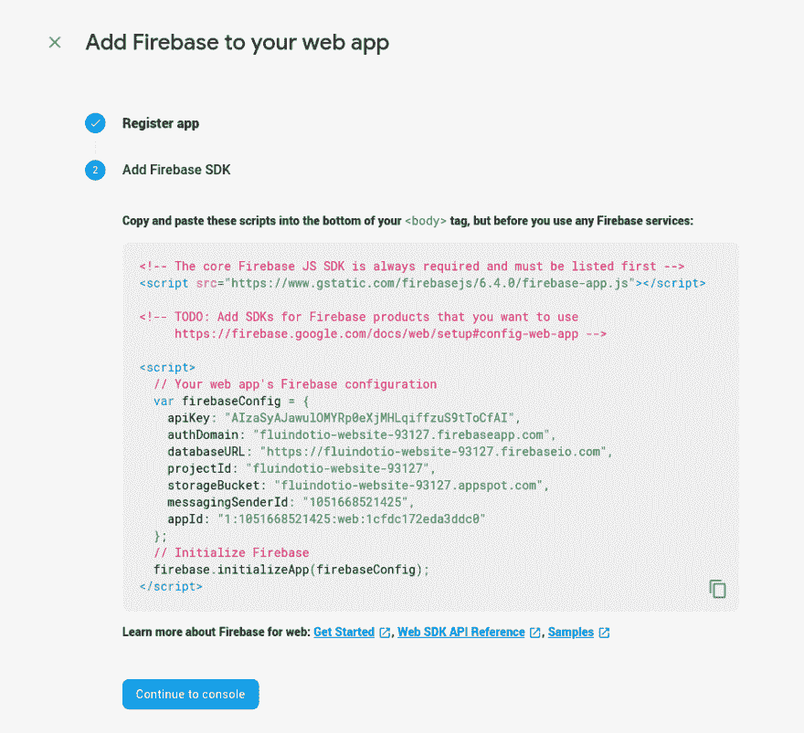

# ng new 后要做的 5 件事

> 原文：<https://dev.to/stephenfluin/5-things-to-do-after-ng-new-1nd7>

Angular CLI 是启动新的 Angular 应用程序的推荐方法，因为它为您提供了开箱即用的出色应用程序。但是让我们假设你已经跑了`ng new`。你下一步应该做什么？您如何确保构建一个出色的可扩展应用程序？

出于本文的目的，我将假设您已经在提示时选择了使用 [SCSS](https://sass-lang.com/) 和[路由器](https://angular.io/guide/router)，因为这两个都是**非常好的想法。**

## 1。设置与 CircleCI 的简单持续集成

我称之为天真的配置，因为它不是真正的“持续集成”,除非你有一个更健壮的系统，但它是我所从事的应用程序的一个很好的起点。我过去常常使用特拉维斯奇，但现在看来，世界正朝着圆形发展。

创建一个名为`.circleci/config.yml`的文件

如果你知道如何配置 CircleCI，太好了！去做吧。如果没有呢？这里只使用我最基本的配置:

```
version: 2
jobs:
  build:
    working_directory: ~/my-project
    docker:
      - image: circleci/node:12-browsers
    steps:
      - checkout
      - restore_cache:
          name: Restore Yarn Package Cache
          keys:
            - yarn-packages-{{ checksum "yarn.lock" }}
      - run:
          name: Install Dependencies
          command: yarn install --frozen-lockfile
      - save_cache:
          name: Save Yarn Package Cache
          key: yarn-packages-{{ checksum "yarn.lock" }}
          paths:
            - ~/.cache/yarn
      - run: xvfb-run -a npm run lint
      - run: xvfb-run -a npm run build --prod --progress=false 
```

这个配置将自动 lint 您的项目，并运行生产构建。它假设你想要节点 12，并使用[纱](https://yarnpkg.com/)。

为什么不做测试？你可能也应该运行你的测试！我在这里没有包括它们，因为我发现至少在一个新项目的第一天，维护测试通常会分散人们对如何构建应用程序的注意力，但是每个应用程序应该总是通过 lint 检查，并且是可构建的。

## 2。添加设计系统

让你的应用程序看起来更好的最简单的方法是添加一个像 [Material Design](https://material.io/) 这样的设计系统。Angular 团队在 [Angular Material](https://material.angular.io) 库中提供了一套体现材质设计的组件。您可以通过 CLI 将其添加到您的应用程序中，然后为您的应用程序创建一个导航组件。

```
ng add @angular/material
ng generate @angular/material:nav app-nav 
```

这将创建一个`app-nav`组件，它包含许多你需要的功能，让你的应用程序朝着正确的方向发展，从一个反应灵敏的侧导航到一个顶部工具栏。

## 3。添加离线支持和 PWA 超能力

离线支持是 web 应用程序中一个非常理想的特性，它可以让你的应用程序比传统的 web 应用程序更强大。Angular 的渐进式 Web 应用程序(PWA)支持使这变得更加容易。

```
ng add @angular/pwa 
```

运行此命令将创建一个 web 应用程序清单(`manifest.webmanifest`)，您应该将它与您的`favicon.ico`和图标文件一起定制。它还创建了一个`ngsw-config.json`,用于配置您的应用程序在脱机状态下的行为。哪些文件应该缓存，什么时候缓存(`lazy` vs `prefetch`)？对于`strategy`，你更喜欢最新的内容(`freshness`)还是最快的内容(`performance`)。

阅读服务人员配置的各种[选项。](https://angular.io/guide/service-worker-config)

## 4。添加 Firebase 身份验证

我构建的几乎每个应用程序都需要了解我的用户，并随着时间的推移为他们提供定制和数据。通常，这导致我们构建定制的认证系统，或者手动集成谷歌、脸书等。Firebase 给了我们一个更好的方法。与 Firebase 的 auth 系统的单一集成意味着我们可以访问我们需要的所有社交登录，我们永远不必管理密码，并消除了对用户安全的担忧。

`ng add @angular/fire`

您需要在控制台上创建一个 Firebase 项目，并添加一个 Web 应用程序。它将为您提供一个配置如下所示的屏幕:

[](https://res.cloudinary.com/practicaldev/image/fetch/s--iyjkp1jq--/c_limit%2Cf_auto%2Cfl_progressive%2Cq_auto%2Cw_880/https://firebasestorage.googleapis.com/v0/b/fluindotio-website-93127.appspot.com/o/posts%252F5-things-to-do-after-ng-new%252FScreenshot_20190818_064841.png%3Falt%3Dmedia%26token%3D6519c072-a0d4-41b4-8e63-d13708766b4a)

忽略指令，复制 JSON 配置对象。您将把它放在您的应用程序模块中，如下所示:

```
imports: [
...
AngularFireModule.forRoot({.. THE COPIED OBJECT...}),
...
] 
```

在那里，我通常会创建某种类型的`auth.service.ts`来包装 Firebase 身份验证方法，并提供我在整个应用程序中使用的有用观察信息，如“用户当前是否登录？”

```
 this.isUser = auth.authState.pipe(map(authState => (authState ? authState.uid : null))); 
```

## 5。添加一个服务器&后端

这个比较新，但是很酷。当你变得足够大时，你可能会开始使用更传统的数据库工具，如 Mongo/MySQL/PostgreSQL，当你想完全控制你的后端时，可以通过一个名为 NestJS 的酷框架在同一个 Angular 项目中实现。

`ng add @nestjs/ng-universal`

这一条命令将使用一个`server`文件夹更新您的 Angular 应用程序，您可以在其中`nest generate`新的 API 或后端工具，并且还添加了内置的服务器端渲染，这可以提高您的应用程序的速度感。