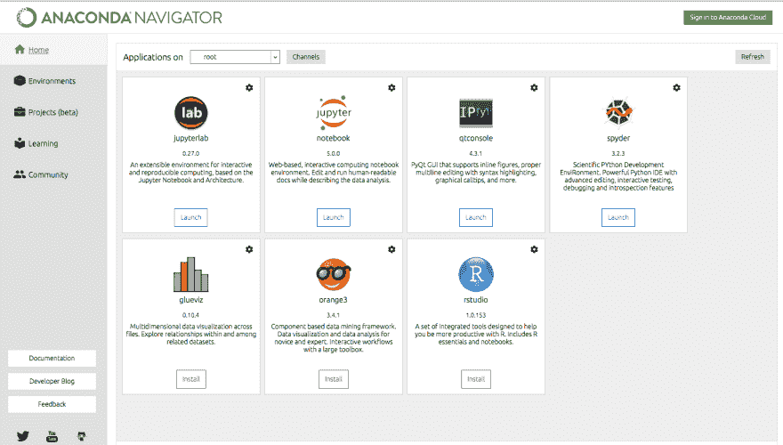
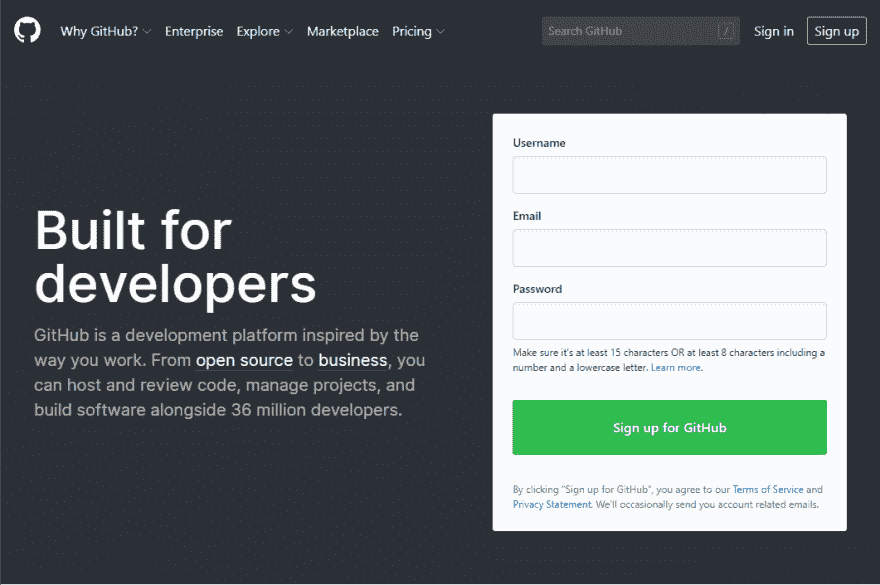
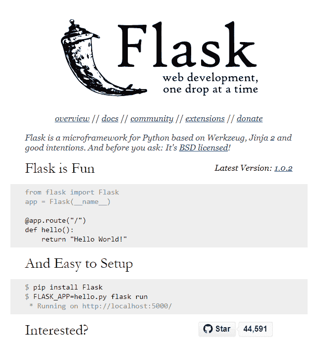

# 数据科学家的 5 个工具:编程入门

> 原文：<https://dev.to/tsantosh7/5-tools-for-data-scientist-getting-started-with-programming-1pjj>

数据科学是数据分析、算法开发和解决复杂数据驱动问题的技术的多学科融合。数据科学家是一类新的分析数据专家，他们拥有解决这些复杂数据问题的技术技能，无疑是 21 世纪最性感的工作。数据科学家的典型任务包括数据收集、数据预处理和数据分析。

以前，没有太多的工具来帮助数据科学家，他们主要依靠编写自定义代码。然而，在过去的五年中，情况发生了很大的变化，这些任务/例程中的大部分已经使用各种工具实现了自动化，而且已经有几十种了。然而，数据科学家通常会寻求新的工具来帮助他们解决复杂的数据问题并找到答案。正是因为这个原因，许多数据科学家认为编程知识是数据科学不可或缺的一部分。并不是所有的数据科学家都会编码，但是，了解可以帮助和组织编程的工具是很有帮助的。

这里尝试列出数据科学家必备的 5 大工具，排名不分先后。这个列表更侧重于那些想亲自动手编写代码的数据科学家。

下面的工具将指导你从设置、实际编码、版本控制、组织代码到最终将你的预测模型展示给现实世界。

* * *

## [蟒蛇](https://www.anaconda.com/distribution/) /蟒蛇导航器(Windows)

Anaconda 是用于科学计算(数据科学、机器学习应用、大规模数据处理、预测分析等)的 Python 和 R 编程语言的免费开源发行版。)，旨在简化包管理和部署。

以前，学术界非常倾向于使用 Matlab。然而，由于 Python 最近取得的进步，并且由于开源社区，浪潮现在已经转向 Python 生态系统。Anaconda Navigator 是 Anaconda 发行版中包含的一个桌面图形用户界面(GUI ),它允许用户在不使用命令行的情况下启动应用程序和管理 conda 包、环境和通道，毫无疑问，它是立即开始 Python 编程的必备编程工具。

Anaconda-Navigator 的安装附带了许多软件包，例如:

*   Jupyter 笔记型电脑
*   Spyder
*   Glueviz
*   柑橘
*   Rstudio
*   Visual Studio -代码

现在，您已经设置好了开始编写代码所需的一切。下一个工具将帮助你编码并实时看到结果。

**定价:免费**

* * *

## [Jupyter 笔记本](https://jupyter.org/)

如果你刚刚开始学习 Python，Jupyter 笔记本是最好的学习方式。它们提供了“交互性”(即你所做的代码)作为一个 web 应用程序，你可以在其中创建和共享包含实时代码、公式、可视化以及文本的文档。Jupyter 笔记本是帮助您获得所需数据科学技能的理想工具之一。

软件/代码开发永远不会完成。这是一个持续的过程，并随着数据不断发展。下一个工具将帮助您对支持协作的项目进行版本控制和管理。

**定价:免费**

* * *

## [t1](#git)[去](https://github.com/)

Git 是使用最广泛的版本控制系统。Github 是世界领先的软件开发平台，使用 Git 进行版本控制。版本控制系统记录一段时间内对一个文件或一组文件的更改，以便您可以在以后调用特定的版本。Git 是一个必不可少的工具，因为它可以帮助你和其他人一起工作，而且你可以在很多工作场所找到它。

使用 Git，不会丢失任何东西，因为您可以随时返回查看他们程序的以前版本。它可以处理冲突，同时同步不同人在不同机器上完成的工作，因此它可以随着您的团队进行扩展。了解 Git 有助于软件包的开源开发。

Git 及其 subversion 控制系统对于保持整个项目的记录至关重要；它不是为管理纯粹的代码片段而设计的。通常，将敏感信息提交给 GIT 存储库并不是一个好的做法。

为此，可以使用代码片段管理器。一个这样独特的片段组织者是 DECS(分散加密代码片段)。

**定价:免费/付费企业版**

* * *

## [DECS](https://app.decs.xyz/)

DECS 提供了一个一体化的工作空间，用于安全地存储并严格控制对代码片段、敏感信息(如专有代码片段、令牌、配置、证书等)的访问。

数据分析管道通常是相同的，而不是记住特定管道的完整例程并在几个实验/应用中重写相同的代码，记住管道/算法总是更容易。

因此使用 DECS，人们可以存储完全加密的代码片段或例程，并通过复制粘贴或下载在几个应用程序中使用它们。这些特性有助于组织大量有价值的信息，而不会忘记。DECS 的移动代码捕获功能使您只需点击一下鼠标，就可以从网络上的任何地方复制代码。由于存储在 DECS 上的数据是端到端加密的，您可以存储包括 API 密钥在内的敏感数据，并且总是只需搜索即可，节省了大量时间。它也是分散的和自由的。

接下来是帮助您将工作作为 API 公开给其他外部工具/用户并帮助您扩大规模的工具。

**定价:免费**

* * *

## [烧瓶](http://flask.pocoo.org/)

Flask 是一个将机器学习模型公开为 web 调用的便捷工具，对于构建微服务非常有用。正如 Flask 网站上所说，Flask 很有趣，也很容易设置。确实如此，因为这个 Python 的微框架提供了一种用 REST 端点注释 Python 函数的强大方法。因此，基本上使用 Flask，机器学习模型可以作为 API 发布，供用户/客户/客户或任何其他第三方业务应用程序访问。这样，人们甚至可以将他们的机器学习模型商业化为网络服务。

**定价:免费**

* * *

这些工具可以帮助您开始、启动和运行。你觉得这份名单怎么样？如果你有其他对数据科学家非常有用的工具，请告诉我。