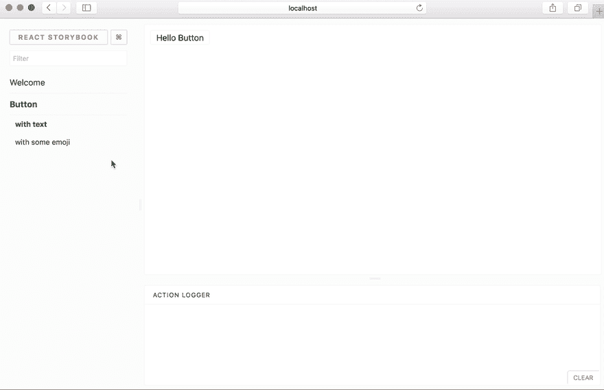
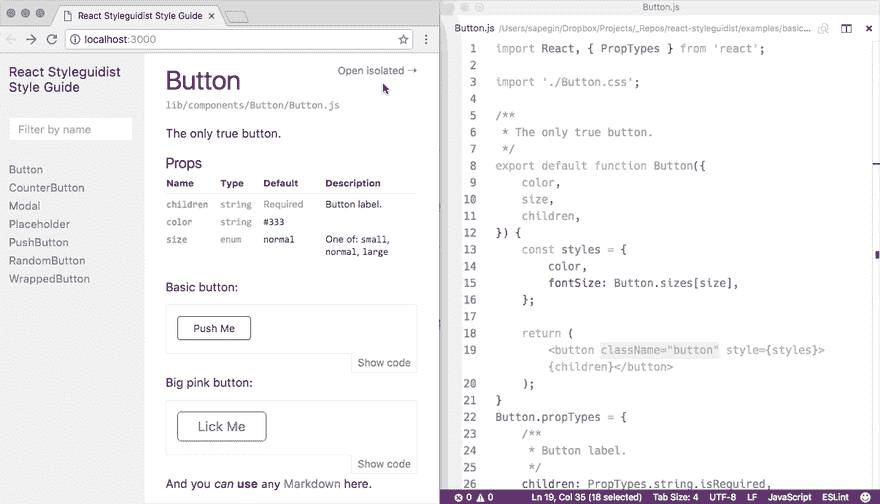
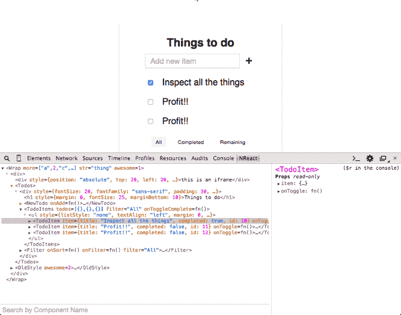
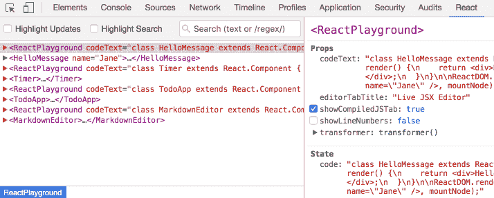
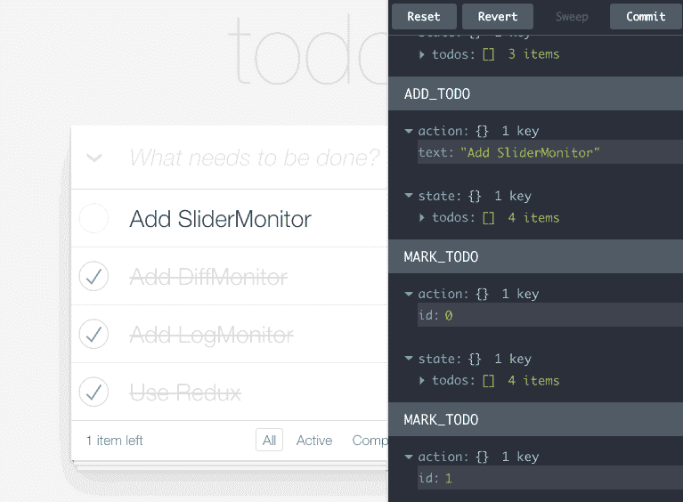
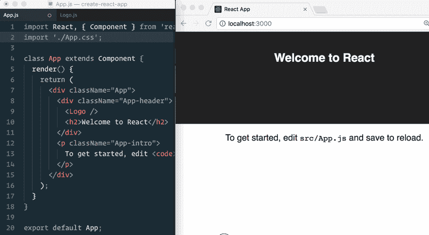

# 在 React 中加快开发的 5 个工具

> 原文：<https://dev.to/giteden/5-tools-for-faster-development-in-react-43i1>

### 5 款加速 React UI 组件和应用开发的工具。

React 对于快速开发具有漂亮的交互式 UI 的应用程序非常有用。React 组件是为开发不同的应用程序创建隔离的和可重用的构建块的好方法。

虽然一些最佳实践有助于开发更好的应用程序，但是正确的工具可以使开发过程更快。这里有 5 个(+)有用的工具来加速你的组件和应用程序的开发。

欢迎大家评论，提出自己的建议。

## 1。少量

[](https://res.cloudinary.com/practicaldev/image/fetch/s--P06SqOea--/c_limit%2Cf_auto%2Cfl_progressive%2Cq_auto%2Cw_880/https://cdn-images-1.medium.com/max/2642/1%2AQG7SZrh2BFdFXFjkCP2lMg.png)

Bit 是一个流行的开源工具，用于共享和构建组件。

它允许您封装组件及其所有文件和依赖项，并跨应用程序在任何地方运行它们。团队可以轻松地共享组件，并协作以更快地构建模块化应用程序。

您的团队共享的所有组件都可以立即在 [bit.dev](https://bit.dev) 组件云中发现和选择。您可以在集合中组织组件，通过像 bundle-size 和 dependencies 这样的参数搜索组件，并快速查看呈现的示例。

[](https://res.cloudinary.com/practicaldev/image/fetch/s--EXeep30D--/c_limit%2Cf_auto%2Cfl_progressive%2Cq_66%2Cw_880/https://cdn-images-1.medium.com/max/2000/1%2AHNrykRFyylLT_oTiiBDn1Q.gif)

有了 [Bit](https://bit.dev) ，你不需要添加更多的仓库、工具或重构任何东西来共享组件。使用几个简单的 CLI 命令，您可以将项目或库中的组件转换为可重用的构建块，您的团队可以在任何地方共享和使用这些构建块来构建您的应用程序。

[](https://res.cloudinary.com/practicaldev/image/fetch/s--1Y2Ql2ah--/c_limit%2Cf_auto%2Cfl_progressive%2Cq_auto%2Cw_880/https://cdn-images-1.medium.com/max/2000/1%2AgJJ8TKLAYWhX90zWB0UMWA.png)

您与 NPM 或 Yarn 共享的组件来自 bit.dev 注册表，您可以使用 [Bit](https://bit.dev) 从任何消费项目或应用程序开发和更新组件。这意味着更多的代码重用和更少的开销。

<center>

使用[位](https://bit.dev)，您可以更快地开发多个应用程序，作为一个团队协作，并使用您的组件作为新功能和项目的构建模块。

## 2。[故事书](https://storybook.js.org/) / [Styleguidist](https://react-styleguidist.js.org/)

Storybook 和 Styleguidist 是 React 中快速 UI 开发的环境。两者都是加速 Reacts 应用程序开发的好工具。

这两者之间有一些重要的区别，也可以结合起来完成您的组件开发系统。

使用 Storybook，您可以在 JavaScript 文件中编写*个故事*。使用 Styleguidist，您可以在 Markdown 文件中编写*示例*。Storybook 一次显示一个组件的一个变体，而 Styleguidist 可以显示不同组件的多个变体。Storybook 非常适合显示组件的状态，Styleguidist 对于不同组件的文档和演示非常有用。

这里有一个简短的纲要。

[Storybook](https://github.com/storybooks/storybook) 是一个 UI 组件的快速开发环境。

它允许您浏览组件库，查看每个组件的不同状态，并以交互方式开发和测试组件。

[](https://res.cloudinary.com/practicaldev/image/fetch/s--z0EPfJd9--/c_limit%2Cf_auto%2Cfl_progressive%2Cq_66%2Cw_880/https://cdn-images-1.medium.com/max/4312/1%2A8T0opytn0oYuEMpd8PRTsw.gif)

StoryBook 帮助你开发独立于应用程序的组件，这也鼓励你的组件有更好的可重用性和可测试性。

你可以从你的库中浏览组件，摆弄它们的属性，并通过网络上的热重装获得即时印象。你可以在这里找到一些流行的例子[。](https://storybook.js.org/examples/)

不同的插件可以让你的开发过程更快，所以你可以缩短代码调整到可视化输出的周期。StoryBook 还支持 [React Native](https://facebook.github.io/react-native/) 和 [Vue.js](https://vuejs.org/) 。

React [Styleguidist](https://github.com/styleguidist/react-styleguidist) 是一个组件开发环境，带有热重装开发服务器和一个生活方式指南，该指南列出了组件属性类型并显示了基于。md 文件。

[](https://res.cloudinary.com/practicaldev/image/fetch/s--9Z5q4jcs--/c_limit%2Cf_auto%2Cfl_progressive%2Cq_66%2Cw_880/https://cdn-images-1.medium.com/max/2412/1%2A9V2nSEgH1VUbmXd5Dq-hnA.gif)

它支持 ES6、Flow 和 TypeScript，并与 Create React 应用程序一起使用。自动生成的使用文档可以帮助 Styleguidist 作为团队不同组件的文档门户。

*   还可以查看由强大实验室提供的 [**React Live](https://github.com/FormidableLabs/react-live) **服务。这个组件渲染环境也在 [Bit 的 live component playground](https://bit.dev/bit/movie-app/components/hero) 中使用。

## 3。 [React devTools](https://chrome.google.com/webstore/detail/react-developer-tools/fmkadmapgofadopljbjfkapdkoienihi?hl=en)

[](https://res.cloudinary.com/practicaldev/image/fetch/s--JMHnJiCg--/c_limit%2Cf_auto%2Cfl_progressive%2Cq_66%2Cw_880/https://cdn-images-1.medium.com/max/2000/1%2A9XrmfPqh_naIBlTi7dv3Hw.gif)

这个官方的 React Chrome 开发工具[扩展](https://chrome.google.com/webstore/detail/react-developer-tools/fmkadmapgofadopljbjfkapdkoienihi?hl=en)允许你检查 Chrome 开发工具中的 React 组件层次结构。它也可以作为一个[火狐插件](https://addons.mozilla.org/en-US/firefox/addon/react-devtools/)使用。

使用 React devTools，您可以检查和编辑组件属性和状态，同时在组件层次结构树中导航。这个特性可以让你看到组件的变化是如何影响其他组件的，从而帮助你用正确的组件结构和分离来设计你的 UI。

扩展的搜索栏可以让你快速找到和检查你需要的组件，节省宝贵的开发时间。

[](https://res.cloudinary.com/practicaldev/image/fetch/s--XPxD5PEV--/c_limit%2Cf_auto%2Cfl_progressive%2Cq_66%2Cw_880/https://cdn-images-1.medium.com/max/2000/1%2AGAPOIeQHhPFS5D0ccHHy7w.gif)

查看与 Safari、IE 和 React Native 配合使用的独立应用程序。

## 4。 [Redux devTools](http://extension.remotedev.io/)

[](https://res.cloudinary.com/practicaldev/image/fetch/s--Pusyoq4f--/c_limit%2Cf_auto%2Cfl_progressive%2Cq_66%2Cw_880/https://cdn-images-1.medium.com/max/2000/1%2ARESAzFvlkgBlU4IgRGQjaA.gif)

这个 [Chrome 扩展](https://github.com/zalmoxisus/redux-devtools-extension)(和 [FireFox 插件](https://addons.mozilla.org/en-US/firefox/addon/remotedev/))是一个开发时间包，为你的 Redux 开发工作流提供动力。它允许您检查每个状态和动作负载，重新评估“分阶段”的动作。

您可以将 [Redux DevTools 扩展](https://github.com/zalmoxisus/redux-devtools-extension)与任何处理状态的架构集成。每个 React 组件的本地状态可以有多个存储或不同的实例。你甚至可以“时间旅行”来取消行动(看这个[丹·阿布拉莫夫](https://dev.toundefined) [视频](https://www.youtube.com/watch?v=xsSnOQynTHs))。日志 UI 本身甚至可以被定制为一个 React 组件。

## 5。样板&启动程序

虽然这些不完全是 devTools，但它们有助于快速设置 React 应用程序，同时节省构建和其他配置的时间。虽然 React 有许多入门套件，但这里有一些最好的。

当与预制组件(在[位](https://bitsrc.io)或其他来源)结合时，您可以快速创建一个应用程序结构并将组件组合到其中。

### [创建 React App](https://github.com/facebook/create-react-app) (50k 星)

[](https://res.cloudinary.com/practicaldev/image/fetch/s--6G5kzSRW--/c_limit%2Cf_auto%2Cfl_progressive%2Cq_66%2Cw_880/https://cdn-images-1.medium.com/max/2000/1%2A2aquNYnmp7YHa2TeefS9Ew.gif)

这个广泛使用和流行的项目可能是快速创建新的 React 应用程序并从头开始运行的最有效的方法。

这个包封装了一个新的 React 应用程序所需的复杂配置(Babel、Webpack 等),所以你可以为一个新的应用程序节省时间。

要创建一个新的应用程序，你只需要运行一个命令。

```
npx create-react-app my-app 
```

这个命令在当前文件夹中创建一个名为 my-app 的目录。在目录中，它将生成初始的项目结构并安装可传递的依赖项，这样您就可以简单地开始编码了。

### [反应样板](https://github.com/react-boilerplate/react-boilerplate) (18k 星星)

马克斯·斯托伊伯的 React 样板模板为您的 React 应用程序提供了一个启动模板，该模板侧重于离线开发，并在构建时考虑了可伸缩性和性能。

它的快速搭建有助于直接从 CLI 创建组件、容器、路径、选择器和 sagas 以及它们的测试，而 CSS 和 JS 的更改可以在您进行更改时立即反映出来。

与 create-react-app 不同，该样板文件不是为初学者设计的，而是为经验丰富的开发人员提供管理性能、异步、样式等的工具，以构建生产就绪的* *应用程序。

### [反应弹弓](https://github.com/coryhouse/react-slingshot) (8.5k 星星)

这个由 [Cory House](https://dev.toundefined) 完成的精彩项目是一个 React+Redux starter kit/boilerplate，包含 Babel、热重装、测试、林挺等等。

与 React 样板文件非常相似，这个初学者工具包侧重于快速开发的开发人员体验。每次点击“save ”,修改就会被热加载，自动测试就会运行。

该项目甚至包括一个示例应用程序，这样你就可以开始工作，而不必过多地阅读文档。

*   也请查看[* *简单反应应用](https://github.com/Kornil/simple-react-app)* *在[这篇文章](https://medium.com/@francesco.agnoletto/i-didnt-like-create-react-app-so-i-created-my-own-boilerplate-190a7dd5d74)中有解释。

</center>