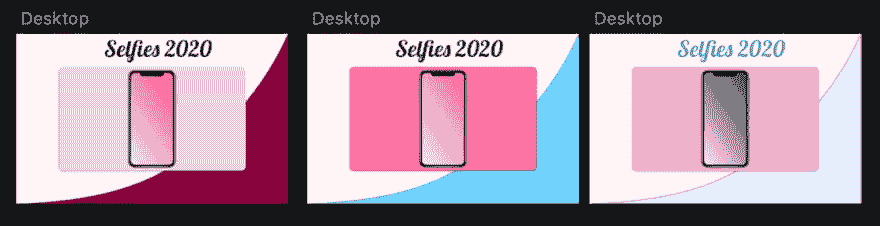
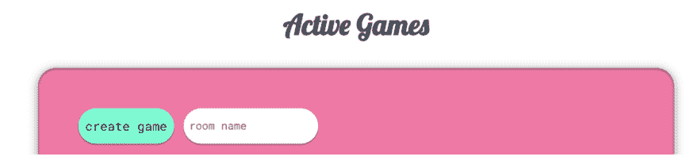

# 用 Javascript 和 Python 写多人策略游戏学到的 53 件事

> 原文：<https://dev.to/aduranil/53-learnings-from-writing-a-multiplayer-strategy-game-3ijd>

我于 2019 年 4 月开始制作 Selfies 2020，希望以现代的方式重现一款名为 [sissyfight 2000](http://sissyfight.com/) 的 1999 年游戏。这是一个“半开玩笑”的社交媒体游戏理论多人游戏，玩家制定策略以获得追随者。玩家获得的追随者取决于其他玩家在该轮中的表现。我是唯一的出资人。5 个月后，我没有完成，我有一个反思的时刻...**我为什么要这么做？**这是为了学习更多的编程概念(尽管如果有人玩的话会很棒)，特别是**从前端到后端制作一个应用程序的一切。**我还想学习我不太熟悉的技术，比如 Django 和 React Hooks。我的最终目标是做一个生产质量的应用程序。

这个项目并不完全是“生产质量”，但我认为它基本上“完成了”如果你想支持它，就在 [github](https://github.com/aduranil/selfies) 、 [play](https://selfies-22b79.firebaseapp.com) 它，并提供你的反馈！

[https://www.youtube.com/embed/xyoPOfHdvA4](https://www.youtube.com/embed/xyoPOfHdvA4)

我了解到，通过分类:

[前端:设计](#place-1)
[前端:CSS + HTML](#place-2)
[前端:Javascript](#place-3)
[前端:React/Redux](#place-4)
[前端:工具](#place-5)
[后端:Django](#place-6)
[后端:Python](#place-7)
[后端:基础设施](#place-8)
[工具:Github](#place-9)

## 前端:设计

**1)素描很牛逼。我不是设计师**，但我学到了足够的素描来改进我的设计。导入谷歌字体，**导出 svg/png/css，使用免费的 iPhone 组件和 1000 个插件极大地改进了我的设计过程。再加上你可以**快速原型**:**

**2) [冷却器](https://coolors.co/)用于生成配色方案**

**3)学习 CSS 而不是组件框架。**我开始尝试学习并决定一个组件框架。让库组件完成您想要的任务是很耗时的。通过学习 CSS 基础知识，我更有效率/提高了我的技能。

如果你使用组件框架，[索环](https://v2.grommet.io/)看起来很现代。

在主页上，告诉用户你的网页是做什么的。让导航非常清晰。在看这本[书](https://www.amazon.com/Dont-Make-Think-Revisited-Usability-ebook/dp/B00HJUBRPG/ref=sr_1_1?crid=BEQZ8PV26SB7&keywords=don%27t+make+me+think&qid=1565915646&s=gateway&sprefix=don%27t+make+m%2Caps%2C133&sr=8-1)之前，我忽略了导航。我的主页上写着“点击进入！”没有其他信息。我解决了这些问题，这些问题对设计师来说可能是显而易见的，但我却没有注意到。

## 前端:CSS + HTML

重置 CSS 以减少浏览器的不一致性。链接中的 CSS 规范了你的网站在不同浏览器上的外观。

在我看来，以内联方式设计组件比使用 CSS 更容易管理。它更丑，但将样式放在一个文件中更容易。后来我有时会把它移到 CSS 中。

组件不应该知道它在页面上的位置。定位组件是容器的工作。例如，我所有的按钮上都有`margin-right: 5px`,我把它去掉了，因为相对定位是容器的工作。这个**提高了组件的可重用性。**

**9)如何使用 [flexbox](https://css-tricks.com/snippets/css/a-guide-to-flexbox/) ，以及在 Safari 中看起来不一样(Safari 需要特殊的`-webkit`前缀才能显示 flexbox)。** `flex-grow`特别有用。
同`flex-grow: 1;` 

无: 

在屏幕中间放置一个 div 并不简单。