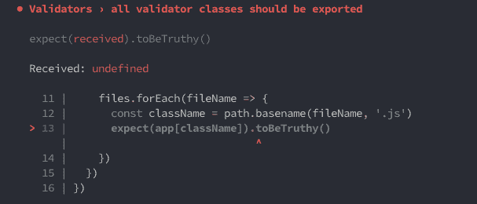
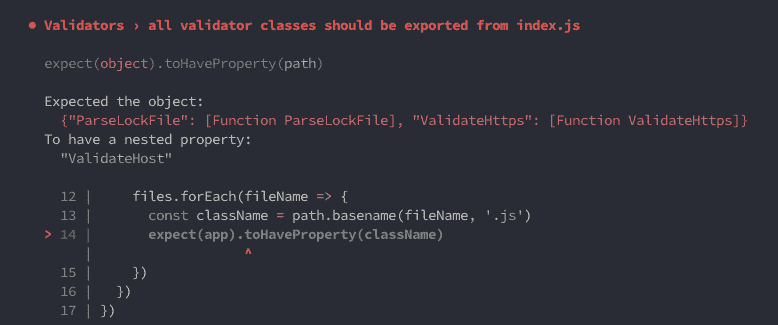
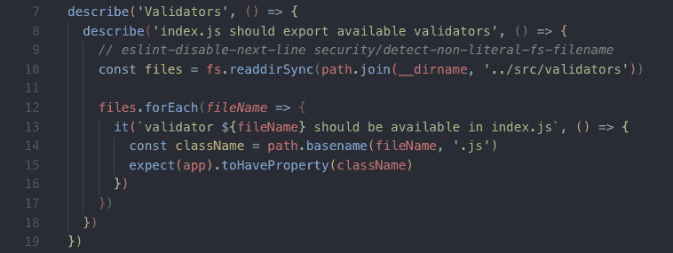
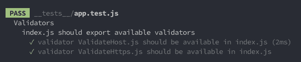

# 重构 jest 测试用例的 6 个阶段

> 原文：<https://dev.to/lirantal/6-stages-of-refactoring-a-jest-test-case-593h>

Jest 的一个被低估的特性是定制测试失败时控制台显示的断言错误。想象一下下面的测试代码，它需要以编程方式循环一个对象，以确保键按预期存在:

测试写得很好，但是想象一下团队中的一个开发人员对代码做了一些修改，在一个地方添加了一个新文件，但是忘记了将它添加到另一个地方，比如正确地导出它。

当测试失败时，失败的原因并不直观，如果您是代码新手，您可能甚至不知道什么出了问题:

所以 jest 有更多的语义预期比如 toHaveProperty()，看起来是这样的:

现在，当一个测试失败时，它至少可以更清楚地表明哪个属性丢失了，但正如你在截图中看到的，它仍然有点神秘。我们能做什么？🤔

在这一点上，它可能已经足够好了。正如你所看到的，测试名称是不言自明的，但问题是我们只有一个失败的测试用例，当查看测试跟踪时，并不清楚到底使用了哪些验证器。

让我们重构一下:

现在，当我的测试通过或失败时，关于测试了什么、失败了什么以及为什么失败，就更加明显和直观了:

好多了！🌈🦄🎉

* * *

如果你像我一样爱开玩笑(😍)您可能也有兴趣在 dev.to 上阅读我在 jest 上的其他文章！：

*   [揭秘 Jest 异步测试模式](https://dev.to/lirantal/demystifying-jest-async-testing-patterns-4n5n)
*   [喜欢 Jest 的理由:开发者体验](https://dev.to/lirantal/reasons-to-love-jest-the-developer-experience-4o6f)
*   [喜欢 Jest 的理由:测试框架](https://dev.to/lirantal/reasons-to-love-jest-the-test-framework-2hoe)