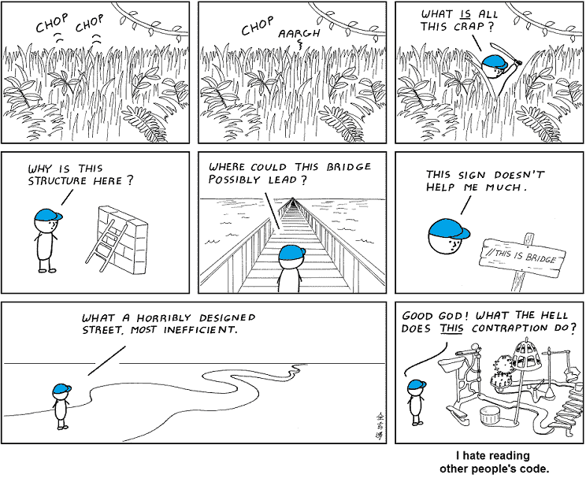
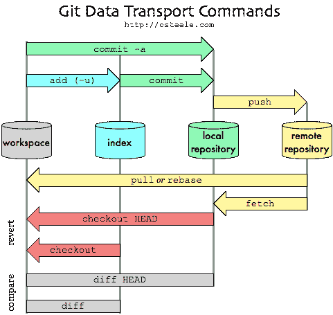
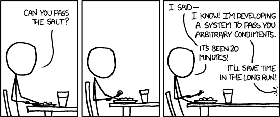
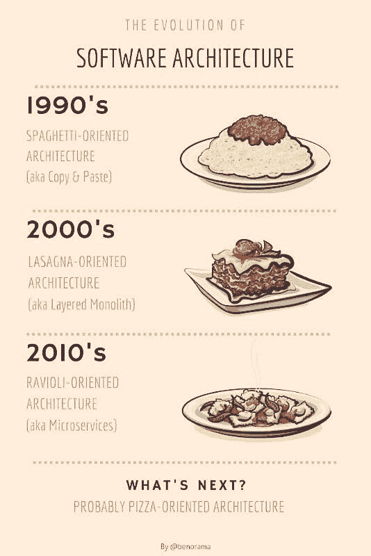

# 高效程序员的 7 个习惯——灵感来自前谷歌 TechLead #幽默

> 原文：<https://dev.to/seattledataguy/7-habits-of-highly-effective-programmers-inspired-by-an-ex-google-techlead-humor-4b4k>

软件工程师花大量时间通过练习 leet 代码问题和完善简历来获得面试的技巧。

一旦他们最终在一家初创公司、谷歌、亚马逊或其他公司获得了那份工作，他们可能会发现他们用来获得这份工作的技能与他们在日常工作中需要的技能并不匹配。

我们的团队受到了 TechLead 创造的高效程序员的七项技能的启发。我们想提供我们自己对这个话题的看法。下面是我们高效程序员的七个技巧。

### 1。学习如何阅读别人的代码

除了你，每个人都写可怕的代码。

这就是为什么一项有多重好处的伟大技能是能够遵循他人的代码。

不管以前的工程师的代码是多么的混乱或者考虑不周，你仍然需要能够涉水而过。毕竟这是你的工作。即使一年前那个工程师是你。

这项技能对你有两方面的好处。第一，能够阅读别人的代码是了解什么是糟糕设计的好机会。当你浏览其他人的代码时，你会知道什么有用，什么没用。更重要的是，你学习了什么类型的代码对另一个工程师来说容易理解，什么类型的代码很难理解。

你需要确保在阅读别人的代码时尽可能多地抱怨。这样，其他工程师就会明白你是一个多么优秀的工程师。

确保你提出了可维护代码和良好注释的重要性。这进一步显示了你在编程领域的优势。

你的代码应该设计得很好，以至于不需要文档。事实上，如果你是一个好的程序员，你不应该记录你的任何代码。这只是浪费时间，你需要花时间编码和开会。

能够阅读其他人杂乱的代码也使得在需要时进行更新变得容易。这偶尔意味着更新您缺乏经验的代码。例如，我们曾经遵循一个从 Powershell 到 Python 再到 Perl 的脚本。我们在 Perl 方面的经验有限，但是我们仍然有足够的上下文来弄清楚发生了什么，并做出所需的更改。

这来自于对所有代码的良好理解以及能够阅读 Perl 脚本。阅读他人的代码让你变得有价值，因为你甚至可以跟随那些可能难倒他人的过度设计的系统。

### 2。对糟糕项目的感觉

有很多技巧需要花时间去学习。我们认为值得了解的技能之一是理解什么项目不值得做，什么项目明显是死亡行军。

大公司总是有比可能完成的或有影响力的项目更多的项目在进行。有些项目可能没有任何商业意义(至少对您来说没有)，还有一些项目管理不善。这并不是说，当你不同意某个项目时，你就应该砍掉这个想法。然而，如果涉众不能恰当地解释他们将如何处理最终结果，那么也许这个项目不值得做。

此外，一些项目可能太专注于技术而不是解决方案，以至于从一开始就很清楚不会有太大的影响。这项技能要求你在了解一个糟糕的项目是什么之前做很多糟糕的项目。因此，不要在早期花太多时间试图辨别每个项目。

在你职业生涯的某个时刻，你会有很好的直觉。

### 3。回避会议

无论您是软件工程师还是数据科学家，会议都是必不可少的，因为您需要能够与项目经理、最终用户和客户达成一致。然而，会议也有突然占据你整个日程的趋势。这就是为什么学会如何避免不必要的会议很重要。

也许更好的用词是管理而不是避免。这里的目标是确保你把时间花在推动决策和帮助你的团队前进的会议上。

最常见的方法是简单地每天划出两个小时的时间来持续开会。通常，大多数人会在他们觉得有利的时候安排一次定期会议。他们将利用这段时间来赶上他们的开发工作。

另一个避免开会的方法是在别人出现之前出现，这样你就可以完成工作。就个人而言，我们喜欢早到，因为一般来说，办公室更安静。大多数早到的人都像你一样，只想把工作做完，这样就没人打扰你了。

这对个人贡献者来说很重要，因为我们的工作需要我们专注的时间，而不是和其他人交谈。是的，有时候你可能想和其他人一起解决问题。但是一旦你克服了阻塞问题，你只需要编码。它是关于进入那个区域，在那里你不断地在你的头脑中持有许多关于你正在做的工作的复杂想法。如果你不停地停下来，很难从你停下来的地方重新开始。

### 4。去吧

一些 CS 专业的学生从出生那天就开始使用 Git。他们理解每一个命令和参数，可以绕过专业人员。其他人在第一份工作中第一次接触到 GitHub。对他们来说，Github 是一个混乱的命令和进程的地狱般的景观。他们从来没有 100%确定自己在做什么(备忘单流行是有原因的)。

无论你的公司使用什么样的存储系统，如果你使用正确，这个系统既有帮助，如果使用不当，它又是一个障碍。一个简单的推动或提交并不需要太多时间，就可以让你花上几个小时试图理清一些多分支和分叉的大杂烩。此外，如果您经常忘记获取存储库的最新版本，您还将面临合并冲突，这一点都不好玩。

如果您需要保存 Git 命令备忘单，那么就去做吧。只要能让你的生活更简单。

### 5。编写简单的可维护代码

 
[xkcd](https://xkcd.com/)

年轻工程师可能会有一种倾向，就是试图将他们所知道的一切都实现到一个解决方案中。有这样一种愿望:将你对面向对象编程、数据结构、设计模式和新技术的理解运用到你编写的每一点代码中。你创造了不必要的复杂性，因为你很容易过分依赖于你过去使用的解决方案或设计模式。

复杂的设计概念和简单的代码之间有一个平衡。设计模式和面向对象设计被认为是为了简化代码。然而，越来越多的流程被抽象、封装和黑盒化，就越难调试。

### 6。学会说不，分清轻重缓急

这适用于任何角色，无论你是金融分析师还是软件工程师。但是特别的是，科技角色似乎每个人都需要从他们身上得到一些东西。如果你是一名数据工程师，你可能会被要求做更多的事情，而不仅仅是开发管道。一些团队需要数据提取，一些团队需要仪表板，还有一些团队需要为他们的数据科学家建立新的管道。

现在，区分优先次序和说不可能真的是两种不同的技能，但它们紧密地交织在一起。分清主次意味着你只花对公司有重大影响的时间。而说“不”有时仅仅意味着回避应该由不同团队处理的工作。对于所有角色来说，它们确实经常同时发生。

这可能是一项很难掌握的技能，因为接受你提出的每一个要求是很诱人的。尤其是如果你刚从大学毕业。你想避免让任何人失望，你总是被提供了大量的工作。在大公司里，工作总是没完没了。关键是承担能做的事情。

有很多技能不会在面试中进行测试，甚至不会在大学里教授。通常，这更多的是环境的限制，而不是缺乏让学生接触真实开发环境中存在的问题的愿望。

### 7。操作设计思维

有一项技能很难在面试中测试，也很难在大学课程中复制，那就是思考最终用户可能会如何不正确地使用你的软件。我们通常称之为对操作场景的思考。

然而，这只是一种礼貌的说法，说明你试图伪造证明代码。

例如，由于大部分编程都是维护，这通常意味着更改与其他代码高度纠缠在一起的代码。即使是简单的改变也需要跟踪对象、方法和/或 API 的每一个可能的引用。否则，很容易意外破坏您没有意识到附加的模块。即使您只是更改数据库中的数据类型。

它还包括在进入开发之前，对边缘案例和整个高层设计进行思考。

至于开发新模块或微服务的更复杂的情况，重要的是花时间仔细考虑您正在构建的操作场景。想想未来的用户可能需要如何使用你的新模块，他们可能如何不正确地使用它，可能需要什么参数，以及未来的程序员是否有不同的方式需要你的代码。

简单的编码和编程只是问题的一部分。创建在你的计算机上运行良好的软件是很容易的。但是部署代码有很多可能出错的地方。一旦投入生产，很难说代码会被如何使用，你的原始代码还会附加什么其他代码。五年后，未来的程序员可能会对你的代码的局限性感到沮丧。

我们这篇文章的灵感来自于 [TechLead](https://youtu.be/uVqoU2FzBiA)

您对学习数据科学或技术感兴趣吗？

[如何登陆第一个数据科学咨询客户端](https://www.theseattledataguy.com/how-to-land-your-first-consulting-client-as-a-data-scientist-or-data-engineer/)
[使用 Python 抓取 MeetUp API](https://youtu.be/Roe2SsX3b18)
[Coursera 上我们最喜欢的免费机器学习课程](https://dev.to/seattledataguy/our-favorite-machine-learning-courses-on-coursera-for-free-25p6)
[算法如何变得不道德和有偏见](http://www.acheronanalytics.com/acheron-blog/how-do-machines-learn-bias-data-science)
[如何用 SQL 加载多个文件](https://medium.com/coriers/how-to-load-multiple-files-into-your-database-with-python-and-sql-94e9c417da47)
[如何开发健壮的算法](https://medium.com/better-programming/how-to-develop-a-robust-algorithm-c38e08f32201)
[动态地将 CSV 数据批量插入 SQL 服务器](https://www.youtube.com/watch?v=2bBsYmQjzSE&t=4s)
[4 必须具备](https://www.theseattledataguy.com/4-skills-data-scientist-must-have/)