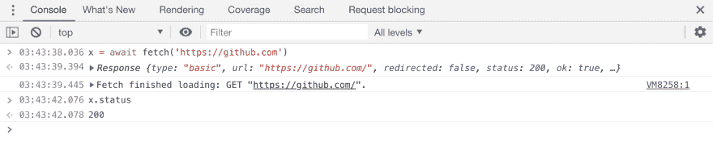

# 您需要知道的 7 个激动人心的 JavaScript 新特性

> 原文：<https://dev.to/gafi/7-new-exciting-javascript-features-you-need-to-know-1fkh>

本文已由 [@rana_kualu](https://twitter.com/rana_kualu) 此处【https://qiita.com/rana_kualu/items/ee7694aa1cd4ae7f4483】T2 翻译成日文

JavaScript(或 ECMA 脚本)是一种不断发展的语言，有很多关于如何前进的建议和想法。TC39(技术委员会 39)是负责定义 JS 标准和特性的委员会，他们今年相当活跃。以下是目前处于“第三阶段”的一些提案的摘要，这是“完成”之前的最后一个阶段。这意味着这些特性将很快在浏览器和其他引擎中实现。事实上，现在已经有一些了。

## 1。私有字段`#`

*可用在 Chrome & NodeJS 12*

是的，你没看错。最后，JS 正在获取类中的私有字段。不再有`this._doPrivateStuff()`，定义闭包存储私有值，或者用`WeakMap`黑私有道具。

[](https://res.cloudinary.com/practicaldev/image/fetch/s--Z93VbJxJ--/c_limit%2Cf_auto%2Cfl_progressive%2Cq_auto%2Cw_880/https://www.meme-arsenal.com/memes/74402a52240be627fb62e298b1fe0897.jpg)

下面是语法的样子

```
// private fields must start with '#'
// and they can't be accessed outside the class block

class Counter {
  #x = 0;

  #increment() {
    this.#x++;
  }

  onClick() {
    this.#increment();
  }

}

const c = new Counter();
c.onClick(); // works fine
c.#increment(); // error 
```

提议:[https://github.com/tc39/proposal-class-fields](https://github.com/tc39/proposal-class-fields)

## 2。可选链接`?.`

曾经不得不访问嵌套在对象内部几层的属性并得到臭名昭著的错误`Cannot read property 'stop' of undefined`。然后你修改代码来处理链中每一个可能的`undefined`对象，比如:

```
const stop = please && please.make && please.make.it && please.make.it.stop;

// or use a library like 'object-path'
const stop = objectPath.get(please, "make.it.stop"); 
```

有了可选的链接，你很快就能完成同样的写作:

```
const stop = please?.make?.it?.stop; 
```

提议:[https://github.com/tc39/proposal-optional-chaining](https://github.com/tc39/proposal-optional-chaining)

## 3。无效合并`??`

很常见的情况是，一个变量的可选值可能会丢失，如果它丢失了
就使用默认值

```
const duration = input.duration || 500; 
```

`||`的问题是它将覆盖所有的 falsy 值，比如(`0`、`''`、`false`)，这些值在某些情况下可能是有效的输入。

输入无效合并运算符，该运算符仅覆盖`undefined`或`null`

```
const duration = input.duration ?? 500; 
```

提议:[https://github.com/tc39/proposal-nullish-coalescing](https://github.com/tc39/proposal-nullish-coalescing)

## 4。BigInt `1n`

*可用在 Chrome & NodeJS 12*

JS 在数学方面一直很糟糕的原因之一是我们不能可靠地存储大于`2 ^ 53`的数字，这使得处理相当大的数字变得相当困难。幸运的是，`BigInt`是一个解决这个具体问题的建议。

[](https://res.cloudinary.com/practicaldev/image/fetch/s--URUEL7B2--/c_limit%2Cf_auto%2Cfl_progressive%2Cq_auto%2Cw_880/https://i.imgflip.com/p8blw.jpg)

二话没说

```
// can define BigInt by appending 'n' to a number literal
const theBiggestInt = 9007199254740991n;

// using the constructor with a literal
const alsoHuge = BigInt(9007199254740991);

// or with a string
const hugeButString = BigInt('9007199254740991'); 
```

您还可以在`BigInt`上使用与常规数字相同的运算符，例如:`+`、`-`、`/`、`*`、`%`，...不过有一个问题，在大多数操作中，你不能把`BigInt`和数字混在一起。比较`Number`和`BigInt`有效，但不相加

```
1n < 2 
// true

1n + 2
// 🤷‍♀️ Uncaught TypeError: Cannot mix BigInt and other types, use explicit conversions 
```

提议:[https://github.com/tc39/proposal-bigint](https://github.com/tc39/proposal-bigint)

## 5。`static`字段

*可用在 Chrome & NodeJS 12*

这个很简单。它允许在类中有静态字段，类似于大多数 OOP 语言。静态字段可以作为枚举的替代，它们也可以用于私有字段。

```
class Colors {
  // public static fields
  static red = '#ff0000';
  static green = '#00ff00';

  // private static fields
  static #secretColor = '#f0f0f0';

}

font.color = Colors.red;

font.color = Colors.#secretColor; // Error 
```

提议:[https://github.com/tc39/proposal-static-class-features](https://github.com/tc39/proposal-static-class-features)

## ⑥。顶级`await`

*在 Chrome 中可用*

允许您在代码的顶层使用 await。这对于在浏览器控制台中调试异步内容(如`fetch`)非常有用，无需将其包装在异步函数中。

[](https://res.cloudinary.com/practicaldev/image/fetch/s--wCIIk7Oa--/c_limit%2Cf_auto%2Cfl_progressive%2Cq_auto%2Cw_880/https://thepracticaldev.s3.amazonaws.com/i/y5ur91fgud4pu7hh5ypv.png)

如果你需要关于异步和等待的复习，[在这里查看我的解释文章](https://dev.to/gafi/7-reasons-to-always-use-async-await-over-plain-promises-tutorial-4ej9)

另一个致命的用例是，它可以用在以异步方式初始化的 ES 模块的顶层(想象一下您的数据库层建立了一个连接)。当这样的“异步模块”被导入时，模块系统将在执行依赖于它的模块之前等待它的解析。这将使处理异步初始化比当前返回初始化承诺并等待它的工作区容易得多。模块不知道它的依赖关系是否是异步的。

[](https://res.cloudinary.com/practicaldev/image/fetch/s--JDbkHgPB--/c_limit%2Cf_auto%2Cfl_progressive%2Cq_auto%2Cw_880/http://24.media.tumblr.com/tumblr_m3x648wxbj1ru99qvo1_500.png)T3】

```
// db.mjs
export const connection = await createConnection(); 
```

```
// server.mjs
import { connection } from './db.mjs';

server.start(); 
```

在本例中，在`db.mjs`中连接完成之前，在`server.mjs`中不会执行任何操作。

提议:[https://github.com/tc39/proposal-top-level-await](https://github.com/tc39/proposal-top-level-await)

## 7。`WeakRef`

*可用在 Chrome & NodeJS 12*

对对象的弱引用是不足以保持对象活动的引用。每当我们用(`const`、`let`、`var`)创建一个变量时，只要这个变量的引用仍然可以访问，垃圾收集器(GC)就永远不会从内存中删除这个变量。这些都是强引用。但是，弱引用引用的对象，如果没有强引用，就可能被 GC 随时移除。一个`WeakRef`实例有一个方法`deref`，它返回引用的原始对象，或者如果原始对象已经被收集，则返回`undefined`。

这对于缓存廉价对象可能很有用，因为您不想将它们永远存储在内存中。

```
 const cache = new Map();

const setValue =  (key, obj) => {
  cache.set(key, new WeakRef(obj));
};

const getValue = (key) => {
  const ref = cache.get(key);
  if (ref) {
    return ref.deref();
  }
};

// this will look for the value in the cache
// and recalculate if it's missing
const fibonacciCached = (number) => {
  const cached = getValue(number);
  if (cached) return cached;
  const sum = calculateFibonacci(number);
  setValue(number, sum);
  return sum;
}; 
```

对于缓存远程数据来说，这可能不是一个好主意，因为它可能会不可预测地从内存中删除。在这种情况下，最好使用类似 LRU 缓存的东西。

提议:[https://github.com/tc39/proposal-weakrefs](https://github.com/tc39/proposal-weakrefs)

* * *

就是这样。我希望你和我一样对使用这些很酷的新功能感到兴奋。关于这些提议和我没有提到的其他提议的更多细节，[关注 github 上的 TC39 提议](https://github.com/tc39/proposals)