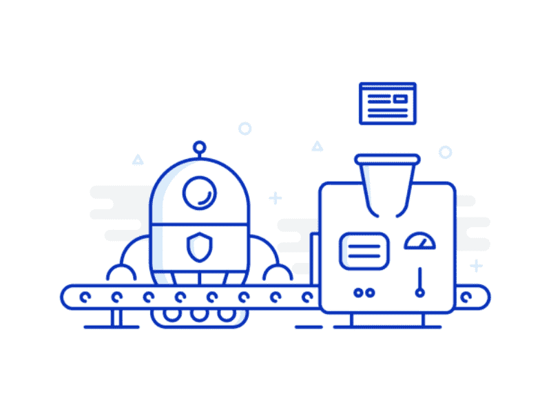
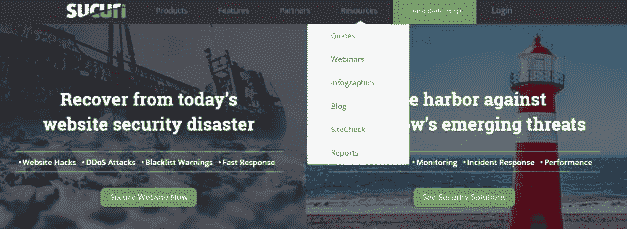
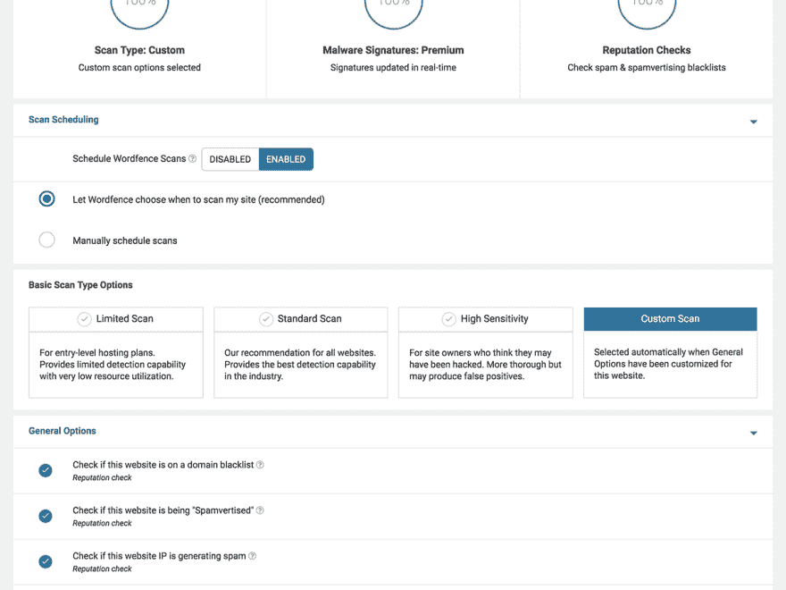
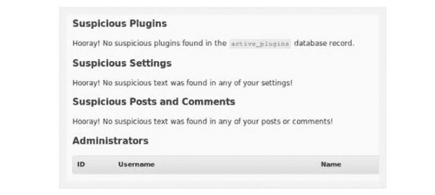
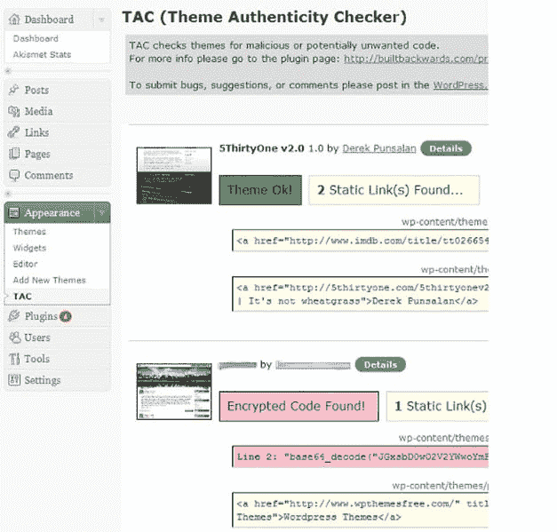
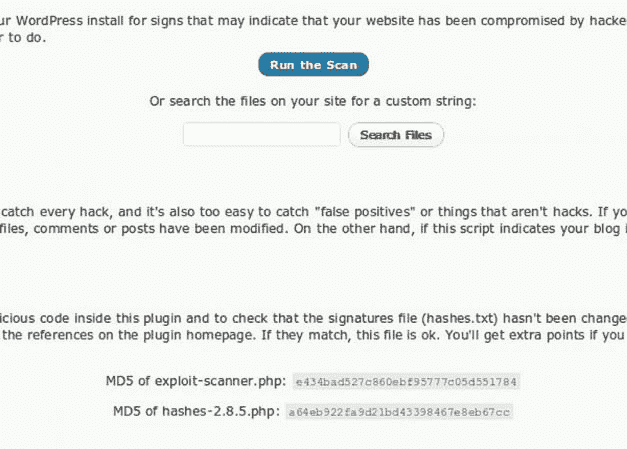
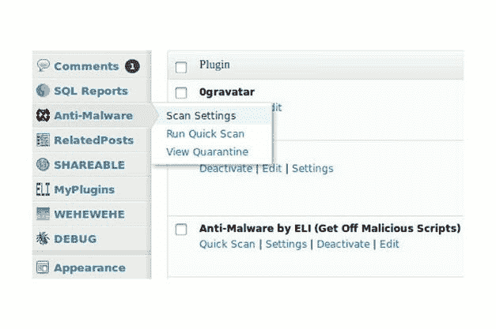

# 2022 年 8 款最佳 WordPress 恶意软件扫描器[更新]

> 原文：<https://dev.to/blog/8-best-wordpress-malware-scanners-in-2019-updated-32l1>

从下面的列表中选择任意一个恶意软件扫描程序，点击查看更多信息。

*   [Wp 被黑求助](#WPHH)
*   苏库里
*   [文字围栏](#WordFence)
*   [库特拉](#Quttera)
*   [主题真实性检查器](#TAC)
*   [漏洞扫描器](#ES)
*   [反恶意软件](#AM)
*   [WP 杀毒网站防护](#WPASP)

* * *

## **更新**——这里公布了一份庞大的 [Wordpress 漏洞扫描器](https://secure.wphackedhelp.com/blog/wordpress-vulnerability-security-scanner/)名单。书签吧！！

WordPress 是主要的 CMS/平台，企业和人们选择在上面建立他们的网站，但是它的流行使得它成为黑客和恶意软件的目标。各种恶意软件扫描解决方案已经被开发出来，以防止对 WordPress 的恶意攻击。这些将是你 2022 年去 Wordpress 恶意软件清除工具，所以把这篇文章收藏起来。

对抗黑客及其恶意软件的战争是一个不断发展的过程，黑客不断开发新的恶意软件来渗透永久升级的反恶意软件解决方案。

除了 Automattic 的默认 WordPress 恶意软件扫描器之外，还有许多其他恶意软件扫描器，如 WP hacked Help 和 WordFence 等恶意软件扫描器插件，可用于确保 WordPress 恶意软件的删除，以及定期扫描 WordPress 的恶意软件以防止 WordPress 恶意软件。

WordPress 网站被黑的第一个迹象是流量的显著减少，因为搜索引擎会让访问者远离你的 WordPress 网站，以避免访问者感染恶意软件。搜索引擎保护用户免受 WordPress 黑客的恶意攻击。

WordPress 是最受欢迎的内容管理系统(CMS)之一，被人们用于简单的博客或其他目的，如建立电子商务商店。还有插件和主题可供选择。

有些是免费的，有些则不是。通常，这些主题中的一些实际上是由那些为了自己的利益而对其进行调整的人上传的。

WordPress 提供了各种各样的主题来适应各种类型的商业和工业。恶意代码可以很容易地嵌入主题，尤其是第三方主题，这就是为什么 WP 网站所有者需要安装 WP 恶意软件扫描器插件来执行 wordpress 恶意软件扫描，这样我们就可以找到准确的位置，并继续[从 WordPress 网站](https://secure.wphackedhelp.com/blog/how-to-remove-malware-from-wordpress-site/)中删除恶意软件。

不需要的代码也可以嵌入评论、插件、附加应用等。常规的 WP 恶意软件扫描将检测恶意代码。一些不想要的代码不会造成什么伤害，但是一些会让你的 WordPress 站点瘫痪。恶意软件攻击可能是野蛮的，也可能是不引人注意的。

事实是，你不会注意到你的 WordPress 站点受到了恶意软件的攻击，除非你定期进行恶意软件扫描，或者你安装了一个可靠的恶意软件扫描插件或反恶意软件，可以检查并清除 WordPress 站点上的恶意软件。

### 黑客注入恶意软件的主要原因

在你最终搜索 WordPress 网站如何修复你的浏览器之前，你必须首先理解为什么黑客会用恶意软件感染 WordPress 网站，因为这是你承认恶意软件攻击的现实和危险的唯一方式。

黑客出于以下一个或多个原因将恶意软件注入网站:

*   恶意软件增强了反向链接，并将用户重定向到垃圾邮件/未知网站，也称为[恶意软件重定向](https://secure.wphackedhelp.com/blog/wordpress-malware-redirect-hack-cleanup/)黑客。
*   恶意软件允许他们追踪访客
*   恶意软件让他们整合他们的广告和横幅
*   恶意软件提供对个人信息(密码、姓名、电子邮件地址)的访问
*   恶意软件可能会因为某个特定的原因或者仅仅为了好玩而导致你的网站崩溃

## 2020 年 8 款最佳 WordPress 恶意软件扫描器列表

让我们从我们的顶级 wordpress 开始

### WP 被黑帮助-下一代 WordPress 恶意软件扫描仪

WP 黑客帮助是一个顶级的 WordPress 安全和恶意软件清除服务([阅读评论](https://www.shopperapproved.com/reviews/wphackedhelp.com/))。这是我见过的最好的 WordPress 安全服务之一。最棒的是。超级实惠。

该服务提供了许多功能，但最突出的是 WP hacked help 的一键自动恶意软件删除，这是第一个自动恶意软件删除。

有了这个自动清洁器，你可以在你的主机暂停或搜索引擎将其列入黑名单之前清洁你的网站。

除了清洁器之外，WP hacked help 还配备了一个非常强大的扫描仪，可以锁定复杂甚至未知的恶意软件的位置。一般其他流行的安全插件都无法发现这类恶意软件。

此外，与其他流行的安全插件不同，WP hacked help 在其服务器上运行其所有进程，而不会对您的网站产生任何影响。

安全服务集成了内置的强大防火墙和登录保护，确保网站日复一日的保护。

### 苏库里

Sucuri 站点检查器是 WordPress 安全领域一个著名的插件。它是一个插件，具有许多优秀的功能，包括安全活动审计，远程恶意软件扫描，监控文件完整性，监控黑名单，安全加固，黑客攻击后的安全行动，安全通知和网站防火墙，起价为 16.66 美元/月。

Sucuri 的免费版本扫描 WP 安装，并搜索 WordPress.org 给出的核心文件的变化。Wp-admin、根目录和 wp-includes 文件会与随您的版本号分发的文件进行比较。

有不一致的文件被列出来，这样你就可以查看它们，因为它们可能指向一个黑客。

### 文字围栏

WordFence 的 WordPress 防火墙是一个 web 应用程序防火墙，可以定位和阻止任何恶意流量。是 WordFence 永久维护和更新的功能！

WordFence 的 WordPress 安全工具是一套安全功能，例如垃圾评论过滤、实时流量监控、登录尝试限制、用户代理和 IP 地址阻止、月度报告和电子邮件通知。

### Quttera 网络恶意软件扫描器

漏洞扫描器是一个插件，它检查你的 WordPress 安装的文件和数据库，以发现它们被破坏的任何迹象。

有了这个插件，你会发现潜在的恶意文件和数据，所以你可以开始删除它们。

漏洞扫描插件可以确认你的 WordPress 站点是否受到了攻击，你可以继续移除所有被感染的文件。

### 主题真实性检查器(TAC)

主题真实性检查器是一个插件，可以扫描你的 WordPress 主题的源文件，查找不需要的、恶意的或可疑的代码。

该插件突出显示恶意代码的位置，以及你的 WP 主题通过静态链接列表链接到的网站。

请记住，垃圾链接是通过嵌入在主题中的恶意代码添加到您的站点中的。目的是破坏你的 WordPress 网站的可信度。

主题真实性检查器(TAC)是一个 WordPress 插件，它扫描每个安装的 WordPress 主题的源文件，查找恶意代码，例如隐藏的页脚链接和 Base64 代码。

一旦检测到，它就会显示特定主题的路径、行号和一小段不可信的代码，这使得 WordPress 管理员可以很容易地直接分析一段特定的可疑代码。

### 漏洞扫描

漏洞扫描器可以扫描你的网站的文件和数据库，并能够检测出可疑的东西是否存在。

当使用漏洞扫描器时，记住它不能防止你的网站受到黑客的攻击，也不能从你的 WordPress 网站上删除任何可疑的文件。

它有助于检测黑客上传的任何可疑文件。如果你想删除它，你必须手动完成。

### 反恶意软件

 
反恶意软件是一个 WordPress 插件，可以用来扫描和删除你的 WordPress 网站中可能存在的病毒、威胁和其他恶意软件。

它的一些重要功能包括定制扫描，全面扫描，快速扫描，自动删除已知的威胁等等。

你可以在 gotmls 免费注册这个插件。如果您不喜欢“呼叫总部”脚本，请避免使用该插件，因为它使用“呼叫总部”功能来检查更新。

### WP 杀毒网站防护

WP 防病毒站点保护是一个安全插件，用于扫描 WordPress 主题以及所有其他上传到 WordPress 网站的文件。

WP 防病毒网站保护的主要功能包括扫描您网站上上传的每个文件，定期更新他们的病毒数据库，删除恶意软件，通过电子邮件发送警报和通知等等。

如果你想要更安全的话，你也可以为某些功能付费。

### 结束思绪

恶意软件扫描解决方案可以防止恶意攻击造成的大量损害。它们也可能显示假阳性结果，但在今天的互联网时代，没有什么是万无一失的。

最好是通过直接从其作者的网站而不是可疑的第三方网站下载插件和主题来降低恶意代码被注入您的网站的风险。

获得一个恶意软件扫描插件是确保你的 WordPress 网站受到保护的第一步。

扫描你的 WordPress 网站是否有恶意软件和其他安全威胁是一个持续的过程，需要勤奋有效地实施

### 相关岗位:

*   [WordPress 安全强化行动计划清单](https://dev.to/blog/wordpress-security-hardening-action-plan-checklist-10-points-oh8)
*   【2019 年 12 点虚拟主机安全清单