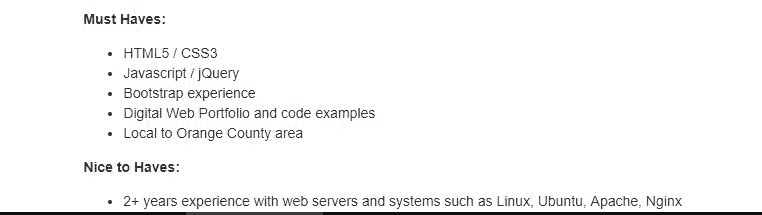
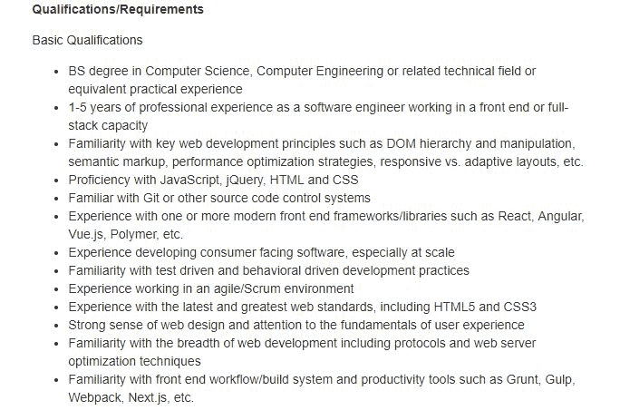

# 破坏你未来的初级和中级 JavaScript 开发人员的 8 个习惯

> 原文：<https://dev.to/jsmanifest/8-habits-for-beginning-and-mid-level-javascript-developers-that-sabotage-your-future-48b4>

在[媒体](https://medium.com/@jsmanifest)上找到我

这确实是一个 JavaScript 开发人员的绝佳时机，因为他们在就业市场上的需求越来越大。框架、库等的快速一致的发布。生活在这个时代是一件幸事——尤其是当我们可以成为所有开源事物的一部分。以至于我们开始在日常生活中的 JavaScript 相关任务上投入大量时间和精力。

但是很有可能你在日常的 JavaScript 任务上投入了太多的时间和精力，以至于你可能会在不知不觉中给自己和自己的未来带来灾难。我在过去遭受了这篇文章中列出的一些问题，所以我的目标是帮助*你*不要犯这些错误，这样你就不会悲惨地结束。

以下是 JavaScript 开发者破坏你未来的 8 个习惯:

## 1。使用 jQuery

jQuery 在 JavaScript 生态系统的发展中发挥了巨大的作用。

首先，JavaScript 主要用于运行幻灯片和可爱的小部件，如日期选择器和出现在页面中的图库。浏览器提供不同的行为是有问题的，jQuery 通过其抽象层的实现帮助标准化了事物，并处理了 DOM 操作等常见问题的所有解决方法。它有助于简化 AJAX 和跨浏览器差异的问题。

然而，事实是，今天这些问题不再像以前那样重要了。jQuery 的一些最好的特性已经被浏览器标准化了，比如 [fetch](https://developer.mozilla.org/en-US/docs/Web/API/Fetch_API) 和[选择器 api](https://flaviocopes.com/selectors-api/) 。

像 React 这样的现代库除了解决 jQuery 目前存在的问题(如状态管理)之外，还解决 jQuery 想要解决的问题。

在 jQuery 中，您最终会做一些奇怪的事情，比如使用 DOM 元素作为当前状态或 T2 数据，编写复杂得离谱的代码来计算 DOM 的上一个、当前和下一个状态，此外还提供了适当转换到即将到来的状态的方法！

阅读更多关于当今人们正在使用的一些现代替代品以及它们给你的 web 应用带来的好处: [React](https://reactjs.org/) ， [Vue](https://vuejs.org/) ， [Angular](https://angular.io/) 。

## 2。不锻炼

在我以前的文章中，有一件事我没有真正提到，那就是保持健康。现在我不是什么专业教练或什么的，但我看着我的身体这些年来发生了变化，我亲眼目睹了如果你忽视你的健康可能会发生的一些可怕的后果。

那么这些经历是什么呢？嗯，我一直计划写一篇很长的帖子，讲述我是如何设法获得我的第一份 web 开发人员工作的——很快就成为了一个前端团队的领导者(让我告诉你——我的旅程在许多方面都是一个巨大的岩石景观)，其中将包括许多有趣的、情感的和鼓舞人心的细节，特别是对于那些自学 JavaScript 的人来说，但我只想说这一行:我当时仅学习 JavaScript 一年就增加了 32 磅。这怎么会发生在一个人身上？

如果你不锻炼，当你体重增加时，你的身体可能会发生许多令人不安的事情。

其中包括:

1.  通过[改变基因表达](https://www.sciencedaily.com/releases/2016/12/161222094841.htm)来改变你的 DNA。
2.  随着时间的推移，你获得的额外卡路里开始转化为脂肪。
3.  [增加患偏头痛的风险](https://americanmigrainefoundation.org/understanding-migraine/the-skinny-on-obesity-and-migraine/)(包括慢性偏头痛)。
4.  你的血压开始上升，因为体重增加会给你的心脏带来额外的压力，这可能会导致血压过高。

不胜枚举。

## 3。在社交上孤立自己

你的家人和爱人很重要。

当你在学习 JavaScript 的时候把自己从社交生活中孤立出来，你就会破坏你的精神和身体健康，比如[增加抑郁和焦虑的风险，睡眠困难，体重减轻，感觉更累或缺乏动力](https://www.bupa.com.au/healthlink/mind-and-body/healthy-ageing/keeping-connected/social-life/why-your-social-life-is-more-important-than-you-think)。

## 4。不写测试

我经常看到人们跳过他们的 web 应用程序的单元测试，这完全没问题——直到一个意想不到的错误在某个时候使应用程序崩溃。这就成了一个大问题，因为时间和金钱可能会被浪费掉。

话虽如此，只是因为你的代码能够继续编译而不出错，或者只是因为应用程序工作而没有控制台抱怨，这并不一定意味着应用程序应该准备好正式使用。

对于小型应用来说，没有任何类型的测试可能是好的，但是当应用变得越来越大，越来越难以维护时，测试开始变得越来越重要，因为你或其他人对现有代码*的任何更改都可能破坏应用的另一部分*。

想要为未来的大型项目节省时间？整合测试会有很大的帮助。

## 5。学习 JavaScript 之前的框架

我知道并理解使用 React、Vue 或 Angular 等最流行的库和框架立即开始开发 web 应用程序的诱惑。

我曾经说过“先学 JavaScript，再学框架！”，但我的看法有些改变了。作为新手，不要直接学习这些工具，最好的方法是在学习 JavaScript 的同时学习它们。JavaScript 生态系统正以惊人的速度发展，如果你想在市场上推销自己，你必须至少*在 React、Angular 和 Vue 等工具上有一些*经验。

例如，我在 indeed 上搜索了“ *javascript* ”，这是出现的第一个结果:

职位描述说他们*要求你有 jQuery 和 JavaScript* 经验。对于这家公司来说，jQuery 和 JavaScript 同等重要。

一份单独的工作描述需要以下"*基本*"要求:

我点击了四分之二的招聘信息，其中 *50%* 不仅需要 JavaScript 知识，还需要基于 JavaScript 的工具知识。然而，我不太建议你把一半时间花在 JavaScript 上，另一半时间花在你选择的某个库中。这个比例应该更接近 65%的 JavaScript 和 35%的前端库或框架。

以这种方式划分时间非常方便，你仍然可以从学习" *true* " JavaScript 中受益，同时还可以学习一个流行的前端框架来提高你在构建前端 web 应用程序方面的知识。你还会发现自己在加入关于 React 或 Vue 等热门话题的讨论时会有点放松。

但是，将 65%的精力放在学习真正的 JavaScript 上，而将其余的精力放在想要立即开始使用的流行工具上，这意味着什么呢？那是怎么回事？

让我非常了解 JavaScript 语言*的*方法*是通读 Kyle Simpson 的免费在线电子书[你不知道的 JS](https://github.com/getify/You-Dont-Know-JS) (阅读)并尽最大努力轻松通过 [FreeCodeCamp](https://www.freecodecamp.org/) 的在线编码课程(实践)。你从两个学习角度受益。《你不知道的 JS》这本书很好地将 JavaScript 的来龙去脉灌输到你的头脑中，以至于这本书的随机部分今天仍然会在我的脑海中出现。这在采访中对我来说意义重大！*

## 6。没有早点学习干净的代码实践

编写干净的代码是每个开发人员为了称自己为专业开发人员必须知道和做的事情。但是在职业生涯的早期开始学习干净的代码实践也是非常方便的。你越早开始接触这些实践，你就能越早掌握编写更干净、更易维护的代码的技能。

学习如何编写更简洁的代码是那些技能之一，这些技能*不会像*在框架*之前学习 JavaScript 那样真正让*在以后的职业生涯中受益。如果你能训练自己写干净的代码，你就不会*有*去体验一开始写难看的代码，去“学习”一个 JavaScript 开发者的方法。你的经历会在后来看别人的丑代码而变得沮丧的时候出现。这是你的经历。

## 7。过早开始大项目

我在职业生涯中犯的最大错误之一是从计划好的大项目开始。

你会问“这有什么不对的”？

首先，如果你不是一个中高级开发人员，你很有可能无法在短期内完成这个“大”项目。如果你没有接触过编写更干净的代码、编写测试、可扩展架构等方面的最佳实践，那么有很多事情需要考虑，特别是对于稳定的应用程序。尤其是如果你还处于起步阶段。

那么，当你过渡到中级开发阶段，意识到你写的很多代码需要重构，因为你意识到应用程序写得不对，会发生什么呢？对于中级开发人员来说，就业市场开始变得轻松，但你还没有机会将任何好的项目放入你的投资组合中，因为你一直忙于不久前计划的这个大项目。然后，当其他开发人员在这些工作面试中夺走你的荣耀时，你开始思考自己是否值得继续做下去。我推荐的方法是从一堆小项目开始，这样你就可以*把它们写在纸上！*。尽快在你的投资组合中展示一些东西*，你永远不知道机会何时到来。*

 *过早开始大项目的另一个问题是，如果你没有接触到最佳实践和正确的设计模式来构建你的特性，你最终只会写很多代码，到时候你不得不重构或放弃。在这一点上，最好的办法可能是重写整个东西，而不是回去重新布线。无论如何，你可以选择放弃它，把现在的代码放在你的简历或文件夹里。但是他们会看着代码做出一些不愉快的判断。

## 8。不学习数据结构和算法

关于*什么时候*你应该开始在职业生涯中学习数据结构和算法，这是一个长期的争论。有些人建议在开始学习 JavaScript 之前学习它们*，有些人建议在之后学习它们。*

我个人认为，学习它们并不是你进入职业生涯的必经之路，但是让自己接触一些算法是有好处的，这样你就可以对计算机程序和计算有所了解。算法是任何计算或计算机程序的组成部分。事实上，这些计算机程序只是一堆算法与一些花哨的结构化数据结合在一起，那就是*all*；)

## 结论

本帖到此结束！我希望你能从中得到一些东西，并在未来关注我的更多帖子！

在[媒体](https://medium.com/@jsmanifest)上找到我*