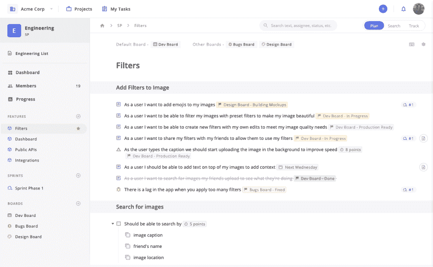
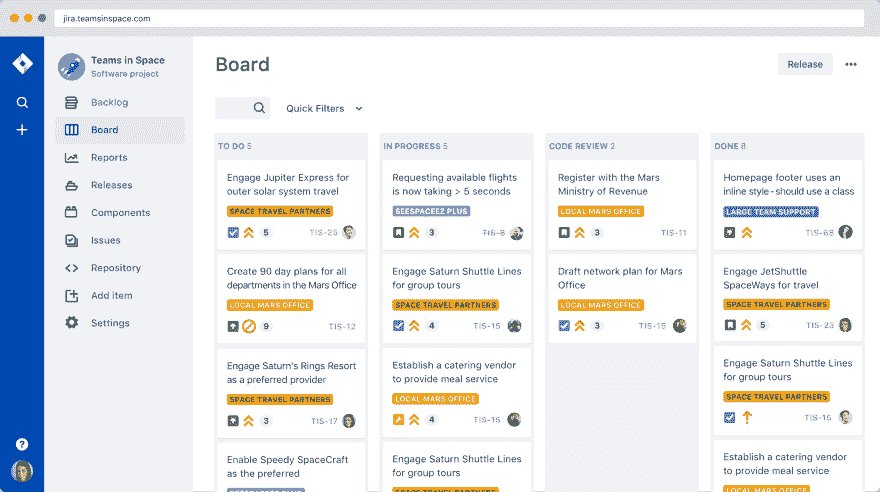
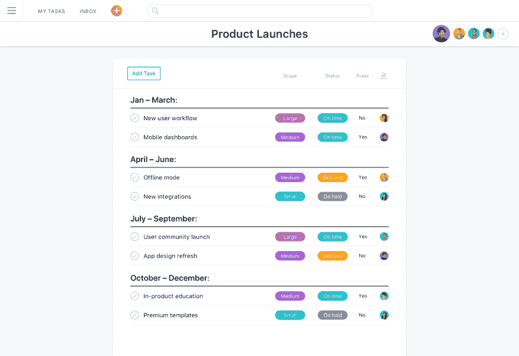
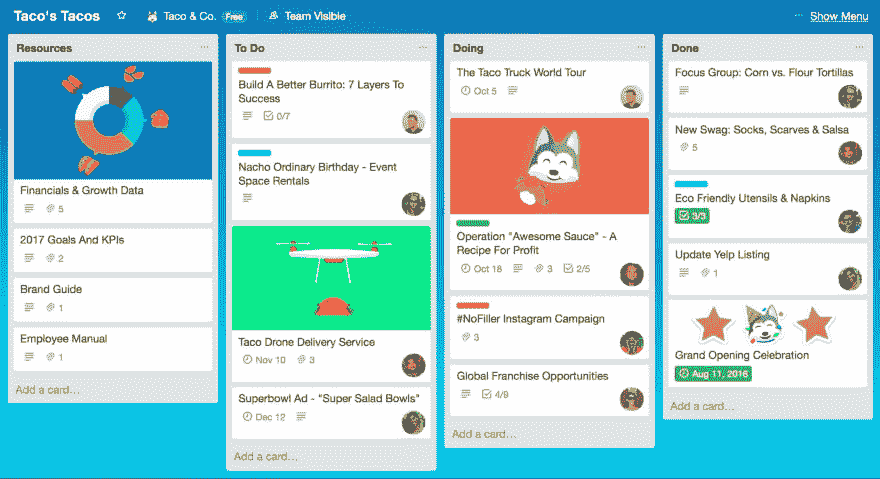
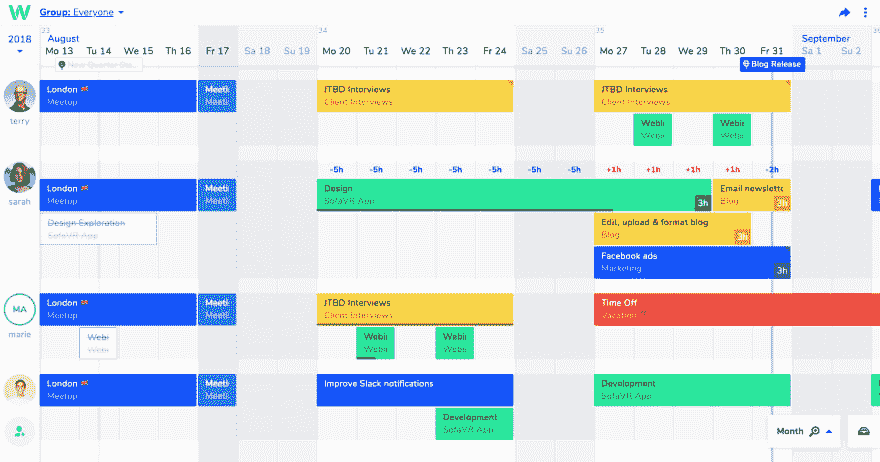
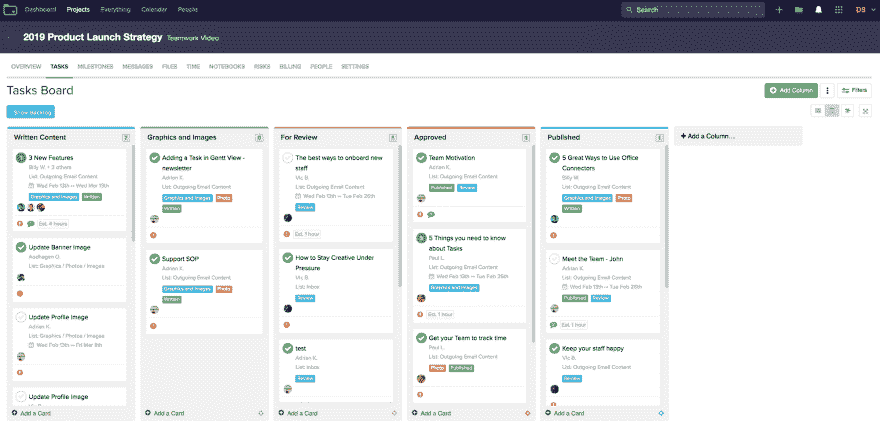
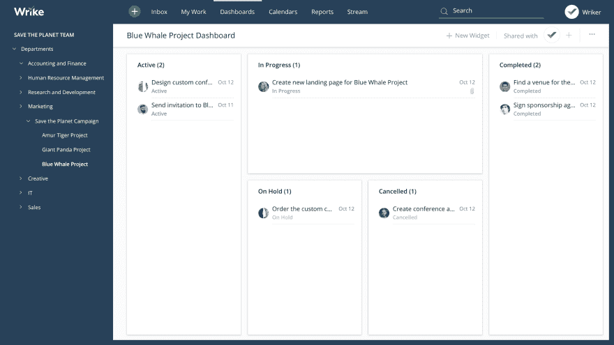
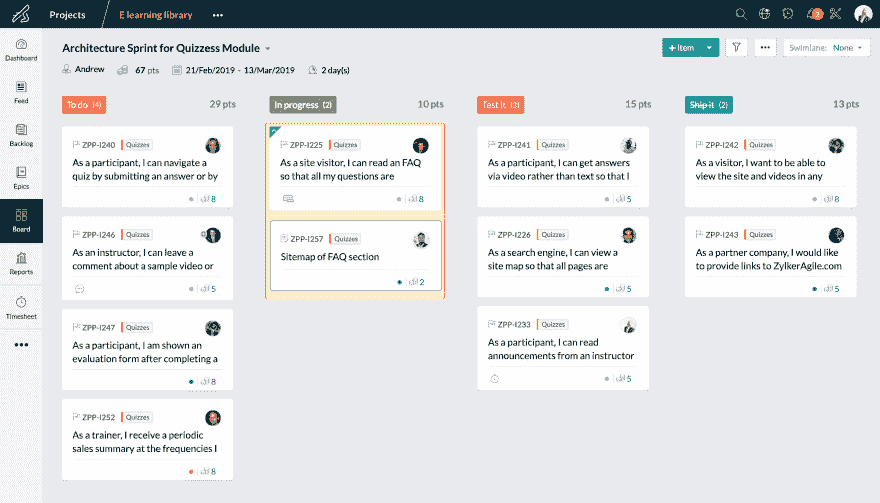
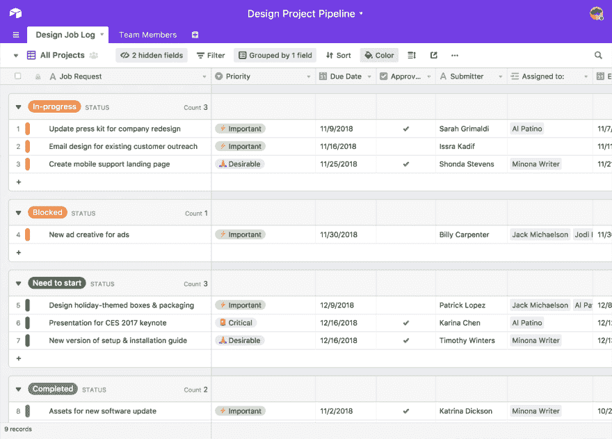

# 9 最好的，免费的，简单的项目管理软件

> 原文：<https://dev.to/svikashk/9-best-free-and-simple-project-management-software-435i>

你正在寻找一个免费的项目管理软件，它使用起来很直观，并且适合你的团队的工作流程吗？你来对地方了。

一个项目管理软件可以为你的团队创造奇迹，让他们能够开发出优秀的产品。

为什么？因为一个好的项目管理软件不仅仅让你看到谁在做什么任务，什么时候能完成，还能让你跟踪具体团队的进度，从整体上查看进度。

最精彩的部分？您可以提高您的团队免费运送优秀产品的能力**！**

有大量的项目管理软件可以帮助你进行项目管理，其中一些是完全免费的。但是，值得注意的是，并不是所有的免费项目管理软件都提供相同的功能。

任何项目管理软件的目标都是通过提供每个团队中正在发生的事情的整体视图来帮助团队管理、跟踪和改进他们的工作。

你选择的免费项目管理软件应该能够实现这一点。

让我们来看看最适合你的团队的免费项目管理软件。

## 1。[泽佩尔](https://zepel.io/?utm_source=devto&utm_medium=text&utm_campaign=free-pm-tools)

Zepel 是为软件产品团队构建的项目管理软件。与其他为简单任务跟踪而构建的免费软件不同，Zepel 的设计非常直观，因此您可以快速规划功能并跟踪其跨学科的进展。

Zepel 对最多 5 名成员免费，没有任何功能限制。

免费版 Zepel 带给你什么:

*   **[毫不费力的特性规划](https://zepel.io/features/plan-features/?utm_source=devto&utm_medium=text&utm_campaign=free-pm-tools)** 凭借简单、直观的界面，Zepel 中的规划特性就像在文档中打字一样简单。所有动作只需一个`/`命令。
*   **时间盒工作，估计完成时间，每次都为您的客户提供令人愉快的功能！**
*   **[项目中每个专业的电路板](https://zepel.io/features/boards/?utm_source=devto&utm_medium=text&utm_campaign=free-pm-tools)** 有了与你的功能相关的每个专业的电路板，每个人都能以他们想要的方式工作。您可以跟踪特定团队的工作，管理工作量，并确保您的功能顺利实现。因为构建功能是一个团队的努力。你需要召集不同技能的成员，让他们一起工作。这就是为什么 Zepel 中的团队协作不仅仅是分配工作和进行对话。
*   **[桌面小部件从您的桌面舒适地跟踪和完成](https://zepel.io/features/desktop-widget/?utm_source=devto&utm_medium=text&utm_campaign=free-pm-tools)**Zepel 的桌面小部件位于您团队的代码编辑器旁边，每个团队成员都可以从他们的桌面查看、获取更新、工作和完成。毕竟，让你的团队定期更新进度可能是当今大多数团队面临的最大痛苦。因为当你的团队没有更新进度时，你的报告或图表都没有意义。
*   **[理解跨领域的所有更新](https://zepel.io/features/feature-tracking/?utm_source=devto&utm_medium=text&utm_campaign=free-pm-tools)** 随着 Zepel 的进展，从任务跟踪到特性跟踪。Zepel 的进步让你可以快速提取每个成员所做的每个更新，并看到你的整个特性的进步。跨越每一个学科。实时的。
*   **有了烧完和烧完报告，你可以通过估计点数或简单的计数来跟踪你已经取得了多少进展。**
*   **集成以适应您的日常工作流程** Zepel 集成了您已经喜爱并每天使用的软件——Slack、Github、Bitbucket 和 Gitlab。公关被合并了？Zepel 会自动完成它。需要更新工作组的时差信息吗？结束了。自动地！
*   **[另外几个免费的特性](https://zepel.io/features/?utm_source=devto&utm_medium=text&utm_campaign=free-pm-tools)** 在这篇文章的后面，你会看到其他几个项目管理软件。Zepel 可能会在免费计划中限制你只有五个成员，但它永远不会限制你的能力。因为你最不想要的就是一个阻止你满足客户特性需求的项目管理软件。

* * *

## 2。[支尔格](https://www.atlassian.com/software/jira)

JIRA 也许是大多数组织在团队变大后决定使用的行业标准，尽管团队成员通常对此有强烈的抵触情绪。它在问题跟踪方面很有效，并附带了许多功能。

他们最近为他们的云平台推出了免费层，最多 10 个成员免费。

**你在 JIRA 的免费版本中得到什么:**

1.  Scrum 和看板
2.  积压
3.  敏捷报告
4.  可定制的工作流程
5.  路线图
6.  集成

在免费计划中，存储上限为 2 GB，支持仅限于社区支持。

如果你正在寻找 JIRA 的替代品，你应该看看这份你现在可以使用的 JIRA 的 9 种替代品的列表。

* * *

## 3。[体式](https://asana.com/)

Asana 是最受欢迎的项目管理软件之一。它被几个团队用来查看谁在什么时候做什么。这款一体化软件允许您以多种视图可视化您的项目，并使用报告来查看您的团队的表现。

大多数用户通常喜欢 Asana 的视觉吸引力。很容易将你的任务转移并分配给队友。然而，用户抱怨的一件事是，如果你想超越简单的任务管理，在免费计划中你没有太多可以做的，当你想升级时，它变得非常昂贵。

体式对 15 名有功能限制的会员是免费的。

**你从免费版的体式中得到什么:**

1.  列表视图来查看您的任务
2.  董事会视图
3.  日历视图
4.  简单的项目管理功能，如受托人和截止日期
5.  集成

[看看 Asana 和 Zepel 相比如何](https://zepel.io/compare/asana-alternative/?utm_source=devto&utm_medium=text&utm_campaign=free-pm-tools)

* * *

## 4。[特雷罗](https://trello.com/)

Trello 是广泛采用的免费项目管理软件之一，尤其是如果你只是想要一个看板来跟踪你的任务。它只做一件事——用看板帮助你跟踪任务——而且做得很好。

Trello 中的每块板都是一个项目，板中的每张卡片都是一项任务。在每张卡中，您可以添加清单、描述和注释。当您想要更新卡片的进度时，您只需将它从一列(在 Trello 中称为列表)移动到另一列来指示进度。

它是小团队的首选项目管理软件之一，因为它简单、不碍事，而且是免费的。当你想开始短跑或者想获取更多关于你的团队表现的信息时，问题就来了。

虽然您可以在 Trello 中使用加电来添加更多功能，但在免费计划中，每块电路板只能加一次电。

**你从免费版的 Trello 中得到什么:**

1.  无限数量的个人留言板、任务和列表。
2.  文件附件的 10MB 限制
3.  每块板 1 次上电

* * *

## 5。[团队周](https://teamweek.com/)

Teamweek 是一个项目管理软件，可以让你用甘特图直观地规划你的项目。它旨在方便规划，因此您可以直观地了解谁在何时做什么。

Teamweek 中的所有内容都可以在甘特图中查看——任务、项目和团队成员组。这让你可以轻松地[管理工作量](https://zepel.io/guide/use-cases/manage-workload/?utm_source=devto&utm_medium=text&utm_campaign=free-pm-tools)，并随时了解你的团队发生了什么。

**你在团队周的免费计划中得到什么:**

1.  无限项目
2.  无限任务
3.  最多可与 5 名成员合作

* * *

## 6。[团队合作项目](https://www.teamwork.com/project-management-software/)

团队合作项目是一个众所周知的远程工作者的项目管理软件，也面向企业。它提供了甘特图以及与 Dropbox 和 Slack 的集成。它非常适合协作，同时仍然保持项目管理的一些更复杂的方面，如 Gant 图表、风险登记簿、时间表等。

然而，团队项目的自由计划仅限于基本的项目管理需求和有限的看板。

**团队项目免费计划中你能得到什么:**

1.  2 个正在进行的项目
2.  100MB 空间。
3.  有限的电路板
4.  基本的项目管理能力。
5.  子任务

* * *

## 7。[里克](https://wrike.com/)

Wrike 是一个很棒的项目管理软件，创意和营销团队都很喜欢。Wrike 的交互式甘特图给出了完整的项目范围，并优化了计划和资源管理。该软件提供了在日历和板上查看项目的能力。通过他们的移动表单，团队成员可以随时更新信息。

然而，他们的免费计划并没有为你所期望的所有基本功能提供广泛的支持，并且仅限于 5 名成员。

**你在 Wrike 的免费计划中得到什么:**

1.  董事会视图
2.  任务管理
3.  文件共享
4.  实时活动流

* * *

## 8。[佐霍冲刺](https://www.zoho.com/sprints/)

Zoho Sprints 是面向敏捷团队的项目管理软件。由于它只关注工作的 sprint 方面，您将有一个 Backlog 来存放您所有的工作并计划您的下一个 sprint，有 Epics 来组织您的工作，还有一个 Board 来定制状态。

Zoho Sprints 还提供了敏捷报告，因此您可以了解您的团队是如何取得进展的。

**你在 Zoho Sprint 的免费计划中得到什么:**

1.  5 个项目
2.  5 个用户
3.  500MB 存储空间

* * *

## 9。[充气台](https://airtable.com/)

Airtable 部分是电子表格，部分是数据库。因此，您可以根据自己的需求进行定制，使其符合您的项目管理要求。有了日历、看板、网格和图片库等视图，您可以确保与团队中的任何人一起组织任何事情。

如果您以前使用过 Excel 来满足项目管理需求，那么 Airtable 可能值得一看。

**你在 Airtable 的免费计划中得到什么:**

1.  无限制基数(像 Excel 中的工作簿)
2.  每个基地 1200 条记录
3.  实时协作和评论
4.  电子邮件支持
5.  网格、日历、表单、看板和图库视图

* * *