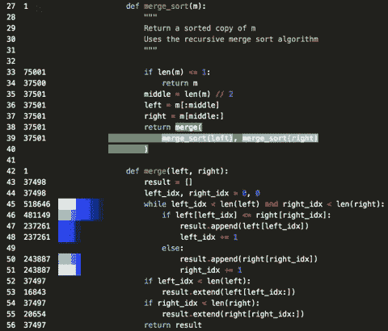
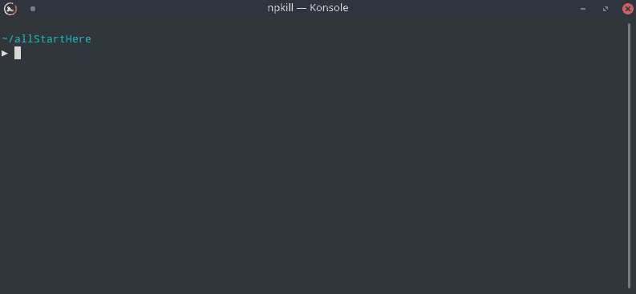
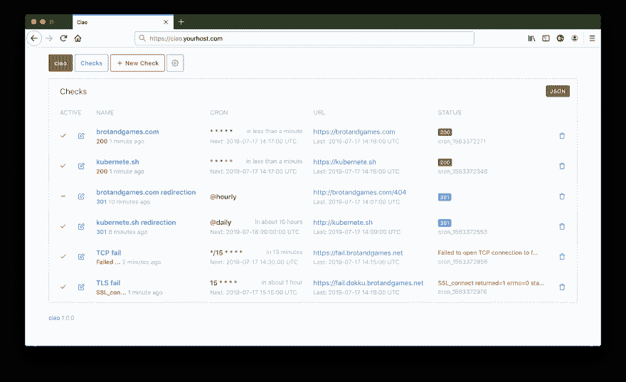
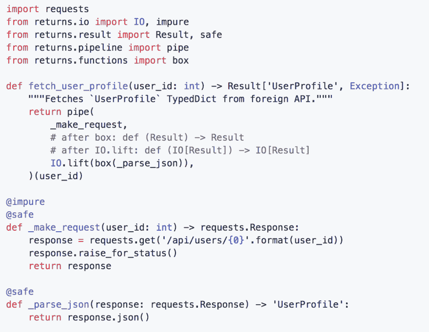
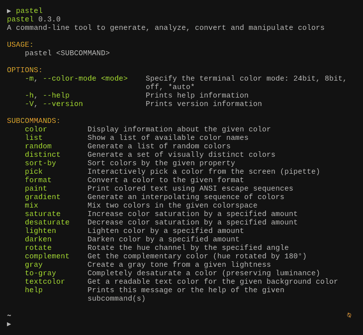
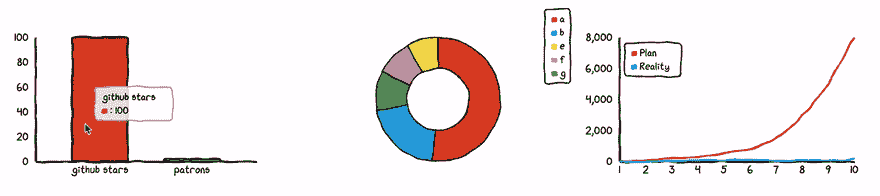
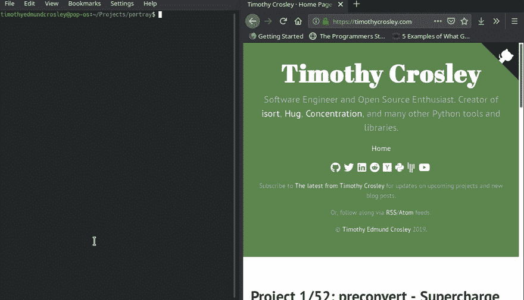
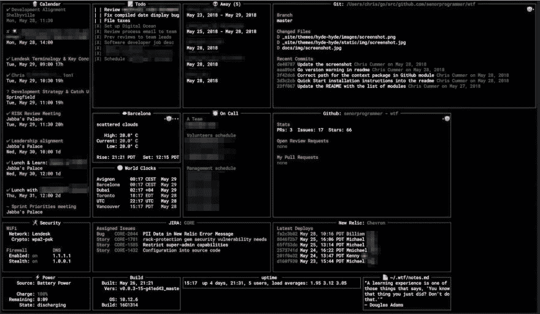

# 9 项最佳开源发现，2019 年 8 月

> 原文：<https://dev.to/sobolevn/9-best-open-source-findings-august-2019-31m8>

大家秋天快乐！🎃

我来介绍一下 2019 年 8 月最佳开源发现列表。

如果你想有更多的牛逼，包括新的有用的开源工具，很棒的文章，很棒的演讲——你可以加入我的电报频道叫做 [@OpensourceFindings](https://t.me/opensource_findings) ( [镜像链接](https://tlg.name/opensource_findings))。

在这个列表中我们将讨论:Python，Rust，JavaScript，Go。这包括网络开发、运营和开发工具。

## 心率

用 Python 编写的 Python 程序
执行的简单实时可视化。

[链接](https://github.com/alexmojaki/heartrate)

## npkill

列出系统中的所有目录，以及它们占用的空间。然后，您可以选择要抹掉的内容以释放空间。清理了大量的空间！
用打字稿写的。

[链接](https://github.com/voidcosmos/npkill)

## ciao

HTTP 检查和测试(私人和公共)监控-检查您的 URL 的状态。有一个非常好的用户界面。用红宝石写的。

[链接](https://github.com/brotandgames/ciao)

## 返回

用 Python 编写类型安全单子和函数组合的一组原语。
用 Python 写的。

[链接](https://github.com/dry-python/returns)

## 粉彩

生成、分析、转换和处理颜色的命令行工具。
用铁锈写的。

[链接](https://github.com/sharkdp/pastel)

## chart.xkcd

`xkcd`样式化的图表库。
用 JavaScript 写的。

[链接](https://github.com/timqian/chart.xkcd)

## 描绘

`portray`是一个 Python3 命令行工具和库，可以帮助您以尽可能少的努力为您的 Python 项目创建优秀的文档网站。
用 Python 写的。

[链接](https://timothycrosley.github.io/portray/)

## nushell

Yehuda Katz (Ember.js)和 Jonathan Turner (TypeScript，Rust)的新壳。主要思想很简单:shell 中的所有内容都是数据！
用铁锈写的。

[链接](https://github.com/nushell/nushell)
[宣布帖子](http://www.jonathanturner.org/2019/08/introducing-nushell.html)

## wtf

是一个用于终端的个人信息仪表板，是为那些一天大部分时间都呆在命令行中的人开发的。
写在围棋里。

[链接](https://wtfutil.com/)

## 奖金！

这个时期最有趣的一篇文章是 [@dan_abramov](https://dev.to/dan_abramov) 写的一篇关于代数效应的文章。它很容易理解，有很好的例子，并链接到更高级的主题:[https://overreated . io/代数效应对我们其余人的影响/](https://overreacted.io/algebraic-effects-for-the-rest-of-us/)

今天到此为止！如果你喜欢这个列表，一定要让[订阅](https://t.me/opensource_findings)我的频道。我打算每个月都发新的。此外，欢迎在评论中发表你知道的任何酷项目。随时欢迎反馈。