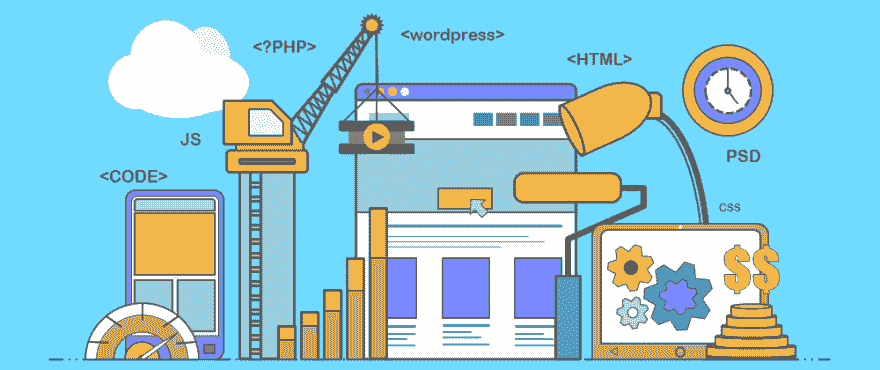

# 9 个用于移动和 WebApp UX UI 原型的强大 UI/UX 工具

> 原文：<https://dev.to/promozseo/9-powerful-ui-ux-tools-for-mobile-and-webapp-ux-ui-prototyping-37h7>

随着人工智能(AI)和机器学习(ML)的兴起，设计师和开发人员总是能够获得新鲜和独特的工具来开发突破性的产品设计。当产生新的想法时，使用 UI UX 工具无疑对满足你的创作需求有很大的帮助。

说到 UI-UX 设计，市场上已经有很多创新的、可行的 UI-UX 设计工具。找到一个原型和线框工具，以满足你的团队的需求，可以给你的设计过程所需的强大基础。此外，我们都知道，直观的设计加上正确的组合**网络营销使其真正成功。**

 **事不宜迟，让我们看看下面九个 UI 和 UX 设计工具，它们将帮助你从头到尾简化你的设计过程。

## Axure RP 9

Axure RP 是一个简单而强大的线框和原型解决方案，用于创建交互式原型和线框。这个工具已经存在一段时间了，它以评估 web 和移动应用程序的有效性而闻名。该软件配备了强大的功能，例如使用条件逻辑和数学函数、处理动态内容和应用动画的能力。

特点:

1.  您可以创建交互式原型、线框和图表。
2.  您可以轻松地从给定的内置库中拖放元素。
3.  它给了你在移动设备上测试原型的自由
4.  它还用于创建高保真的结果，以便最终结果可以通过一个现实的原型进行测试。
5.  它可以在 MacOS 和 Windows 操作系统上运行。

定价:

1.  每月计划:Axure RP 9 Pro -每个用户每月 29 美元，Axure RP 9 Team -每个用户每月 49 美元
2.  永久计划:Axure RP 9 Pro -每位用户 495 美元，Axure RP 9 Team -每位用户 895 美元

## UX 销

[**UX 图钉**](https://www.uxpin.com/) 因其灵活性和易用性是每个设计师最喜欢的线框工具之一。这是一个基于云的线框工具。UXPin 的主要优势在于，它允许设计师将他们的设计理念贯穿整个过程。它有独特的设计文档。你可以创建从线框到演示的任何东西，并收集用户反馈。

特点:

1.  您可以使用 UXPin 创建一个健壮的交互式线框和原型。
2.  简单的拖放功能允许您拖动图标、自定义 UI 元素和图像来增强线框。
3.  使用 UXPin，您可以轻松创建高保真模型。
4.  它允许您通过更改或添加自定义 CSS 代码来即时自定义现有的 UI 元素。
5.  UXPin 拥有超过 1000 个用于 web、基于云的和移动线框的 UI 元素。
6.  它适用于 Windows、iOS 和 Android 操作系统。

定价:

1.  提供免费计划
2.  每月计划:个人计划-每月 29 美元，企业-联系销售
3.  年度计划:个人计划-每月 23 美元，企业-联系销售

## 漫威

[**【漫威】**](https://marvelapp.com/) 是一款基于云的 UX 原型软件，支持移动。它支持不同规模的单个或多个用户在一个集中的工作区内创建应用原型。该软件提供了基于浏览器的环境和设计模式。这有助于您基于导入的草图或 Photoshop 构图创建界面资产和实体模型。

特点:

1.  它让你可以自由地在任何屏幕尺寸上测试你的设计，包括 iPhone、iPad、Apple TV、Apple Watch 和 Android 设备。
2.  用户可以通过对你的原型的评论来发送他们的反馈。
3.  你可以与开发者、客户或利益相关者分享你的原型。
4.  您可以在没有互联网连接的情况下展示您的模型。
5.  它的所见即所得和拖放功能是无代码的，不需要专业的开发知识。
6.  它完全兼容 Android 和 iOS 设备。

定价:

1.  提供免费计划
2.  每月计划:每月 16 美元，企业联系销售团队
3.  年度计划:每月 12 美元，企业联系销售团队

## 模拟流量

[**模拟流程**](https://www.mockflow.com/) 是一套对项目实施过程中的许多任务非常有用的应用程序。首先，它是您可以使用的一个很好的替代原型工具。它非常适合处理最初的想法。模拟流使您能够快速构建基本布局，有时这是您进入可展示表单所需的全部内容。

特点:

1.  您可以轻松地将元素拖放到实体模型中，并设计一个线框。
2.  它允许您选择第三方组件、布局和模板。
3.  模拟流允许您在世界任何地方设计和访问您的 UI 模型。
4.  你可以从你的用户那里得到实时的评论和反馈。
5.  您可以使用任何自定义图像作为您的线框以及库中的图像。
6.  可以将创建的线框导出为一系列格式。

定价:

1.  提供免费计划
2.  每月计划:高级-每月 19 美元，商业-每月 89 美元
3.  季度计划:高级-每月 17 美元，商业-每月 89 美元
4.  半年计划:高级-每月 16 美元，商业-每月 89 美元
5.  年度计划:高级-每月 14 美元，商业-每月 89 美元

## 流体界面

[**Fluid UI**](https://www.fluidui.com/) 是一款网站和手机线框设计工具。它提供了一个非常直观且易于使用的平台，可以在几分钟内创建令人惊叹的 web 和移动原型。Fluid UI 有许多功能，包括集成的小部件、低保真度和高保真度设置、协作工具、交互式链接和缩放以及云访问等。您可以通过几次点击和触摸手势来制作交互式网络和移动原型。

特点:

1.  你可以在任何设备上测试你的线框。
2.  Fluid UI 有超过 2000 个内置组件可供选择。
3.  它提供实时视频通话和 Skype 聊天功能，以获取用户反馈。
4.  您可以在线框中使用过渡和动画。
5.  Fluid UI 允许您通过不同的屏幕(如移动、平板、桌面和各种可穿戴设备，如 Apple watch、Android 和 Galaxy wear)与 UI 设计进行交互。
6.  它支持像 Android 和 iOS 这样的平台。

定价:

1.  提供免费的永久计划
2.  月计划:个人-每月 15 美元，团队-每月 65 美元
3.  年度计划:个人每月 8.25 美元，团队每月 41.58 美元

## 原始 io

[**Proto.io**](https://proto.io/) 是一个 web 应用平台，用于创建全交互、高保真的移动应用原型。它允许您创建移动应用程序屏幕，应用屏幕过渡，并为屏幕上的每个设计元素定义触摸事件。它带有大量用于原型的设计元素和 UI 组件，如工具栏、导航栏、标签栏、菜单、表单、文本、照片等等。

特点:

1.  它为您提供高保真的交互体验，同时处理复杂的逻辑和结构。
2.  你可以使用许多移动手势、动画和过渡。
3.  您可以使用现成的模板加快工作流程。
4.  它允许您在移动设备上测试原型。
5.  它为您提供了草图导入工具和 Dropbox 同步。
6.  Proto.io 支持 Mac 和 Windows 操作系统。

定价:

1.  提供 15 天免费试用
2.  月计划:自由职业者-每月 24 美元，公司-每月 160 美元
3.  年度计划:自由职业者-每月 24 美元，公司-每月 160 美元

## 视觉

[**InVision**](https://www.invisionapp.com/) 是一个基于云的解决方案，用于为网站或移动应用程序设计线框。InVision 被认为是高保真设计的理想选择。它提供了很棒的原型工具和特性，使您能够创建一个全功能的原型。

特点:

1.  有了 InVision，从头开始构建可点击的原型变得又快又简单。
2.  拖放功能可以更方便地访问图像和草图，将它们从一个地方移动到另一个地方。
3.  它带有一个流畅的协作工具。您可以轻松地与其他设计师分享链接，并获得即时反馈。
4.  它支持 iOS、Android 和 web 平台。

定价:

1.  提供免费计划
2.  入门-每月 15 美元
3.  企业联系销售团队

## 成帧器 X

[**Framer X**](https://www.framer.com/) 被认为是最具交互性和快速设计的 UI 平台之一。它将你所有的创意和设计带入生活。您用 Framer 创建的每个图形都是交互式和响应性的。Framer X 的动作非常快，让内容更贴近生产。

特点:

1.  Framer X 允许高级，高保真原型和动画。
2.  它有一个图标、UI 元素、预制视觉效果和代码组件的应用商店。
3.  它允许您对组件进行编码，并引入实时数据。
4.  Framer X 通过添加 3D 效果或动量，提供了设计滚动、链接和页面交互的工具。
5.  您可以为每个组件创建自定义 UI，并在多个项目中重用。

定价:

1.  每月计划:个人-每月 15 美元，公司-联系销售
2.  年度计划:个人-每月 12 美元，公司-联系销售

## [图](#figma)

在 UI 和 UX 设计工具的世界里，FigmaT3 是相对较新的。从设计团队到开发人员，每个人都可以一起协作，以确保每个人都在同一平面上。这有助于提高流程的效率和生产力。

特点:

1.  Figma 允许您通过将对象固定到父框架来缩放您的设计，以适应任何屏幕大小。
2.  通过使用并集、减法、交集和排除公式，可以精确地组合任意一组形状图层。
3.  它的 60fps 交互式编辑带来了像素级的完美预览和导出。
4.  通过相对定位和手动定位，您可以完全控制重叠显示的位置和方式。

定价:

1.  无启动计划
2.  组织计划-每个编辑每月 45 美元

轮到你了

这些是一些强大的 UI UX 设计工具，用于原型设计和设计网站和移动应用程序。在为你或你的团队选择最好的 UI UX 软件时，首先要考虑你的总体设计过程的目标。**