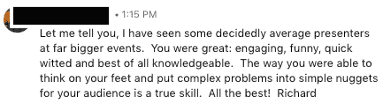
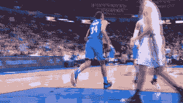
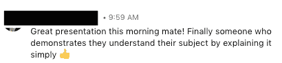
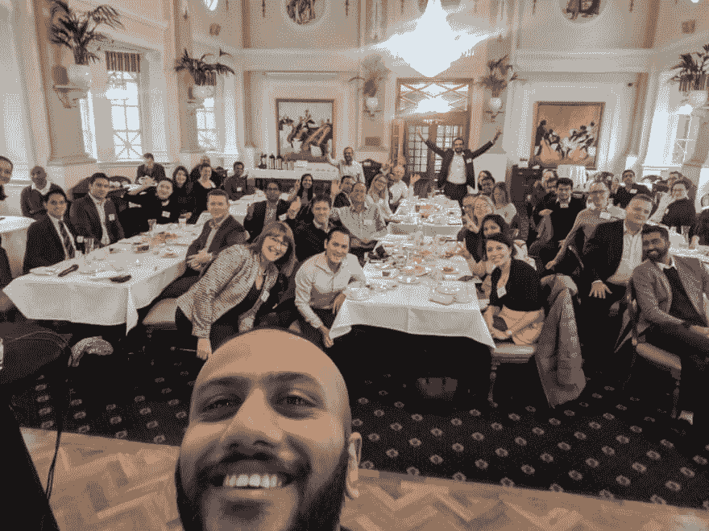

# 粉碎谈话的 5 步指南

> 原文：<https://dev.to/veebuv/a-5-step-guide-to-smashing-talks-adb>

让我们开始吧。一个热门话题。我在这个领域的快速历史是什么？

今天标志着我第一次在人群前跳跃并“说话”已经三年了，从那以后我已经做了将近 100 件事情。这些人在一个会议室里从 20 人到 600 人(如果不是更多的话)不等。

正如人们所料，我经历过重大事件和不太重大的事件。因此，下面是我的粉碎技术(或非技术)会谈的 5 步指南，它让我被邀请参加多个活动，甚至为其中的一些活动获得报酬。

## 1。保持人性&可理解，在一个事件中，每个人都分心了

如果你正在做一个技术性的演讲，深入到你共享的系统中去是非常令人兴奋的。然而，要保持人性化，最重要的是要有触觉。事件是一个令人分心的领域，有很多移动的元素，所以如果你想知道你是如何很好地编码某件事的，练习分享片段，并用一个很棒的例子来证实。

此外，保持话题的关联性，注意力更容易被陌生话题吸引，所以分享一些共同的痛点(简单的 twitter 搜索会帮助你)——简而言之，建立关系。

此外，评估你的听众的技能水平也很重要，这样你才能知道你能做到什么程度。理想情况下，你应该在接受邀请之前这样做，但即使这样，也要确保你与人群互动，并询问他们是否理解(很快会有更多相关内容)

## 2。创造一个故事

我见过的真正好的演讲总是在他们的幻灯片中创造一个故事，就像主题曲一样，最后在结尾做一个大的揭示。这有助于你重新思考如何分解演示方法。

假设你想谈谈编译器和你如何创建一个智能编译器。

我将首先谈论面临的问题
我将谈论我今天如何解决它们(分享挫折)
我将谈论它如何影响我的日常生活(尝试建立关系)
我将谈论理想的解决方案应该是什么样子
我将通过构建方法
分享，最后，我将分享最终结果。

我带领我的观众经历了一次意图、原因、行动和结果的旅程。

一个故事是在一天结束时令人难忘的，人们会回家，谷歌技术位无论如何，背后的推理是什么会坚持他们

## 3。有一个目标，找出你的听众想要达到的目标

这一点非常重要，因为漫无目的的谈话会让每个人都不开心或困惑。当你被邀请去演讲时，你需要明白这一点。

我问每一个召集我的组织者，“演讲的目标是什么，你希望人们带着什么离开”——这让他们面临挑战，要真正分解他们希望听众获得的结果。

如果你有足够的时间，研究一下你的一些听众的背景，也许可以提前在 twitter 上添加他们，并向他们提问。

我最近为项目经理做了一个关于机器学习的演讲，我的目标是告诉他们 AI/ML 是一个使能器而不是一个威胁，我围绕这个主题建立了我的整个故事，更重要的是围绕项目经理和他们的日常工作建立了整个演示。

我试图教育他们如何为这项事业做出贡献，以及如何帮助他们取得成功。有些人真的很喜欢这种方法

## 4。尽可能多地互动，尽可能经常地互动

这是一个棘手的问题，它取决于活动的规模以及主题。对于像 TED 这样更正式的活动，你有规则可循，你不能和观众互动太多。

但是我演讲过的活动，不管有没有报酬，总是给我机会与观众直接对话。这可以简单到让他们举手，如果有东西符合一定的标准。

请听众提供他们对你正在解释的问题的看法，这有两种方式。要么他们忽略了答案，你的谈话被“破坏”了，要么这能给你一个机会补充他们刚刚说过的话。

要非常谨慎，不要让他们感到羞耻，让他们觉得做得不对也很舒服，也许可以分享一下你开始时对这个话题有多困惑。谦逊会有很大的帮助，因为它能建立起一种熟悉感。

## 5。保持相关性，分享挫折

投球和演讲，持有相似的目标。分享一个故事，激发观众，让他们相信你的方法很棒或者值得注意。

也就是说，真正地关注问题，更重要的是关注挫折。人们更容易被负面情绪所吸引，而不是正面情绪。

看看所有的营销活动，他们首先分享你面临的挫折，他们通过你对棘手问题的共同兴趣建立联系，然后提供解决方案。

这里有一个我最喜欢的演讲的链接，它涵盖了我在这里陈述的所有观点。

演讲者用行话谈论挫折，谈论他如何从未理解它，并围绕他如何试图更深入地挖掘它以及走过惊喜和发现建立一个故事。保持内容的片段性和可读性(可消化的内容)

在我最近为 VueJS optimisations 做的一次演讲中，我通过分享我的项目在扩展时遇到问题的例子来保持它的相关性，并且我自动看到几个人因为他们面临类似的问题(挫折)而靠过来

关于项目管理的谈话也是如此，人们对行话感到沮丧，所以一切技术都是用与项目管理相关的例子和相似之处塑造的，而不是一些关于土豆的随机例子。

我一点一点地讲述了不同的优化，以及它们如何以及为什么帮助了我。

* * *

这里大概就是这样🙌这些事情亲自帮助我做了演讲，得到了非常好的积极反馈。

希望它们能帮助你计划下一次活动！

这里有一张快乐的照片，来自不久前的一次非常有趣的活动！

祝您的活动一切顺利！

