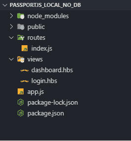

# 护照 JS 完全指南第 1 部分

> 原文：<https://dev.to/nileshsanyal/a-complete-guide-to-passport-js-part-1-443>

[](https://res.cloudinary.com/practicaldev/image/fetch/s--dvFXdcxl--/c_limit%2Cf_auto%2Cfl_progressive%2Cq_auto%2Cw_880/https://1.bp.blogspot.com/-IB8IXR1fA10/XWD4jrx01hI/AAAAAAAABTs/kjaAmK1A7HAENOuZ3HOLrorTuq3IrT6PACLcBGAs/s640/passport_js.jpg)

*阅读原文[此处](https://www.devhelperworld.in/2019/08/passport-js-complete-guide-part-one.html)T3】*

简单来说，passport js 是 express js 框架的中间件。它允许开发人员用很少的代码集成不同类型的身份验证策略。例如:开发人员可以添加各种类型的登录功能与不同的服务，如谷歌，facebook，twitter，github 等，也可以添加自己的自定义策略，通过验证用户的电子邮件和密码。

我们还可以组合所有的策略，以便用户可以使用任何一个选择的策略登录。使用 passport js 比从头构建一个定制的身份验证策略要快得多。

当我第一次开始使用 passport js 时，我花了几天时间才完全理解它的内部工作原理。我浏览了官方文档，搜索了教程，在 stack overflow 中寻找帮助，在做了所有这些额外的工作之后，我能够理解它了。

## 本文涵盖的主题

*   为配置 passport 策略设置回调函数。

*   passport.authenticate()函数在回调 url 中的重要性。

*   设置中间件来检查用户是否已经登录。

*   serializeUser()和 deserializeUser()的实际工作方式。

好，那我们开始吧。

**设置用于配置 passport 策略的回调函数**

看看下面的代码。在这里，我们需要 passport 本地策略模块，我们添加了两条路线；一个用于显示登录页面，另一个用于处理回调 url。在调用“/login”路由后，我们要求用户输入他们的电子邮件 id 和密码。

如果用户提交的电子邮件 id 和密码与这些值匹配，我们将返回用户的电子邮件 id。如果没有找到匹配，那么我们返回 false 来表示认证失败。

借助 done()函数，这是可能的。它是一个内部 passport js 函数，负责在用户成功通过身份验证后提供用户凭证。这个函数将电子邮件 id 附加到请求对象上，以便它在回调 url 上作为“req.user”可用。

它将可用于仪表板路由，在仪表板路由中，您将为用户设置会话，然后设置到 web 应用程序的另一部分。

**passport . authenticate()函数的重要性**

passport js 在内部使用该函数来确保用户在直接访问该 url 之前已经登录。在必须登录才能访问应用程序的受保护 url 的情况下，应该使用它。例如，要访问仪表板页面，用户必须首先登录。

**设置中间件以检查用户是否已经登录**

要检查是否有人登录，我们需要检查是否设置了 req.session.user 值。然后，我们需要在 GET route 上使用这个函数作为中间件[来授予登录用户访问权限。中间件的代码如下所示。](https://www.tutorialspoint.com/expressjs/expressjs_middleware.htm) 

```
const LocalStrategy = require('passport-local').Strategy;

app.get('/login', (req, res) => {
        res.render('login');
});

app.post('/login', passport.authenticate('local', {
        failureRedirect: '/login',
        successRedirect: '/dashboard'
}));

passport.use(new LocalStrategy(
     (username, password, done) => {
         if(username === 'test@gmail.com' && password === '1234') {
             return done(null, {username: 'test@gmail.com'});
         } else {
             return done(null, false);
         }
      }
 ));

function isLoggedIn(req ,res, next){
  if(req.isAuthenticated()){
    return next();
  }else{
    return res.redirect('/login');
} 
```

Enter fullscreen mode Exit fullscreen mode

在上面的代码中，我们检查了用户是否使用 passport js 内置的 **isAuthenticated()** 函数进行了身份验证。如果用户通过了身份验证，当调用 **next()** 函数时，请求继续。否则，用户将被重定向到登录页面。

我们希望只允许登录的用户访问仪表板页面，下面给出了这样做的代码。

```
 app.get('/dashboard', isLoggedIn, (req, res) => {
      res.render('dashboard');
 }); 
```

Enter fullscreen mode Exit fullscreen mode

在上面的代码中，我们已经将之前创建的 isLoggedIn()函数添加到仪表板路由中。它将作为一个中间件，只允许登录的用户访问仪表板页面。

**serialize user()和 deserializeUser()的实际工作原理**

身份验证成功后，passport 会将用户的电子邮件 id 附加到 req.user 对象。由于 serializeUser()和 deserializeUser()函数的存在，这是可能的。

之前，当我们通过设置回调函数来配置 passport js 时，我们在 done()回调函数中传递了 email 值。这一步是必要的，因为 passport 需要获取电子邮件 id 并将其存储在 req.session.passport 对象中，这是 passport 跟踪事物的方式。

为了完成这项任务，必须定义 serializeUser()函数。下面提供了该函数的代码。

```
passport.serializeUser(function(user, done) {
    done(null, user.username);
}); 
```

Enter fullscreen mode Exit fullscreen mode

在 deserializeUser()函数中，电子邮件 id 作为第一个参数给出，该参数与 serializeUser()函数中传递的电子邮件 id 相同。然后，该函数通过调用 done()函数向数据库发出请求，以找到用户的电子邮件 id。在这一步之后，用户的电子邮件 id 被附加到 req.user 对象。

```
passport.deserializeUser((username, done) => {
    done(null, {username: username});
}); 
```

Enter fullscreen mode Exit fullscreen mode

## 最后，我们将构建的应用程序

我们将构建一个简单的 web 应用程序，解释如何使用 passport 本地模块，这是 passport js 本身提供的一个包。我们不会在任何数据库中存储用户凭证。我们有意这样做，以便您可以专注于与 passport js 相关的基本概念。但是，在实际应用中，必须使用数据库。

注意:要跟随本教程，您需要在这里下载项目文件。然后确保你已经在电脑上安装了[节点 js](https://nodejs.org/en/download/) 。下载完成后，解压缩下载的 rar 文件。在下载项目的位置打开终端或命令提示符。运行这个命令“npm install”，然后运行“npm start”，打开一个 web 浏览器，键入“**[http://localhost:8000/log in](http://localhost:8000/login)**”来运行应用程序。

**项目总体结构**

[](https://res.cloudinary.com/practicaldev/image/fetch/s--H0gIa5vG--/c_limit%2Cf_auto%2Cfl_progressive%2Cq_auto%2Cw_880/https://1.bp.blogspot.com/-8llA9KDciUs/XWECx2eN20I/AAAAAAAABUE/xHmNB0_cUJoybmzIxF4j7qNQj0D_Kxm4ACLcBGAs/s400/passport_js_overall_project_structure.png)

### 关于项目结构的讨论

*   app.js 文件:express js 应用程序的主网关。在这里，我们将设置所有的依赖关系，应用程序所需的所有中间件和错误处理代码等。

*   routes/index.js 文件:在这个文件中，我们存储了应用程序的所有路线。

*   views 文件夹:它存储了我们应用程序的所有动态页面。为了生成页面的动态内容，我们使用 handlebars 作为模板引擎。目前，它包含两个页面，即 dashboard.hbs 和 login.hbs。

*   公共文件夹:该文件夹存储 dashboard.hbs 和 login.hbs 页面所需的所有静态资源文件(即 css、js、图像文件等)。

*   package.json 文件:它存储了构建应用程序所需的各种模块。

## 创建节点服务器

```
const express = require('express');
const session = require('express-session');
const bodyParser = require('body-parser');
const passport = require('passport');
const path = require('path');
const app = express();
const port = 8000;

// setup for body-parser module
app.use(bodyParser.urlencoded({extended: false}));
app.use(bodyParser.json());

// express session middleware setup
app.use(session({
    secret: 'W$q4=25*8%v-}UV',
    resave: true,
    saveUninitialized: true
}));

// passport middleware setup ( it is mandatory to put it after session middleware setup)
app.use(passport.initialize());
app.use(passport.session());

// setup for loading static resources from 'public' directory
app.use(express.static(path.join(__dirname,'public')));

// view engine setup
app.set('view engine', 'hbs');
app.set('views', path.join(__dirname,'views'));

require('./routes/index')(app, passport);

app.listen(port, () => console.log(`Server is running on port ${port}`)); 
```

Enter fullscreen mode Exit fullscreen mode

**app . js 文件说明**

在 app.js 中，我们需要存储应用程序使用的第三方模块的所有引用。然后我们需要相应地配置它们。一个**重要提示**我想在这里提一下，如果我们在我们的应用程序中使用快速会话模块，那么我们必须在快速会话中间件设置之后立即配置 passport 中间件。

## 配置护照

```
const LocalStrategy = require('passport-local').Strategy;

module.exports = (app, passport) => {

    app.get('/dashboard', isLoggedIn, (req, res) => {
        res.render('dashboard');
    });

    app.get('/login', (req, res) => {
        res.render('login');
    });

    app.get('/logout', (req, res) => {
        req.logout();
        res.redirect('/login');
    });

    app.post('/login', passport.authenticate('local', {
        failureRedirect: '/login',
        successRedirect: '/dashboard'
    }));

    passport.use(new LocalStrategy(
        (username, password, done) => {
            if(username === 'test@gmail.com' && password === '1234') {
                return done(null, {username: 'test@gmail.com'});
            } else {
                return done(null, false);
            }
        }
    ));

    passport.serializeUser((user, done) => {
        done(null, user.username);
    });

    passport.deserializeUser((username, done) => {
        done(null, {username: username});
    }); 

    function isLoggedIn(req, res, next) {
        if(req.isAuthenticated()) {
            return next();
        } else {
            return res.redirect('/login');
        }
    }
}; 
```

Enter fullscreen mode Exit fullscreen mode

我已经解释了这种配置实际上是如何工作的。如果您想重温该部分，请转到标题为**“本文涵盖的主题”**。

## 创建登录页面

```
<!DOCTYPE html>
<html lang="en">
<head>
    <meta charset="UTF-8">
    <meta name="viewport" content="width=device-width, initial-scale=1.0">
    <meta http-equiv="X-UA-Compatible" content="ie=edge">
    Material Login Form

    <link rel="stylesheet" href="//maxcdn.bootstrapcdn.com/font-awesome/4.3.0/css/font-awesome.min.css">

    <link rel="stylesheet" href="css/login-style.css">

</head>
<body>

    <div class="materialContainer">

   <div class="box">
      <div class="title">LOGIN</div>
      <form action="/login" method="post">
        <div class="input">
            <label for="name">Email</label>
            <input type="text" name="username" id="name">
            <span class="spin"></span>
        </div>

        <div class="input">
            <label for="pass">Password</label>
            <input type="password" name="password" id="pass">
            <span class="spin"></span>
        </div>

        <div class="button login">
            <button><span>Log In</span> <i class="fa fa-check"></i></button>
        </div>

      </form>  

   </div>

</div>

    <script src="js/jquery.min.js"></script>
    <script src="js/script.js"></script>

</body>
</html> 
```

Enter fullscreen mode Exit fullscreen mode

## 创建仪表板页面

```
 <!DOCTYPE html>
<html lang="en">

<head>
  <!-- Required meta tags -->
  <meta charset="utf-8">
  <meta name="viewport" content="width=device-width, initial-scale=1, shrink-to-fit=no">
  Material Admin
  <link rel="stylesheet" href="css/materialdesignicons.min.css">

  <link rel="stylesheet" href="css/style.css">
  <link rel="shortcut icon" href="images/favicon.png" />
</head>

<body>
  <div class="body-wrapper">
    <aside class="mdc-persistent-drawer mdc-persistent-drawer--open">
      <nav class="mdc-persistent-drawer__drawer">
        <div class="mdc-persistent-drawer__toolbar-spacer">
          <a href="javascript:void(0);" class="brand-logo">
                        
                    </a>
        </div>
        <div class="mdc-list-group">
          <nav class="mdc-list mdc-drawer-menu">
            <div class="mdc-list-item mdc-drawer-item">
              <a class="mdc-drawer-link" href="javascript:void(0);">
                <i class="material-icons mdc-list-item__start-detail mdc-drawer-item-icon" aria-hidden="true">desktop_mac</i>
                Dashboard
              </a>
            </div>
            <div class="mdc-list-item mdc-drawer-item">
              <a class="mdc-drawer-link" href="#">
                <i class="material-icons mdc-list-item__start-detail mdc-drawer-item-icon" aria-hidden="true">track_changes</i>
                Forms
              </a>
            </div>
            <div class="mdc-list-item mdc-drawer-item" href="javascript:void(0);" data-toggle="expansionPanel" target-panel="ui-sub-menu">
              <a class="mdc-drawer-link" href="#">
                <i class="material-icons mdc-list-item__start-detail mdc-drawer-item-icon" aria-hidden="true">dashboard</i>
                UI Features
                <i class="mdc-drawer-arrow material-icons">arrow_drop_down</i>
              </a>
              <div class="mdc-expansion-panel" id="ui-sub-menu">
                <nav class="mdc-list mdc-drawer-submenu">
                  <div class="mdc-list-item mdc-drawer-item">
                    <a class="mdc-drawer-link" href="javascript:void(0);">
                      Buttons
                    </a>
                  </div>
                  <div class="mdc-list-item mdc-drawer-item">
                    <a class="mdc-drawer-link" href="javascript:void(0);">
                      Typography
                    </a>
                  </div>
                </nav>
              </div>
            </div>
            <div class="mdc-list-item mdc-drawer-item">
              <a class="mdc-drawer-link" href="javascript:void(0);">
                <i class="material-icons mdc-list-item__start-detail mdc-drawer-item-icon" aria-hidden="true">grid_on</i>
                Tables
              </a>
            </div>
            <div class="mdc-list-item mdc-drawer-item">
              <a class="mdc-drawer-link" href="javascript:void(0);">
                <i class="material-icons mdc-list-item__start-detail mdc-drawer-item-icon" aria-hidden="true">pie_chart_outlined</i>
                Charts
              </a>
            </div>
            <div class="mdc-list-item mdc-drawer-item" href="#" data-toggle="expansionPanel" target-panel="sample-page-submenu">
              <a class="mdc-drawer-link" href="#">
                <i class="material-icons mdc-list-item__start-detail mdc-drawer-item-icon" aria-hidden="true">pages</i>
                Sample Pages
                <i class="mdc-drawer-arrow material-icons">arrow_drop_down</i>
              </a>
              <div class="mdc-expansion-panel" id="sample-page-submenu">
                <nav class="mdc-list mdc-drawer-submenu">
                  <div class="mdc-list-item mdc-drawer-item">
                    <a class="mdc-drawer-link" href="javascript:void(0);">
                      Blank Page
                    </a>
                  </div>
                  <div class="mdc-list-item mdc-drawer-item">
                    <a class="mdc-drawer-link" href="javascript:void(0);">
                      403
                    </a>
                  </div>
                  <div class="mdc-list-item mdc-drawer-item">
                    <a class="mdc-drawer-link" href="javascript:void(0);">
                      404
                    </a>
                  </div>
                  <div class="mdc-list-item mdc-drawer-item">
                    <a class="mdc-drawer-link" href="javascript:void(0);">
                      500
                    </a>
                  </div>
                  <div class="mdc-list-item mdc-drawer-item">
                    <a class="mdc-drawer-link" href="javascript:void(0);">
                      505
                    </a>
                  </div>
                  <div class="mdc-list-item mdc-drawer-item">
                    <a class="mdc-drawer-link" href="javascript:void(0);">
                      Login
                    </a>
                  </div>
                  <div class="mdc-list-item mdc-drawer-item">
                    <a class="mdc-drawer-link" href="javascript:void(0);">
                      Register
                    </a>
                  </div>

                </nav>
              </div>
            </div>
          </nav>
        </div>
      </nav>
    </aside>
    <!-- partial -->
    <!-- partial:partials/_navbar.html -->
    <header class="mdc-toolbar mdc-elevation--z4 mdc-toolbar--fixed">
      <div class="mdc-toolbar__row">
        <section class="mdc-toolbar__section mdc-toolbar__section--align-start">
          <a href="#" class="menu-toggler material-icons mdc-toolbar__menu-icon">menu</a>
          <span class="mdc-toolbar__input">
            <div class="mdc-text-field">
              <input type="text" class="mdc-text-field__input" id="css-only-text-field-box" placeholder="Search anything...">
            </div>
          </span>
        </section>
        <section class="mdc-toolbar__section mdc-toolbar__section--align-end" role="toolbar">
          <div class="mdc-menu-anchor">
            <a href="#" class="mdc-toolbar__icon toggle mdc-ripple-surface" data-toggle="dropdown" toggle-dropdown="notification-menu" data-mdc-auto-init="MDCRipple">
              <i class="material-icons">notifications</i>
              <span class="dropdown-count">3</span>
            </a>
            <div class="mdc-simple-menu mdc-simple-menu--right" tabindex="-1" id="notification-menu">
              <ul class="mdc-simple-menu__items mdc-list" role="menu" aria-hidden="true">
                <li class="mdc-list-item" role="menuitem" tabindex="0">
                  <i class="material-icons mdc-theme--primary mr-1">email</i>
                  One unread message
                </li>
                <li class="mdc-list-item" role="menuitem" tabindex="0">
                  <i class="material-icons mdc-theme--primary mr-1">group</i>
                  One event coming up
                </li>
                <li class="mdc-list-item" role="menuitem" tabindex="0">
                  <i class="material-icons mdc-theme--primary mr-1">cake</i>
                  It's Aleena's birthday!
                </li>
              </ul>
            </div>
          </div>
          <div class="mdc-menu-anchor">
            <a href="#" class="mdc-toolbar__icon mdc-ripple-surface" data-mdc-auto-init="MDCRipple">
              <i class="material-icons">widgets</i>
            </a>
          </div>
          <div class="mdc-menu-anchor mr-1">
            <a href="#" class="mdc-toolbar__icon toggle mdc-ripple-surface" data-toggle="dropdown" toggle-dropdown="logout-menu" data-mdc-auto-init="MDCRipple">
              <i class="material-icons">more_vert</i>
            </a>
            <div class="mdc-simple-menu mdc-simple-menu--right" tabindex="-1" id="logout-menu">
                <ul class="mdc-simple-menu__items mdc-list" role="menu" aria-hidden="true">
                  {{!-- <li class="mdc-list-item" role="menuitem" tabindex="0">
                    <i class="material-icons mdc-theme--primary mr-1">settings</i>
                    Settings
                  </li> --}}
                  <li class="mdc-list-item" role="menuitem" tabindex="0">
                    <i class="material-icons mdc-theme--primary mr-1">power_settings_new</i>
                    <a href="/logout">Logout</a>
                  </li>
                </ul>
            </div>
          </div>
        </section>
      </div>
    </header>
    <!-- partial -->
    <div class="page-wrapper mdc-toolbar-fixed-adjust">
      <main class="content-wrapper">
        <div class="mdc-layout-grid">
          <div class="mdc-layout-grid__inner">
            <div class="mdc-layout-grid__cell stretch-card mdc-layout-grid__cell--span-12">

            </div>

            <div class="mdc-layout-grid__cell stretch-card mdc-layout-grid__cell--span-4">
              <div class="mdc-card d-flex flex-column">
                <div class="mdc-layout-grid__inner flex-grow-1">
                  <div class="mdc-layout-grid__cell stretch-card mdc-layout-grid__cell--span-3"></div>
                  <div class="mdc-layout-grid__cell stretch-card mdc-layout-grid__cell--span-6 d-flex align-item-center flex-column">
                    <h2 class="mdc-card__title mdc-card__title--large text-center mt-2 mb-2">Time, Practice</h2>
                    <div id="currentBalanceCircle" class="w-100"></div>
                  </div>
                  <div class="mdc-layout-grid__cell stretch-card mdc-layout-grid__cell--span-3"></div>
                </div>
                <div class="mdc-layout-grid__inner">
                  <div class="mdc-layout-grid__cell stretch-card mdc-layout-grid__cell--span-12">
                    <section class="mdc-card__action-footer mt-4 bg-red w-100">
                      <div class="col mdc-button" data-mdc-auto-init="MDCRipple">
                        <i class="mdi mdi-store icon-md"></i>
                      </div>
                      <div class="col mdc-button" data-mdc-auto-init="MDCRipple">
                        <i class="mdi mdi-phone-plus icon-md"></i>
                      </div>
                      <div class="col mdc-button" data-mdc-auto-init="MDCRipple">
                        <i class="mdi mdi-share-variant icon-md"></i>
                      </div>
                      <div class="col mdc-button" data-mdc-auto-init="MDCRipple">
                        <i class="mdi mdi-autorenew icon-md"></i>
                      </div>
                    </section>
                  </div>
                </div>
              </div>
            </div>
            <div class="mdc-layout-grid__cell stretch-card mdc-layout-grid__cell--span-4">
              <div class="mdc-card card--with-avatar">
                <section class="mdc-card__primary">
                  <div class="card__avatar"></div>
                  <h1 class="mdc-card__title">Daniel Russel</h1>
                  <h2 class="mdc-card__subtitle">@danielrussel</h2>
                  <span class="social__icon-badge mdc-twitter mdi mdi-twitter"></span>
                </section>
                <section class="mdc-card__supporting-text pt-1">
                  <p class="mb-1">Lorem ipsum dolor sit amet, consectetur adipiscing elit. Aliquam condimentum sem non mauris euismod hendrerit.Aliquam condimentum sem non mauris euismod hendrerit.</p>
                  <p class="mb-2">Lorem ipsum dolor sit amet, consectetur adipiscing elit. Aliquam condimentum.</p>
                </section>
                <section class="mdc-card__social-footer bg-blue">
                  <div class="col">
                    <small>TWEETS</small>
                    <p>768.8k</p>
                  </div>
                  <div class="col">
                    <small>FOLLOWING</small>
                    <p>186.8k</p>
                  </div>
                  <div class="col">
                    <small>FOLLOWING</small>
                    <p>25.8k</p>
                  </div>
                </section>
              </div>
            </div>
            <div class="mdc-layout-grid__cell stretch-card mdc-layout-grid__cell--span-8">
              <div class="mdc-card px-2 py-2">
                <div id="js-legend" class="chartjs-legend mb-2"></div>
                <canvas id="dashboard-monthly-analytics" height="205"></canvas>
              </div>
            </div>
            <div class="mdc-layout-grid__cell stretch-card mdc-layout-grid__cell--span-12">
              <div class="mdc-card table-responsive">
                <div class="table-heading px-2 px-1 border-bottom">
                  <h1 class="mdc-card__title mdc-card__title--large">Employee status</h1>
                </div>
                <table class="table">
                  <thead>
                    <tr>
                      <th class="text-left">Product</th>
                      <th>Cost</th>
                      <th>Sales amount</th>
                      <th>Shipping cost</th>
                      <th>Units sold</th>
                      <th>Profit generated</th>
                      <th>Left in stock</th>
                      <th>Returns</th>
                      <th>Actions</th>
                    </tr>
                  </thead>
                  <tbody>
                    <tr>
                      <td class="text-left">T-shirts</td>
                      <td>250</td>
                      <td>300</td>
                      <td>60</td>
                      <td>3453</td>
                      <td>76</td>
                      <td>453643</td>
                      <td>300</td>
                      <td><div class="col mdc-button" data-mdc-auto-init="MDCRipple"><i class="mdi mdi-heart text-blue"></i></div><div class="col mdc-button" data-mdc-auto-init="MDCRipple"><i class="mdi mdi-forum text-yellow"></i></div><div class="col mdc-button" data-mdc-auto-init="MDCRipple"><i class="mdi mdi-delete text-red"></i></div></td>
                    </tr>
                    <tr>
                      <td class="text-left">Baseball Hat</td>
                      <td>457</td>
                      <td>204</td>
                      <td>35</td>
                      <td>6754</td>
                      <td>35</td>
                      <td>345623</td>
                      <td>546</td>
                      <td><div class="col mdc-button" data-mdc-auto-init="MDCRipple"><i class="mdi mdi-heart text-blue"></i></div><div class="col mdc-button" data-mdc-auto-init="MDCRipple"><i class="mdi mdi-forum text-yellow"></i></div><div class="col mdc-button" data-mdc-auto-init="MDCRipple"><i class="mdi mdi-delete text-red"></i></div></td>
                    </tr>
                    <tr>
                      <td class="text-left">Tennis Racket</td>
                      <td>250</td>
                      <td>350</td>
                      <td>38</td>
                      <td>3289</td>
                      <td>45</td>
                      <td>54662</td>
                      <td>278</td>
                      <td><div class="col mdc-button" data-mdc-auto-init="MDCRipple"><i class="mdi mdi-heart text-blue"></i></div><div class="col mdc-button" data-mdc-auto-init="MDCRipple"><i class="mdi mdi-forum text-yellow"></i></div><div class="col mdc-button" data-mdc-auto-init="MDCRipple"><i class="mdi mdi-delete text-red"></i></div></td>
                    </tr>
                    <tr>
                      <td class="text-left">Gloves</td>
                      <td>250</td>
                      <td>300</td>
                      <td>60</td>
                      <td>3453</td>
                      <td>76</td>
                      <td>453643</td>
                      <td>300</td>
                      <td><div class="col mdc-button" data-mdc-auto-init="MDCRipple"><i class="mdi mdi-heart text-blue"></i></div><div class="col mdc-button" data-mdc-auto-init="MDCRipple"><i class="mdi mdi-forum text-yellow"></i></div><div class="col mdc-button" data-mdc-auto-init="MDCRipple"><i class="mdi mdi-delete text-red"></i></div></td>
                    </tr>
                    <tr>
                      <td class="text-left">Shoes</td>
                      <td>673</td>
                      <td>457</td>
                      <td>56</td>
                      <td>4467</td>
                      <td>98</td>
                      <td>345723</td>
                      <td>350</td>
                      <td><div class="col mdc-button" data-mdc-auto-init="MDCRipple"><i class="mdi mdi-heart text-blue"></i></div><div class="col mdc-button" data-mdc-auto-init="MDCRipple"><i class="mdi mdi-forum text-yellow"></i></div><div class="col mdc-button" data-mdc-auto-init="MDCRipple"><i class="mdi mdi-delete text-red"></i></div></td>
                    </tr>
                    </tbody>
                  </table>
              </div>
            </div>
          </div>
        </div>
      </main>
      <!-- partial:partials/_footer.html -->
      <footer>
        <div class="mdc-layout-grid">
          <div class="mdc-layout-grid__inner">
            <div class="mdc-layout-grid__cell stretch-card mdc-layout-grid__cell--span-6">
              <span class="text-muted">Copyright © 2018 <a class="text-green" href="javascript:void(0);" target="_blank">Bootstrap Dash</a>. All rights reserved.</span>
            </div>
            <div class="mdc-layout-grid__cell stretch-card mdc-layout-grid__cell--span-6 d-flex justify-content-end">
              <span class="mt-0 text-right">Hand-crafted &amp; made with <i class="mdi mdi-heart text-red"></i></span>
            </div>
          </div>
        </div>
      </footer>
      <!-- partial -->
    </div>
  </div>
  <!-- body wrapper -->
  <!-- plugins:js -->
  <script src="js/material-components-web.min.js"></script>
  <script src="js/jquery3.4.1.min.js"></script>
  <!-- endinject -->
  <!-- Plugin js for this page-->
  <script src="js/Chart.min.js"></script>
  <script src="js/progressbar.min.js"></script>
  <!-- End plugin js for this page-->
  <!-- inject:js -->
  <script src="js/misc.js"></script>
  <script src="js/material.js"></script>
  <!-- endinject -->
  <!-- Custom js for this page-->
  <script src="js/dashboard.js"></script>
  <!-- End custom js for this page-->
</body>

</html> 
```

Enter fullscreen mode Exit fullscreen mode

### 结论

感谢您通读这篇文章。如果你学到了新的令人兴奋的东西，请将这篇文章分享给其他人。