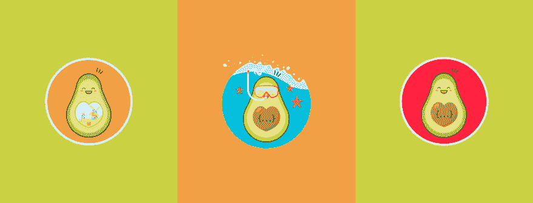
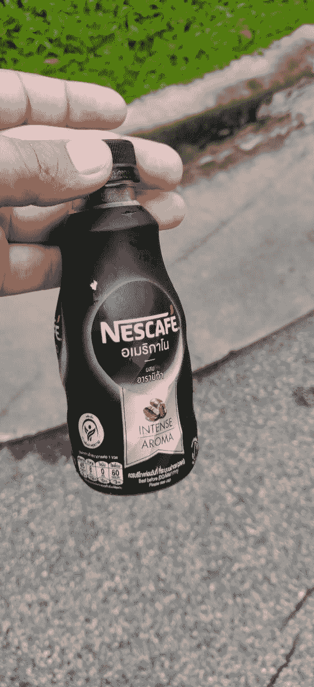
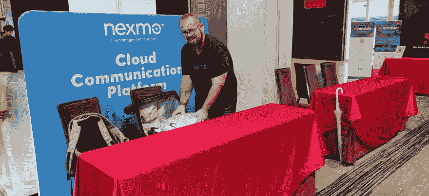
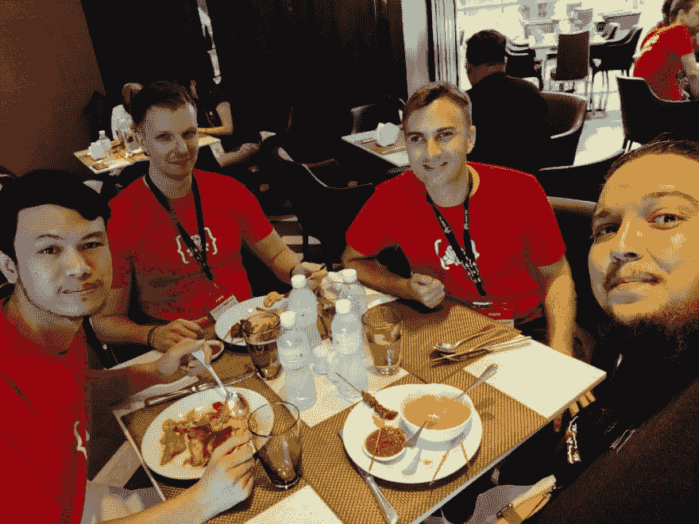
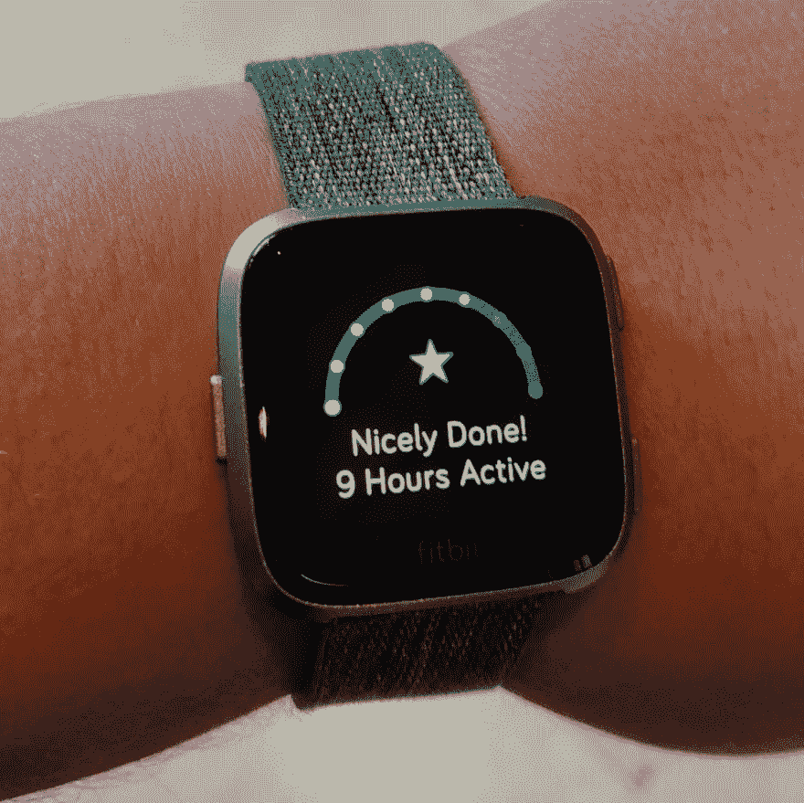

# 开发商代言人迷人生活的一天

> 原文：<https://dev.to/lakatos88/a-day-in-the-glamorous-life-of-a-developer-advocate-nhl>

整篇文章跨越了周末发生的一个 Twitter 帖子，我觉得我没有用一系列 280 个字符的帖子来公正地处理它。我还在这篇文章的底部嵌入了线索，所以在一个地方更容易看到整个背景。互联网上流传着一些关于开发者倡导者经常做什么的误解，它们围绕着我们每天在世界各地穿梭的迷人生活。我想我应该分享一下作为一名开发者倡导者对我来说意味着什么，以及我经常做什么和不做什么。

# 究竟什么是开发者拥护者？

如果你碰巧用谷歌搜索了一下，网上有很多定义，而且都不一样。我会说这要看情况，但你可能会说就在这里。和我一起。大多数公司和产品都是不同的，DevRel 团队的目标也各不相同，所以在那些团队中做开发人员宣传的人有稍微不同的角色，有相同的头衔。所以我就说说我知道的，过去几年一直在做的事情。

这段时间我一直是 Nexmo 的开发者拥护者，我的角色是开发 NEX mo API 的产品团队和使用 NEX mo API 的开发者之间的桥梁。每当我们开发一个新产品，我将是“零客户”，基本上是第一个以类似生产的方式使用它的开发者。不过这是一个双向桥梁，所以一旦它被公开，我也会从使用该产品的开发人员那里寻找反馈，并将其带回我们的产品团队，以便他们可以对其进行改进。

如果你只是通过点击来了解开发者倡导者是什么，你可以在这里停下来，他们是“产品和开发者之间的桥梁”。如果你想知道这是如何转化为日常工作的，请继续阅读。

# 一个开发者倡导者每天都在做什么？

老实说，这是我做过的最灵活的工作之一(我也做过一些)。它是产品、工程、教育和社区角色的混合体。没有哪两天是完全一样的，在任何一天我都会做这些事情中的一件或几件。

## 教育

这转化为围绕 Nexmo APIs 创建博客帖子、教程、文档、研讨会和网络研讨会。

作为 Nexmo 的 JavaScript 开发人员，我负责撰写关于如何将我们的 API 与其他技术结合使用的博文。例如，我目前正在写一篇关于如何使用 Node.js 和 Express 发送和接收短信的博文。

我们有一个团队专门处理开发人员体验和 [Nexmo 开发人员平台](https://developer.nexmo.com)，他们会找出需要改进的地方。如果是 JavaScript 相关的，我会跳到其中一个问题上，改进我们的文档。例如，可编程对话文档需要为其支持的所有语言编写的[【入门】](https://developer.nexmo.com/client-sdk/in-app-messaging/guides/simple-conversation)指南，所以我为 JavaScript 客户端 SDK 编写了指南。

入门指南和博客文章都是较短的内容，但我偶尔会做一些较长的内容，比如教程。你会问，博文和教程有什么区别？。很高兴你问了。在 Nexmo，我们对它们的定义略有不同。博客帖子是寿命较短的内容，不会在一年中得到维护和更新。但是教程在我们的开发者平台上，并且定期更新，所以它们是长期存在的。有时它们可能以博客帖子的形式开始，如果阅读它们的人有足够的兴趣，我们会在以后迁移它们。

书面内容不仅用于我们的博客和文档，还用于我们正在进行的现场研讨会和网络研讨会。我刚刚完成了我们在澳大利亚的 Nexmo Convo 研讨会的写作和运行，我正在为 10 月份在旧金山举行的 Vonage 校园活动筹备一个新的研讨会。如果你在三藩市，你一定要[加入我](https://web.cvent.com/event/9bba9ffb-c9b5-4022-a9b8-3a8184c70aa8/register)，我会带你建立会说话的网站。

## 工程

并不是所有的开发倡导者角色都有很强的工程成分，但是你仍然要定期编写代码。为什么？因为所有的博客帖子、教程、文档、研讨会和网络研讨会都是基于代码的。你要写的代码。博客帖子和教程都需要演示应用，而研讨会和网络研讨会需要示例应用。有什么区别？嗯，演示通常有较短的生命周期，特定于一个用例(例如“如何创建自己的语音邮件”)，并可能有第三方集成在其中，而示例应用有较长的生命周期，定期更新，并基于功能而不是基于用例(例如“如何用 Nexmo 记录来电”)。

如果你一直在关注，这两个使用相同的 Nexmo APIs 和特性，但是一个处理你可以用这些特性构建的特定用例，另一个专门侧重于解释如何自己使用这些特性。

研讨会和网络研讨会依赖于我为博客帖子和教程编写的相同的演示或示例应用程序，所以我可以重用它们。

文档也需要代码，所以我最终编写了 Nexmo 开发者门户网站上的大部分 JavaScript 代码片段。这些都是较短的例子，只处理一个 Nexmo API 的一个特定功能。比如“如何用 Nexmo 记录来电”，既是博文也是代码片段。blog post 处理构建一个可以接收来电并记录下来的应用程序所需的一切，代码片段就像一个乐高积木，只有记录电话所需的代码，而没有处理构建一个完整应用程序所需的相邻代码。

我已经说过，大多数开发者拥护者没有强大的工程组件，他们处理的是编写演示和示例应用程序，而不一定是生产代码。我很幸运，我的角色实际上有很强的工程成分。Nexmo 的开发人员关系团队拥有并维护 [Nexmo 服务器 SDK](https://github.com/Nexmo/)，它们是我们 API 的包装库，因此使用起来更容易。从[走到](https://github.com/nexmo-community/nexmo-go)、 [Java](https://github.com/Nexmo/nexmo-java) 、 [JavaScript](https://github.com/Nexmo/nexmo-node) 、[。NET](https://github.com/Nexmo/nexmo-dotnet) 、 [PHP](https://github.com/Nexmo/nexmo-php) 、 [Python](https://github.com/Nexmo/nexmo-python) 、 [Ruby](https://github.com/Nexmo/nexmo-ruby) 。当我加入 Nexmo 时，我继承了 Node.js SDK 并负责维护它，这意味着每当需要向 SDK 添加新功能时，我都要编写生产级代码。

也许我是双倍幸运的，但是 Nexmo 也有用 Node.js 编写的 CLI,我们在我们的文档中使用它来帮助开发人员设置他们的帐户，而不必去我们的[仪表板](https://dashboard.nexmo.com/)。所以我也坚持这一点，因为它们被成千上万的人使用，我需要确保它们是生产级的。

如果你在网上看看，有一种模式是开发者支持者在工程角色之间来回移动，因为他们错过了构建产品。我认为我工作的这个特殊方面，开发 SDK 和 CLI，使我不想来回切换，因为我已经在构建产品作为角色的一部分。

## 产品

作为产品和社区之间的桥梁，你充当了一个反馈机制。对所有人来说。当产品想要构建一些新的东西，或者改变你的 API 的工作方式时，有谁比了解开发人员的痛点的人更适合呢？所以我可以参与产品开发过程。这通常意味着查看 OpenAPI 规范，并努力使它们更易于阅读或确保它们易于使用。或者测试一个新产品或新功能，并确保它是开发人员想要使用的东西。

一旦产品准备好发布，我也会从使用它的人那里收集反馈。当人们试图使用文档和 SDK 时，我会偶尔坐在一旁，试图找出瓶颈并消除它们，或者收集关于产品在野外如何使用的反馈。但是这并不能很好的扩展，所以你需要更多的观众。这就是与广大开发者社区互动的切入点。你会问，我如何与开发者社区互动？好吧，继续读下去！

## 社区

有几种方法可以让我定期与开发人员社区互动。我最喜欢的一件事(如果你问我的老板，他可能对此最不高兴)是在会议上发言。我有各种各样的话题可以谈论，从与 Nexmo 无关的话题([动手性能调试](https://www.youtube.com/watch?v=l23fbEZ-jKE))，我在那里谈论我最近在更广阔的 JavaScript 世界中做的事情，到与 Nexmo 相关的话题([我如何建立一个会说话的网站](https://2019.jsconf.asia/#sunday))，我在那里谈论我最近建立的东西，这些通常涉及 Nexmo 组件，因为我花了很多时间用 Nexmo 建立东西。Nexmo 的开发者关系人员不在舞台上做产品推介，但其他开发者倡导者也会做产品推介，这取决于观众和活动。

我与我们社区互动的另一种方式是赞助活动和管理 Nexmo 展台。如果人们以前没有用过 Nexmo，我会告诉他们所有关于它的信息，如果他们用过，我会听取他们的反馈。你知道，把 t 恤和贴纸像糖果一样分发出去😅。老实说，这可能是 [#devrellife](https://twitter.com/hashtag/DevRelLife) 中最累人的活动之一，有很多事情发生在幕后，从准备在展位上使用的材料(活动页面、调查、演示)，到在其他人之前到达现场设置展位，然后在最后打包。这涉及到很多工作，我不是一个人做的，通常我们几个来自 Nexmo 的[人会分担工作，并在当天出现在展台上。这篇文章是由 twitter 上关于赞助一天会议的略带讽刺的帖子引发的。](https://developer.nexmo.com/team)

这些只是冰山一角，因为大多数与社区的互动并不发生在活动现场。我在 [StackOverflow](https://stackoverflow.com/users/8483302/alex-lakatos) 、 [Twitter](https://twitter.com/lakatos88) 和 [Nexmo Community Slack](https://developer.nexmo.com/community/slack) 上与试图使用我们的 API 的人进行互动。通常都是相同的场景，有人在跟进我们发布的某个内容时遇到问题，或者他们试图用 Nexmo 构建一些东西，但他们没有阅读所有可用的文档，所以我会将他们引向正确的方向，或者回答关于我们的 API 的问题。这可能是我做的最耗时的事情之一，主要是因为它是异步的，并且它涉及到调试其他人的代码，这些代码我实际上看不到。因此，这意味着许多假设的解决方案，看到许多代码片段，并试图找出所有可能的错误。

# 那些误区呢？

如果你仍然不知道一个开发者经常倡导做什么，让我至少告诉你我不做什么。

关于 [#devrellife](https://twitter.com/hashtag/DevRelLife) 最常见的误解是，我们可以乘坐喷气式飞机环游世界，参加一个又一个会议，过着奢华的生活，因为一切都由公司支付。可能是这样，但事实并非如此。让我告诉你为什么:这是简单的数学。你每年都有固定的预算。你在一件事情上花的越少，你能做的事情就越多。一些开发者关系项目足够大，足够幸运，如果飞行超过一定的小时数，他们实际上可以乘坐商务舱。但是大多数开发者关系项目没有这样的政策，所以每个人都坐经济舱。

在 Nexmo，我们足够幸运，如果飞行时间超过 6 小时，我们可以升级到高级经济舱，如果我们做背靠背活动或我们觉得有必要，我们可以要求业务。让我说清楚，我们没有被要求做这些事情，家庭和健康是第一位的。但是我们大多数人选择为我们的社区做更多的事情，选择乘坐最便宜的航班，大多数时候是乘坐廉价航班。原因很简单，我们今年可以赞助额外的社区会议，或者每个月举办一次聚会，而不是商务飞行。我们这样做是因为在一天结束时，帮助这些社区的人聚集在一起(如果没有赞助商，大多数人都无法聚集在一起)，远远超过我们在这 6 个小时里稍微舒服一点。

至于“住在时尚豪华的酒店”这部分，就像我们有一定的机票预算一样，我们也有酒店的每日限额。这对豪华酒店来说远远不够。反正我不喜欢那些豪华酒店。我只是觉得穿着它们不舒服，而且我真的没有时间享受像“水疗日”和“高尔夫俱乐部”这样的便利设施。酒店提供了一个简单的功能，那就是睡觉的地方。我有几个简单的规则来选择我的酒店，无论是工作旅行还是度假旅行:booking.com 8 层以上，尽可能靠近场地，最好有跑步机或健身房。这给了我足够的选择，我最终通常会选择 IHG，因为它们是最便宜的选择。

“好吧，你不旅行，也不时髦地生活，但你可以去看看这个世界”。是的，我知道。今年看了大概 20 个机场，30 个酒店。公共汽车/出租车/火车在他们之间穿梭。即使你真的到了一个新的城市，你也不会有一天的时间去探索。你仍然有工作要做，大多数时间我都在一家靠近酒店或机场、无线网络良好的咖啡店里度过。每个月都要学习在一个新的城市中导航，过一段时间后会变得筋疲力尽，所以我尽量减少互动。如果你碰巧在晚上有空闲时间，因为没有会议要参加，你只能在酒店房间里和你爱的人用 Skype 聊天。

# 那么我为什么要这样做呢？为什么我是开发者拥护者？

绝对不是为了“光鲜”的生活，也不是为了所有的“名气”和“荣耀”。我做这些是因为我真心喜欢帮助别人！我可以诚实地说，我每天至少帮助了一个人！我真的很关心开发者社区，“让开发者的生活更简单”对我来说不仅仅是一个营销噱头。尽管在推特上讽刺，我还是很乐意明天再做一次，我会享受其中的每一刻。我喜欢帮助别人，这是我做过的最有回报的工作(我也做过一些)。

如果你发现自己在想“我希望我也能这样做”，那么，你可以！。我非常乐意帮忙——你可以在 Twitter 上找到我，我的 DM 永远是开放的。我还和[茱莉亚](https://twitter.com/iza_biro)共同策划了一份名为[“开发者鳄梨”的每周时事通讯🥑每周"](https://developeravocados.net/)"，充满了帮助你成为(更好的)开发者的资源🥑，给它读一读。如果你读过这篇文章，并认为“我希望我能加入你”，那么，这也是可能的， [Nexmo 正在招聘](https://developer.nexmo.com/team#join)开发人员关系团队的一系列角色，看看开放的角色或给我发消息。

液体错误:内部

> 莱卡托斯🥑🇹🇭@ ruby confth[@拉卡托斯 88](https://dev.to/lakatos88)😴你前一天晚上在飞机上，第二天早上排了 4 个小时的队才拿到到达泰国的签证。
> T15】😪你今天 6 点起床，洗完澡睁着一只眼睛，因为这是你能做的最大限度的事情23:41PM-05 Sep 2019

> 莱卡托斯🥑🇹🇭@ rubyconfth[@拉卡托斯 88](https://dev.to/lakatos88)☹️you 很幸运地得到了低劣的酒店咖啡导致早餐在 7...
> 
> 😬所以你选择了劣质的 711 咖啡。至少你找到了一种不加糖的选择，这很了不起。2019 年 9 月 23:49PM-05

> 莱卡托斯🥑🇹🇭@ rubyconfth[@拉卡托斯 88](https://dev.to/lakatos88)🌄你比其他人提前一个小时到达会场，因为你需要布置展位。
> 
> 🧳A 倒时差 [@RabbiGreenberg](https://twitter.com/RabbiGreenberg) 和你们一起，带着你们两人携带入境的“赃物藏匿处”，在世界的这个地方运送东西是“不可以”的。00:46AM-06 Sep 2019

> 莱卡托斯🥑🇹🇭@ ruby confth[@拉卡托斯 88](https://dev.to/lakatos88)👨‍💻因为你在会议上工作，这意味着你的日程安排和其他人相反。
> T15】🙊你在会议休息时间工作，而你的“休息时间”是在会谈期间。02:19AM-06 Sep 2019

> 莱卡托斯🥑🇹🇭@ ruby confth[@拉卡托斯 88](https://dev.to/lakatos88)📜主题演讲刚刚开始，所以从技术上讲，你可以去喝一杯咖啡，你从早上 6 点开始就非常需要了。
> T15】🎁但这是今年唯一一场发布会 [@timriley](https://twitter.com/timriley) 做的，主题演讲应该很特别。
> T19】🤔你是做什么的？决定，决定...02:23AM-06 Sep 2019

> 莱卡托斯🥑🇹🇭@ rubyconfth[@拉卡托斯 88](https://dev.to/lakatos88)🍣猜猜谁在开会的时候要轮班去吃午饭？你猜对了，其他人都还在看会谈。
> 
> 🏝️I 希望你喜欢一个人吃饭。05:09AM-06 Sep 2019

> 莱卡托斯🥑🇹🇭@ rubyconfth[@拉卡托斯 88](https://dev.to/lakatos88)🤞你今天真的很幸运，会议组织者和你有相同的日程安排，所以你可以和一些组织者共进午餐！05:23AM-06 Sep 2019

> 莱卡托斯🥑🇹🇭@ ruby confth[@拉卡托斯 88](https://dev.to/lakatos88)😶展台变得安静了，终于是时候开始工作了。
> T15】📉但你真的应该先检查一下社交媒体和分析，看看你的会议进展如何。
> 
> 📢也许你应该利用这段安静的时间为明天安排更多的推文。07:46AM-06 Sep 2019

> 莱卡托斯🥑🇹🇭@ rubyconfth[@拉卡托斯 88](https://dev.to/lakatos88)🥳恭喜你，大会最后一次休息完成！你可以开始收拾摊位了。
> T15】🙊到目前为止，你已经和至少 100 个人进行过类似的对话，而且他们都是以同样的方式开始的。
> 
> 👻你以前听说过 Nexmo 吗？09:14am-06 Sep 2019

> 莱卡托斯🥑🇹🇭@ ruby confth[@拉卡托斯 88](https://dev.to/lakatos88)👨‍💻你今天确实设法完成了一些工作。您向正在工作的 node SDK 添加了一个新端点。明天还有两个。
> T15】📦正好赶上大会第一天结束，你真的应该把你之前收拾好的展位收好！09:55AM-06 Sep 2019

> 莱卡托斯🥑🇹🇭@ rubyconfth[@拉卡托斯 88](https://dev.to/lakatos88)😪第一天结束了，你也是。期待去房间睡一个小时左右。
> 
> 💃你一直告诉别人你会去庆功宴。30 分钟后。
> 
> 👟往好的方面想，你唯一能活动 9 个小时的时间是在会议期间！2019 年 9 月 06 日上午 10:59

液体错误:内部

> 莱卡托斯🥑🇹🇭@ rubyconfth[】@拉卡托斯 88](https://dev.to/lakatos88)🛌you've 设法神不知鬼不觉地离开了派对，你终于在你的房间里崩溃了。
> T15】🤯但是在你关机睡觉之前，记住你为什么要做这些。2019 年 9 月 12:36PM-06

> 莱卡托斯🥑🇹🇭@ ruby confth[@拉卡托斯 88](https://dev.to/lakatos88)💼没有人谈论每天工作 12 小时或者总是在外面。
> T15】🚧每个人都沉迷于旅行和迷人的生活。
> 
> 💸不喜欢华丽的生活？旅行太棒了。你看到了曼谷的很多地方:机场、你的酒店和会议酒店。2019 年 09 月 06 日下午 13:06

> 莱卡托斯🥑🇹🇭@ rubyconfth[@拉卡托斯 88](https://dev.to/lakatos88)✨you're 这样做不是为了“光鲜”的生活，也不是为了所有的“名气”和“荣耀”。
> T15】👨‍⚕️You're 做这一切是因为你真心喜欢帮助别人！
> 
> 🔮你可以诚实地说你今天至少帮助了一个人！2019 年 9 月 06 日下午 13:10

> 莱卡托斯🥑🇹🇭@ ruby confth[@拉卡托斯 88](https://dev.to/lakatos88)👩‍⚕️You 真的很关心开发者社区！
> T15】💖“让开发者的生活更简单”对你来说不仅仅是一个营销噱头。
> 
> ☺️Despite 今天在推特上冷嘲热讽，明天你会欣然接受。
> T19】😁脸上带着微笑。因为你喜欢帮助别人！2019 年 9 月 06 日下午 13:15

> 莱卡托斯🥑🇹🇭@ ruby confth[@拉卡托斯 88](https://dev.to/lakatos88)🤩老实说，这是你做过的最有回报的工作(我也做过几份)，你不会拿它去换另一份工作！
> T15】🙇‍♂️Thanks，感谢你来参加我的 TED 演讲，明天见！2019 年 9 月 06 日下午 13:32