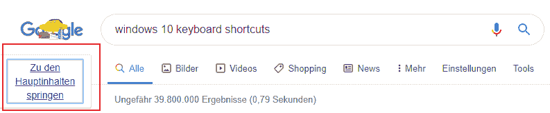
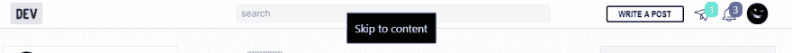
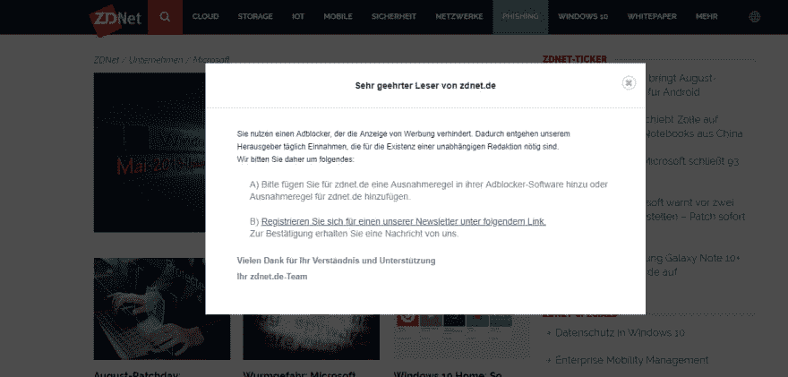
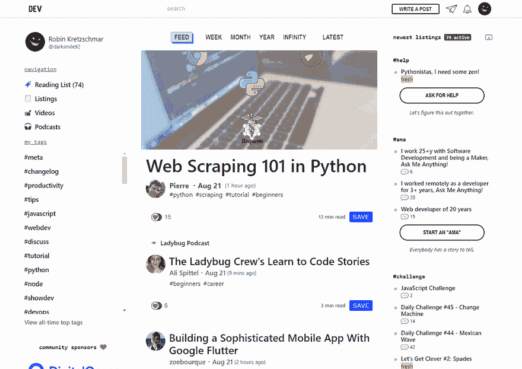

# 只有键盘没有鼠标的一天！

> 原文：<https://dev.to/darksmile92/a-day-with-only-the-keyboard-no-mouse-2lpm>

今天我把鼠标忘在家里了，我想今天在办公室挑战自己只用键盘再合适不过了！

我有一台笔记本电脑，配有一个扩展坞和一个外部键盘，以防万一，我本来可以使用触摸板。

事实上，我正在用同样的方式写这篇文章——只用我的键盘！

以下是我挑战的摘要

### 只用键盘一天，不用鼠标

#### 网站的无障碍性

在搜索结果上按下`Tab`后，我第一次注意到谷歌支持键盘导航的伟大方式:

dev.to 也一样！
[T3】](https://res.cloudinary.com/practicaldev/image/fetch/s--TI4IrC__--/c_limit%2Cf_auto%2Cfl_progressive%2Cq_auto%2Cw_880/https://thepracticaldev.s3.amazonaws.com/i/94rkbluiesk3oatbydh7.png)

一些不太好的体验是在不关心可访问性的网站上使用弹出窗口/模态对话框。

##### 网站上的侵入式对话/模式

例如这个对话框:

我无法关闭这个对话框！当我只能用键盘不能专注于任何东西的时候，我该怎么关上它？！
我所做的是在 Chrome ( `F12`)中打开开发工具，聚焦*元素*选项卡，`Ctrl+F`搜索弹出的 HTML 元素，`Shift+F10`右击它并从 DOM 中删除它。感觉关闭这个对话框太费力了😩

#### 滚动、选择、导航-浏览

幸运的是，滚动、选择内容和导航非常容易。提高我速度的是 chrome 浏览器的 Vimium 扩展，我是在阅读了这篇关于它的非常好的帖子
后安装的

 [## 所以你换了 Vim——别忘了给 Chrome 安装 Vimium！

### 彼得·冈德尔 8 月 2 日 172 分钟阅读

#vim](/peterfication/so-you-switched-to-vim---dont-forget-to-install-vimium-for-chrome)

在 Vimium 的帮助下，我能够以更少的按键次数更快地四处走动，因为我不需要在所有元素中找到想要的元素，而是可以通过最多 2 次按键组合来选择它！

* * *

下面是一个简短的 GIF:

#### 这一天我用得最多的快捷键

*   `Win+B`访问 windows 托盘图标！(在 Windows 上)
*   或者从 1 到 9 的任何数字开始任何程序被钉在任务栏的这个索引处。
*   `Win+Tab`给出了一个高级应用切换器界面
*   `Win+L` / `F6`在浏览器或 windows 资源管理器中聚焦地址栏。
*   `Shift+F10`模拟右击(如果键盘上没有专用键)
*   `F`在 chrome 中使用 Vimium
*   `Ctrl+W`关闭标签页
*   `Win+Shift+Right Arrow`或向左箭头将窗口从一个屏幕快速移动到另一个屏幕
*   `Win+Ctrl+Right Arrow`或向左箭头在工作空间之间切换

### 🗨Tell 告诉我你阻止使用鼠标的经历，以及你是成功还是失败！