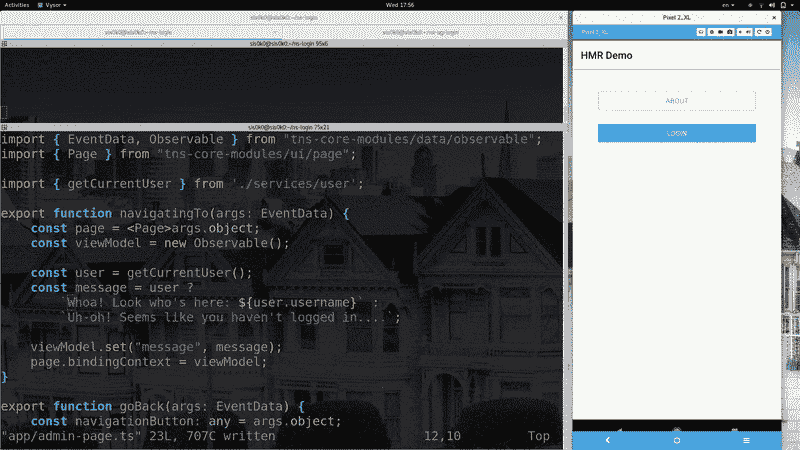
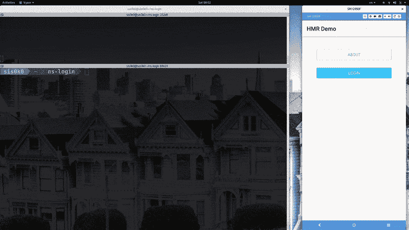
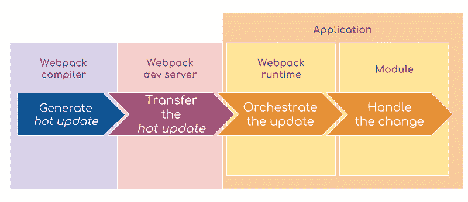

# 深入探讨用 Webpack 替换热模块(第一部分-基础知识)

> 原文：<https://dev.to/stanimiravlaeva/a-deep-dive-into-hot-module-replacement-with-webpack-part-one-the-basics-39hn>

下面这篇文章是关于用 webpack 替换热模块的“深入探讨”系列的第一部分。

*   第 1 部分:基础知识
*   第 2 部分:用 module.hot API 处理热更新

# 第一部分:基础知识

让我们想象一下，现在还是 12 月中旬，我已经按时完成了这篇博文...

圣诞节快到了，是时候装饰客厅的圣诞树了。你去拿去年所有的装满装饰品的盒子。首先，你要关灯。在解开它们的时候，确保你一点压力都没有。你后退一步，也许放点圣诞音乐，给自己泡杯茶。几个小时后，你就可以把它们挂在树上了。酷，最难的部分已经过去了。现在，你可以挂一些花环和很酷的装饰品。最后，你把星星放在树顶上，点亮灯。太美了。

但是...那是正确的星星吗？你决定你实际上想要闪亮的新彩虹星，而不是保守的旧黄星。你是否需要移除所有东西，重新开始整个过程，仅仅是为了更换那件装饰品？显然不是！您只需取下旧的 Star，装上新的即可。

如果你还在阅读，你可能想知道这是怎么回事。嗯，你的圣诞树就像一个 JavaScript 应用程序。装饰品、花环和灯光是应用程序的模块。让你不用拆树就能换件装饰品的机制叫做[热模块更换](https://webpack.js.org/concepts/hot-module-replacement/)。而 **HMR** 就是我们今天要玩的。

# 我为什么要在乎？

因为和 HMR 一起发展更快。

我在 NativeScript 框架上工作，有时甚至用它来构建应用程序。让我们回顾一下在热模块替换之前我作为 NativeScript 开发人员的生活:

在上面的视频中，我正在开发一个应用程序，它有一个登录屏幕和一个管理屏幕，只有授权用户才能访问。登录后，我对管理屏幕进行了更改。重新加载过程开始。我们可以把它分成四个阶段:

1.  被改变的模块被传送到设备。
2.  整个应用程序被拆除，并从登录屏幕重新启动。
3.  我再次登录**。**
***   我被重定向到管理页面，在那里我看到了我的更改。**

 **现在，让我们看看游戏中热模块更换的相同过程:

现在的重新加载步骤是:

1.  被改变的模块被传送到设备。
2.  管理页面被重新加载。
3.  我看到了我的改变。

速度明显更快，因为只有当前屏幕被重新加载，用户会话被持久化。

# 它是如何工作的？

NativeScript 使用 webpack 来处理应用程序的 JavaScript 部分。Webpack 找到你的应用程序正在使用的所有模块,然后*将它们打包成几个输出文件。*

> Webpack 有三个密切相关的术语- **模块**、**组块**和**捆绑包**。模块是一段封装数据并提供功能的 JS 代码。**模块**可以相互依赖，从而形成**依赖图**。在 webpack 捆绑过程中，几个模块形成一个**块**。**捆绑包**是由捆绑过程产生的输出文件。在大多数情况下，每个**块**正好发出一个**束**。

Webpack 还支持一个名为*热模块替换* (HMR)的特性。HMR 在应用程序运行时交换、添加或删除模块，无需完全重新加载。

然而，当你修改代码时，HMR 不会神奇地重新加载你的应用程序。应用程序本身必须知道如何对即将到来的变化做出反应。让我们仔细看看 HMR 进程。

1.  当您做出更改时，webpack 编译器负责在旧版本的包和新版本的包之间生成一个‘diff’(*热更新*)。
2.  webpack 开发服务器处理 HMR 的运输物流。换句话说，它确保当应用程序请求时，可以加载*热更新*。不强制使用`webpack-dev-server`来传输文件。在 NativeScript 生态系统中，NativeScript CLI 扮演着这一角色。
3.  注入到您的应用程序包中的特殊代码获取*热更新*。然后，它开始为每个应该被替换的*模块*寻找处理程序。
4.  如果找到合适的处理器，则替换*模块*。如果不是，过程失败并且*模块*是**而不是**被替换。显然，在这种情况下有一个退路是很好的。在浏览器中，页面被重新加载，在 NativeScript 中，应用程序被重新启动。

# 总结

*总结一下，今天我们学习了:*

*   热模块替换是 webpack 提供的功能；
*   热模块替换通过缩短重新加载时间和保留应用程序状态，使我们作为开发人员的生活更加轻松；
*   解开圣诞灯的时候要做好失败的准备；
*   热模块替换并不神奇，但是您的应用程序应该知道如何使用它。

在 HMR 系列的下一篇博文中，我们将把目光转向最后一点。我们将学习如何在我们的应用程序中处理即将到来的变化。**