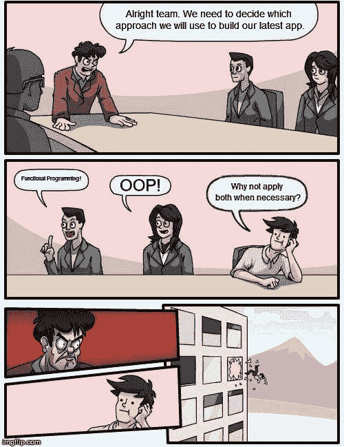

# 初步了解函数式编程和面向对象编程

> 原文：<https://dev.to/fihra/a-dip-in-the-water-with-understanding-functional-vs-object-oriented-programming-122l>

函数式编程(FP)和面向对象编程(OOP)。

它们是什么，有什么区别，一个比另一个好吗？它们是如何工作的？每一种适合什么时候使用？我对此有很多疑问，因为这看起来像是一个关于编程的问题。先说每一个是什么。

函数式编程:
..一种构建计算机程序的结构和元素的风格——将计算视为数学函数的评估，并避免改变状态和可变数据- [功能编程](https://en.wikipedia.org/wiki/Functional_programming)

面向对象编程:
"..一种基于“对象”概念的编程范例，它可以包含字段形式的数据(通常称为属性)和过程形式的代码(通常称为方法)。对象的一个特性是对象的过程，它可以访问并经常修改与它们相关联的对象的数据字段(对象有“这”或“自己”的概念)。- [面向对象编程](https://en.wikipedia.org/wiki/Object-oriented_programming)

仅仅根据这些维基百科的定义，我将确定一些关键词，在这里指出一些不同之处:

FP -避免改变状态和可变数据(不可变数据)
OOP -访问和修改对象的数据字段(可变数据)

所以你的意思是如果我做了这样的事。

```
#Functional Style
class Character
    attr_reader :name, :weapon

    def initialize(name, weapon= "none")
        @name = name
        @weapon = weapon
    end

    def equip(new_weapon)
        Character.new(@name, new_weapon)
    end

    def view_info
        puts "Name: #{self.name}"
        puts "Weapon: #{self.weapon}"
    end
end
puts "Functional Style"
puts ""
puts "-----Creating Object-----"
hero = Character.new("Que")
hero.view_info

hero_with_weapon = hero.equip("Sword")
hero_with_another_weapon = hero.equip("Axe")

puts "---Hero with weapon---"
hero_with_weapon.view_info
puts "---Hero with another weapon---"
hero_with_another_weapon.view_info
puts "---Hero without weapon---"
hero.view_info 
```

Enter fullscreen mode Exit fullscreen mode

下面是这段代码的输出:

```
Functional Style

-----Creating Object-----
Name: Que
Weapon: none
---Hero with weapon---
Name: Que
Weapon: Sword
---Hero with another weapon---
Name: Que
Weapon: Axe
---Hero without weapon---
Name: Que
Weapon: none 
```

Enter fullscreen mode Exit fullscreen mode

所以我们实例化了一个没有武器的英雄“Que”，它输出的武器默认为“none”然后我们创建了一个“Que”的副本，但是带有一个武器“剑”，用 Equip 方法实例化了一个新的角色对象。然而，我们把这个方法赋给了一个变量‘hero _ with _ weapon’我们用“斧头”武器创建了另一个副本，也将该方法赋给了另一个变量。然后在最后只调用“英雄”对象，我们看到武器仍然没有来自第一个“英雄”对象。

```
[1] pry(main)> hero
=> #<Character:0x0000000003c765e8 @name="Que", @weapon="none">
[2] pry(main)> hero_with_weapon
=> #<Character:0x0000000003c76458 @name="Que", @weapon="Sword">
[3] pry(main)> hero_with_another_weapon
=> #<Character:0x0000000003c76408 @name="Que", @weapon="Axe"> 
```

Enter fullscreen mode Exit fullscreen mode

我们可以看到，在 pry 调用每个变量时，我们没有改变 hero 对象，而是创建了 hero 对象的副本。函数式编程的目标是创建不可变的数据，这样我们就不会改变我们不想要的数据。这只是我对函数式编程理解的一个简单例子，因为这个主题有太多的东西是我在深入研究这个主题时没有想到的。

[](https://res.cloudinary.com/practicaldev/image/fetch/s--c8wdopkd--/c_limit%2Cf_auto%2Cfl_progressive%2Cq_auto%2Cw_880/https://thepracticaldev.s3.amazonaws.com/i/lohwsqxyve79uxs0zxb2.jpg)

在面向对象编程中，当我们使用方法时，数据会被改变。

```
#OOP Style
class Person
    attr_accessor :name, :weapon
    def initialize(name, weapon="none")
        @name = name
        @weapon = weapon
    end

    def equip(new_weapon)
        @weapon = new_weapon
    end

    def view_info
        puts "Name: #{self.name}"
        puts "Weapon: #{self.weapon}"
    end

end

hero2 = Person.new("Que")
puts "Hero 2 without weapon"
hero2.view_info
hero2.equip("Spear")
puts "Hero 2 with weapon"
hero2.view_info
hero2.equip("Bow and Arrows")
puts "Hero 2 with weapon"
hero2.view_info 
```

Enter fullscreen mode Exit fullscreen mode

我们实例化一个“hero 2”Person 对象。调用“hero2”对象的 equip 方法会将“new_weapon”参数分配给@weapon 属性。所以每次用新武器调用 hero2.equip，都会为 hero2 改变武器属性。

```
Hero 2 without weapon
Name: Que
Weapon: none
Hero 2 with weapon
Name: Que
Weapon: Spear
Hero 2 with weapon
Name: Que
Weapon: Bow and Arrows

[1] pry(main)> hero2
=> #<Person:0x0000000003b05998 @name="Que", @weapon="Bow and Arrows"> 
```

Enter fullscreen mode Exit fullscreen mode

当我们在最后一行中调用 hero2 时，我们可以看到“hero2”忘记了没有武器，而是有一支矛。这表明我们会不断地改变对象的数据。

[](https://i.giphy.com/media/rkXNems5uxExG/giphy.gif)

函数性之于声明性，就像面向对象之于命令性一样。

声明式:“在声明式编程风格中，你描述的是你想要的结果，而不是如何达到目的。”- [托宾克](https://www.perlmonks.org/?node_id=983655)

命令式:“命令式”这个词来自拉丁语“impero”，意思是“我命令”。这是我们得到“皇帝”的同一个地方，这是非常恰当的。你是皇帝。你给计算机下达一些指令，它一次执行一个指令，然后反馈回来。”- [托宾克](https://www.perlmonks.org/?node_id=983655)

FP 和 OOP 主要被归类为这两种编程方法。Declarative 表示逻辑，但不描述控制流。命令式表达了程序如何工作的所有必要命令。

利弊

使用函数式编程的优点:

*   能够保留原始数据，处理不可变数据
*   出于不同目的使用许多副本(例如迭代)
*   使用纯函数(返回值基于输入值的函数)

缺点:

*   有许多基于原始数据的副本
*   在处理 I/O 操作时，使用纯函数会成为一个障碍

使用面向对象编程的优点:

*   实际上一切都可以是对象，所以将现实世界的想法应用到 OOP 中是很容易的
*   类在程序中是可重用的
*   并行开发:当与团队一起工作时，在整个开发过程中使用独立的代码要容易得多

缺点:

*   在设计应用程序时，程序需要从一开始就进行适当的规划
*   它真的可以扩展，有时不必要的代码也会加载进来

还有很多优点和缺点我没有包括在内，因为我甚至对那个领域还不太熟悉，比如 Lambdas、递归、记忆化等等。我没想到这个兔子洞比我想象的还要深。虽然，我确实觉得我现在理解了函数式编程和面向对象编程之间的一般概念，因为这一直困扰着我多年自学编码，甚至现在还在编码训练营学习。

当我查阅了许多关于函数式编程和面向对象编程之争的文章、博客和大量阅读资料后，我发现这种思维方式已经成为一种过时的编程思维方式，因为程序已经在情景环境中实现了程序的双方。关于函数式编程和面向对象编程的争论还有更多的讨论。

CodeNewbie 博客中引用的一段话很好地总结了何时使用函数式编程和面向对象编程:

《函数式 JavaScript》一书的作者迈克尔·福格斯在他的博客文章《FP vs OO，来自战壕》([http://blog.fogus.me/2013/07/22/fp-vs-oo-from-the-trenches/](http://blog.fogus.me/2013/07/22/fp-vs-oo-from-the-trenches/))中指出，当他处理关于人的数据时，FP 工作得很好，但当他试图模拟人时，OOP 工作得很好- [CodeNewbie -面向对象编程 vs 函数式编程](https://www.codenewbie.org/blogs/object-oriented-programming-vs-functional-programming)

[](https://res.cloudinary.com/practicaldev/image/fetch/s--NDmyycvN--/c_limit%2Cf_auto%2Cfl_progressive%2Cq_auto%2Cw_880/https://thepracticaldev.s3.amazonaws.com/i/bryqu84a8mqrlf3bbvta.jpg)

如果您想学习更多函数式编程的入门概念，请查看以下链接:

[https://www . freecodecamp . org/news/an-introduction-to-the-basic-principles-of-functional-programming-a2 C2 a15 c 84/](https://www.freecodecamp.org/news/an-introduction-to-the-basic-principles-of-functional-programming-a2c2a15c84/)

这里也是面向对象编程的开始概念:

[https://www . freecodecamp . org/news/how-to-explain-object-oriented-programming-concepts-to-a-6 岁-21bb035f7260/](https://www.freecodecamp.org/news/how-to-explain-object-oriented-programming-concepts-to-a-6-year-old-21bb035f7260/)

引用:
[https://www . site point . com/functional-programming-pure-functions/](https://www.sitepoint.com/functional-programming-pure-functions/)

[https://dev.to/nijeesh4all/functional-programming-vs-oops-解释-x-like-im-five-2fnc](https://dev.to/nijeesh4all/functional-programming-vs-oops--explain-x-like-im-five-2fnc)

[https://www.educba.com/functional-programming-vs-oop/](https://www.educba.com/functional-programming-vs-oop/)

[https://www . c setutor . com/面向对象编程语言的优缺点/](https://www.csetutor.com/advantages-and-disadvantages-of-object-oriented-programming-language/)

[https://greengarageblog . org/6-面向对象编程的利弊](https://greengarageblog.org/6-pros-and-cons-of-object-oriented-programming)

[https://code burst . io/declarative-vs-important-programming-a 8 a7 c 93d 9 ad 2](https://codeburst.io/declarative-vs-imperative-programming-a8a7c93d9ad2)