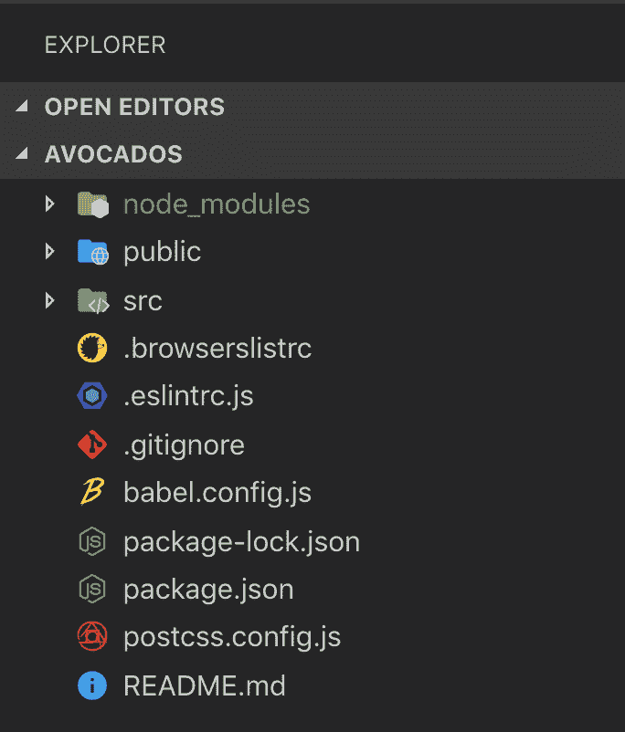

# Vue CLI 初探

> 原文：<https://dev.to/marinamosti/a-first-look-at-the-vue-cli-380c>

本文最初发表于[https://www.telerik.com/blogs/a-first-look-at-the-vue-cli](https://www.telerik.com/blogs/a-first-look-at-the-vue-cli)

* * *

又见面了！😃

我最近为 Vue 完成了一个[初学者教程系列。JS](https://dev.to/vuevixens/hands-on-vuejs-for-beginners-part-1-2j2g) (不要脸的自我推广，抱歉😅)，其中我们回顾了 **Vue** 如何工作的所有基础知识。

然而，我们只是从向静态 HTML 文件添加一个`<script>`标签并直接在页面的 JS 上设置它的角度来看待 **Vue** 。

是时候升级到大女孩工具了，看看使用 **Vue** 最令人愉快的方面之一 CLI(命令行界面)。

不怕，超级简单！

> 遗憾的是，对于本教程，我将不得不假设您对如何使用基本的`cd`命令在终端内导航有所了解，因为这已经超出了 Vue CLI 的范围。虽然`cd`命令非常简单，但是如果你需要复习，你可以很容易地通过谷歌搜索视频或快速教程

# 开始设置

在开始之前，我们需要在你的电脑上设置一些东西。如果你已经有了这些，可以随意跳过一些，但是要超级小心，不要跳过一些重要的东西。

## 节点

为了让 CLI 在我们的系统上工作，我们将需要首先安装 Node，特别是在编写本文时，我们需要至少有版本 **8.9** ，但建议使用 **8.11+** 。

如果您以前安装过 Node，但是不确定您使用的是哪个版本，请打开您的终端并运行下面的命令`node -v`。您应该得到类似于`v11.9.0`的输出，如果您得到一个错误，那么您的机器上可能没有安装 Node。

前往 node[https://nodejs.org/en/](https://nodejs.org/en/)的官方页面，在主页上你会看到两个绿色的下载按钮。继续点击显示`LTS`(长期支持)的版本，除非你知道你在做什么，想要最新的版本。

您将获得当前操作系统的下载，双击它并完成安装向导。完成后，再次启动终端，再次尝试运行`node -v`来检查一切是否正常。

还有一件事，当安装节点时，你还可以免费在你的电脑上安装`NPM`(节点包管理器)！我们稍后会用到它，所以请记住这一点，以防您想知道它是从哪里来的。

## 纱线(可选)

有些人更喜欢使用`yarn`而不是`npm`作为他们选择的包管理器，就我个人而言，我没有偏好，会根据项目和团队的要求使用两者——但是如果你想尝试一下，只需前往[https://yarnpkg.com/en/](https://yarnpkg.com/en/)并点击`Install Yarn`按钮。

再次下载文件并按照安装向导进行操作。一旦完成，您可以通过在您的终端上运行`yarn -v`来检查`yarn`是否被正确地添加到您的机器中。

# 安装 CLI

太棒了。现在我们已经有了所有需要的东西，我们可以开始在我们的电脑上安装 **Vue CLI** 了。

打开您的终端，运行以下命令。(请注意，我将展示 NPM 和 YARN 命令，您不必同时运行这两个命令——选择您想要使用并且已经从上一节安装的命令)。

```
npm install -g @vue/cli

yarn global add @vue/cli 
```

当您在终端中运行这个命令时，它将执行一些脚本，您将得到一些非常神秘的输出。不要担心这个，去给自己弄些咖啡，等到它完成安装一切。

注意这两个命令上的`-g`和`global`标志，这意味着你正在你的计算机上安装这个包`globally`。简而言之，这意味着您将能够从文件系统内的任何地方使用这些命令，而不必导航到特定的文件夹。

让我们再一次通过在终端上运行`vue --version`来检查所有的东西都被正确安装了，您应该得到带有 CLI 版本号的输出。

# 创建我们的第一个项目

是时候把手弄脏，实际使用这个东西了。如果您还没有启动终端，请启动它，并导航到您想要创建项目的文件夹。

您现在想要运行的命令是`vue create <name>`，其中`<name>`是您的项目的名称，也是将要创建的文件夹的名称。

让我们创建我们的第一个项目，然后运行:

```
vue create avocados 
```

很合适，对吧？

你将会遇到一堆问题，这些问题将会帮助你配置你的项目，但是不要惊慌，它们都是不言自明的。

第一个屏幕将允许您选择一个默认配置(初学者可以使用)，或者通过手动配置选项手动选择您的选项。

如果您没有在项目设置中选择一个选项，比如 Vuex，也不要担心——在您的项目中，随时都有机会重新安装所有这些选项。

如果您选择了手动设置，您将经历一个选项向导，该向导将为您的项目配置选项。您可以使用箭头键导航，使用空格键选择和取消选择选项，使用 enter 键跳到下一个屏幕。

在这里，您可以做出选择，如添加类型脚本支持、路由器基本配置，甚至是用于全局状态管理的 Vuex。

一旦你完成了，命令行界面就会自动完成它的工作，几秒钟后你闪亮的新项目就准备好了。继续并`cd`进入它——让我们一起检查一下文件夹的结构。

# 文件夹结构

好吧！我将在 VS 代码中打开这个新项目，如果你想知道的话，我将使用材料图标主题来使图标变得漂亮。

[](https://res.cloudinary.com/practicaldev/image/fetch/s--JI2jlqZj--/c_limit%2Cf_auto%2Cfl_progressive%2Cq_auto%2Cw_880/https://thepracticaldev.s3.amazonaws.com/i/cq71fahqstxe5tt8svbr.png)

快跑下来！

*   *node_modules* :保存您的依赖关系代码，您可以使用`npm`和`yarn`来安装或删除这些代码
*   *public* :这个文件夹将保存`index.html`，当你导航到应用程序的 url 时，你的网络服务器将加载该文件。它需要的所有文件都将由 Vue 自动注入，所以你真的不需要太担心这里会发生什么。
*   src :这是你放置所有代码、组件、资产等的地方。
*   *根文件*:在你的项目根上，你会看到一堆配置文件，比如用于 ES Lint 配置的`.eslintrc.js`，用于 GIT 的`.gitignore`，用于包管理的`package.json`和`package-lock.json`或`yarn.lock`文件，以及其他取决于你之前选择的文件。

好吧，现在怎么办？

一个很好的经验法则是，当你有一个新项目，你想看你的可用脚本时，你应该检查一下`package.json`文件。继续打开它，您会看到 JSON 中有一个名为`scripts`的条目。

```
 "scripts": {
    "serve": "vue-cli-service serve",
    "build": "vue-cli-service build",
    "lint": "vue-cli-service lint"
  }, 
```

在左边你会得到脚本的名字，在右边的 key:value 对你会得到脚本实际上为你做了什么。

我如何使用它们？嗯，其实很简单。

如果你使用 NPM，你可以在你的终端输入`npm run <scriptname>`，例如`npm run serve`。如果你用的是 YARN，那么你可以输入`yarn serve`。

# 服役并建立

使用 Vue CLI 时，您将使用两个主要脚本，一个是`serve`，另一个是`build`。

继续在您的终端上运行`npm run serve`或`yarn serve`(之前您需要在项目目录上)，并给它几秒钟来执行它的魔法。它会把你所有的流动资产进行编译捆绑，最后吐出这个传说。

[](https://res.cloudinary.com/practicaldev/image/fetch/s--cmxCh7Jy--/c_limit%2Cf_auto%2Cfl_progressive%2Cq_auto%2Cw_880/https://thepracticaldev.s3.amazonaws.com/i/9r6v9d87tjte321r8hof.png)

一些事情正在发生。

1.  这个命令为您启动了一个服务器，它不会“退出”，直到您在终端窗口上点击`control + c`。
2.  服务器会留意你对代码所做的更改，当你保存它们时，它会立即重新绑定你的资产(如果你有错误，它会对你大喊大叫)。
3.  它为您提供了这个`localhost` url，您可以将其复制并粘贴或命令/控制点击到您的浏览器中，并允许您提供和查看您的项目。
4.  它有一个**热重新加载**功能，当发生变化时，它会从浏览器中动态地重新加载应用程序的部分内容，因此，例如，如果您更改了一点 CSS，浏览器会在 CLI 完成重新编译后自动神奇地得到更新。

所以，底线是，如果你正在做你的项目，你希望它一直在后台运行。

另一方面，您有`build`命令。

继续运行`npm run build`或`yarn build`，给它几秒钟来编译您的资产。

你会在你的根目录下得到一个名为`dist`的新文件夹，里面会有你的`index.html`的副本，但是这次它被缩小了，里面会有它需要加载的嵌入脚本和样式。

在这个文件夹中，您还将获得保存您编译的项目的`css`和`js`文件夹。

简而言之，这是您最终想要放入 web 服务器以部署应用程序的文件夹。

# 奖金

Vue CLI 实际上有一个 GUI。🤯

在终端中找到您的项目根目录，运行命令`vue ui`，准备好大吃一惊吧。您将获得一个完整的 web 应用程序 GUI，允许您查看/删除/安装插件，检查您的依赖项，调整您的项目配置，甚至执行您之前学习的脚本！

# 结论

对于任何想使用 Vue 制作 spa 的开发者来说，了解并使用 Vue CLI 是必须的。我知道对于第一次来说，终端可能是一个黑暗和可怕的新世界，但我保证一旦你经历了这些步骤几次，它会变得越来越容易使用。(如果其他一切都失败了，您还有 web UI 来支持您！)